This document describes how the system keeps the blocklist filter up-to-date and ready for use. When a request to initialize or update the filter is received, the flow checks if the filter is already set up or needs to be rebuilt. If necessary, it renews and downloads the latest blocklist data and constructs a new filter, returning the current or updated blocklist filter.

# Where is this flow used?

This flow is used multiple times in the codebase as represented in the following diagram:

(Note - these are only some of the entry points of this flow)

```mermaid
graph TD;
      66557e9a1c97b0ec60a2a495f43daef2c9343d8dd94c4edbfc7d86d8df7ba307(src/…/dns-op/resolver.js::DNSResolver.exec) --> 4b89e52dba3ee51396b4c97ac472edf6cce97a95e3e0d450aac51807e371a072(src/…/dns-op/resolver.js::DNSResolver.resolveDns)

4b89e52dba3ee51396b4c97ac472edf6cce97a95e3e0d450aac51807e371a072(src/…/dns-op/resolver.js::DNSResolver.resolveDns) --> 17141b6adca74c46a8afba1313dbdd24b9bae3aedd999609da321ea7b64dbdf6(src/…/rethinkdns/main.js::BlocklistWrapper.init)

1ee3e410eb76b84533705554985e772d052147c2c3087e4d3876f8af16d4572d(src/…/command-control/cc.js::CommandControl.exec) --> c4284cc89cfe5167db2f44081a566a421f91dc0cbc8077528668dc3ca096dd56(src/…/command-control/cc.js::CommandControl.commandOperation)

c4284cc89cfe5167db2f44081a566a421f91dc0cbc8077528668dc3ca096dd56(src/…/command-control/cc.js::CommandControl.commandOperation) --> 17141b6adca74c46a8afba1313dbdd24b9bae3aedd999609da321ea7b64dbdf6(src/…/rethinkdns/main.js::BlocklistWrapper.init)

6df46e0eb7da2ee5e7d427c35a8a572d695a8cf7cde2da56d6edc12b0176f2dc(src/…/node/dbip.js::setup) --> 17141b6adca74c46a8afba1313dbdd24b9bae3aedd999609da321ea7b64dbdf6(src/…/rethinkdns/main.js::BlocklistWrapper.init)

6df46e0eb7da2ee5e7d427c35a8a572d695a8cf7cde2da56d6edc12b0176f2dc(src/…/node/dbip.js::setup) --> 7693056deafac31430251862d6b48499037a5c6da7ab793febcb014ba9dc9fd9(src/…/node/dbip.js::setupLocally)

7693056deafac31430251862d6b48499037a5c6da7ab793febcb014ba9dc9fd9(src/…/node/dbip.js::setupLocally) --> 17141b6adca74c46a8afba1313dbdd24b9bae3aedd999609da321ea7b64dbdf6(src/…/rethinkdns/main.js::BlocklistWrapper.init)

72d538c506cff5d694321ce36e0ac4b34ec022d47e46843f83b3d6c998b91d78(src/…/deno/dbip.ts::setup) --> 17141b6adca74c46a8afba1313dbdd24b9bae3aedd999609da321ea7b64dbdf6(src/…/rethinkdns/main.js::BlocklistWrapper.init)

72d538c506cff5d694321ce36e0ac4b34ec022d47e46843f83b3d6c998b91d78(src/…/deno/dbip.ts::setup) --> 13aaa9567e0c836c48eb789e14a466b0c5eb1b916cb557f53db3c69aaca65b87(src/…/deno/dbip.ts::setupLocally)

13aaa9567e0c836c48eb789e14a466b0c5eb1b916cb557f53db3c69aaca65b87(src/…/deno/dbip.ts::setupLocally) --> 17141b6adca74c46a8afba1313dbdd24b9bae3aedd999609da321ea7b64dbdf6(src/…/rethinkdns/main.js::BlocklistWrapper.init)

40cadc48d6103643c5701ee07ad9ccb93fbd5a1e4dcff3ed8c5d79d33f595988(src/…/node/blocklists.js::setup) --> 17141b6adca74c46a8afba1313dbdd24b9bae3aedd999609da321ea7b64dbdf6(src/…/rethinkdns/main.js::BlocklistWrapper.init)


classDef mainFlowStyle color:#000000,fill:#7CB9F4
classDef rootsStyle color:#000000,fill:#00FFF4
classDef Style1 color:#000000,fill:#00FFAA
classDef Style2 color:#000000,fill:#FFFF00
classDef Style3 color:#000000,fill:#AA7CB9

%% Swimm:
%% graph TD;
%%       66557e9a1c97b0ec60a2a495f43daef2c9343d8dd94c4edbfc7d86d8df7ba307(<SwmPath>[src/…/dns-op/resolver.js](src/plugins/dns-op/resolver.js)</SwmPath>::DNSResolver.exec) --> 4b89e52dba3ee51396b4c97ac472edf6cce97a95e3e0d450aac51807e371a072(<SwmPath>[src/…/dns-op/resolver.js](src/plugins/dns-op/resolver.js)</SwmPath>::DNSResolver.resolveDns)
%% 
%% 4b89e52dba3ee51396b4c97ac472edf6cce97a95e3e0d450aac51807e371a072(<SwmPath>[src/…/dns-op/resolver.js](src/plugins/dns-op/resolver.js)</SwmPath>::DNSResolver.resolveDns) --> 17141b6adca74c46a8afba1313dbdd24b9bae3aedd999609da321ea7b64dbdf6(<SwmPath>[src/…/rethinkdns/main.js](src/plugins/rethinkdns/main.js)</SwmPath>::BlocklistWrapper.init)
%% 
%% 1ee3e410eb76b84533705554985e772d052147c2c3087e4d3876f8af16d4572d(<SwmPath>[src/…/command-control/cc.js](src/plugins/command-control/cc.js)</SwmPath>::CommandControl.exec) --> c4284cc89cfe5167db2f44081a566a421f91dc0cbc8077528668dc3ca096dd56(<SwmPath>[src/…/command-control/cc.js](src/plugins/command-control/cc.js)</SwmPath>::CommandControl.commandOperation)
%% 
%% c4284cc89cfe5167db2f44081a566a421f91dc0cbc8077528668dc3ca096dd56(<SwmPath>[src/…/command-control/cc.js](src/plugins/command-control/cc.js)</SwmPath>::CommandControl.commandOperation) --> 17141b6adca74c46a8afba1313dbdd24b9bae3aedd999609da321ea7b64dbdf6(<SwmPath>[src/…/rethinkdns/main.js](src/plugins/rethinkdns/main.js)</SwmPath>::BlocklistWrapper.init)
%% 
%% 6df46e0eb7da2ee5e7d427c35a8a572d695a8cf7cde2da56d6edc12b0176f2dc(<SwmPath>[src/…/node/dbip.js](src/core/node/dbip.js)</SwmPath>::setup) --> 17141b6adca74c46a8afba1313dbdd24b9bae3aedd999609da321ea7b64dbdf6(<SwmPath>[src/…/rethinkdns/main.js](src/plugins/rethinkdns/main.js)</SwmPath>::BlocklistWrapper.init)
%% 
%% 6df46e0eb7da2ee5e7d427c35a8a572d695a8cf7cde2da56d6edc12b0176f2dc(<SwmPath>[src/…/node/dbip.js](src/core/node/dbip.js)</SwmPath>::setup) --> 7693056deafac31430251862d6b48499037a5c6da7ab793febcb014ba9dc9fd9(<SwmPath>[src/…/node/dbip.js](src/core/node/dbip.js)</SwmPath>::setupLocally)
%% 
%% 7693056deafac31430251862d6b48499037a5c6da7ab793febcb014ba9dc9fd9(<SwmPath>[src/…/node/dbip.js](src/core/node/dbip.js)</SwmPath>::setupLocally) --> 17141b6adca74c46a8afba1313dbdd24b9bae3aedd999609da321ea7b64dbdf6(<SwmPath>[src/…/rethinkdns/main.js](src/plugins/rethinkdns/main.js)</SwmPath>::BlocklistWrapper.init)
%% 
%% 72d538c506cff5d694321ce36e0ac4b34ec022d47e46843f83b3d6c998b91d78(<SwmPath>[src/…/deno/dbip.ts](src/core/deno/dbip.ts)</SwmPath>::setup) --> 17141b6adca74c46a8afba1313dbdd24b9bae3aedd999609da321ea7b64dbdf6(<SwmPath>[src/…/rethinkdns/main.js](src/plugins/rethinkdns/main.js)</SwmPath>::BlocklistWrapper.init)
%% 
%% 72d538c506cff5d694321ce36e0ac4b34ec022d47e46843f83b3d6c998b91d78(<SwmPath>[src/…/deno/dbip.ts](src/core/deno/dbip.ts)</SwmPath>::setup) --> 13aaa9567e0c836c48eb789e14a466b0c5eb1b916cb557f53db3c69aaca65b87(<SwmPath>[src/…/deno/dbip.ts](src/core/deno/dbip.ts)</SwmPath>::setupLocally)
%% 
%% 13aaa9567e0c836c48eb789e14a466b0c5eb1b916cb557f53db3c69aaca65b87(<SwmPath>[src/…/deno/dbip.ts](src/core/deno/dbip.ts)</SwmPath>::setupLocally) --> 17141b6adca74c46a8afba1313dbdd24b9bae3aedd999609da321ea7b64dbdf6(<SwmPath>[src/…/rethinkdns/main.js](src/plugins/rethinkdns/main.js)</SwmPath>::BlocklistWrapper.init)
%% 
%% 40cadc48d6103643c5701ee07ad9ccb93fbd5a1e4dcff3ed8c5d79d33f595988(<SwmPath>[src/…/node/blocklists.js](src/core/node/blocklists.js)</SwmPath>::setup) --> 17141b6adca74c46a8afba1313dbdd24b9bae3aedd999609da321ea7b64dbdf6(<SwmPath>[src/…/rethinkdns/main.js](src/plugins/rethinkdns/main.js)</SwmPath>::BlocklistWrapper.init)
%% 
%% 
%% classDef mainFlowStyle color:#000000,fill:#7CB9F4
%% classDef rootsStyle color:#000000,fill:#00FFF4
%% classDef Style1 color:#000000,fill:#00FFAA
%% classDef Style2 color:#000000,fill:#FFFF00
%% classDef Style3 color:#000000,fill:#AA7CB9
```



# Deciding Whether to (Re)Build the Blocklist


<SwmSnippet path="/src/plugins/rethinkdns/main.js" line="51">

---

<SwmToken path="src/plugins/rethinkdns/main.js" pos="51:3:3" line-data="  async init(rxid, forceget = false) {">`init`</SwmToken> kicks off the blocklist setup. It checks if the filter is already ready or disabled, and bails out early if so. If not, it decides whether to start a new blocklist construction (by calling <SwmToken path="src/plugins/rethinkdns/main.js" pos="67:5:5" line-data="        return this.initBlocklistConstruction(rxid, now);">`initBlocklistConstruction`</SwmToken>) based on whether a build is already running or if the last build is stale. This is where the flow branches: either start a new build, return early if we're allowed to, or wait for the current build to finish.

```javascript
  async init(rxid, forceget = false) {
    if (this.isBlocklistFilterSetup() || this.disabled()) {
      const blres = pres.emptyResponse();
      blres.data.blocklistFilter = this.blocklistFilter; // may be nil
      return blres;
    }

    try {
      const now = Date.now();

      if (
        !this.isBlocklistUnderConstruction ||
        // it has been a while, queue another blocklist-construction
        now - this.startTime > envutil.downloadTimeout() * 2
      ) {
        this.log.i(rxid, "download blocklists", now, this.startTime);
        return this.initBlocklistConstruction(rxid, now);
      } else if (this.nowait && !forceget) {
        // blocklist-construction is in progress, but we don't have to
        // wait for it to finish. So, return an empty response.
        this.log.i(rxid, "nowait, but blocklist construction ongoing");
        return pres.emptyResponse();
      } else {
        // someone's constructing... wait till finished
        return this.waitUntilDone(rxid);
      }
    } catch (e) {
      this.log.e(rxid, "main", e.stack);
      return pres.errResponse("blocklistWrapper", e);
    }
  }
```

---

</SwmSnippet>

# Renewing and Downloading Blocklist Data


<SwmSnippet path="/src/plugins/rethinkdns/main.js" line="151">

---

In <SwmToken path="src/plugins/rethinkdns/main.js" pos="151:3:3" line-data="  async initBlocklistConstruction(rxid, when) {">`initBlocklistConstruction`</SwmToken>, we set up for a new blocklist build. We check if the blocklist config is too old and renew it if needed. After that, we call <SwmToken path="src/plugins/rethinkdns/main.js" pos="181:5:5" line-data="      await this.downloadAndBuildBlocklistFilter(rxid, bconfig, ft);">`downloadAndBuildBlocklistFilter`</SwmToken> to actually fetch and process the blocklist data, since that's the next step to get a working filter.

```javascript
  async initBlocklistConstruction(rxid, when) {
    this.isBlocklistUnderConstruction = true;
    this.startTime = when;

    const baseurl = envutil.blocklistUrl();

    let bconfig = withDefaults(cfg.orig());
    let ft = cfg.filetag();
    // if bconfig.timestamp is older than AUTO_RENEW_BLOCKLISTS_OLDER_THAN
    // then download the latest filetag (ft) and basicconfig (bconfig).
    if (!envutil.disableBlocklists()) {
      const blocklistAgeThresWeeks = envutil.renewBlocklistsThresholdInWeeks();
      const bltimestamp = util.bareTimestampFrom(cfg.timestamp());
      if (isPast(bltimestamp, blocklistAgeThresWeeks)) {
        const [renewCfg, renewedFt] = await renew(baseurl);

        if (renewCfg != null && renewedFt != null) {
          this.log.i(rxid, "r:", bconfig.timestamp, "=>", renewCfg.timestamp);
          bconfig = withDefaults(renewCfg);
          ft = renewedFt;
        } else {
          this.log.w(rxid, "r: failed; got:", renewCfg);
        }
      } else {
        this.log.d(rxid, "r: not needed for:", bltimestamp);
      }
    }

    let response = pres.emptyResponse();
    try {
      await this.downloadAndBuildBlocklistFilter(rxid, bconfig, ft);

      this.log.i(rxid, "blocklist-filter setup; u6?", bconfig.useCodec6);
```

---

</SwmSnippet>

<SwmSnippet path="/src/plugins/rethinkdns/main.js" line="203">

---

<SwmToken path="src/plugins/rethinkdns/main.js" pos="203:3:3" line-data="  async downloadAndBuildBlocklistFilter(rxid, bconfig, ft) {">`downloadAndBuildBlocklistFilter`</SwmToken> fetches the blocklist data, builds a trie for fast lookups, and loads it into the filter.

```javascript
  async downloadAndBuildBlocklistFilter(rxid, bconfig, ft) {
    const tdNodecount = bconfig.nodecount; // or: cfg.tdNodeCount();
    const tdParts = bconfig.tdparts; // or: cfg.tdParts();
    const u6 = bconfig.useCodec6; // or: cfg.tdCodec6();

    let url = envutil.blocklistUrl() + bconfig.timestamp + "/";
    url += u6 ? "u6/" : "u8/";

    !tdNodecount && this.log.e(rxid, "tdNodecount zero or missing!");

    this.log.d(rxid, url, tdNodecount, tdParts);
    const buf0 = fileFetch(url + "rd.txt", "buffer");
    const buf1 = maxrangefetches > 0 ? rangeTd(url) : makeTd(url, tdParts);

    const downloads = await Promise.all([buf0, buf1]);

    this.log.i(rxid, "d:trie w/ config", bconfig);

    const rd = downloads[0];
    const td = downloads[1];

    const ftrie = this.makeTrie(td, rd, bconfig);

    this.blocklistFilter.load(ftrie, ft);
  }
```

---

</SwmSnippet>

<SwmSnippet path="/src/plugins/rethinkdns/main.js" line="184">

---

Back in <SwmToken path="src/plugins/rethinkdns/main.js" pos="192:11:11" line-data="      this.log.e(rxid, &quot;initBlocklistConstruction&quot;, e);">`initBlocklistConstruction`</SwmToken>, after returning from <SwmToken path="src/plugins/rethinkdns/main.js" pos="181:5:5" line-data="      await this.downloadAndBuildBlocklistFilter(rxid, bconfig, ft);">`downloadAndBuildBlocklistFilter`</SwmToken>, we attach the loaded filter to the response. If there was an error, we log it and return an error response. We also mark construction as done so future requests know the filter is ready.

```javascript
      if (false) {
        // test
        const result = this.blocklistFilter.blockstamp("google.com");
        this.log.d(rxid, JSON.stringify(result));
      }

      response.data.blocklistFilter = this.blocklistFilter;
    } catch (e) {
      this.log.e(rxid, "initBlocklistConstruction", e);
      response = pres.errResponse("initBlocklistConstruction", e);
      this.exceptionFrom = response.exceptionFrom;
      this.exceptionStack = response.exceptionStack;
    }

    this.isBlocklistUnderConstruction = false;

    return response;
  }
```

---

</SwmSnippet>

&nbsp;

*This is an auto-generated document by Swimm 🌊 and has not yet been verified by a human*

<SwmMeta version="3.0.0" repo-id="Z2l0aHViJTNBJTNBamF2YXNjcmlwdC1zZXJ2ZXJsZXNzLWRucyUzQSUzQXJpY2FyZG9sb3Blemc=" repo-name="javascript-serverless-dns"><sup>Powered by [Swimm](https://app.swimm.io/)</sup></SwmMeta>
