This document describes how the system sets up and maintains the blocklist filter for DNS filtering. The flow validates prerequisites, attempts local setup, and downloads blocklists if needed. It manages concurrent requests to construct the blocklist and renews the configuration when outdated, ensuring users are protected from unwanted domains. Input is blocklist configuration and environment state; output is a current blocklist filter.

# Validating prerequisites and triggering blocklist setup

```mermaid
%%{init: {"flowchart": {"defaultRenderer": "elk"}} }%%
flowchart TD
  node2{"Are local blocklists available?"}
  click node2 openCode "src/core/node/blocklists.js:31:31"
  node2 -->|"No"| node5["Return false"]
  click node5 openCode "src/core/node/blocklists.js:31:31"
  node2 -->|"Yes"| node3{"Did local setup succeed?"}
  click node3 openCode "src/core/node/blocklists.js:33:36"
  node3 -->|"Yes"| node6["Return true"]
  click node6 openCode "src/core/node/blocklists.js:35:36"
  node3 -->|"No"| node4["Log and initialize blocklist download"]
  click node4 openCode "src/core/node/blocklists.js:38:39"
  node4 --> node8["Save downloaded blocklists"]
  click node8 openCode "src/core/node/blocklists.js:41:41"
  node8 --> node7["Return save result"]
  click node7 openCode "src/core/node/blocklists.js:41:41"

classDef HeadingStyle fill:#777777,stroke:#333,stroke-width:2px;

%% Swimm:
%% %%{init: {"flowchart": {"defaultRenderer": "elk"}} }%%
%% flowchart TD
%%   node2{"Are local blocklists available?"}
%%   click node2 openCode "<SwmPath>[src/…/node/blocklists.js](src/core/node/blocklists.js)</SwmPath>:31:31"
%%   node2 -->|"No"| node5["Return false"]
%%   click node5 openCode "<SwmPath>[src/…/node/blocklists.js](src/core/node/blocklists.js)</SwmPath>:31:31"
%%   node2 -->|"Yes"| node3{"Did local setup succeed?"}
%%   click node3 openCode "<SwmPath>[src/…/node/blocklists.js](src/core/node/blocklists.js)</SwmPath>:33:36"
%%   node3 -->|"Yes"| node6["Return true"]
%%   click node6 openCode "<SwmPath>[src/…/node/blocklists.js](src/core/node/blocklists.js)</SwmPath>:35:36"
%%   node3 -->|"No"| node4["Log and initialize blocklist download"]
%%   click node4 openCode "<SwmPath>[src/…/node/blocklists.js](src/core/node/blocklists.js)</SwmPath>:38:39"
%%   node4 --> node8["Save downloaded blocklists"]
%%   click node8 openCode "<SwmPath>[src/…/node/blocklists.js](src/core/node/blocklists.js)</SwmPath>:41:41"
%%   node8 --> node7["Return save result"]
%%   click node7 openCode "<SwmPath>[src/…/node/blocklists.js](src/core/node/blocklists.js)</SwmPath>:41:41"
%% 
%% classDef HeadingStyle fill:#777777,stroke:#333,stroke-width:2px;
```



<SwmSnippet path="/src/core/node/blocklists.js" line="30">

---

Setup is the entry point for blocklist initialization. It first checks if bw is valid and if disk access is available, bailing out early if not. Then it tries to set up blocklists locally—if that works, we're done. If not, it logs that it's downloading blocklists, initializes bw for a download, and calls save to persist the result. The next step is calling <SwmToken path="src/core/node/blocklists.js" pos="39:3:5" line-data="  await bw.init(/* rxid */ &quot;bl-download&quot;, /* wait */ true);">`bw.init`</SwmToken> in <SwmPath>[src/…/rethinkdns/main.js](src/plugins/rethinkdns/main.js)</SwmPath>, which handles the actual blocklist download and construction.

```javascript
export async function setup(bw) {
  if (!bw || !envutil.hasDisk()) return false;

  const ok = await setupLocally(bw);
  if (ok) {
    return true;
  }

  log.i("dowloading blocklists");
  await bw.init(/* rxid */ "bl-download", /* wait */ true);

  return save(bw);
}
```

---

</SwmSnippet>

# Managing blocklist construction and concurrent requests

```mermaid
%%{init: {"flowchart": {"defaultRenderer": "elk"}} }%%
flowchart TD
  node1["Start blocklist initialization"]
  click node1 openCode "src/plugins/rethinkdns/main.js:51:81"
  node1 --> node2{"Is blocklist already set up or disabled?"}
  click node2 openCode "src/plugins/rethinkdns/main.js:52:56"
  node2 -->|"Yes"| node3["Return current blocklist filter response"]
  click node3 openCode "src/plugins/rethinkdns/main.js:53:55"
  node2 -->|"No"| node4{"Is blocklist construction needed?
(Not in progress or timeout exceeded)"}
  click node4 openCode "src/plugins/rethinkdns/main.js:61:65"
  node4 -->|"Yes"| node5["Start or continue blocklist construction"]
  click node5 openCode "src/plugins/rethinkdns/main.js:66:67"
  node4 -->|"No"| node6{"Return immediately without waiting?
(nowait is true and forceget is false)"}
  click node6 openCode "src/plugins/rethinkdns/main.js:68:73"
  node6 -->|"Yes"| node7["Return empty response"]
  click node7 openCode "src/plugins/rethinkdns/main.js:71:72"
  node6 -->|"No"| node8["Wait for blocklist construction to finish"]
  click node8 openCode "src/plugins/rethinkdns/main.js:75:75"
  %% Error handling
  node1 -.-> node9["On unexpected error: Return error response"]
  click node9 openCode "src/plugins/rethinkdns/main.js:77:80"

classDef HeadingStyle fill:#777777,stroke:#333,stroke-width:2px;

%% Swimm:
%% %%{init: {"flowchart": {"defaultRenderer": "elk"}} }%%
%% flowchart TD
%%   node1["Start blocklist initialization"]
%%   click node1 openCode "<SwmPath>[src/…/rethinkdns/main.js](src/plugins/rethinkdns/main.js)</SwmPath>:51:81"
%%   node1 --> node2{"Is blocklist already set up or disabled?"}
%%   click node2 openCode "<SwmPath>[src/…/rethinkdns/main.js](src/plugins/rethinkdns/main.js)</SwmPath>:52:56"
%%   node2 -->|"Yes"| node3["Return current blocklist filter response"]
%%   click node3 openCode "<SwmPath>[src/…/rethinkdns/main.js](src/plugins/rethinkdns/main.js)</SwmPath>:53:55"
%%   node2 -->|"No"| node4{"Is blocklist construction needed?
%% (Not in progress or timeout exceeded)"}
%%   click node4 openCode "<SwmPath>[src/…/rethinkdns/main.js](src/plugins/rethinkdns/main.js)</SwmPath>:61:65"
%%   node4 -->|"Yes"| node5["Start or continue blocklist construction"]
%%   click node5 openCode "<SwmPath>[src/…/rethinkdns/main.js](src/plugins/rethinkdns/main.js)</SwmPath>:66:67"
%%   node4 -->|"No"| node6{"Return immediately without waiting?
%% (nowait is true and forceget is false)"}
%%   click node6 openCode "<SwmPath>[src/…/rethinkdns/main.js](src/plugins/rethinkdns/main.js)</SwmPath>:68:73"
%%   node6 -->|"Yes"| node7["Return empty response"]
%%   click node7 openCode "<SwmPath>[src/…/rethinkdns/main.js](src/plugins/rethinkdns/main.js)</SwmPath>:71:72"
%%   node6 -->|"No"| node8["Wait for blocklist construction to finish"]
%%   click node8 openCode "<SwmPath>[src/…/rethinkdns/main.js](src/plugins/rethinkdns/main.js)</SwmPath>:75:75"
%%   %% Error handling
%%   node1 -.-> node9["On unexpected error: Return error response"]
%%   click node9 openCode "<SwmPath>[src/…/rethinkdns/main.js](src/plugins/rethinkdns/main.js)</SwmPath>:77:80"
%% 
%% classDef HeadingStyle fill:#777777,stroke:#333,stroke-width:2px;
```



<SwmSnippet path="/src/plugins/rethinkdns/main.js" line="51">

---

Init manages the blocklist construction state. If filtering is already set up or disabled, it returns an empty response. Otherwise, it checks if a new blocklist construction should be started based on timing or state. If construction is ongoing and nowait is set, it returns immediately; otherwise, it waits for completion. This keeps blocklist data fresh and avoids redundant downloads.

```javascript
  async init(rxid, forceget = false) {
    if (this.isBlocklistFilterSetup() || this.disabled()) {
      const blres = pres.emptyResponse();
      blres.data.blocklistFilter = this.blocklistFilter; // may be nil
      return blres;
    }

    try {
      const now = Date.now();

      if (
        !this.isBlocklistUnderConstruction ||
        // it has been a while, queue another blocklist-construction
        now - this.startTime > envutil.downloadTimeout() * 2
      ) {
        this.log.i(rxid, "download blocklists", now, this.startTime);
        return this.initBlocklistConstruction(rxid, now);
      } else if (this.nowait && !forceget) {
        // blocklist-construction is in progress, but we don't have to
        // wait for it to finish. So, return an empty response.
        this.log.i(rxid, "nowait, but blocklist construction ongoing");
        return pres.emptyResponse();
      } else {
        // someone's constructing... wait till finished
        return this.waitUntilDone(rxid);
      }
    } catch (e) {
      this.log.e(rxid, "main", e.stack);
      return pres.errResponse("blocklistWrapper", e);
    }
  }
```

---

</SwmSnippet>

# Renewing blocklist config and building filter

```mermaid
%%{init: {"flowchart": {"defaultRenderer": "elk"}} }%%
flowchart TD
  node1["Set blocklist as under construction"] --> node2{"Is blocklist construction disabled?"}
  click node1 openCode "src/plugins/rethinkdns/main.js:152:153"
  node2 -->|"Yes"| node7["Download and build blocklist filter"]
  click node2 openCode "src/plugins/rethinkdns/main.js:161:177"
  node2 -->|"No"| node3{"Is blocklist timestamp older than threshold?"}
  node3 -->|"Yes"| node4{"Was renewal successful?"}
  click node3 openCode "src/plugins/rethinkdns/main.js:163:174"
  node4 -->|"Yes"| node5["Update blocklist config and filetag"]
  click node4 openCode "src/plugins/rethinkdns/main.js:167:171"
  node4 -->|"No"| node6["Log renewal failure"]
  click node6 openCode "src/plugins/rethinkdns/main.js:172:173"
  node3 -->|"No"| node8["Log renewal not needed"]
  click node8 openCode "src/plugins/rethinkdns/main.js:175:176"
  node5 --> node7
  node6 --> node7
  node8 --> node7
  node7 --> node9["Set blocklist as not under construction"]
  click node7 openCode "src/plugins/rethinkdns/main.js:181:190"
  node9 --> node10["Return blocklist filter"]
  click node9 openCode "src/plugins/rethinkdns/main.js:198:199"
  click node10 openCode "src/plugins/rethinkdns/main.js:200:201"
classDef HeadingStyle fill:#777777,stroke:#333,stroke-width:2px;

%% Swimm:
%% %%{init: {"flowchart": {"defaultRenderer": "elk"}} }%%
%% flowchart TD
%%   node1["Set blocklist as under construction"] --> node2{"Is blocklist construction disabled?"}
%%   click node1 openCode "<SwmPath>[src/…/rethinkdns/main.js](src/plugins/rethinkdns/main.js)</SwmPath>:152:153"
%%   node2 -->|"Yes"| node7["Download and build blocklist filter"]
%%   click node2 openCode "<SwmPath>[src/…/rethinkdns/main.js](src/plugins/rethinkdns/main.js)</SwmPath>:161:177"
%%   node2 -->|"No"| node3{"Is blocklist timestamp older than threshold?"}
%%   node3 -->|"Yes"| node4{"Was renewal successful?"}
%%   click node3 openCode "<SwmPath>[src/…/rethinkdns/main.js](src/plugins/rethinkdns/main.js)</SwmPath>:163:174"
%%   node4 -->|"Yes"| node5["Update blocklist config and filetag"]
%%   click node4 openCode "<SwmPath>[src/…/rethinkdns/main.js](src/plugins/rethinkdns/main.js)</SwmPath>:167:171"
%%   node4 -->|"No"| node6["Log renewal failure"]
%%   click node6 openCode "<SwmPath>[src/…/rethinkdns/main.js](src/plugins/rethinkdns/main.js)</SwmPath>:172:173"
%%   node3 -->|"No"| node8["Log renewal not needed"]
%%   click node8 openCode "<SwmPath>[src/…/rethinkdns/main.js](src/plugins/rethinkdns/main.js)</SwmPath>:175:176"
%%   node5 --> node7
%%   node6 --> node7
%%   node8 --> node7
%%   node7 --> node9["Set blocklist as not under construction"]
%%   click node7 openCode "<SwmPath>[src/…/rethinkdns/main.js](src/plugins/rethinkdns/main.js)</SwmPath>:181:190"
%%   node9 --> node10["Return blocklist filter"]
%%   click node9 openCode "<SwmPath>[src/…/rethinkdns/main.js](src/plugins/rethinkdns/main.js)</SwmPath>:198:199"
%%   click node10 openCode "<SwmPath>[src/…/rethinkdns/main.js](src/plugins/rethinkdns/main.js)</SwmPath>:200:201"
%% classDef HeadingStyle fill:#777777,stroke:#333,stroke-width:2px;
```



<SwmSnippet path="/src/plugins/rethinkdns/main.js" line="151">

---

In <SwmToken path="src/plugins/rethinkdns/main.js" pos="151:3:3" line-data="  async initBlocklistConstruction(rxid, when) {">`initBlocklistConstruction`</SwmToken>, we set up the construction state and check if blocklists need renewal based on age. If renewal is needed, we fetch new config and filetag; otherwise, we stick with the current ones. Then we move on to downloading and building the blocklist filter.

```javascript
  async initBlocklistConstruction(rxid, when) {
    this.isBlocklistUnderConstruction = true;
    this.startTime = when;

    const baseurl = envutil.blocklistUrl();

    let bconfig = withDefaults(cfg.orig());
    let ft = cfg.filetag();
    // if bconfig.timestamp is older than AUTO_RENEW_BLOCKLISTS_OLDER_THAN
    // then download the latest filetag (ft) and basicconfig (bconfig).
    if (!envutil.disableBlocklists()) {
      const blocklistAgeThresWeeks = envutil.renewBlocklistsThresholdInWeeks();
      const bltimestamp = util.bareTimestampFrom(cfg.timestamp());
      if (isPast(bltimestamp, blocklistAgeThresWeeks)) {
        const [renewCfg, renewedFt] = await renew(baseurl);

        if (renewCfg != null && renewedFt != null) {
          this.log.i(rxid, "r:", bconfig.timestamp, "=>", renewCfg.timestamp);
          bconfig = withDefaults(renewCfg);
          ft = renewedFt;
        } else {
          this.log.w(rxid, "r: failed; got:", renewCfg);
        }
      } else {
        this.log.d(rxid, "r: not needed for:", bltimestamp);
      }
    }

    let response = pres.emptyResponse();
    try {
      await this.downloadAndBuildBlocklistFilter(rxid, bconfig, ft);

      this.log.i(rxid, "blocklist-filter setup; u6?", bconfig.useCodec6);
```

---

</SwmSnippet>

<SwmSnippet path="/src/plugins/rethinkdns/main.js" line="203">

---

DownloadAndBuildBlocklistFilter fetches blocklist data using config values. It builds the URL, fetches <SwmToken path="src/plugins/rethinkdns/main.js" pos="214:14:16" line-data="    const buf0 = fileFetch(url + &quot;rd.txt&quot;, &quot;buffer&quot;);">`rd.txt`</SwmToken> and trie data (using <SwmToken path="src/plugins/rethinkdns/main.js" pos="215:15:15" line-data="    const buf1 = maxrangefetches &gt; 0 ? rangeTd(url) : makeTd(url, tdParts);">`rangeTd`</SwmToken> or <SwmToken path="src/plugins/rethinkdns/main.js" pos="215:22:22" line-data="    const buf1 = maxrangefetches &gt; 0 ? rangeTd(url) : makeTd(url, tdParts);">`makeTd`</SwmToken> based on maxrangefetches), then builds a trie and loads it into the filter. The fetching method is controlled by an external constant, and the config object is assumed to have all required properties.

```javascript
  async downloadAndBuildBlocklistFilter(rxid, bconfig, ft) {
    const tdNodecount = bconfig.nodecount; // or: cfg.tdNodeCount();
    const tdParts = bconfig.tdparts; // or: cfg.tdParts();
    const u6 = bconfig.useCodec6; // or: cfg.tdCodec6();

    let url = envutil.blocklistUrl() + bconfig.timestamp + "/";
    url += u6 ? "u6/" : "u8/";

    !tdNodecount && this.log.e(rxid, "tdNodecount zero or missing!");

    this.log.d(rxid, url, tdNodecount, tdParts);
    const buf0 = fileFetch(url + "rd.txt", "buffer");
    const buf1 = maxrangefetches > 0 ? rangeTd(url) : makeTd(url, tdParts);

    const downloads = await Promise.all([buf0, buf1]);

    this.log.i(rxid, "d:trie w/ config", bconfig);

    const rd = downloads[0];
    const td = downloads[1];

    const ftrie = this.makeTrie(td, rd, bconfig);

    this.blocklistFilter.load(ftrie, ft);
  }
```

---

</SwmSnippet>

<SwmSnippet path="/src/plugins/rethinkdns/main.js" line="184">

---

After returning from <SwmToken path="src/plugins/rethinkdns/main.js" pos="181:5:5" line-data="      await this.downloadAndBuildBlocklistFilter(rxid, bconfig, ft);">`downloadAndBuildBlocklistFilter`</SwmToken>, we attach the constructed <SwmToken path="src/plugins/rethinkdns/main.js" pos="186:9:9" line-data="        const result = this.blocklistFilter.blockstamp(&quot;google.com&quot;);">`blocklistFilter`</SwmToken> to the response. If an error happened, we log it and return an error response with exception details. Finally, we reset the construction state and return the response to the caller.

```javascript
      if (false) {
        // test
        const result = this.blocklistFilter.blockstamp("google.com");
        this.log.d(rxid, JSON.stringify(result));
      }

      response.data.blocklistFilter = this.blocklistFilter;
    } catch (e) {
      this.log.e(rxid, "initBlocklistConstruction", e);
      response = pres.errResponse("initBlocklistConstruction", e);
      this.exceptionFrom = response.exceptionFrom;
      this.exceptionStack = response.exceptionStack;
    }

    this.isBlocklistUnderConstruction = false;

    return response;
  }
```

---

</SwmSnippet>

&nbsp;

*This is an auto-generated document by Swimm 🌊 and has not yet been verified by a human*

<SwmMeta version="3.0.0" repo-id="Z2l0aHViJTNBJTNBamF2YXNjcmlwdC1zZXJ2ZXJsZXNzLWRucyUzQSUzQXJpY2FyZG9sb3Blemc=" repo-name="javascript-serverless-dns"><sup>Powered by [Swimm](https://app.swimm.io/)</sup></SwmMeta>
