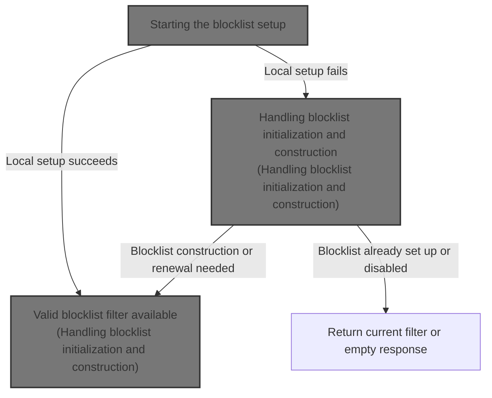

This document describes how the system ensures a valid blocklist filter is available for DNS filtering. The process checks for a usable local blocklist, and if unavailable, downloads and constructs a new filter. The flow also manages renewal and construction to keep DNS filtering effective.



# Starting the blocklist setup

```mermaid
%%{init: {"flowchart": {"defaultRenderer": "elk"}} }%%
flowchart TD
    node1{"Is BlocklistWrapper valid and disk access available?"}
    click node1 openCode "src/core/deno/blocklists.ts:20:21"
    node1 -->|"No"| node2["Return false"]
    click node2 openCode "src/core/deno/blocklists.ts:20:21"
    node1 -->|"Yes"| node3["Attempt local setup"]
    click node3 openCode "src/core/deno/blocklists.ts:22:23"
    node3 --> node4{"Did local setup succeed?"}
    click node4 openCode "src/core/deno/blocklists.ts:23:25"
    node4 -->|"Yes"| node5["Return true"]
    click node5 openCode "src/core/deno/blocklists.ts:24:25"
    node4 -->|"No"| node6["Download and initialize blocklists"]
    click node6 openCode "src/core/deno/blocklists.ts:27:28"
    node6 --> node7["Save blocklists"]
    click node7 openCode "src/core/deno/blocklists.ts:30:31"
    node7 --> node8["Return save result"]
    click node8 openCode "src/core/deno/blocklists.ts:30:31"

classDef HeadingStyle fill:#777777,stroke:#333,stroke-width:2px;

%% Swimm:
%% %%{init: {"flowchart": {"defaultRenderer": "elk"}} }%%
%% flowchart TD
%%     node1{"Is <SwmToken path="src/core/deno/blocklists.ts" pos="19:11:11" line-data="export async function setup(bw: BlocklistWrapper) {">`BlocklistWrapper`</SwmToken> valid and disk access available?"}
%%     click node1 openCode "<SwmPath>[src/…/deno/blocklists.ts](src/core/deno/blocklists.ts)</SwmPath>:20:21"
%%     node1 -->|"No"| node2["Return false"]
%%     click node2 openCode "<SwmPath>[src/…/deno/blocklists.ts](src/core/deno/blocklists.ts)</SwmPath>:20:21"
%%     node1 -->|"Yes"| node3["Attempt local setup"]
%%     click node3 openCode "<SwmPath>[src/…/deno/blocklists.ts](src/core/deno/blocklists.ts)</SwmPath>:22:23"
%%     node3 --> node4{"Did local setup succeed?"}
%%     click node4 openCode "<SwmPath>[src/…/deno/blocklists.ts](src/core/deno/blocklists.ts)</SwmPath>:23:25"
%%     node4 -->|"Yes"| node5["Return true"]
%%     click node5 openCode "<SwmPath>[src/…/deno/blocklists.ts](src/core/deno/blocklists.ts)</SwmPath>:24:25"
%%     node4 -->|"No"| node6["Download and initialize blocklists"]
%%     click node6 openCode "<SwmPath>[src/…/deno/blocklists.ts](src/core/deno/blocklists.ts)</SwmPath>:27:28"
%%     node6 --> node7["Save blocklists"]
%%     click node7 openCode "<SwmPath>[src/…/deno/blocklists.ts](src/core/deno/blocklists.ts)</SwmPath>:30:31"
%%     node7 --> node8["Return save result"]
%%     click node8 openCode "<SwmPath>[src/…/deno/blocklists.ts](src/core/deno/blocklists.ts)</SwmPath>:30:31"
%% 
%% classDef HeadingStyle fill:#777777,stroke:#333,stroke-width:2px;
```



<SwmSnippet path="/src/core/deno/blocklists.ts" line="19">

---

Setup is where we kick off the blocklist initialization. If local setup fails, we move on to downloading and building blocklists by calling <SwmToken path="src/core/deno/blocklists.ts" pos="28:3:5" line-data="  await bw.init(/* rxid*/ &quot;bl-download&quot;, /* wait */ true);">`bw.init`</SwmToken>, which handles remote fetching and construction. This is necessary to make sure we have a valid blocklist, regardless of local state.

```typescript
export async function setup(bw: BlocklistWrapper) {
  if (!bw || !envutil.hasDisk()) return false;

  const ok = setupLocally(bw);
  if (ok) {
    return true;
  }

  console.info("dowloading blocklists");
  await bw.init(/* rxid*/ "bl-download", /* wait */ true);

  return save(bw);
}
```

---

</SwmSnippet>

# Handling blocklist initialization and construction

```mermaid
%%{init: {"flowchart": {"defaultRenderer": "elk"}} }%%
flowchart TD
  node1["Is blocklist filter set up or system disabled?"]
  click node1 openCode "src/plugins/rethinkdns/main.js:52:56"
  node1 -->|"Yes"| node2["Return current blocklist filter or empty response"]
  click node2 openCode "src/plugins/rethinkdns/main.js:53:55"
  node1 -->|"No"| node3{"Is blocklist construction needed? (not in progress or timeout expired)"}
  click node3 openCode "src/plugins/rethinkdns/main.js:61:65"
  node3 -->|"Yes"| node4["Start blocklist construction"]
  click node4 openCode "src/plugins/rethinkdns/main.js:66:67"
  node3 -->|"No"| node5{"Return immediately (nowait true & forceget false) or wait?"}
  click node5 openCode "src/plugins/rethinkdns/main.js:68:76"
  node5 -->|"Return immediately"| node6["Return empty response"]
  click node6 openCode "src/plugins/rethinkdns/main.js:71:72"
  node5 -->|"Wait"| node7["Wait for blocklist construction to finish"]
  click node7 openCode "src/plugins/rethinkdns/main.js:75:75"
  node1 -.-> node8["On error: Return error response"]
  click node8 openCode "src/plugins/rethinkdns/main.js:77:80"

classDef HeadingStyle fill:#777777,stroke:#333,stroke-width:2px;

%% Swimm:
%% %%{init: {"flowchart": {"defaultRenderer": "elk"}} }%%
%% flowchart TD
%%   node1["Is blocklist filter set up or system disabled?"]
%%   click node1 openCode "<SwmPath>[src/…/rethinkdns/main.js](src/plugins/rethinkdns/main.js)</SwmPath>:52:56"
%%   node1 -->|"Yes"| node2["Return current blocklist filter or empty response"]
%%   click node2 openCode "<SwmPath>[src/…/rethinkdns/main.js](src/plugins/rethinkdns/main.js)</SwmPath>:53:55"
%%   node1 -->|"No"| node3{"Is blocklist construction needed? (not in progress or timeout expired)"}
%%   click node3 openCode "<SwmPath>[src/…/rethinkdns/main.js](src/plugins/rethinkdns/main.js)</SwmPath>:61:65"
%%   node3 -->|"Yes"| node4["Start blocklist construction"]
%%   click node4 openCode "<SwmPath>[src/…/rethinkdns/main.js](src/plugins/rethinkdns/main.js)</SwmPath>:66:67"
%%   node3 -->|"No"| node5{"Return immediately (nowait true & forceget false) or wait?"}
%%   click node5 openCode "<SwmPath>[src/…/rethinkdns/main.js](src/plugins/rethinkdns/main.js)</SwmPath>:68:76"
%%   node5 -->|"Return immediately"| node6["Return empty response"]
%%   click node6 openCode "<SwmPath>[src/…/rethinkdns/main.js](src/plugins/rethinkdns/main.js)</SwmPath>:71:72"
%%   node5 -->|"Wait"| node7["Wait for blocklist construction to finish"]
%%   click node7 openCode "<SwmPath>[src/…/rethinkdns/main.js](src/plugins/rethinkdns/main.js)</SwmPath>:75:75"
%%   node1 -.-> node8["On error: Return error response"]
%%   click node8 openCode "<SwmPath>[src/…/rethinkdns/main.js](src/plugins/rethinkdns/main.js)</SwmPath>:77:80"
%% 
%% classDef HeadingStyle fill:#777777,stroke:#333,stroke-width:2px;
```



<SwmSnippet path="/src/plugins/rethinkdns/main.js" line="51">

---

Init decides if we need to build or renew the blocklist. If it's already set up or disabled, we skip construction. Otherwise, we check timestamps and trigger blocklist construction if needed, or wait for ongoing construction to finish.

```javascript
  async init(rxid, forceget = false) {
    if (this.isBlocklistFilterSetup() || this.disabled()) {
      const blres = pres.emptyResponse();
      blres.data.blocklistFilter = this.blocklistFilter; // may be nil
      return blres;
    }

    try {
      const now = Date.now();

      if (
        !this.isBlocklistUnderConstruction ||
        // it has been a while, queue another blocklist-construction
        now - this.startTime > envutil.downloadTimeout() * 2
      ) {
        this.log.i(rxid, "download blocklists", now, this.startTime);
        return this.initBlocklistConstruction(rxid, now);
      } else if (this.nowait && !forceget) {
        // blocklist-construction is in progress, but we don't have to
        // wait for it to finish. So, return an empty response.
        this.log.i(rxid, "nowait, but blocklist construction ongoing");
        return pres.emptyResponse();
      } else {
        // someone's constructing... wait till finished
        return this.waitUntilDone(rxid);
      }
    } catch (e) {
      this.log.e(rxid, "main", e.stack);
      return pres.errResponse("blocklistWrapper", e);
    }
  }
```

---

</SwmSnippet>

<SwmSnippet path="/src/plugins/rethinkdns/main.js" line="151">

---

InitBlocklistConstruction handles the actual blocklist renewal and building. It checks if the blocklist config is outdated, renews it if needed, then downloads and builds the filter. It uses repo-specific utilities for config, timestamps, and renewal logic, and returns a response with the filter or error info.

```javascript
  async initBlocklistConstruction(rxid, when) {
    this.isBlocklistUnderConstruction = true;
    this.startTime = when;

    const baseurl = envutil.blocklistUrl();

    let bconfig = withDefaults(cfg.orig());
    let ft = cfg.filetag();
    // if bconfig.timestamp is older than AUTO_RENEW_BLOCKLISTS_OLDER_THAN
    // then download the latest filetag (ft) and basicconfig (bconfig).
    if (!envutil.disableBlocklists()) {
      const blocklistAgeThresWeeks = envutil.renewBlocklistsThresholdInWeeks();
      const bltimestamp = util.bareTimestampFrom(cfg.timestamp());
      if (isPast(bltimestamp, blocklistAgeThresWeeks)) {
        const [renewCfg, renewedFt] = await renew(baseurl);

        if (renewCfg != null && renewedFt != null) {
          this.log.i(rxid, "r:", bconfig.timestamp, "=>", renewCfg.timestamp);
          bconfig = withDefaults(renewCfg);
          ft = renewedFt;
        } else {
          this.log.w(rxid, "r: failed; got:", renewCfg);
        }
      } else {
        this.log.d(rxid, "r: not needed for:", bltimestamp);
      }
    }

    let response = pres.emptyResponse();
    try {
      await this.downloadAndBuildBlocklistFilter(rxid, bconfig, ft);

      this.log.i(rxid, "blocklist-filter setup; u6?", bconfig.useCodec6);
      if (false) {
        // test
        const result = this.blocklistFilter.blockstamp("google.com");
        this.log.d(rxid, JSON.stringify(result));
      }

      response.data.blocklistFilter = this.blocklistFilter;
    } catch (e) {
      this.log.e(rxid, "initBlocklistConstruction", e);
      response = pres.errResponse("initBlocklistConstruction", e);
      this.exceptionFrom = response.exceptionFrom;
      this.exceptionStack = response.exceptionStack;
    }

    this.isBlocklistUnderConstruction = false;

    return response;
  }
```

---

</SwmSnippet>

&nbsp;

*This is an auto-generated document by Swimm 🌊 and has not yet been verified by a human*

<SwmMeta version="3.0.0" repo-id="Z2l0aHViJTNBJTNBamF2YXNjcmlwdC1zZXJ2ZXJsZXNzLWRucyUzQSUzQXJpY2FyZG9sb3Blemc=" repo-name="javascript-serverless-dns"><sup>Powered by [Swimm](https://app.swimm.io/)</sup></SwmMeta>
