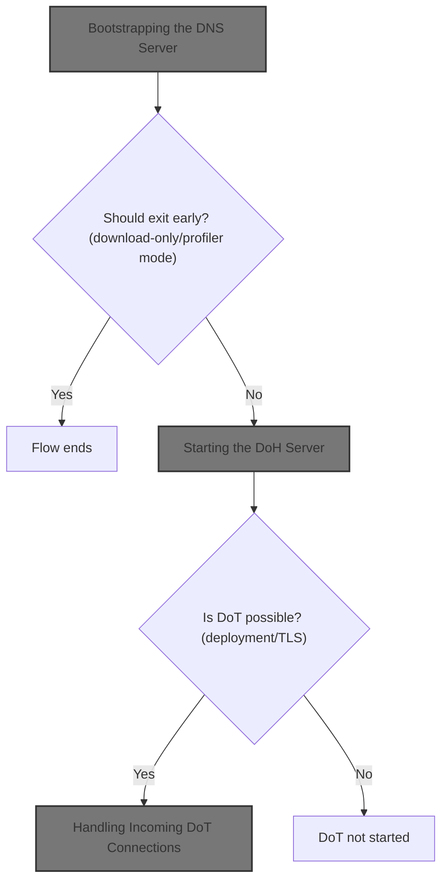
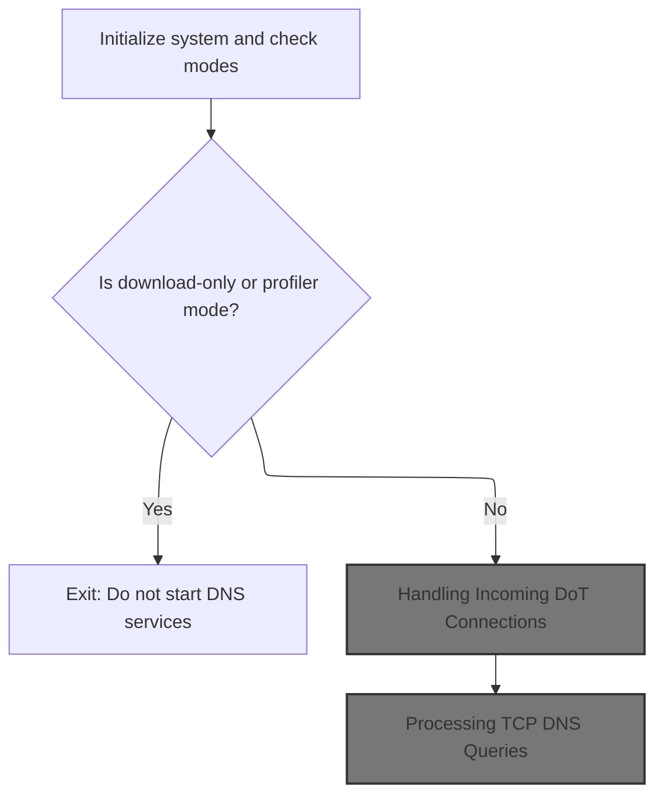
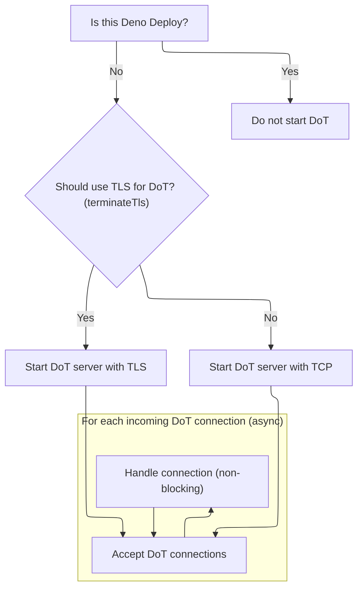
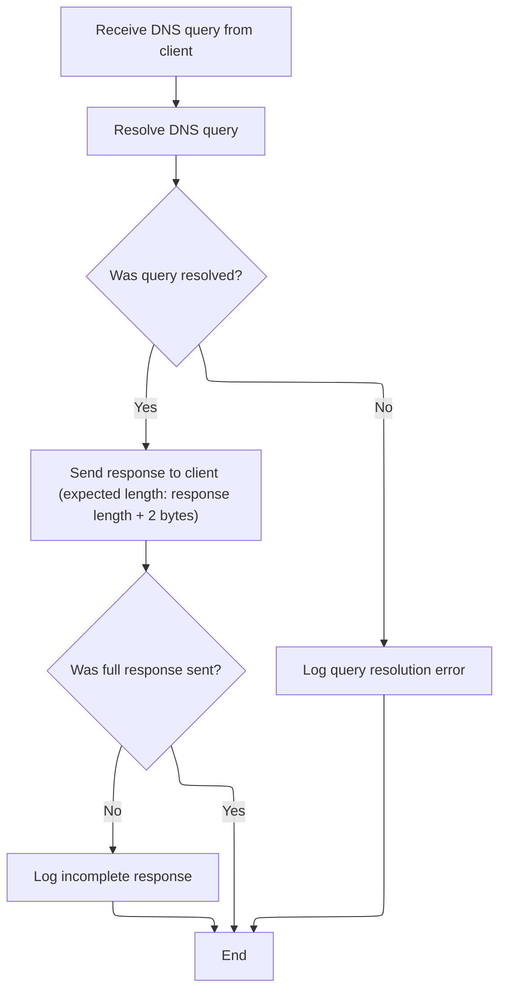

```mermaid
%%{init: {"flowchart": {"defaultRenderer": "elk"}} }%%
flowchart TD
  node1["Start DNS-over-HTTPS (DoH) service"] --> node2{"Is TLS available?"}
  click node1 openCode "src/server-deno.ts:102:119"
  node2 -->|"Yes"| node3["Start DoH with TLS options (dohConnOpts, tlsOpts, httpOpts, sigOpts)"]
  click node2 openCode "src/server-deno.ts:147:153"
  click node3 openCode "src/server-deno.ts:104:112"
  node2 -->|"No"| node4["Start DoH without TLS (dohConnOpts, sigOpts)"]
  click node4 openCode "src/server-deno.ts:114:115"
  node3 --> node5["Register DoH as up"]
  click node5 openCode "src/server-deno.ts:117:118"
  node4 --> node5
  node5 --> node6["Start DNS-over-TLS (DoT) service if possible"]
  click node6 openCode "src/server-deno.ts:120:139"
  node6 --> node7{"Is system running on Deno Deploy?"}
  click node7 openCode "src/server-deno.ts:122:122"
  node7 -->|"Yes"| node14["Skip DoT startup"]
  click node14 openCode "src/server-deno.ts:122:122"
  node7 -->|"No"| node8{"Is TLS available for DoT?"}
  click node8 openCode "src/server-deno.ts:126:128"
  node8 -->|"Yes"| node9["Start DoT with TLS options (dotConnOpts, tlsOpts)"]
  click node9 openCode "src/server-deno.ts:127:127"
  node8 -->|"No"| node10["Start DoT without TLS (dotConnOpts)"]
  click node10 openCode "src/server-deno.ts:128:128"
  node9 --> node11["Register DoT as up"]
  click node11 openCode "src/server-deno.ts:130:131"
  node10 --> node11
  node11 --> node12["Handle incoming DoT connections"]
  click node12 openCode "src/server-deno.ts:133:138"
  subgraph loop1["For each DoT connection"]
    node12 --> node13["Serve DNS request"]
    click node13 openCode "src/server-deno.ts:137:137"
    node13 --> node12
  end
classDef HeadingStyle fill:#777777,stroke:#333,stroke-width:2px;

%% Swimm:
%% %%{init: {"flowchart": {"defaultRenderer": "elk"}} }%%
%% flowchart TD
%%   node1["Start DNS-over-HTTPS (<SwmToken path="src/server-deno.ts" pos="117:4:4" line-data="    up(&quot;DoH&quot;, abortctl, dohConnOpts);">`DoH`</SwmToken>) service"] --> node2{"Is TLS available?"}
%%   click node1 openCode "<SwmPath>[src/server-deno.ts](src/server-deno.ts)</SwmPath>:102:119"
%%   node2 -->|"Yes"| node3["Start <SwmToken path="src/server-deno.ts" pos="117:4:4" line-data="    up(&quot;DoH&quot;, abortctl, dohConnOpts);">`DoH`</SwmToken> with TLS options (<SwmToken path="src/server-deno.ts" pos="73:3:3" line-data="  const dohConnOpts = { port: envutil.dohBackendPort() };">`dohConnOpts`</SwmToken>, <SwmToken path="src/server-deno.ts" pos="85:3:3" line-data="  const tlsOpts = dotls">`tlsOpts`</SwmToken>, <SwmToken path="src/server-deno.ts" pos="93:3:3" line-data="  const httpOpts = {">`httpOpts`</SwmToken>, <SwmToken path="src/server-deno.ts" pos="75:3:3" line-data="  const sigOpts = {">`sigOpts`</SwmToken>)"]
%%   click node2 openCode "<SwmPath>[src/server-deno.ts](src/server-deno.ts)</SwmPath>:147:153"
%%   click node3 openCode "<SwmPath>[src/server-deno.ts](src/server-deno.ts)</SwmPath>:104:112"
%%   node2 -->|"No"| node4["Start <SwmToken path="src/server-deno.ts" pos="117:4:4" line-data="    up(&quot;DoH&quot;, abortctl, dohConnOpts);">`DoH`</SwmToken> without TLS (<SwmToken path="src/server-deno.ts" pos="73:3:3" line-data="  const dohConnOpts = { port: envutil.dohBackendPort() };">`dohConnOpts`</SwmToken>, <SwmToken path="src/server-deno.ts" pos="75:3:3" line-data="  const sigOpts = {">`sigOpts`</SwmToken>)"]
%%   click node4 openCode "<SwmPath>[src/server-deno.ts](src/server-deno.ts)</SwmPath>:114:115"
%%   node3 --> node5["Register <SwmToken path="src/server-deno.ts" pos="117:4:4" line-data="    up(&quot;DoH&quot;, abortctl, dohConnOpts);">`DoH`</SwmToken> as up"]
%%   click node5 openCode "<SwmPath>[src/server-deno.ts](src/server-deno.ts)</SwmPath>:117:118"
%%   node4 --> node5
%%   node5 --> node6["Start DNS-over-TLS (<SwmToken path="src/server-deno.ts" pos="121:5:5" line-data="    // No DoT on Deno Deploy which supports only http workloads">`DoT`</SwmToken>) service if possible"]
%%   click node6 openCode "<SwmPath>[src/server-deno.ts](src/server-deno.ts)</SwmPath>:120:139"
%%   node6 --> node7{"Is system running on Deno Deploy?"}
%%   click node7 openCode "<SwmPath>[src/server-deno.ts](src/server-deno.ts)</SwmPath>:122:122"
%%   node7 -->|"Yes"| node14["Skip <SwmToken path="src/server-deno.ts" pos="121:5:5" line-data="    // No DoT on Deno Deploy which supports only http workloads">`DoT`</SwmToken> startup"]
%%   click node14 openCode "<SwmPath>[src/server-deno.ts](src/server-deno.ts)</SwmPath>:122:122"
%%   node7 -->|"No"| node8{"Is TLS available for <SwmToken path="src/server-deno.ts" pos="121:5:5" line-data="    // No DoT on Deno Deploy which supports only http workloads">`DoT`</SwmToken>?"}
%%   click node8 openCode "<SwmPath>[src/server-deno.ts](src/server-deno.ts)</SwmPath>:126:128"
%%   node8 -->|"Yes"| node9["Start <SwmToken path="src/server-deno.ts" pos="121:5:5" line-data="    // No DoT on Deno Deploy which supports only http workloads">`DoT`</SwmToken> with TLS options (<SwmToken path="src/server-deno.ts" pos="74:3:3" line-data="  const dotConnOpts = { port: envutil.dotBackendPort() };">`dotConnOpts`</SwmToken>, <SwmToken path="src/server-deno.ts" pos="85:3:3" line-data="  const tlsOpts = dotls">`tlsOpts`</SwmToken>)"]
%%   click node9 openCode "<SwmPath>[src/server-deno.ts](src/server-deno.ts)</SwmPath>:127:127"
%%   node8 -->|"No"| node10["Start <SwmToken path="src/server-deno.ts" pos="121:5:5" line-data="    // No DoT on Deno Deploy which supports only http workloads">`DoT`</SwmToken> without TLS (<SwmToken path="src/server-deno.ts" pos="74:3:3" line-data="  const dotConnOpts = { port: envutil.dotBackendPort() };">`dotConnOpts`</SwmToken>)"]
%%   click node10 openCode "<SwmPath>[src/server-deno.ts](src/server-deno.ts)</SwmPath>:128:128"
%%   node9 --> node11["Register <SwmToken path="src/server-deno.ts" pos="121:5:5" line-data="    // No DoT on Deno Deploy which supports only http workloads">`DoT`</SwmToken> as up"]
%%   click node11 openCode "<SwmPath>[src/server-deno.ts](src/server-deno.ts)</SwmPath>:130:131"
%%   node10 --> node11
%%   node11 --> node12["Handle incoming <SwmToken path="src/server-deno.ts" pos="121:5:5" line-data="    // No DoT on Deno Deploy which supports only http workloads">`DoT`</SwmToken> connections"]
%%   click node12 openCode "<SwmPath>[src/server-deno.ts](src/server-deno.ts)</SwmPath>:133:138"
%%   subgraph loop1["For each <SwmToken path="src/server-deno.ts" pos="121:5:5" line-data="    // No DoT on Deno Deploy which supports only http workloads">`DoT`</SwmToken> connection"]
%%     node12 --> node13["Serve DNS request"]
%%     click node13 openCode "<SwmPath>[src/server-deno.ts](src/server-deno.ts)</SwmPath>:137:137"
%%     node13 --> node12
%%   end
%% classDef HeadingStyle fill:#777777,stroke:#333,stroke-width:2px;
```

This document describes how the DNS server is bootstrapped and started. Based on deployment environment and configuration, the flow decides whether to start DNS-over-HTTPS (<SwmToken path="src/server-deno.ts" pos="117:4:4" line-data="    up(&quot;DoH&quot;, abortctl, dohConnOpts);">`DoH`</SwmToken>) and DNS-over-TLS (<SwmToken path="src/server-deno.ts" pos="121:5:5" line-data="    // No DoT on Deno Deploy which supports only http workloads">`DoT`</SwmToken>) services, or exit early if in download-only or profiler mode. Once running, the system processes incoming DNS queries securely over HTTPS and TLS.



# Bootstrapping the DNS Server



<SwmSnippet path="/src/server-deno.ts" line="55">

---

In <SwmToken path="src/server-deno.ts" pos="55:2:2" line-data="function systemUp() {">`systemUp`</SwmToken>, we kick off the whole server setup. It checks if we're in download mode or profiler mode using env vars. If download mode is set, it logs and exits early, skipping DNS startup. Profiler mode sets a timer to auto-stop after 60 seconds. After those checks, it reads more env vars to figure out if we're on Deno Deploy, if cleartext is enabled, and what ports to use. It loads TLS cert/key files if needed, then starts the <SwmToken path="src/server-deno.ts" pos="117:4:4" line-data="    up(&quot;DoH&quot;, abortctl, dohConnOpts);">`DoH`</SwmToken> server right away. Next, it calls <SwmToken path="src/server-deno.ts" pos="98:1:1" line-data="  startDotIfPossible();">`startDotIfPossible`</SwmToken> to try spinning up the <SwmToken path="src/server-deno.ts" pos="121:5:5" line-data="    // No DoT on Deno Deploy which supports only http workloads">`DoT`</SwmToken> server if conditions allow (not Deno Deploy, not cleartext). This lets us handle both HTTPS and TLS DNS traffic depending on deployment and config.

```typescript
function systemUp() {
  log = loggerWithTags("Deno");
  if (!log) throw new Error("logger unavailable on system up");

  const downloadmode = envutil.blocklistDownloadOnly() as boolean;
  const profilermode = envutil.profileDnsResolves() as boolean;
  if (downloadmode) {
    log.i("in download mode, not running the dns resolver");
    return;
  } else if (profilermode) {
    const durationms = 60 * 1000;
    log.w("in profiler mode, run for", durationms, "and exit");
    stopAfter(durationms);
  }

  const abortctl = new AbortController();
  const onDenoDeploy = envutil.onDenoDeploy() as boolean;
  const isCleartext = envutil.isCleartext() as boolean;
  const dohConnOpts = { port: envutil.dohBackendPort() };
  const dotConnOpts = { port: envutil.dotBackendPort() };
  const sigOpts = {
    signal: abortctl.signal,
    onListen: undefined,
  };

  // TODO: set TLS_KEY and TLS_CRT paths via env vars
  const crtpath = envutil.tlsCrtPath() as string;
  const keypath = envutil.tlsKeyPath() as string;
  const dotls = !onDenoDeploy && !isCleartext;

  const tlsOpts = dotls
    ? {
        // docs.deno.com/runtime/reference/migration_guide/
        cert: Deno.readTextFileSync(crtpath),
        key: Deno.readTextFileSync(keypath),
      }
    : { cert: "", key: "" };
  // deno.land/manual@v1.18.0/runtime/http_server_apis_low_level
  const httpOpts = {
    alpnProtocols: ["h2", "http/1.1"],
  };

  startDoh();
  startDotIfPossible();

```

---

</SwmSnippet>

## Handling Incoming <SwmToken path="src/server-deno.ts" pos="121:5:5" line-data="    // No DoT on Deno Deploy which supports only http workloads">`DoT`</SwmToken> Connections



<SwmSnippet path="/src/server-deno.ts" line="120">

---

<SwmToken path="src/server-deno.ts" pos="120:5:5" line-data="  async function startDotIfPossible() {">`startDotIfPossible`</SwmToken> checks if we're on Deno Deploy and skips <SwmToken path="src/server-deno.ts" pos="121:5:5" line-data="    // No DoT on Deno Deploy which supports only http workloads">`DoT`</SwmToken> setup if so. Otherwise, it sets up a TLS or plain TCP listener for <SwmToken path="src/server-deno.ts" pos="121:5:5" line-data="    // No DoT on Deno Deploy which supports only http workloads">`DoT`</SwmToken> based on config. It registers the listener and then loops over incoming connections, logging each one. For every connection, it calls <SwmToken path="src/server-deno.ts" pos="137:1:1" line-data="      serveTcp(conn);">`serveTcp`</SwmToken> without awaiting, so the server can keep accepting new connections while handling queries in parallel.

```typescript
  async function startDotIfPossible() {
    // No DoT on Deno Deploy which supports only http workloads
    if (onDenoDeploy) return;

    // doc.deno.land/deno/stable/~/Deno.listenTls
    // doc.deno.land/deno/stable/~/Deno.listen
    const dot = terminateTls()
      ? Deno.listenTls({ ...dotConnOpts, ...tlsOpts })
      : Deno.listen({ ...dotConnOpts });

    up("DoT (no blocklists)", dot, dotConnOpts);

    // deno.land/manual@v1.11.3/runtime/http_server_apis#handling-connections
    for await (const conn of dot) {
      log.d("DoT conn:", conn.remoteAddr);

      // to not block the server and accept further conns, do not await
      serveTcp(conn);
    }
  }
```

---

</SwmSnippet>

## Processing TCP DNS Queries

<SwmSnippet path="/src/server-deno.ts" line="168">

---

In <SwmToken path="src/server-deno.ts" pos="168:4:4" line-data="async function serveTcp(conn: Deno.Conn) {">`serveTcp`</SwmToken>, we loop over the connection, reading the length-prefixed DNS queries. If the query is valid, we pass it to <SwmToken path="src/server-deno.ts" pos="206:3:3" line-data="    await handleTCPQuery(q, conn);">`handleTCPQuery`</SwmToken> to resolve and respond. This lets us handle multiple queries per connection, as expected for DNS over TCP.

```typescript
async function serveTcp(conn: Deno.Conn) {
  // TODO: Sync this impl with serveTcp in server-node.js
  const qlBuf = new Uint8Array(2);

  while (true) {
    let n = null;

    try {
      n = await conn.read(qlBuf);
    } catch (e) {
      log.w("err tcp query read", e);
      break;
    }

    if (n == 0 || n == null) {
      log.d("tcp socket clean shutdown");
      break;
    }

    // TODO: use dnsutil.validateSize instead
    if (n < 2) {
      log.w("query too small");
      break;
    }

    const ql = new DataView(qlBuf.buffer).getUint16(0);
    log.d(`Read ${n} octets; q len = ${qlBuf} = ${ql}`);

    const q = new Uint8Array(ql);
    n = await conn.read(q);
    log.d(`Read ${n} length q`);

    if (n != ql) {
      log.w(`query len mismatch: ${n} < ${ql}`);
      break;
    }

    // TODO: Parallel processing
    await handleTCPQuery(q, conn);
  }

```

---

</SwmSnippet>

### Resolving and Responding to TCP Queries



<SwmSnippet path="/src/server-deno.ts" line="213">

---

<SwmToken path="src/server-deno.ts" pos="213:4:4" line-data="async function handleTCPQuery(q: Uint8Array, conn: Deno.Conn) {">`handleTCPQuery`</SwmToken> gets the DNS query, calls <SwmToken path="src/server-deno.ts" pos="215:9:9" line-data="    const r = await resolveQuery(q);">`resolveQuery`</SwmToken> to generate the response, and writes it back to the client with a length prefix. Errors are logged but don't crash the server.

```typescript
async function handleTCPQuery(q: Uint8Array, conn: Deno.Conn) {
  try {
    const r = await resolveQuery(q);
    const rlBuf = bufutil.encodeUint8ArrayBE(r.byteLength, 2);

    const n = await conn.write(new Uint8Array([...rlBuf, ...r]));
    if (n != r.byteLength + 2) {
      log.e(`res write incomplete: ${n} < ${r.byteLength + 2}`);
    }
  } catch (e) {
    log.w("err tcp query resolve", e);
  }
}
```

---

</SwmSnippet>

### Query Resolution Logic

See <SwmLink doc-title="DNS Query Resolution Flow">[DNS Query Resolution Flow](/.swm/dns-query-resolution-flow.65rzxg5j.sw.md)</SwmLink>

### Closing the TCP Connection

<SwmSnippet path="/src/server-deno.ts" line="209">

---

Back in <SwmToken path="src/server-deno.ts" pos="137:1:1" line-data="      serveTcp(conn);">`serveTcp`</SwmToken>, after we've handled all queries for a connection, we close it to free up resources. This matches typical DNS-over-TCP behavior.

```typescript
  // TODO: expect client to close the connection; timeouts.
  conn.close();
}
```

---

</SwmSnippet>

## Starting the <SwmToken path="src/server-deno.ts" pos="117:4:4" line-data="    up(&quot;DoH&quot;, abortctl, dohConnOpts);">`DoH`</SwmToken> Server



<SwmSnippet path="/src/server-deno.ts" line="100">

---

Back in <SwmToken path="src/server-deno.ts" pos="55:2:2" line-data="function systemUp() {">`systemUp`</SwmToken>, after trying to start <SwmToken path="src/server-deno.ts" pos="121:5:5" line-data="    // No DoT on Deno Deploy which supports only http workloads">`DoT`</SwmToken>, we set up the <SwmToken path="src/server-deno.ts" pos="117:4:4" line-data="    up(&quot;DoH&quot;, abortctl, dohConnOpts);">`DoH`</SwmToken> server. Depending on TLS config, we use <SwmToken path="src/server-deno.ts" pos="101:13:15" line-data="  // docs.deno.com/api/deno/~/Deno.serve">`Deno.serve`</SwmToken> with or without TLS options. The up() call logs and tracks the server. <SwmToken path="src/server-deno.ts" pos="137:1:1" line-data="      serveTcp(conn);">`serveTcp`</SwmToken> isn't called here since <SwmToken path="src/server-deno.ts" pos="117:4:4" line-data="    up(&quot;DoH&quot;, abortctl, dohConnOpts);">`DoH`</SwmToken> uses HTTP handlers, not raw TCP.

```typescript
  // docs.deno.com/runtime/fundamentals/http_server
  // docs.deno.com/api/deno/~/Deno.serve
  function startDoh() {
    if (terminateTls()) {
      Deno.serve(
        {
          ...dohConnOpts,
          ...tlsOpts,
          ...httpOpts,
          ...sigOpts,
        },
        serveDoh
      );
    } else {
      Deno.serve({ ...dohConnOpts, ...sigOpts }, serveDoh);
    }

    up("DoH", abortctl, dohConnOpts);
  }

  async function startDotIfPossible() {
    // No DoT on Deno Deploy which supports only http workloads
    if (onDenoDeploy) return;

    // doc.deno.land/deno/stable/~/Deno.listenTls
    // doc.deno.land/deno/stable/~/Deno.listen
    const dot = terminateTls()
      ? Deno.listenTls({ ...dotConnOpts, ...tlsOpts })
      : Deno.listen({ ...dotConnOpts });

    up("DoT (no blocklists)", dot, dotConnOpts);

    // deno.land/manual@v1.11.3/runtime/http_server_apis#handling-connections
    for await (const conn of dot) {
      log.d("DoT conn:", conn.remoteAddr);

      // to not block the server and accept further conns, do not await
      serveTcp(conn);
    }
  }

```

---

</SwmSnippet>

<SwmSnippet path="/src/server-deno.ts" line="141">

---

At the end of <SwmToken path="src/server-deno.ts" pos="55:2:2" line-data="function systemUp() {">`systemUp`</SwmToken>, up() logs the server/listener and tracks it. <SwmToken path="src/server-deno.ts" pos="142:22:24" line-data="    log.i(&quot;up&quot;, p, opts, &quot;tls?&quot;, terminateTls());">`terminateTls()`</SwmToken> checks env flags and cert/key files to decide if TLS should be enabled for the listeners. This affects how the servers are started and is tied to the repo's deployment/security setup.

```typescript
  function up(p: string, s: any, opts: any) {
    log.i("up", p, opts, "tls?", terminateTls());
    // 's' may be a Deno.Listener or std:http/Server
    listeners.push(s);
  }

  function terminateTls() {
    if (onDenoDeploy) return false;
    if (envutil.isCleartext() as boolean) return false;
    if (util.emptyString(tlsOpts.key)) return false;
    if (util.emptyString(tlsOpts.cert)) return false;
    return true;
  }
}
```

---

</SwmSnippet>

&nbsp;

*This is an auto-generated document by Swimm 🌊 and has not yet been verified by a human*

<SwmMeta version="3.0.0" repo-id="Z2l0aHViJTNBJTNBamF2YXNjcmlwdC1zZXJ2ZXJsZXNzLWRucyUzQSUzQXJpY2FyZG9sb3Blemc=" repo-name="javascript-serverless-dns"><sup>Powered by [Swimm](https://app.swimm.io/)</sup></SwmMeta>
