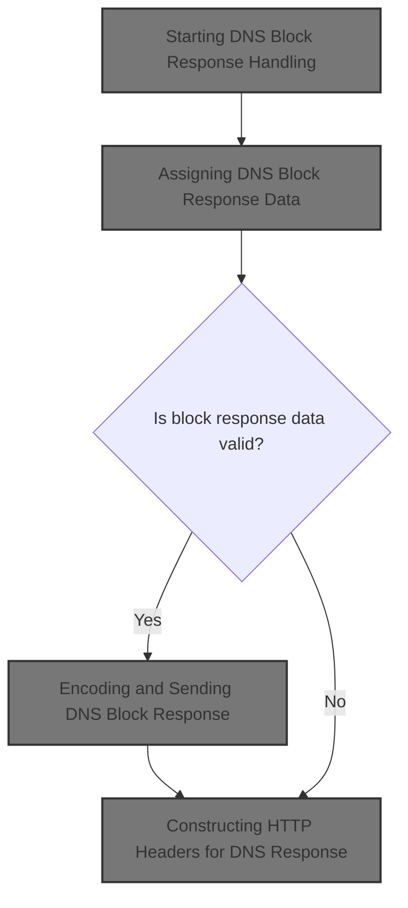
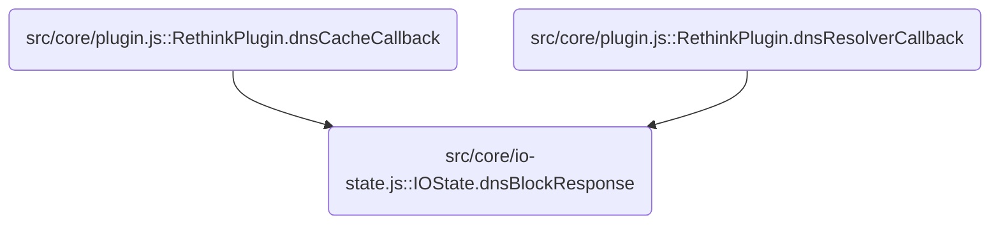
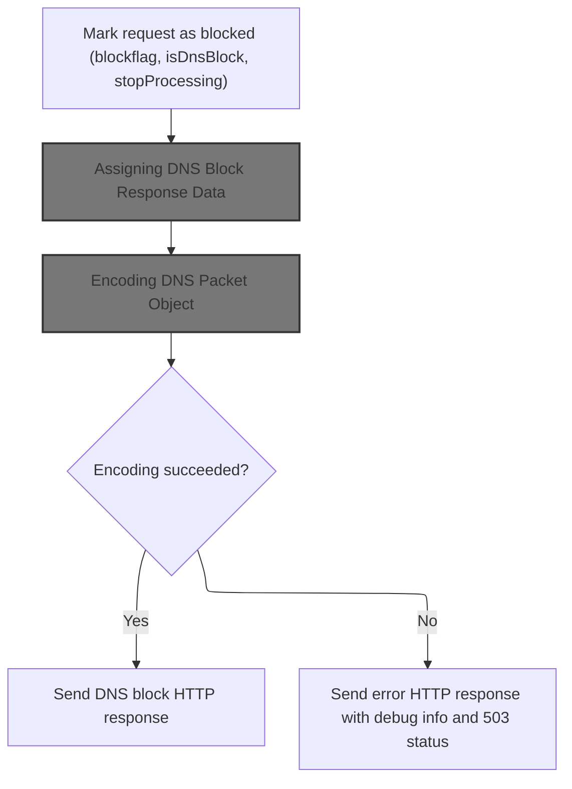
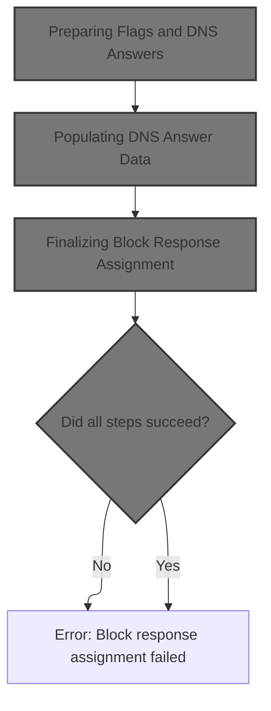
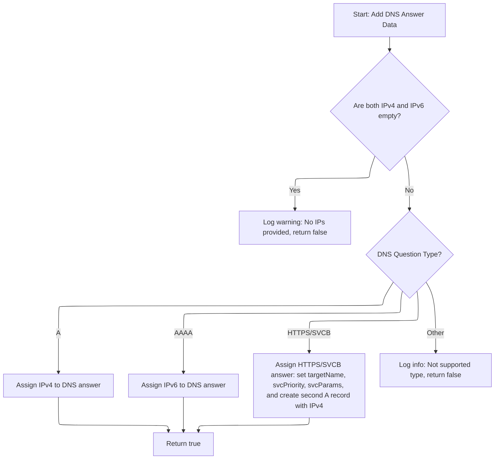
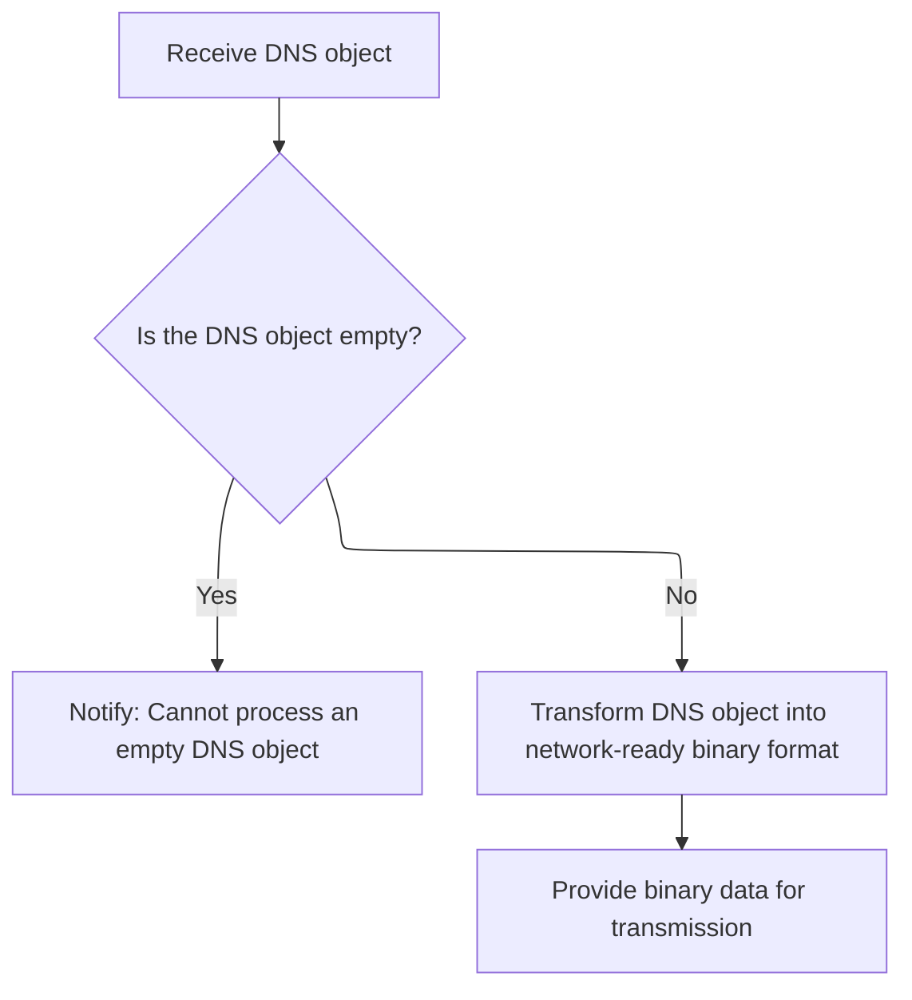
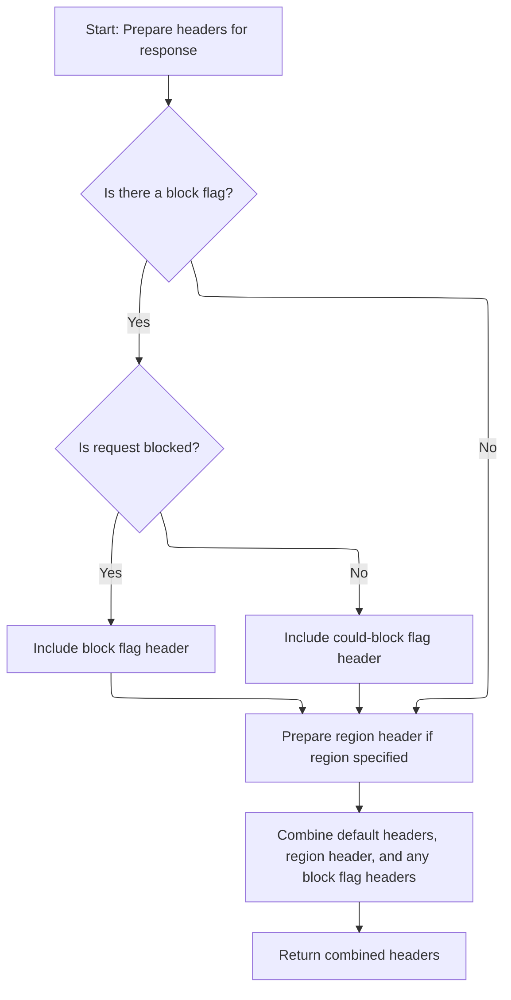

This document describes the flow for handling DNS requests that must be blocked. The system marks the request, builds the block response data, encodes the DNS packet, and returns an HTTP response with the necessary headers and cache settings.



# Where is this flow used?

This flow is used multiple times in the codebase as represented in the following diagram:



# Starting DNS Block Response Handling



<SwmSnippet path="/src/core/io-state.js" line="187">

---

In <SwmToken path="src/core/io-state.js" pos="187:1:1" line-data="  dnsBlockResponse(blockflag) {">`dnsBlockResponse`</SwmToken>, we kick off the block response logic by marking the DNS packet as blocked and setting the relevant flags. We need to call <SwmToken path="src/core/io-state.js" pos="194:3:3" line-data="      this.assignBlockResponse();">`assignBlockResponse`</SwmToken> next because that's where the actual DNS answer data gets built and attached to the packet.

```javascript
  dnsBlockResponse(blockflag) {
    this.initDecodedDnsPacketIfNeeded(); // initializes to empty obj
    this.stopProcessing = true;
    this.isDnsBlock = true;
    this.flag = blockflag;

    try {
      this.assignBlockResponse();
```

---

</SwmSnippet>

## Assigning DNS Block Response Data



<SwmSnippet path="/src/core/io-state.js" line="289">

---

In <SwmToken path="src/core/io-state.js" pos="289:1:1" line-data="  assignBlockResponse() {">`assignBlockResponse`</SwmToken>, we start by prepping the flags and DNS answers using <SwmToken path="src/core/io-state.js" pos="290:9:9" line-data="    let done = this.initFlagsAndAnswers();">`initFlagsAndAnswers`</SwmToken>. This sets up the structure so we can fill in the actual answer data next.

```javascript
  assignBlockResponse() {
    let done = this.initFlagsAndAnswers();
```

---

</SwmSnippet>

### Preparing Flags and DNS Answers

See <SwmLink doc-title="Preparing DNS Response Packets">[Preparing DNS Response Packets](/.swm/preparing-dns-response-packets.3qxko7hh.sw.md)</SwmLink>

### Adding DNS Answer Data

<SwmSnippet path="/src/core/io-state.js" line="291">

---

Back in <SwmToken path="src/core/io-state.js" pos="194:3:3" line-data="      this.assignBlockResponse();">`assignBlockResponse`</SwmToken>, after prepping the answer structure, we call <SwmToken path="src/core/io-state.js" pos="291:11:11" line-data="    done = done &amp;&amp; this.addData();">`addData`</SwmToken> to fill in the DNS answer fields based on the question type and <SwmToken path="src/commons/dnsutil.js" pos="446:5:5" line-data="    // capturing IPs in A / AAAA records appearing later in ans">`IPs`</SwmToken>. This is where the actual response data gets set.

```javascript
    done = done && this.addData();
```

---

</SwmSnippet>

### Populating DNS Answer Data



<SwmSnippet path="/src/core/io-state.js" line="363">

---

In <SwmToken path="src/core/io-state.js" pos="363:1:1" line-data="  addData(ip4 = &quot;0.0.0.0&quot;, ip6 = &quot;::&quot;) {">`addData`</SwmToken>, we first check if both <SwmToken path="src/core/io-state.js" pos="363:3:3" line-data="  addData(ip4 = &quot;0.0.0.0&quot;, ip6 = &quot;::&quot;) {">`ip4`</SwmToken> and <SwmToken path="src/core/io-state.js" pos="363:18:18" line-data="  addData(ip4 = &quot;0.0.0.0&quot;, ip6 = &quot;::&quot;) {">`ip6`</SwmToken> are empty using <SwmToken path="src/core/io-state.js" pos="364:4:6" line-data="    if (util.emptyString(ip4) &amp;&amp; util.emptyString(ip6)) {">`util.emptyString`</SwmToken>. If so, we log a warning and bail out. This prevents us from returning a DNS answer with no valid data.

```javascript
  addData(ip4 = "0.0.0.0", ip6 = "::") {
    if (util.emptyString(ip4) && util.emptyString(ip6)) {
```

---

</SwmSnippet>

<SwmSnippet path="/src/commons/util.js" line="363">

---

<SwmToken path="src/commons/util.js" pos="363:4:4" line-data="export function emptyString(str) {">`emptyString`</SwmToken> checks if the input is <SwmToken path="src/commons/util.js" pos="364:5:7" line-data="  // treat false-y values as empty">`false-y`</SwmToken> or a string with only whitespace. It returns true for anything that can't be used as a valid string, which helps us avoid setting empty DNS answer data.

```javascript
export function emptyString(str) {
  // treat false-y values as empty
  if (!str) return true;
  // check if str is indeed a str
  if (typeof str !== "string") return false;
  // if len(str) is 0, str is empty
  return str.trim().length === 0;
}
```

---

</SwmSnippet>

<SwmSnippet path="/src/core/io-state.js" line="365">

---

Back in <SwmToken path="src/core/io-state.js" pos="291:11:11" line-data="    done = done &amp;&amp; this.addData();">`addData`</SwmToken>, if both <SwmToken path="src/commons/dnsutil.js" pos="446:5:5" line-data="    // capturing IPs in A / AAAA records appearing later in ans">`IPs`</SwmToken> are empty, we log a warning with the details using <SwmToken path="src/core/io-state.js" pos="365:1:5" line-data="      this.log.w(&quot;either ip4/ip6 to assign ans data&quot;, ip4, ip6);">`this.log.w`</SwmToken>. This helps us catch and debug cases where no valid answer data is available.

```javascript
      this.log.w("either ip4/ip6 to assign ans data", ip4, ip6);
      return false;
    }
```

---

</SwmSnippet>

<SwmSnippet path="/src/core/log.js" line="109">

---

<SwmToken path="src/core/log.js" pos="109:1:1" line-data="      w: (...args) =&gt; {">`w`</SwmToken> in <SwmPath>[src/core/log.js](src/core/log.js)</SwmPath> wraps the log call with a timestamp and a ' W' tag, then passes everything to the underlying log function. This makes warnings easy to spot in the logs.

```javascript
      w: (...args) => {
        this.w(this.now() + " W", ...tags, ...args);
      },
```

---

</SwmSnippet>

<SwmSnippet path="/src/core/io-state.js" line="368">

---

After logging, <SwmToken path="src/core/io-state.js" pos="291:11:11" line-data="    done = done &amp;&amp; this.addData();">`addData`</SwmToken> sets the DNS answer data based on the question type. For 'A' and 'AAAA', it sets the IP directly. For 'HTTPS' and 'SVCB', it builds a structured answer and adds a second 'A' record. If the type isn't recognized, it logs info and returns false.

```javascript
    // TODO: move record-type checks (A/AAAA/SVCB) to dnsutil
    if (this.decodedDnsPacket.questions[0].type === "A") {
      this.decodedDnsPacket.answers[0].data = ip4;
    } else if (this.decodedDnsPacket.questions[0].type === "AAAA") {
      this.decodedDnsPacket.answers[0].data = ip6;
    } else if (
      this.decodedDnsPacket.questions[0].type === "HTTPS" ||
      this.decodedDnsPacket.questions[0].type === "SVCB"
    ) {
      // set https/svcb target to the same domain as in question
      this.decodedDnsPacket.answers[0].data = {};
      this.decodedDnsPacket.answers[0].data.svcPriority = 0;
      this.decodedDnsPacket.answers[0].data.targetName = ".";
      this.decodedDnsPacket.answers[0].data.svcParams = {};
      // ground that target (domain) to 0.0.0.0
      this.decodedDnsPacket.answers[1] = {};
      this.decodedDnsPacket.answers[1].name =
        this.decodedDnsPacket.questions[0].name;
      this.decodedDnsPacket.answers[1].type = "A";
      this.decodedDnsPacket.answers[1].data = ip4;
    } else {
      this.log.i("bypass gw override: not a/aaaa/https/svcb question");
      return false;
    }

    return true;
  }
```

---

</SwmSnippet>

<SwmSnippet path="/src/core/log.js" line="106">

---

<SwmToken path="src/core/log.js" pos="106:1:1" line-data="      i: (...args) =&gt; {">`i`</SwmToken> in <SwmPath>[src/core/log.js](src/core/log.js)</SwmPath> tags info logs with a timestamp and ' I', then passes everything to the underlying log function. This helps us separate info logs from warnings and errors.

```javascript
      i: (...args) => {
        this.i(this.now() + " I", ...tags, ...args);
      },
```

---

</SwmSnippet>

### Finalizing Block Response Assignment

<SwmSnippet path="/src/core/io-state.js" line="292">

---

After <SwmToken path="src/core/io-state.js" pos="291:11:11" line-data="    done = done &amp;&amp; this.addData();">`addData`</SwmToken> in <SwmToken path="src/core/io-state.js" pos="194:3:3" line-data="      this.assignBlockResponse();">`assignBlockResponse`</SwmToken>, we wipe authority records and check if everything succeeded. If not, we throw an error to bail out of the block response setup.

```javascript
    done = done && this.wipeAuthorities();
    if (!done) throw new Error("fail assign block-response");
  }
```

---

</SwmSnippet>

## Encoding and Sending DNS Block Response

<SwmSnippet path="/src/core/io-state.js" line="195">

---

Back in <SwmToken path="src/core/io-state.js" pos="187:1:1" line-data="  dnsBlockResponse(blockflag) {">`dnsBlockResponse`</SwmToken>, after building the block response, we encode the DNS packet using <SwmToken path="src/core/io-state.js" pos="195:7:9" line-data="      const b = dnsutil.encode(this.decodedDnsPacket); // may throw if empty or malformed">`dnsutil.encode`</SwmToken> so it can be sent over the network. If the packet is empty or malformed, this step will throw.

```javascript
      const b = dnsutil.encode(this.decodedDnsPacket); // may throw if empty or malformed
```

---

</SwmSnippet>

## Encoding DNS Packet Object



<SwmSnippet path="/src/commons/dnsutil.js" line="232">

---

In encode, we check if the DNS packet object is empty using <SwmToken path="src/commons/dnsutil.js" pos="233:4:6" line-data="  if (util.emptyObj(obj)) {">`util.emptyObj`</SwmToken>. If it is, we throw an error to avoid encoding invalid data.

```javascript
export function encode(obj) {
  if (util.emptyObj(obj)) {
    throw new Error("failed encoding an empty dns-obj");
  }

```

---

</SwmSnippet>

<SwmSnippet path="/src/commons/dnsutil.js" line="237">

---

After encoding the DNS packet in <SwmPath>[src/commons/dnsutil.js](src/commons/dnsutil.js)</SwmPath>, we use <SwmToken path="src/commons/dnsutil.js" pos="238:3:5" line-data="  return bufutil.arrayBufferOf(b);">`bufutil.arrayBufferOf`</SwmToken> to convert it into an <SwmToken path="src/core/io-state.js" pos="147:7:7" line-data="   * @param {ArrayBuffer} arrayBuffer - responseBodyBuffer">`ArrayBuffer`</SwmToken> for sending.

```javascript
  const b = dnslib.encode(obj);
  return bufutil.arrayBufferOf(b);
}
```

---

</SwmSnippet>

## Extracting <SwmToken path="src/core/io-state.js" pos="147:7:7" line-data="   * @param {ArrayBuffer} arrayBuffer - responseBodyBuffer">`ArrayBuffer`</SwmToken> from Encoded Packet

<SwmSnippet path="/src/commons/bufutil.js" line="185">

---

In <SwmToken path="src/commons/bufutil.js" pos="185:4:4" line-data="export function arrayBufferOf(buf) {">`arrayBufferOf`</SwmToken>, we check if the buffer is empty and, if not, slice out the relevant <SwmToken path="src/core/io-state.js" pos="147:7:7" line-data="   * @param {ArrayBuffer} arrayBuffer - responseBodyBuffer">`ArrayBuffer`</SwmToken> segment. This works for both <SwmToken path="src/commons/bufutil.js" pos="186:9:9" line-data="  // buf is either TypedArray or node:Buffer">`TypedArray`</SwmToken> and node:Buffer inputs, so we always get the right chunk for transmission.

```javascript
export function arrayBufferOf(buf) {
  // buf is either TypedArray or node:Buffer
  if (emptyBuf(buf)) return ZEROAB;

```

---

</SwmSnippet>

<SwmSnippet path="/src/commons/bufutil.js" line="147">

---

EmptyBuf returns true if the buffer is missing or has no data.

```javascript
export function emptyBuf(b) {
  return !b || b.byteLength <= 0;
}
```

---

</SwmSnippet>

<SwmSnippet path="/src/commons/bufutil.js" line="189">

---

After checking for <SwmToken path="src/commons/bufutil.js" pos="147:4:4" line-data="export function emptyBuf(b) {">`emptyBuf`</SwmToken>, <SwmToken path="src/commons/dnsutil.js" pos="238:5:5" line-data="  return bufutil.arrayBufferOf(b);">`arrayBufferOf`</SwmToken> slices out a copy of the <SwmToken path="src/core/io-state.js" pos="147:7:7" line-data="   * @param {ArrayBuffer} arrayBuffer - responseBodyBuffer">`ArrayBuffer`</SwmToken> from the input buffer, making sure we get the actual data chunk for sending, not just a view.

```javascript
  const offset = buf.byteOffset;
  const len = buf.byteLength;
  // slice creates a view when buf is node:Buffer, but:
  // slice creates a copy when buf is an TypedArray; otoh,
  // subarray creates a view for both TypedArray & node:Buffer
  // ref: nodejs.org/api/buffer.html#buffers-and-typedarrays.
  // what we want to return is an array-buffer after copying
  // the relevant contents from the the underlying-buffer.
  // stackoverflow.com/a/31394257
  return buf.buffer.slice(offset, offset + len);
}
```

---

</SwmSnippet>

## Building HTTP Response for DNS Block

<SwmSnippet path="/src/core/io-state.js" line="196">

---

After encoding the DNS packet in <SwmToken path="src/core/io-state.js" pos="203:10:10" line-data="      this.exceptionFrom = &quot;IOState:dnsBlockResponse&quot;;">`dnsBlockResponse`</SwmToken>, we build the HTTP Response with the encoded data and headers. If encoding fails, we log the error and return a 503 response with debug info.

```javascript
      this.httpResponse = new Response(b, {
        headers: this.headers(b),
      });
    } catch (e) {
      this.log.e("dnsBlock", JSON.stringify(this.decodedDnsPacket), e.stack);
      this.isException = true;
      this.exceptionStack = e.stack;
      this.exceptionFrom = "IOState:dnsBlockResponse";
      this.httpResponse = new Response(null, {
        headers: util.concatHeaders(
          this.headers(),
          this.debugHeaders(JSON.stringify(this.exceptionStack))
        ),
        status: 503,
      });
    }
  }
```

---

</SwmSnippet>

# Constructing HTTP Headers for DNS Response



<SwmSnippet path="/src/core/io-state.js" line="240">

---

In headers, we build custom HTTP headers based on block flags and region info. We use <SwmToken path="src/core/io-state.js" pos="241:8:10" line-data="    const hasBlockFlag = !util.emptyString(this.flag);">`util.emptyString`</SwmToken> to check if these fields are set before adding them to the header list.

```javascript
  headers(b = null) {
    const hasBlockFlag = !util.emptyString(this.flag);
    const isBlocked = hasBlockFlag && this.isDnsBlock;
    const couldBlock = hasBlockFlag && !this.isDnsBlock;
    const xNileFlags = isBlocked ? { "x-nile-flags": this.flag } : null;
    const xNileFlagsOk = couldBlock ? { "x-nile-flags-dn": this.flag } : null;
    const xNileRegion = !util.emptyString(this.region)
      ? { "x-nile-region": this.region }
      : null;

```

---

</SwmSnippet>

<SwmSnippet path="/src/core/io-state.js" line="250">

---

After checking flags and region, headers uses utility functions to build the full header set, including DNS, content length, cache, and custom flags. <SwmToken path="src/core/io-state.js" pos="253:3:3" line-data="      this.cacheHeaders(),">`cacheHeaders`</SwmToken> is called to add caching info based on the DNS packet.

```javascript
    return util.concatHeaders(
      util.dnsHeaders(),
      util.contentLengthHeader(b),
      this.cacheHeaders(),
      xNileRegion,
      xNileFlags,
      xNileFlagsOk
    );
  }
```

---

</SwmSnippet>

# Setting Cache-Control Header

<SwmSnippet path="/src/core/io-state.js" line="280">

---

CacheHeaders grabs the TTL from the DNS packet using <SwmToken path="src/core/io-state.js" pos="281:7:9" line-data="    const ttl = dnsutil.ttl(this.decodedDnsPacket);">`dnsutil.ttl`</SwmToken> and sets the <SwmToken path="src/core/io-state.js" pos="285:2:4" line-data="      &quot;cache-control&quot;: &quot;public, max-age=&quot; + ttl,">`cache-control`</SwmToken> header if TTL is positive. If not, we skip caching.

```javascript
  cacheHeaders() {
    const ttl = dnsutil.ttl(this.decodedDnsPacket);
    if (ttl <= 0) return null;

    return {
      "cache-control": "public, max-age=" + ttl,
    };
  }
```

---

</SwmSnippet>

# Extracting TTL from DNS Packet

<SwmSnippet path="/src/commons/dnsutil.js" line="387">

---

Ttl checks if the DNS packet has answers and grabs the ttl from the first answer. If there's no answer or no ttl, it returns 0.

```javascript
export function ttl(packet) {
  if (!hasAnswers(packet)) return 0;
  return packet.answers[0].ttl || 0;
}
```

---

</SwmSnippet>

# Checking for DNS Answers

<SwmSnippet path="/src/commons/dnsutil.js" line="94">

---

In <SwmToken path="src/commons/dnsutil.js" pos="94:4:4" line-data="export function hasAnswers(packet) {">`hasAnswers`</SwmToken>, we check if the packet is non-empty and if the answers array isn't empty using <SwmToken path="src/commons/dnsutil.js" pos="95:4:6" line-data="  return !util.emptyObj(packet) &amp;&amp; !util.emptyArray(packet.answers);">`util.emptyObj`</SwmToken> and <SwmToken path="src/commons/dnsutil.js" pos="95:14:16" line-data="  return !util.emptyObj(packet) &amp;&amp; !util.emptyArray(packet.answers);">`util.emptyArray`</SwmToken>. This tells us if there's any answer data to work with.

```javascript
export function hasAnswers(packet) {
  return !util.emptyObj(packet) && !util.emptyArray(packet.answers);
```

---

</SwmSnippet>

<SwmSnippet path="/src/commons/dnsutil.js" line="95">

---

HasAnswers returns true only if the packet is a valid object and the answers array isn't empty, using <SwmToken path="src/commons/dnsutil.js" pos="95:4:6" line-data="  return !util.emptyObj(packet) &amp;&amp; !util.emptyArray(packet.answers);">`util.emptyObj`</SwmToken> and <SwmToken path="src/commons/dnsutil.js" pos="95:14:16" line-data="  return !util.emptyObj(packet) &amp;&amp; !util.emptyArray(packet.answers);">`util.emptyArray`</SwmToken> for safety.

```javascript
  return !util.emptyObj(packet) && !util.emptyArray(packet.answers);
}
```

---

</SwmSnippet>

<SwmSnippet path="/src/commons/util.js" line="372">

---

EmptyArray treats anything <SwmToken path="src/commons/util.js" pos="373:5:7" line-data="  // treat false-y values as empty">`false-y`</SwmToken> or not array-like as empty. If it's an object with a length property, it checks if length is zero or less to decide if it's empty.

```javascript
export function emptyArray(a) {
  // treat false-y values as empty
  if (!a) return true;
  // obj v arr: stackoverflow.com/a/2462810
  if (typeof a !== "object") return false;
  if (!a.hasOwnProperty("length")) return false;
  // len(a) === 0 is empty
  return a.length <= 0;
}
```

---

</SwmSnippet>

&nbsp;

*This is an auto-generated document by Swimm 🌊 and has not yet been verified by a human*

<SwmMeta version="3.0.0" repo-id="Z2l0aHViJTNBJTNBamF2YXNjcmlwdC1zZXJ2ZXJsZXNzLWRucyUzQSUzQXJpY2FyZG9sb3Blemc=" repo-name="javascript-serverless-dns"><sup>Powered by [Swimm](https://app.swimm.io/)</sup></SwmMeta>
