This document describes the flow for exchanging DNS queries and responses over TCP, which is a key part of DNS transport and resolver logic. The flow starts by preparing and sending a DNS query, then processes the incoming response, and handles any timeouts or errors that may occur. The input is a DNS query and transaction ID, and the output is either a DNS response or an error/timeout indication.


# Where is this flow used?

This flow is used multiple times in the codebase as represented in the following diagram:

```mermaid
graph TD;
      242f0198851de586303d5f7fef79f39c1d94826dfcb7265a70c579f5279962e7(src/…/node/dns-transport.js::Transport.udpquery) --> 0f3858fc7a7b00584722bf10d31548293ba2433d38261b6c8affb2ba2adea253(src/…/dns/transact.js::TcpTx.exchange)

8104e61c05fb4118e89f308f6e4820111c12d4ac1881ab1f519d3fcecc7b7698(src/…/dns-op/resolver.js::resolveDnsUpstream) --> 242f0198851de586303d5f7fef79f39c1d94826dfcb7265a70c579f5279962e7(src/…/node/dns-transport.js::Transport.udpquery)

8104e61c05fb4118e89f308f6e4820111c12d4ac1881ab1f519d3fcecc7b7698(src/…/dns-op/resolver.js::resolveDnsUpstream) --> 50bf232e8db402a016070cff7e3d3bff35a738de5a835cf04337d9014a2312b2(src/…/node/dns-transport.js::Transport.tcpquery)

6a8da81bb668375fae6262852ff83e8c70f5020063d6a85d9b663874b53bc617(src/…/command-control/cc.js::domainNameToList) --> 8104e61c05fb4118e89f308f6e4820111c12d4ac1881ab1f519d3fcecc7b7698(src/…/dns-op/resolver.js::resolveDnsUpstream)

c4284cc89cfe5167db2f44081a566a421f91dc0cbc8077528668dc3ca096dd56(src/…/command-control/cc.js::CommandControl.commandOperation) --> 6a8da81bb668375fae6262852ff83e8c70f5020063d6a85d9b663874b53bc617(src/…/command-control/cc.js::domainNameToList)

1ee3e410eb76b84533705554985e772d052147c2c3087e4d3876f8af16d4572d(src/…/command-control/cc.js::CommandControl.exec) --> c4284cc89cfe5167db2f44081a566a421f91dc0cbc8077528668dc3ca096dd56(src/…/command-control/cc.js::CommandControl.commandOperation)

4b89e52dba3ee51396b4c97ac472edf6cce97a95e3e0d450aac51807e371a072(src/…/dns-op/resolver.js::DNSResolver.resolveDns) --> 8104e61c05fb4118e89f308f6e4820111c12d4ac1881ab1f519d3fcecc7b7698(src/…/dns-op/resolver.js::resolveDnsUpstream)

66557e9a1c97b0ec60a2a495f43daef2c9343d8dd94c4edbfc7d86d8df7ba307(src/…/dns-op/resolver.js::DNSResolver.exec) --> 4b89e52dba3ee51396b4c97ac472edf6cce97a95e3e0d450aac51807e371a072(src/…/dns-op/resolver.js::DNSResolver.resolveDns)

50bf232e8db402a016070cff7e3d3bff35a738de5a835cf04337d9014a2312b2(src/…/node/dns-transport.js::Transport.tcpquery) --> 0f3858fc7a7b00584722bf10d31548293ba2433d38261b6c8affb2ba2adea253(src/…/dns/transact.js::TcpTx.exchange)


classDef mainFlowStyle color:#000000,fill:#7CB9F4
classDef rootsStyle color:#000000,fill:#00FFF4
classDef Style1 color:#000000,fill:#00FFAA
classDef Style2 color:#000000,fill:#FFFF00
classDef Style3 color:#000000,fill:#AA7CB9

%% Swimm:
%% graph TD;
%%       242f0198851de586303d5f7fef79f39c1d94826dfcb7265a70c579f5279962e7(<SwmPath>[src/…/node/dns-transport.js](src/core/node/dns-transport.js)</SwmPath>::Transport.udpquery) --> 0f3858fc7a7b00584722bf10d31548293ba2433d38261b6c8affb2ba2adea253(<SwmPath>[src/…/dns/transact.js](src/core/dns/transact.js)</SwmPath>::TcpTx.exchange)
%% 
%% 8104e61c05fb4118e89f308f6e4820111c12d4ac1881ab1f519d3fcecc7b7698(<SwmPath>[src/…/dns-op/resolver.js](src/plugins/dns-op/resolver.js)</SwmPath>::resolveDnsUpstream) --> 242f0198851de586303d5f7fef79f39c1d94826dfcb7265a70c579f5279962e7(<SwmPath>[src/…/node/dns-transport.js](src/core/node/dns-transport.js)</SwmPath>::Transport.udpquery)
%% 
%% 8104e61c05fb4118e89f308f6e4820111c12d4ac1881ab1f519d3fcecc7b7698(<SwmPath>[src/…/dns-op/resolver.js](src/plugins/dns-op/resolver.js)</SwmPath>::resolveDnsUpstream) --> 50bf232e8db402a016070cff7e3d3bff35a738de5a835cf04337d9014a2312b2(<SwmPath>[src/…/node/dns-transport.js](src/core/node/dns-transport.js)</SwmPath>::Transport.tcpquery)
%% 
%% 6a8da81bb668375fae6262852ff83e8c70f5020063d6a85d9b663874b53bc617(<SwmPath>[src/…/command-control/cc.js](src/plugins/command-control/cc.js)</SwmPath>::domainNameToList) --> 8104e61c05fb4118e89f308f6e4820111c12d4ac1881ab1f519d3fcecc7b7698(<SwmPath>[src/…/dns-op/resolver.js](src/plugins/dns-op/resolver.js)</SwmPath>::resolveDnsUpstream)
%% 
%% c4284cc89cfe5167db2f44081a566a421f91dc0cbc8077528668dc3ca096dd56(<SwmPath>[src/…/command-control/cc.js](src/plugins/command-control/cc.js)</SwmPath>::CommandControl.commandOperation) --> 6a8da81bb668375fae6262852ff83e8c70f5020063d6a85d9b663874b53bc617(<SwmPath>[src/…/command-control/cc.js](src/plugins/command-control/cc.js)</SwmPath>::domainNameToList)
%% 
%% 1ee3e410eb76b84533705554985e772d052147c2c3087e4d3876f8af16d4572d(<SwmPath>[src/…/command-control/cc.js](src/plugins/command-control/cc.js)</SwmPath>::CommandControl.exec) --> c4284cc89cfe5167db2f44081a566a421f91dc0cbc8077528668dc3ca096dd56(<SwmPath>[src/…/command-control/cc.js](src/plugins/command-control/cc.js)</SwmPath>::CommandControl.commandOperation)
%% 
%% 4b89e52dba3ee51396b4c97ac472edf6cce97a95e3e0d450aac51807e371a072(<SwmPath>[src/…/dns-op/resolver.js](src/plugins/dns-op/resolver.js)</SwmPath>::DNSResolver.resolveDns) --> 8104e61c05fb4118e89f308f6e4820111c12d4ac1881ab1f519d3fcecc7b7698(<SwmPath>[src/…/dns-op/resolver.js](src/plugins/dns-op/resolver.js)</SwmPath>::resolveDnsUpstream)
%% 
%% 66557e9a1c97b0ec60a2a495f43daef2c9343d8dd94c4edbfc7d86d8df7ba307(<SwmPath>[src/…/dns-op/resolver.js](src/plugins/dns-op/resolver.js)</SwmPath>::DNSResolver.exec) --> 4b89e52dba3ee51396b4c97ac472edf6cce97a95e3e0d450aac51807e371a072(<SwmPath>[src/…/dns-op/resolver.js](src/plugins/dns-op/resolver.js)</SwmPath>::DNSResolver.resolveDns)
%% 
%% 50bf232e8db402a016070cff7e3d3bff35a738de5a835cf04337d9014a2312b2(<SwmPath>[src/…/node/dns-transport.js](src/core/node/dns-transport.js)</SwmPath>::Transport.tcpquery) --> 0f3858fc7a7b00584722bf10d31548293ba2433d38261b6c8affb2ba2adea253(<SwmPath>[src/…/dns/transact.js](src/core/dns/transact.js)</SwmPath>::TcpTx.exchange)
%% 
%% 
%% classDef mainFlowStyle color:#000000,fill:#7CB9F4
%% classDef rootsStyle color:#000000,fill:#00FFF4
%% classDef Style1 color:#000000,fill:#00FFAA
%% classDef Style2 color:#000000,fill:#FFFF00
%% classDef Style3 color:#000000,fill:#AA7CB9
```



# Starting the TCP DNS Exchange

<SwmSnippet path="/src/core/dns/transact.js" line="51">

---

In <SwmToken path="src/core/dns/transact.js" pos="51:3:3" line-data="  async exchange(rxid, query, timeout) {">`exchange`</SwmToken>, we kick off the DNS-over-TCP transaction by checking if the transaction is already done, then set up event handlers for data, close, timeout, and error events on the socket. We define <SwmToken path="src/core/dns/transact.js" pos="57:3:3" line-data="    const onData = (b) =&gt; {">`onData`</SwmToken> here so that when the socket receives data, we can process it immediately by calling TcpTx.onData. This is needed to handle incoming DNS responses as soon as they arrive.

```javascript
  async exchange(rxid, query, timeout) {
    if (this.done) {
      this.log.w(rxid, "no exchange, tx is done");
      return null;
    }

    const onData = (b) => {
      this.onData(rxid, b);
    };
    const onClose = (err) => {
      this.onClose(rxid, err);
    };
```

---

</SwmSnippet>

## Processing Incoming DNS Data

<SwmSnippet path="/src/core/dns/transact.js" line="96">

---

In <SwmToken path="src/core/dns/transact.js" pos="96:1:1" line-data="  onData(rxid, chunk) {">`onData`</SwmToken>, we start by getting the length of the incoming chunk using <SwmToken path="src/core/dns/transact.js" pos="97:7:9" line-data="    const cl = bufutil.len(chunk);">`bufutil.len`</SwmToken>. This lets us know how much data we have to work with. If the transaction is already done, we log and bail out early. Next up, we need bufutil to check buffer length and handle empty buffers.

```javascript
  onData(rxid, chunk) {
    const cl = bufutil.len(chunk);

    // TODO: Same code as in server.js, merge them
    if (this.done) {
      this.log.w(rxid, "on reads, tx closed; discard", cl);
      return chunk;
    }

```

---

</SwmSnippet>

### Calculating Buffer Length

<SwmSnippet path="/src/commons/bufutil.js" line="73">

---

<SwmToken path="src/commons/bufutil.js" pos="73:4:4" line-data="export function len(b) {">`len`</SwmToken> checks if the buffer is empty using <SwmToken path="src/commons/bufutil.js" pos="74:4:4" line-data="  if (emptyBuf(b)) return 0;">`emptyBuf`</SwmToken>, and if not, returns its <SwmToken path="src/commons/bufutil.js" pos="75:5:5" line-data="  return b.byteLength || 0;">`byteLength`</SwmToken>. This is how we safely get the size of any buffer-like object, handling nulls and empties up front.

```javascript
export function len(b) {
  if (emptyBuf(b)) return 0;
  return b.byteLength || 0;
}
```

---

</SwmSnippet>

<SwmSnippet path="/src/commons/bufutil.js" line="147">

---

<SwmToken path="src/commons/bufutil.js" pos="147:4:4" line-data="export function emptyBuf(b) {">`emptyBuf`</SwmToken> just checks if the buffer is falsy or has <SwmToken path="src/commons/bufutil.js" pos="148:10:10" line-data="  return !b || b.byteLength &lt;= 0;">`byteLength`</SwmToken> <= 0. It's a straight-up emptiness check, nothing fancy or repo-specific.

```javascript
export function emptyBuf(b) {
  return !b || b.byteLength <= 0;
}
```

---

</SwmSnippet>

### Parsing and Validating DNS Response Data


<SwmSnippet path="/src/core/dns/transact.js" line="105">

---

Back in <SwmToken path="src/core/dns/transact.js" pos="57:3:3" line-data="    const onData = (b) =&gt; {">`onData`</SwmToken>, after getting the buffer length, we parse the DNS header, validate the response size, and handle the data buffer. If anything looks off (like size mismatches), we log a warning using the logger, which helps us spot protocol issues or bugs.

```javascript
    const sb = this.readBuffer;

    if (cl <= 0) return;

    // read header first which contains length(dns-query)
    const rem = dnsutil.dnsHeaderSize - sb.qlenBufOffset;
    if (rem > 0) {
      const seek = Math.min(rem, cl);
      const read = chunk.slice(0, seek);
      sb.qlenBuf.fill(read, sb.qlenBufOffset);
      sb.qlenBufOffset += seek;
    }

    // header has not been read fully, yet
    if (sb.qlenBufOffset !== dnsutil.dnsHeaderSize) return;

    const qlen = sb.qlenBuf.readUInt16BE();
    if (qlen < dnsutil.minDNSPacketSize || qlen > dnsutil.maxDNSPacketSize) {
      this.log.w(rxid, `query range err: ql:${qlen} cl:${cl} rem:${rem}`);
      this.no("out-of-bounds");
      return;
    }

    // rem bytes already read, is any more left in chunk?
    const size = cl - rem;
    if (size <= 0) return;

    // hopefully fast github.com/nodejs/node/issues/20130#issuecomment-382417255
    // chunk out dns-query starting rem-th byte
    const data = chunk.slice(rem);

    if (sb.qBuf === null) {
      sb.qBuf = bufutil.createBuffer(qlen);
      sb.qBufOffset = bufutil.recycleBuffer(sb.qBuf);
    }

    sb.qBuf.fill(data, sb.qBufOffset);
    sb.qBufOffset += size;

    // exactly qlen bytes read, the complete answer
    if (sb.qBufOffset === qlen) {
      this.yes(sb.qBuf);
      // reset qBuf and qlenBuf states
      sb.qlenBufOffset = bufutil.recycleBuffer(sb.qlenBuf);
      sb.qBuf = null;
      sb.qBufOffset = 0;
      return;
    } else if (sb.qBufOffset > qlen) {
      this.log.w(rxid, `size mismatch: ${chunk.byteLength} <> ${qlen}`);
      this.no("size-mismatch");
      return;
    } // continue reading from socket
  }
```

---

</SwmSnippet>

## Logging Warnings with Timestamps


<SwmSnippet path="/src/core/log.js" line="109">

---

<SwmToken path="src/core/log.js" pos="109:1:1" line-data="      w: (...args) =&gt; {">`w`</SwmToken> logs a message with a timestamp and a ' W' marker for warnings, plus any tags. This makes it easy to spot and filter warnings in the logs.

```javascript
      w: (...args) => {
        this.w(this.now() + " W", ...tags, ...args);
      },
```

---

</SwmSnippet>

<SwmSnippet path="/src/core/log.js" line="132">

---

<SwmToken path="src/core/log.js" pos="132:1:1" line-data="  now() {">`now`</SwmToken> gives you an ISO timestamp if <SwmToken path="src/core/log.js" pos="133:6:6" line-data="    if (this.logTimestamps) return new Date().toISOString();">`logTimestamps`</SwmToken> is set, otherwise just an empty string. It's a toggle for whether logs get timestamps or not.

```javascript
  now() {
    if (this.logTimestamps) return new Date().toISOString();
    else return "";
  }
```

---

</SwmSnippet>

## Handling Timeouts and Errors

<SwmSnippet path="/src/core/dns/transact.js" line="63">

---

After <SwmToken path="src/core/dns/transact.js" pos="57:3:3" line-data="    const onData = (b) =&gt; {">`onData`</SwmToken> in <SwmToken path="src/core/dns/transact.js" pos="51:3:3" line-data="  async exchange(rxid, query, timeout) {">`exchange`</SwmToken>, we set up <SwmToken path="src/core/dns/transact.js" pos="63:3:3" line-data="    const onTimeout = () =&gt; {">`onTimeout`</SwmToken> and <SwmToken path="src/core/dns/transact.js" pos="66:3:3" line-data="    const onError = (err) =&gt; {">`onError`</SwmToken> handlers. <SwmToken path="src/core/dns/transact.js" pos="66:3:3" line-data="    const onError = (err) =&gt; {">`onError`</SwmToken> is there to catch and handle socket errors, so we can log them and clean up properly.

```javascript
    const onTimeout = () => {
      this.onTimeout(rxid);
    };
    const onError = (err) => {
      this.onError(rxid, err);
    };

```

---

</SwmSnippet>

## Logging and Handling Socket Errors

<SwmSnippet path="/src/core/dns/transact.js" line="164">

---

<SwmToken path="src/core/dns/transact.js" pos="164:1:1" line-data="  onError(rxid, err) {">`onError`</SwmToken> skips out if the transaction is already done. Otherwise, it logs the error with context and passes the error message to no(), which handles cleanup or further error signaling.

```javascript
  onError(rxid, err) {
    if (this.done) return; // no-op
    this.log.e(rxid, "udp err", err.message);
    this.no(err.message);
  }
```

---

</SwmSnippet>

<SwmSnippet path="/src/core/log.js" line="112">

---

<SwmToken path="src/core/log.js" pos="112:1:1" line-data="      e: (...args) =&gt; {">`e`</SwmToken> logs errors with a timestamp and a custom ' E' marker, plus any tags. This makes error logs easy to spot and filter.

```javascript
      e: (...args) => {
        this.e(this.now() + " E", ...tags, ...args);
      },
```

---

</SwmSnippet>

## Writing the DNS Query to the Socket


<SwmSnippet path="/src/core/dns/transact.js" line="70">

---

After handling errors in <SwmToken path="src/core/dns/transact.js" pos="51:3:3" line-data="  async exchange(rxid, query, timeout) {">`exchange`</SwmToken>, we set up all the event listeners, then write the DNS query to the socket. Writing comes last so we don't miss any incoming data or errors that could happen right after the write.

```javascript
    try {
      const ans = this.promisedRead();

      this.sock.on("timeout", onTimeout);
      this.sock.setTimeout(timeout);
      this.sock.on("error", onError);
      this.sock.on("close", onClose);
      this.sock.on("data", onData);

      this.write(rxid, query);

      return await ans;
    } finally {
      this.sock.setTimeout(0);
      this.sock.removeListener("data", onData);
      this.sock.removeListener("timeout", onTimeout);
      this.sock.removeListener("close", onClose);
      this.sock.removeListener("error", onError);
    }
  }
```

---

</SwmSnippet>

# Preparing and Sending the DNS Query

<SwmSnippet path="/src/core/dns/transact.js" line="188">

---

In <SwmToken path="src/core/dns/transact.js" pos="188:1:1" line-data="  write(rxid, query) {">`write`</SwmToken>, we get the query length using <SwmToken path="src/core/dns/transact.js" pos="189:7:9" line-data="    const qlen = bufutil.len(query);">`bufutil.len`</SwmToken>, then prep a header buffer for the length prefix. This sets up the DNS query for TCP framing. Next, we use bufutil to create and manage the header buffer.

```javascript
  write(rxid, query) {
    const qlen = bufutil.len(query);
```

---

</SwmSnippet>

<SwmSnippet path="/src/core/dns/transact.js" line="190">

---

Back in <SwmToken path="src/core/dns/transact.js" pos="79:3:3" line-data="      this.write(rxid, query);">`write`</SwmToken>, before sending anything, we check if the transaction is done. If so, we log a warning and skip the write to avoid messing with a closed or finished socket.

```javascript
    if (this.done) {
      this.log.w(rxid, "no writes, tx is done; discard", qlen);
      return query;
    }

```

---

</SwmSnippet>

<SwmSnippet path="/src/core/dns/transact.js" line="195">

---

After logging, <SwmToken path="src/core/dns/transact.js" pos="79:3:3" line-data="      this.write(rxid, query);">`write`</SwmToken> creates a header buffer for the length prefix using bufutil, and gets its size. This sets up the actual bytes we'll send to the socket.

```javascript
    const header = bufutil.createBuffer(dnsutil.dnsHeaderSize);
    const hlen = bufutil.len(header);
```

---

</SwmSnippet>

<SwmSnippet path="/src/core/dns/transact.js" line="197">

---

After prepping the header, <SwmToken path="src/core/dns/transact.js" pos="200:5:5" line-data="    this.sock.write(header, () =&gt; {">`write`</SwmToken> sends the header and query to the socket, logging each write for visibility. This helps us debug and track what's actually sent out.

```javascript
    bufutil.recycleBuffer(header);
    header.writeUInt16BE(qlen);

    this.sock.write(header, () => {
      this.log.d(rxid, "tcp write hdr:", hlen);
    });
    this.sock.write(query, () => {
      this.log.d(rxid, "tcp write q:", qlen);
    });
  }
```

---

</SwmSnippet>

<SwmSnippet path="/src/core/log.js" line="103">

---

<SwmToken path="src/core/log.js" pos="103:1:1" line-data="      d: (...args) =&gt; {">`d`</SwmToken> logs debug messages with a timestamp and a custom ' D' marker, plus any tags. This helps us filter and spot debug logs quickly.

```javascript
      d: (...args) => {
        this.d(this.now() + " D", ...tags, ...args);
      },
```

---

</SwmSnippet>

&nbsp;

*This is an auto-generated document by Swimm 🌊 and has not yet been verified by a human*

<SwmMeta version="3.0.0" repo-id="Z2l0aHViJTNBJTNBamF2YXNjcmlwdC1zZXJ2ZXJsZXNzLWRucyUzQSUzQXJpY2FyZG9sb3Blemc=" repo-name="javascript-serverless-dns"><sup>Powered by [Swimm](https://app.swimm.io/)</sup></SwmMeta>
