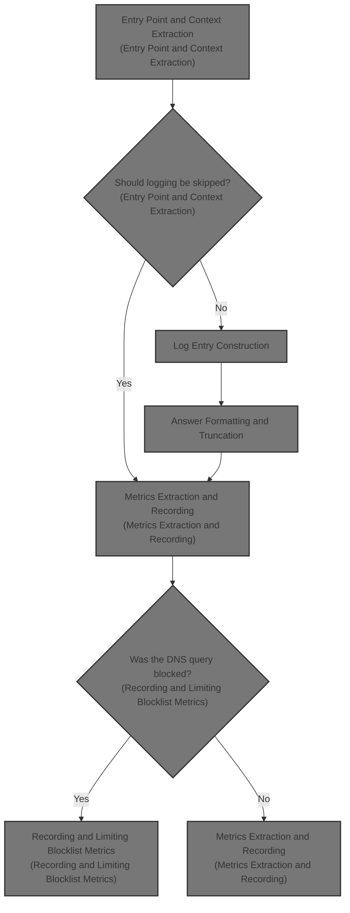
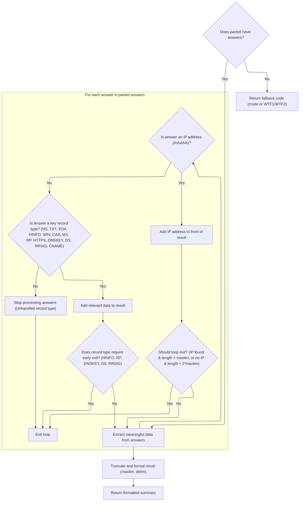

```mermaid
%%{init: {"flowchart": {"defaultRenderer": "elk"}} }%%
flowchart TD
  node1["Check if GeoIP database is initialized"]
  click node1 openCode "src/plugins/observability/geoip.js:96:96"
  node1 -->|"Not initialized"| node2["Return unknown country code"]
  click node2 openCode "src/plugins/observability/geoip.js:96:97"
  node1 -->|"Initialized"| node3["Check if IP address is valid"]
  click node3 openCode "src/plugins/observability/geoip.js:97:97"
  node3 -->|"Invalid"| node2
  node3 -->|"Valid"| node4["Check cache for country code"]
  click node4 openCode "src/plugins/observability/geoip.js:99:102"
  node4 -->|"Found in cache"| node5["Return cached country code"]
  click node5 openCode "src/plugins/observability/geoip.js:101:102"
  node4 -->|"Not found"| node6["Prepare for binary search"]
  click node6 openCode "src/plugins/observability/geoip.js:104:110"
  node6 --> node7
  subgraph loop1["Binary search for country code"]
    node7["Iterate to find country code in GeoIP database"]
    click node7 openCode "src/plugins/observability/geoip.js:111:121"
  end
  node7 --> node8["Store result in cache"]
  click node8 openCode "src/plugins/observability/geoip.js:127:127"
  node8 --> node9["Return country code"]
  click node9 openCode "src/plugins/observability/geoip.js:131:132"
classDef HeadingStyle fill:#777777,stroke:#333,stroke-width:2px;

%% Swimm:
%% %%{init: {"flowchart": {"defaultRenderer": "elk"}} }%%
%% flowchart TD
%%   node1["Check if <SwmToken path="src/plugins/observability/log-pusher.js" pos="16:4:4" line-data="import { GeoIP } from &quot;./geoip.js&quot;;">`GeoIP`</SwmToken> database is initialized"]
%%   click node1 openCode "<SwmPath>[src/…/observability/geoip.js](src/plugins/observability/geoip.js)</SwmPath>:96:96"
%%   node1 -->|"Not initialized"| node2["Return unknown country code"]
%%   click node2 openCode "<SwmPath>[src/…/observability/geoip.js](src/plugins/observability/geoip.js)</SwmPath>:96:97"
%%   node1 -->|"Initialized"| node3["Check if IP address is valid"]
%%   click node3 openCode "<SwmPath>[src/…/observability/geoip.js](src/plugins/observability/geoip.js)</SwmPath>:97:97"
%%   node3 -->|"Invalid"| node2
%%   node3 -->|"Valid"| node4["Check cache for country code"]
%%   click node4 openCode "<SwmPath>[src/…/observability/geoip.js](src/plugins/observability/geoip.js)</SwmPath>:99:102"
%%   node4 -->|"Found in cache"| node5["Return cached country code"]
%%   click node5 openCode "<SwmPath>[src/…/observability/geoip.js](src/plugins/observability/geoip.js)</SwmPath>:101:102"
%%   node4 -->|"Not found"| node6["Prepare for binary search"]
%%   click node6 openCode "<SwmPath>[src/…/observability/geoip.js](src/plugins/observability/geoip.js)</SwmPath>:104:110"
%%   node6 --> node7
%%   subgraph loop1["Binary search for country code"]
%%     node7["Iterate to find country code in <SwmToken path="src/plugins/observability/log-pusher.js" pos="16:4:4" line-data="import { GeoIP } from &quot;./geoip.js&quot;;">`GeoIP`</SwmToken> database"]
%%     click node7 openCode "<SwmPath>[src/…/observability/geoip.js](src/plugins/observability/geoip.js)</SwmPath>:111:121"
%%   end
%%   node7 --> node8["Store result in cache"]
%%   click node8 openCode "<SwmPath>[src/…/observability/geoip.js](src/plugins/observability/geoip.js)</SwmPath>:127:127"
%%   node8 --> node9["Return country code"]
%%   click node9 openCode "<SwmPath>[src/…/observability/geoip.js](src/plugins/observability/geoip.js)</SwmPath>:131:132"
%% classDef HeadingStyle fill:#777777,stroke:#333,stroke-width:2px;
```

This document describes how DNS queries and responses are logged and how analytics metrics are recorded for each request. By extracting context from each DNS request, building comprehensive log entries, and recording metrics such as blocklist hits and geographic distribution, this flow enables DNS observability and analytics.



# Entry Point and Context Extraction

```mermaid
%%{init: {"flowchart": {"defaultRenderer": "elk"}} }%%
flowchart TD
    node1["Start log push process"]
    click node1 openCode "src/plugins/observability/log-pusher.js:122:123"
    node1 --> node2{"Should log push be skipped?"}
    click node2 openCode "src/plugins/observability/log-pusher.js:132:133"
    node2 -->|"Yes"| node3["Return empty response"]
    click node3 openCode "src/plugins/observability/log-pusher.js:133:134"
    node2 -->|"No"| node4["Push DNS log with request, upstream, query, answer, blockflag"]
    click node4 openCode "src/plugins/observability/log-pusher.js:136:152"
    node4 --> node5["Return response"]
    click node5 openCode "src/plugins/observability/log-pusher.js:157:158"
    node4 --> node6["Return error response if log push fails"]
    click node6 openCode "src/plugins/observability/log-pusher.js:154:155"

classDef HeadingStyle fill:#777777,stroke:#333,stroke-width:2px;

%% Swimm:
%% %%{init: {"flowchart": {"defaultRenderer": "elk"}} }%%
%% flowchart TD
%%     node1["Start log push process"]
%%     click node1 openCode "<SwmPath>[src/…/observability/log-pusher.js](src/plugins/observability/log-pusher.js)</SwmPath>:122:123"
%%     node1 --> node2{"Should log push be skipped?"}
%%     click node2 openCode "<SwmPath>[src/…/observability/log-pusher.js](src/plugins/observability/log-pusher.js)</SwmPath>:132:133"
%%     node2 -->|"Yes"| node3["Return empty response"]
%%     click node3 openCode "<SwmPath>[src/…/observability/log-pusher.js](src/plugins/observability/log-pusher.js)</SwmPath>:133:134"
%%     node2 -->|"No"| node4["Push DNS log with request, upstream, query, answer, blockflag"]
%%     click node4 openCode "<SwmPath>[src/…/observability/log-pusher.js](src/plugins/observability/log-pusher.js)</SwmPath>:136:152"
%%     node4 --> node5["Return response"]
%%     click node5 openCode "<SwmPath>[src/…/observability/log-pusher.js](src/plugins/observability/log-pusher.js)</SwmPath>:157:158"
%%     node4 --> node6["Return error response if log push fails"]
%%     click node6 openCode "<SwmPath>[src/…/observability/log-pusher.js](src/plugins/observability/log-pusher.js)</SwmPath>:154:155"
%% 
%% classDef HeadingStyle fill:#777777,stroke:#333,stroke-width:2px;
```



<SwmSnippet path="/src/plugins/observability/log-pusher.js" line="122">

---

<SwmToken path="src/plugins/observability/log-pusher.js" pos="122:3:3" line-data="  async exec(ctx) {">`exec`</SwmToken> is where the flow starts. It checks if logging should be skipped (noop), then extracts all the relevant context from the request (IDs, region, upstream, DNS packets, flags). Next, it calls <SwmToken path="src/plugins/observability/log-pusher.js" pos="125:13:13" line-data="    // The cost of enabling cf logpush in prod:">`logpush`</SwmToken> with all this data so the log entry can be built with full context. Skipping logpush means nothing gets logged for this request.

```javascript
  async exec(ctx) {
    let response = pres.emptyResponse();

    // The cost of enabling cf logpush in prod:
    //        |   cpu                |   gb-sec
    // %      |   before     after   |   before     after
    // p99.9  |   60.7       80      |   0.2        0.2
    // p99    |   22.2       35      |   0.05       0.05
    // p75    |   3.6        4.4     |   0.004      0.005
    // p50    |   2.2        2.6     |   0.002      0.003
    if (this.noop(ctx)) {
      return response;
    }

    try {
      const request = ctx.request;
      const bg = ctx.dispatcher;
      const rxid = ctx.rxid;
      const lid = ctx.lid;
      const reg = ctx.region;
      // may be null if user hasn't set a custom upstream
      const upstream = ctx.userDnsResolverUrl || emptystring;
      // may not exist if not a dns query
      const query = ctx.requestDecodedDnsPacket || null;
      // may be missing in case of exceptions or blocked answers
      const ans = ctx.responseDecodedDnsPacket || null;
      // may be missing in case qname is not in any blocklist
      // note: blockflag is set regardless of whether the query is blocked
      const flag = ctx.blockflag || emptystring;

      this.logpush(rxid, bg, lid, reg, request, upstream, query, ans, flag);
    } catch (e) {
      response = pres.errResponse("logpusher", e);
    }

    return response;
  }
```

---

</SwmSnippet>

# Log Entry Construction

```mermaid
%%{init: {"flowchart": {"defaultRenderer": "elk"}} }%%
flowchart TD
    node1["Collect DNS query and response data (fields: version, ip, region, upstream, qname, qtype, flag)"]
    click node1 openCode "src/plugins/observability/log-pusher.js:160:176"
    node1 --> node2["Answer Formatting and Truncation"]
    
    node2 --> node3["DNS Answer Extraction Logic"]
    
    node3 --> node4["Format log entry and split into lines if needed (max length)"]
    click node4 openCode "src/plugins/observability/log-pusher.js:177:183"
    
    subgraph loop1["For each log line"]
      node4 --> node5["Send log line to remote log"]
      click node5 openCode "src/plugins/observability/log-pusher.js:185:188"
    end
    node5 --> node6["Metrics Extraction and Recording"]
    

classDef HeadingStyle fill:#777777,stroke:#333,stroke-width:2px;
click node2 goToHeading "Answer Formatting and Truncation"
node2:::HeadingStyle
click node3 goToHeading "DNS Answer Extraction Logic"
node3:::HeadingStyle
click node6 goToHeading "Metrics Extraction and Recording"
node6:::HeadingStyle

%% Swimm:
%% %%{init: {"flowchart": {"defaultRenderer": "elk"}} }%%
%% flowchart TD
%%     node1["Collect DNS query and response data (fields: version, ip, region, upstream, qname, qtype, flag)"]
%%     click node1 openCode "<SwmPath>[src/…/observability/log-pusher.js](src/plugins/observability/log-pusher.js)</SwmPath>:160:176"
%%     node1 --> node2["Answer Formatting and Truncation"]
%%     
%%     node2 --> node3["DNS Answer Extraction Logic"]
%%     
%%     node3 --> node4["Format log entry and split into lines if needed (max length)"]
%%     click node4 openCode "<SwmPath>[src/…/observability/log-pusher.js](src/plugins/observability/log-pusher.js)</SwmPath>:177:183"
%%     
%%     subgraph loop1["For each log line"]
%%       node4 --> node5["Send log line to remote log"]
%%       click node5 openCode "<SwmPath>[src/…/observability/log-pusher.js](src/plugins/observability/log-pusher.js)</SwmPath>:185:188"
%%     end
%%     node5 --> node6["Metrics Extraction and Recording"]
%%     
%% 
%% classDef HeadingStyle fill:#777777,stroke:#333,stroke-width:2px;
%% click node2 goToHeading "Answer Formatting and Truncation"
%% node2:::HeadingStyle
%% click node3 goToHeading "DNS Answer Extraction Logic"
%% node3:::HeadingStyle
%% click node6 goToHeading "Metrics Extraction and Recording"
%% node6:::HeadingStyle
```



<SwmSnippet path="/src/plugins/observability/log-pusher.js" line="160">

---

<SwmToken path="src/plugins/observability/log-pusher.js" pos="160:1:1" line-data="  logpush(rxid, bg, lid, reg, req, upstream, q, a, flag) {">`logpush`</SwmToken> builds up all the log fields using prefixes, then calls <SwmToken path="src/plugins/observability/log-pusher.js" pos="176:18:18" line-data="    const ans = this.key(&quot;a&quot;, this.getans(a));">`getans`</SwmToken> to process the answer before adding it to the log.

```javascript
  logpush(rxid, bg, lid, reg, req, upstream, q, a, flag) {
    // ex: k:1c34wels9yeq2
    const lk = this.key("k", lid);
    // ex: v:1
    const version = this.key("v", this.getversion());
    // ex: r:maa
    const region = this.key("r", reg);
    // ex: i:1.2.3.4
    const ip = this.key("i", this.getip(req));
    // ex: u:dns.google
    const up = this.key("u", this.getupstream(upstream));
    // ex: q:block.this.website
    const qname = this.key("q", this.getqname(q));
    // ex: t:A
    const qtype = this.key("t", this.getqtype(q));
    // ex: a:0.0.0.0 or a:NXDOMAIN or a:<base64> or a:ip1|ip2|cname
    const ans = this.key("a", this.getans(a));
```

---

</SwmSnippet>

## Answer Formatting and Truncation

<SwmSnippet path="/src/plugins/observability/log-pusher.js" line="231">

---

<SwmToken path="src/plugins/observability/log-pusher.js" pos="231:1:1" line-data="  getans(a) {">`getans`</SwmToken> checks if there's an answer, and if so, calls out to <SwmToken path="src/plugins/observability/log-pusher.js" pos="233:3:5" line-data="    return dnsutil.getInterestingAnswerData(a, maxansdatalen, ansdelim);">`dnsutil.getInterestingAnswerData`</SwmToken>, passing in the answer and two repo-specific constants for max length and delimiter. This makes sure the answer string is formatted and trimmed to fit log constraints before it goes into the log entry.

```javascript
  getans(a) {
    if (!a) return emptystring;
    return dnsutil.getInterestingAnswerData(a, maxansdatalen, ansdelim);
  }
```

---

</SwmSnippet>

## DNS Answer Extraction Logic



<SwmSnippet path="/src/commons/dnsutil.js" line="434">

---

In <SwmToken path="src/commons/dnsutil.js" pos="434:4:4" line-data="export function getInterestingAnswerData(packet, maxlen = 80, delim = &quot;|&quot;) {">`getInterestingAnswerData`</SwmToken>, we loop through all DNS answers and handle each type differently. <SwmToken path="src/commons/dnsutil.js" pos="446:5:5" line-data="    // capturing IPs in A / AAAA records appearing later in ans">`IPs`</SwmToken> from A/AAAA records are prepended to the result string, while other types append their key fields. The function uses length checks to avoid overshooting the log size, and has special logic for HTTPS/SVCB records to extract IP hints. This way, the log captures the most relevant answer data without getting too big.

```javascript
export function getInterestingAnswerData(packet, maxlen = 80, delim = "|") {
  if (!hasAnswers(packet)) {
    return !util.emptyObj(packet) ? packet.rcode || "WTF1" : "WTF2";
  }

  // set to true if at least one ip has been captured from ans
  let atleastoneip = false;
  let str = "";
  for (const a of packet.answers) {
    // gather twice the maxlen to capture as much as possible:
    // ips are usually prepend to the front, and going 2 times
    // over maxlen (chosen arbitrarily) maximises chances of
    // capturing IPs in A / AAAA records appearing later in ans
    if (atleastoneip && str.length > maxlen) break;
    if (!atleastoneip && str.length > maxlen * 2) break;

    if (isAnswerA(a) || isAnswerAAAA(a)) {
      const dat = a.data || "";
      // prepend A / AAAA data
      if (!util.emptyString(dat)) str = dat + delim + str;
      atleastoneip = true;
    } else if (isAnswerOPTION(a) || isAnswerNS(a) || isAnswerTXT(a)) {
      // ns: github.com/mafintosh/dns-packet/blob/31d3caf3/index.js#L249
      // txt: github.com/mafintosh/dns-packet/blob/31d3caf3/index.js#L370
      // opt: github.com/mafintosh/dns-packet/blob/31d3caf3/index.js#L773
      const dat = a.data || "";
      if (!util.emptyString(dat)) str += dat + delim;
    } else if (isAnswerSOA(a)) {
      // github.com/mafintosh/dns-packet/blob/31d3caf3/index.js#L284
      str += a.data.mname + delim;
    } else if (isAnswerHINFO(a)) {
      // github.com/mafintosh/dns-packet/blob/31d3caf3/index.js#L450
      str += a.data.os + delim;
      break;
    } else if (isAnswerSRV(a)) {
      // github.com/mafintosh/dns-packet/blob/31d3caf3/index.js#L521
      str += a.data.target + delim;
    } else if (isAnswerCAA(a)) {
      // github.com/mafintosh/dns-packet/blob/31d3caf3/index.js#L574
      str += a.data.value + delim;
    } else if (isAnswerMX(a)) {
      // github.com/mafintosh/dns-packet/blob/31d3caf3/index.js#L618
      str += a.data.exchange + delim;
    } else if (isAnswerRP(a)) {
      // github.com/mafintosh/dns-packet/blob/31d3caf3/index.js#L1027
      str += a.data.mbox + delim;
      break;
    } else if (isAnswerHttps(a)) {
      // https/svcb answers may have a A / AAAA records
      // github.com/serverless-dns/dns-parser/blob/b7d73b3d/index.js#L1381
      const t = a.data.targetName;
      const kv = a.data.svcParams;
      if (t === ".") {
        if (util.emptyObj(kv)) continue;
        // if svcb/https is self-referential, then prepend ip hints, if any
        if (
          !util.emptyArray(kv.ipv4hint) &&
          !util.emptyString(kv.ipv4hint[0])
        ) {
          str = kv.ipv4hint[0] + delim + str;
          atleastoneip = true;
        }
        if (
          !util.emptyArray(kv.ipv6hint) &&
          !util.emptyString(kv.ipv6hint[0])
        ) {
          str = kv.ipv6hint[0] + delim + str;
          atleastoneip = true;
        }
      } else {
        str += t + delim;
      }
    } else if (isAnswerDNSKEY(a)) {
      // github.com/mafintosh/dns-packet/blob/31d3caf3/index.js#L914
      str += bufutil.bytesToBase64Url(a.data.key) + delim;
      break;
    } else if (isAnswerDS(a)) {
      // ds: github.com/mafintosh/dns-packet/blob/31d3caf3/index.js#L1279
      str += bufutil.bytesToBase64Url(a.data.digest) + delim;
      break;
    } else if (isAnswerRRSIG(a)) {
      // rrsig: github.com/mafintosh/dns-packet/blob/31d3caf3/index.js#L984
      str += bufutil.bytesToBase64Url(a.data.signature) + delim;
      break;
    } else if (isAnswerCname(a)) {
      str += a.data + delim;
    } else {
      // unhanlded types:
      // null, ptr, ds, nsec, nsec3, nsec3param, tlsa, sshfp, spf, dname
      break;
    }
  }
```

---

</SwmSnippet>

<SwmSnippet path="/src/commons/dnsutil.js" line="527">

---

After collecting all the answer data, the function trims the string to maxlen, then cuts it at the last delimiter so we don't end up with partial fields in the log. If there's no delimiter, it just returns the truncated string as-is.

```javascript
  const trunc = util.strstr(str, 0, maxlen);
  const idx = trunc.lastIndexOf(delim);
  return idx >= 0 ? util.strstr(trunc, 0, idx) : trunc;
}
```

---

</SwmSnippet>

## Log Chunking and Remote Dispatch

```mermaid
%%{init: {"flowchart": {"defaultRenderer": "elk"}} }%%
flowchart TD
    node1["Prepare log fields (version, ip, region, up, qname, qtype, ans, flag)"] --> node2["Determine max log entry length"]
    click node1 openCode "src/plugins/observability/log-pusher.js:177:179"
    node2 --> node3{"Is log data longer than max length?"}
    click node2 openCode "src/plugins/observability/log-pusher.js:182:182"
    node3 -->|"Yes"| node4["Split log data into multiple entries"]
    click node3 openCode "src/plugins/observability/log-pusher.js:183:183"
    node3 -->|"No"| node5["Use single log entry"]
    click node4 openCode "src/plugins/observability/log-pusher.js:183:183"
    click node5 openCode "src/plugins/observability/log-pusher.js:183:183"
    node4 --> node6["Log entries ready"]
    node5 --> node6
    click node6 openCode "src/plugins/observability/log-pusher.js:183:183"
    
    subgraph loop1["For each log entry"]
      node6 --> node7["Send log entry to remote logging service"]
      click node7 openCode "src/plugins/observability/log-pusher.js:185:188"
      node7 --> node6
    end
    node6 --> node8["Record all log data asynchronously"]
    click node8 openCode "src/plugins/observability/log-pusher.js:190:190"

classDef HeadingStyle fill:#777777,stroke:#333,stroke-width:2px;

%% Swimm:
%% %%{init: {"flowchart": {"defaultRenderer": "elk"}} }%%
%% flowchart TD
%%     node1["Prepare log fields (version, ip, region, up, qname, qtype, ans, flag)"] --> node2["Determine max log entry length"]
%%     click node1 openCode "<SwmPath>[src/…/observability/log-pusher.js](src/plugins/observability/log-pusher.js)</SwmPath>:177:179"
%%     node2 --> node3{"Is log data longer than max length?"}
%%     click node2 openCode "<SwmPath>[src/…/observability/log-pusher.js](src/plugins/observability/log-pusher.js)</SwmPath>:182:182"
%%     node3 -->|"Yes"| node4["Split log data into multiple entries"]
%%     click node3 openCode "<SwmPath>[src/…/observability/log-pusher.js](src/plugins/observability/log-pusher.js)</SwmPath>:183:183"
%%     node3 -->|"No"| node5["Use single log entry"]
%%     click node4 openCode "<SwmPath>[src/…/observability/log-pusher.js](src/plugins/observability/log-pusher.js)</SwmPath>:183:183"
%%     click node5 openCode "<SwmPath>[src/…/observability/log-pusher.js](src/plugins/observability/log-pusher.js)</SwmPath>:183:183"
%%     node4 --> node6["Log entries ready"]
%%     node5 --> node6
%%     click node6 openCode "<SwmPath>[src/…/observability/log-pusher.js](src/plugins/observability/log-pusher.js)</SwmPath>:183:183"
%%     
%%     subgraph loop1["For each log entry"]
%%       node6 --> node7["Send log entry to remote logging service"]
%%       click node7 openCode "<SwmPath>[src/…/observability/log-pusher.js](src/plugins/observability/log-pusher.js)</SwmPath>:185:188"
%%       node7 --> node6
%%     end
%%     node6 --> node8["Record all log data asynchronously"]
%%     click node8 openCode "<SwmPath>[src/…/observability/log-pusher.js](src/plugins/observability/log-pusher.js)</SwmPath>:190:190"
%% 
%% classDef HeadingStyle fill:#777777,stroke:#333,stroke-width:2px;
```



<SwmSnippet path="/src/plugins/observability/log-pusher.js" line="177">

---

After formatting the answer, <SwmToken path="src/plugins/observability/log-pusher.js" pos="125:13:13" line-data="    // The cost of enabling cf logpush in prod:">`logpush`</SwmToken> splits the log into size-limited chunks and sends each one out.

```javascript
    // ex: f:1:2AOAERQAkAQKAggAAEA
    const f = this.key("f", flag);
    const all = [version, ip, region, up, qname, qtype, ans, f];

    // max number of chars in a log entry
    const n = this.getlimit(lk.length);
    const lines = this.mklogs(all, n);
    // log-id, log-entry
    for (const l of lines) {
      // k:avc,0:cd9i01d9mw,v:1,q:rethinkdns.com,t:AAAA,a:2606:4700::81d4:fa9a
      this.remotelog(lk + logdelim + l);
    }
```

---

</SwmSnippet>

<SwmSnippet path="/src/plugins/observability/log-pusher.js" line="190">

---

After sending out all the log chunks, we call <SwmToken path="src/plugins/observability/log-pusher.js" pos="190:5:5" line-data="    bg(this.rec(lid, all));">`rec`</SwmToken> in the background to process metrics from the same data. This lets us track stats or analytics separately from the raw logs.

```javascript
    bg(this.rec(lid, all));

```

---

</SwmSnippet>

## Metrics Extraction and Recording

<SwmSnippet path="/src/plugins/observability/log-pusher.js" line="322">

---

In <SwmToken path="src/plugins/observability/log-pusher.js" pos="322:3:3" line-data="  async rec(lid, all) {">`rec`</SwmToken>, we break out all the DNS query details from the input array, then use a bunch of repo-specific helpers to figure out things like whether the answer was blocked, which blocklists matched, the domain, and the answer IP. We call <SwmToken path="src/plugins/observability/log-pusher.js" pos="335:11:11" line-data="    const countrycode = await this.getcountry(ansip);">`getcountry`</SwmToken> next to look up the country code for the answer IP, which is needed for geo analytics in the metrics.

```javascript
  async rec(lid, all) {
    const [m1, m2] = this.metricsservice();
    if (m1 == null || m2 == null) return;

    const metrics1 = [];
    const metrics2 = [];
    const [version, ip, region, up, qname, qtype, ans, f] = all;

    // ans is a multi-value str delimited by pipe
    const isblocked = this.isansblocked(qtype, ans, f);
    const blists = this.getblocklists(f);
    const dom = this.getdomain(qname);
    const ansip = this.getipfromans(ans);
    const countrycode = await this.getcountry(ansip);
```

---

</SwmSnippet>

### Country Lookup for Answer IP

<SwmSnippet path="/src/plugins/observability/log-pusher.js" line="257">

---

<SwmToken path="src/plugins/observability/log-pusher.js" pos="257:3:3" line-data="  async getcountry(ipstr) {">`getcountry`</SwmToken> checks if the IP string is empty, then makes sure geoip data is initialized. It then calls out to <SwmToken path="src/plugins/observability/log-pusher.js" pos="260:5:7" line-data="    return this.geoip.country(ipstr);">`geoip.country`</SwmToken> to actually look up the country code for the IP. This is where the geo lookup happens.

```javascript
  async getcountry(ipstr) {
    if (util.emptyString(ipstr)) return emptystring;
    await this.init();
    return this.geoip.country(ipstr);
  }
```

---

</SwmSnippet>

### <SwmToken path="src/plugins/observability/log-pusher.js" pos="16:4:4" line-data="import { GeoIP } from &quot;./geoip.js&quot;;">`GeoIP`</SwmToken> Binary Search



<SwmSnippet path="/src/plugins/observability/geoip.js" line="95">

---

In <SwmToken path="src/plugins/observability/geoip.js" pos="95:1:1" line-data="  country(ipstr) {">`country`</SwmToken>, we first check the cache for the IP. If it's not cached, we convert the IP to bytes, pick the right geo array (IPv4 or IPv6), and do a binary search to find the matching country code. This is fast and keeps memory usage low since the data is sorted and compact. Once found, we cache the result for next time.

```javascript
  country(ipstr) {
    if (!this.initDone()) return ccunknown;
    if (util.emptyString(ipstr)) return ccunknown;

    const cached = this.cache.get(ipstr);
    if (!util.emptyObj(cached)) {
      return cached;
    }

    const ip = this.iptou8(ipstr);
    const recsize = ip.length + ccsize;
    const g = ip.length === 4 ? this.geo4 : this.geo6;

    let low = 0;
    let high = g.byteLength / recsize;
    let i = 0;
    while (high - 1 > low) {
      const mid = ((high + low) / 2) | 0;
      const midpos = mid * recsize;

      if (debug) this.log.d(i, "nexti", mid, "<mid, l/h>", low, high);

      if (this.lessthan(g, midpos, ip)) low = mid;
      else high = mid;

      if (i++ > maxdepth) break;
    }
```

---

</SwmSnippet>

<SwmSnippet path="/src/plugins/observability/geoip.js" line="123">

---

After searching, it returns the decoded country code for the IP.

```javascript
    const pos = low * recsize + ip.length;
    const raw = g.subarray(pos, pos + ccsize);
    const cc = this.decoder.decode(raw);

    this.cache.put(ipstr, cc);

    if (debug) this.log.d(low, high, "<l/h | pos>", pos, raw, "cc", cc);

    return cc;
  }
```

---

</SwmSnippet>

### Recording and Limiting Blocklist Metrics

```mermaid
%%{init: {"flowchart": {"defaultRenderer": "elk"}} }%%
flowchart TD
    node1["Collect DNS query metrics"] --> node2{"Was the query blocked?"}
    click node1 openCode "src/plugins/observability/log-pusher.js:339:356"
    node2 -->|"No"| node3["Filter metrics into blobs and doubles"]
    click node2 openCode "src/plugins/observability/log-pusher.js:357:365"
    node2 -->|"Yes"| node4["Prepare blocked query metrics"]
    click node4 openCode "src/plugins/observability/log-pusher.js:357:365"
    subgraph loop1["For each blocklist entry (up to maxdatapoints)"]
        node4 --> node5["Add blocklist details to blocked metrics"]
        click node5 openCode "src/plugins/observability/log-pusher.js:359:363"
    end
    node3 --> node6["Push main metrics to analytics engine"]
    click node3 openCode "src/plugins/observability/log-pusher.js:376:380"
    node5 --> node7["Filter blocked metrics into blobs and doubles"]
    click node7 openCode "src/plugins/observability/log-pusher.js:367:370"
    node7 --> node8{"Are there blocked metrics to report?"}
    click node8 openCode "src/plugins/observability/log-pusher.js:381:387"
    node8 -->|"Yes"| node9["Push blocked metrics to analytics engine"]
    click node9 openCode "src/plugins/observability/log-pusher.js:382:386"
    node8 -->|"No"| node10["Skip blocked metrics push"]
    click node10 openCode "src/plugins/observability/log-pusher.js:387:387"
    node6 --> node11["Log summary"]
    click node11 openCode "src/plugins/observability/log-pusher.js:388:389"
    node9 --> node11

classDef HeadingStyle fill:#777777,stroke:#333,stroke-width:2px;

%% Swimm:
%% %%{init: {"flowchart": {"defaultRenderer": "elk"}} }%%
%% flowchart TD
%%     node1["Collect DNS query metrics"] --> node2{"Was the query blocked?"}
%%     click node1 openCode "<SwmPath>[src/…/observability/log-pusher.js](src/plugins/observability/log-pusher.js)</SwmPath>:339:356"
%%     node2 -->|"No"| node3["Filter metrics into blobs and doubles"]
%%     click node2 openCode "<SwmPath>[src/…/observability/log-pusher.js](src/plugins/observability/log-pusher.js)</SwmPath>:357:365"
%%     node2 -->|"Yes"| node4["Prepare blocked query metrics"]
%%     click node4 openCode "<SwmPath>[src/…/observability/log-pusher.js](src/plugins/observability/log-pusher.js)</SwmPath>:357:365"
%%     subgraph loop1["For each blocklist entry (up to maxdatapoints)"]
%%         node4 --> node5["Add blocklist details to blocked metrics"]
%%         click node5 openCode "<SwmPath>[src/…/observability/log-pusher.js](src/plugins/observability/log-pusher.js)</SwmPath>:359:363"
%%     end
%%     node3 --> node6["Push main metrics to analytics engine"]
%%     click node3 openCode "<SwmPath>[src/…/observability/log-pusher.js](src/plugins/observability/log-pusher.js)</SwmPath>:376:380"
%%     node5 --> node7["Filter blocked metrics into blobs and doubles"]
%%     click node7 openCode "<SwmPath>[src/…/observability/log-pusher.js](src/plugins/observability/log-pusher.js)</SwmPath>:367:370"
%%     node7 --> node8{"Are there blocked metrics to report?"}
%%     click node8 openCode "<SwmPath>[src/…/observability/log-pusher.js](src/plugins/observability/log-pusher.js)</SwmPath>:381:387"
%%     node8 -->|"Yes"| node9["Push blocked metrics to analytics engine"]
%%     click node9 openCode "<SwmPath>[src/…/observability/log-pusher.js](src/plugins/observability/log-pusher.js)</SwmPath>:382:386"
%%     node8 -->|"No"| node10["Skip blocked metrics push"]
%%     click node10 openCode "<SwmPath>[src/…/observability/log-pusher.js](src/plugins/observability/log-pusher.js)</SwmPath>:387:387"
%%     node6 --> node11["Log summary"]
%%     click node11 openCode "<SwmPath>[src/…/observability/log-pusher.js](src/plugins/observability/log-pusher.js)</SwmPath>:388:389"
%%     node9 --> node11
%% 
%% classDef HeadingStyle fill:#777777,stroke:#333,stroke-width:2px;
```



<SwmSnippet path="/src/plugins/observability/log-pusher.js" line="336">

---

Back in LogPusher.rec, after getting the country code from getcountry, we build up the metrics arrays. Here, we push all the main DNS query details into <SwmToken path="src/plugins/observability/log-pusher.js" pos="345:1:1" line-data="    metrics1.push(this.strmet(ip)); // ip hits">`metrics1`</SwmToken>, and if the answer was blocked, we loop through the blocklists and add each one to <SwmToken path="src/plugins/observability/log-pusher.js" pos="360:4:4" line-data="        if (metrics2.length &gt; maxdatapoints) break;">`metrics2`</SwmToken>. The loop stops early if <SwmToken path="src/plugins/observability/log-pusher.js" pos="360:4:4" line-data="        if (metrics2.length &gt; maxdatapoints) break;">`metrics2`</SwmToken> gets too big (using maxdatapoints), so we don't overload the metrics system. This keeps the metrics payload within repo-defined limits, even if a query matches a ton of blocklists.

```javascript
    // todo: device-id, should it be concatenated with log-key?
    // todo: faang dominance (sigma?)

    // lk is simply "logkey" and not "k:logkey"
    const idx1 = this.idxmet(lid, "1");
    const idx2 = this.idxmet(lid, "2");

    // metric blobs in m1 should never change order; add new blobs at the end
    // update this.setupCols1() when appending new blobs / doubles
    metrics1.push(this.strmet(ip)); // ip hits
    metrics1.push(this.strmet(qname)); // query count
    metrics1.push(this.strmet(region)); // total requests
    metrics1.push(this.strmet(qtype)); // query type count
    metrics1.push(this.strmet(dom)); // domain count
    metrics1.push(this.strmet(ansip)); // ip count
    metrics1.push(this.strmet(countrycode)); // geo ip count

    // metric numbers in m1 should never change order; add new numbers at the end
    metrics1.push(this.nummet(1.0)); // req count
    metrics1.push(this.nummet(isblocked ? 1.0 : 0.0)); // blocked count

    if (isblocked) {
      // metric blobs in m2 can have variable order
      for (const b of blists) {
        if (metrics2.length > maxdatapoints) break;
        const kb = this.key("l", b);
        metrics2.push(this.strmet(kb)); // blocklist
      }
```

---

</SwmSnippet>

<SwmSnippet path="/src/plugins/observability/log-pusher.js" line="364">

---

Here LogPusher.rec filters the metrics arrays into blobs and doubles, then writes them to two separate metric services (<SwmToken path="src/plugins/observability/log-pusher.js" pos="376:1:1" line-data="    m1.writeDataPoint({">`m1`</SwmToken> and <SwmToken path="src/plugins/observability/log-pusher.js" pos="382:1:1" line-data="      m2.writeDataPoint({">`m2`</SwmToken>). <SwmToken path="src/plugins/observability/log-pusher.js" pos="367:7:7" line-data="    const blobs1 = metrics1.filter((m) =&gt; m.blob != null);">`metrics1`</SwmToken> covers general DNS stats, <SwmToken path="src/plugins/observability/log-pusher.js" pos="364:1:1" line-data="      metrics2.push(this.nummet(blists.length)); // blocklists count">`metrics2`</SwmToken> is for blocklist hits. Each write is <SwmToken path="src/plugins/observability/log-pusher.js" pos="375:5:7" line-data="    // a non-blocking call that returns void (like console.log)">`non-blocking`</SwmToken> and fits the analytics engine's limits on blobs, doubles, and indexes. The function logs the write for debugging, but doesn't return anything useful.

```javascript
      metrics2.push(this.nummet(blists.length)); // blocklists count
    }

    const blobs1 = metrics1.filter((m) => m.blob != null);
    const blobs2 = metrics2.filter((m) => m.blob != null);
    const doubles1 = metrics1.filter((m) => m.double != null);
    const doubles2 = metrics2.filter((m) => m.double != null);
    // developers.cloudflare.com/analytics/analytics-engine/get-started
    // indexes are limited to 32 bytes, blobs are limited to 5120 bytes
    // there can be a maximum of 1 index and 20 blobs, per data point
    // per cf discord, needn't await / waitUntil as writeDataPoint is
    // a non-blocking call that returns void (like console.log)
    m1.writeDataPoint({
      blobs: blobs1.map((m) => m.blob),
      doubles: doubles1.map((m) => m.double),
      indexes: [idx1],
    });
    if (metrics2.length > 0) {
      m2.writeDataPoint({
        blobs: blobs2.map((m) => m.blob),
        doubles: doubles2.map((m) => m.double),
        indexes: [idx2],
      });
    }
    this.corelog.d(`rec: ${lid} ${blobs1.length} ${doubles1.length}`);
  }
```

---

</SwmSnippet>

## Finalizing and Logging Remote Dispatch

<SwmSnippet path="/src/plugins/observability/log-pusher.js" line="192">

---

After returning from LogPusher.rec, LogPusher.logpush finishes by logging how many remote log lines were sent. The metrics recording (rec) was already triggered in the background, so this is just a final debug statement for monitoring.

```javascript
    this.corelog.d(`remotelog lines: ${lk} ${lines.length}`);
  }
```

---

</SwmSnippet>

&nbsp;

*This is an auto-generated document by Swimm 🌊 and has not yet been verified by a human*

<SwmMeta version="3.0.0" repo-id="Z2l0aHViJTNBJTNBamF2YXNjcmlwdC1zZXJ2ZXJsZXNzLWRucyUzQSUzQXJpY2FyZG9sb3Blemc=" repo-name="javascript-serverless-dns"><sup>Powered by [Swimm](https://app.swimm.io/)</sup></SwmMeta>
