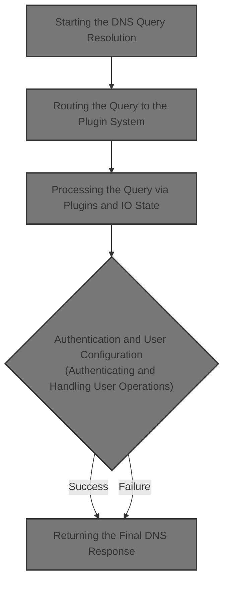
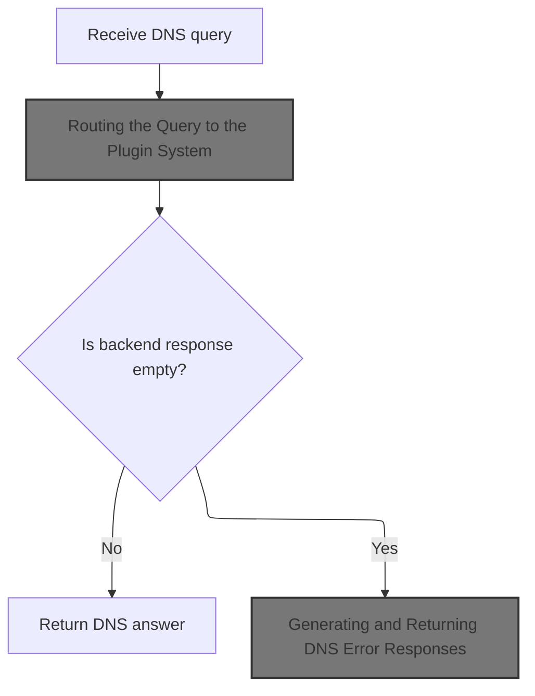
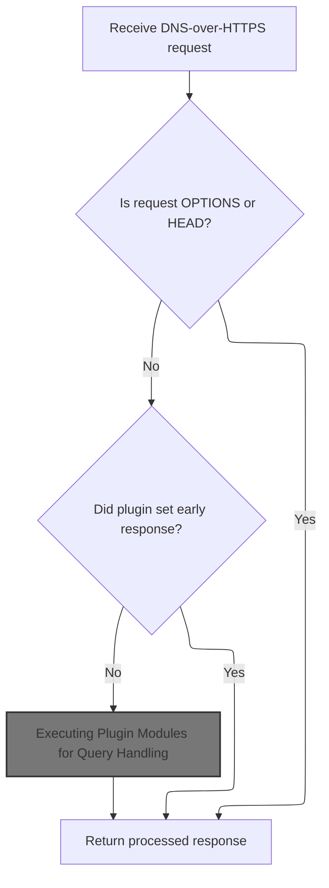
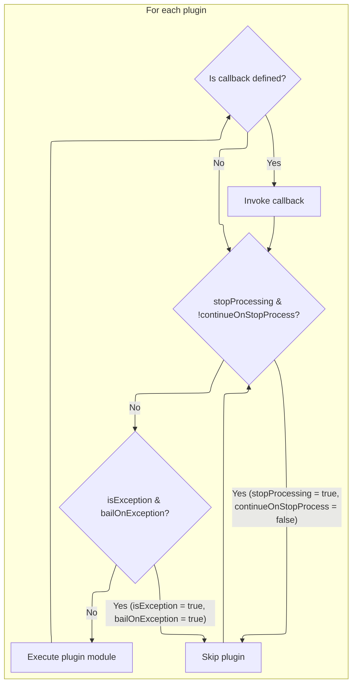

This document describes the flow for resolving DNS queries, which forms the core of the DNS resolution service. The system receives a DNS query, processes it through a plugin-based architecture, applies user-specific configuration and authentication, and returns a DNS response. User settings and plugins determine how queries are answered.



# Starting the DNS Query Resolution



<SwmSnippet path="/src/server-deno.ts" line="227">

---

In <SwmToken path="src/server-deno.ts" pos="227:4:4" line-data="async function resolveQuery(q: Uint8Array) {">`resolveQuery`</SwmToken>, we prep the DNS query and pass it to <SwmToken path="src/server-deno.ts" pos="235:9:9" line-data="  const r = await handleRequest(util.mkFetchEvent(freq));">`handleRequest`</SwmToken>, which is where the main processing happens.

```typescript
async function resolveQuery(q: Uint8Array) {
  // TODO: Sync code with server-node.js:resolveQuery
  const freq: Request = new Request("https://ignored.example.com", {
    method: "POST",
    headers: util.concatHeaders(util.dnsHeaders(), util.contentLengthHeader(q)),
    body: q,
  });

  const r = await handleRequest(util.mkFetchEvent(freq));

```

---

</SwmSnippet>

## Routing the Query to the Plugin System

<SwmSnippet path="/src/core/doh.js" line="25">

---

<SwmToken path="src/core/doh.js" pos="25:4:4" line-data="export function handleRequest(event) {">`handleRequest`</SwmToken> just hands off the <SwmToken path="src/core/doh.js" pos="22:7:7" line-data=" * @param {FetchEvent|FetchEventLike} event">`FetchEvent`</SwmToken> to <SwmToken path="src/core/doh.js" pos="26:3:3" line-data="  return proxyRequest(event);">`proxyRequest`</SwmToken>. This is where the event gets processed by the plugin system and all the DNS-over-HTTPS logic happens.

```javascript
export function handleRequest(event) {
  return proxyRequest(event);
}
```

---

</SwmSnippet>

## Processing the Query via Plugins and IO State



<SwmSnippet path="/src/core/doh.js" line="33">

---

In <SwmToken path="src/core/doh.js" pos="33:4:4" line-data="async function proxyRequest(event) {">`proxyRequest`</SwmToken>, we check for OPTIONS/HEAD and bail early if needed. Then we set up <SwmToken path="src/core/doh.js" pos="37:9:9" line-data="  const io = new IOState();">`IOState`</SwmToken> and <SwmToken path="src/core/doh.js" pos="41:9:9" line-data="    const plugin = new RethinkPlugin(event);">`RethinkPlugin`</SwmToken>, which manages the request state and plugin logic. If the plugin sets an early response, we return it right away. Otherwise, we <SwmPath>[run](run)</SwmPath> <SwmToken path="src/core/doh.js" pos="50:11:13" line-data="      /* op*/ () =&gt; plugin.execute(),">`plugin.execute`</SwmToken> with a timeout to avoid hanging, and always add CORS headers before returning.

```javascript
async function proxyRequest(event) {
  if (optionsRequest(event.request)) return util.respond204();
  if (headRequest(event.request)) return util.respond204();

  const io = new IOState();
  const ua = event.request.headers.get("User-Agent");

  try {
    const plugin = new RethinkPlugin(event);
    await plugin.initIoState(io);

    // if an early response has been set by plugin.initIoState, return it
    if (io.httpResponse) {
      return withCors(io, ua);
    }

    await util.timedSafeAsyncOp(
      /* op*/ () => plugin.execute(),
```

---

</SwmSnippet>

### Executing Plugin Modules for Query Handling



<SwmSnippet path="/src/core/plugin.js" line="143">

---

<SwmToken path="src/core/plugin.js" pos="143:3:3" line-data="  async execute() {">`execute`</SwmToken> runs each plugin module with its own context, skipping or continuing based on flags, and calls plugin callbacks if present.

```javascript
  async execute() {
    const io = this.io;
    // const rxid = this.ctx.get("rxid");
    for (const p of this.plugin) {
      if (io.stopProcessing && !p.continueOnStopProcess) {
        continue;
      }
      if (io.isException && p.bailOnException) {
        continue;
      }

      const res = await p.module.exec(makectx(this.ctx, p.pctx));

      if (typeof p.callback === "function") {
        await p.callback.call(this, res, io);
      }
    }
  }
```

---

</SwmSnippet>

### Authenticating and Handling User Operations

```mermaid
%%{init: {"flowchart": {"defaultRenderer": "elk"}} }%%
flowchart TD
  node1["Authenticate user operation request"] --> node2{"Is authentication successful?"}
  click node1 openCode "src/plugins/users/user-op.js:38:39"
  node2 -->|"Yes"| node3["Load user data"]
  click node2 openCode "src/plugins/users/user-op.js:39:43"
  node2 -->|"No"| node4["Return error: authentication failed"]
  click node4 openCode "src/plugins/users/user-op.js:40:41"
  node3 --> node5["Include authentication result in response"]
  click node3 openCode "src/plugins/users/user-op.js:42:44"
  node4 --> node5["Include authentication result in response"]
  click node4 openCode "src/plugins/users/user-op.js:40:44"
  node5["Return response"]
  click node5 openCode "src/plugins/users/user-op.js:49:50"

classDef HeadingStyle fill:#777777,stroke:#333,stroke-width:2px;

%% Swimm:
%% %%{init: {"flowchart": {"defaultRenderer": "elk"}} }%%
%% flowchart TD
%%   node1["Authenticate user operation request"] --> node2{"Is authentication successful?"}
%%   click node1 openCode "<SwmPath>[src/…/users/user-op.js](src/plugins/users/user-op.js)</SwmPath>:38:39"
%%   node2 -->|"Yes"| node3["Load user data"]
%%   click node2 openCode "<SwmPath>[src/…/users/user-op.js](src/plugins/users/user-op.js)</SwmPath>:39:43"
%%   node2 -->|"No"| node4["Return error: authentication failed"]
%%   click node4 openCode "<SwmPath>[src/…/users/user-op.js](src/plugins/users/user-op.js)</SwmPath>:40:41"
%%   node3 --> node5["Include authentication result in response"]
%%   click node3 openCode "<SwmPath>[src/…/users/user-op.js](src/plugins/users/user-op.js)</SwmPath>:42:44"
%%   node4 --> node5["Include authentication result in response"]
%%   click node4 openCode "<SwmPath>[src/…/users/user-op.js](src/plugins/users/user-op.js)</SwmPath>:40:44"
%%   node5["Return response"]
%%   click node5 openCode "<SwmPath>[src/…/users/user-op.js](src/plugins/users/user-op.js)</SwmPath>:49:50"
%% 
%% classDef HeadingStyle fill:#777777,stroke:#333,stroke-width:2px;
```



<SwmSnippet path="/src/plugins/users/user-op.js" line="34">

---

In <SwmToken path="src/plugins/users/user-op.js" pos="34:3:3" line-data="  async exec(ctx) {">`exec`</SwmToken>, we start by authenticating the request using <SwmToken path="src/plugins/users/user-op.js" pos="38:9:11" line-data="      const out = await token.auth(ctx.rxid, ctx.request.url);">`token.auth`</SwmToken>. If auth fails, we return an error response. If it passes, we move on to user-specific logic. This keeps unauthenticated requests from getting further into the flow.

```javascript
  async exec(ctx) {
    let res = pres.emptyResponse();

    try {
      const out = await token.auth(ctx.rxid, ctx.request.url);
```

---

</SwmSnippet>

<SwmSnippet path="/src/plugins/users/auth-token.js" line="63">

---

<SwmToken path="src/plugins/users/auth-token.js" pos="63:6:6" line-data="export async function auth(rxid, url) {">`auth`</SwmToken> checks for access keys, extracts a message key from the URL, and iterates over possible domains. For each, it generates a hex key and compares it to the access keys, allowing if there's a match. If no keys or no match, it denies or allows based on config.

```javascript
export async function auth(rxid, url) {
  const accesskeys = envutil.accessKeys();

  // empty access key, allow all
  if (util.emptySet(accesskeys)) {
    return Outcome.none();
  }
  const msg = rdnsutil.msgkeyFromUrl(url);
  // if missing msg-key in url, deny
  if (util.emptyString(msg)) {
    log.w(rxid, "auth: stop! missing access-key in", url);
    return Outcome.miss();
  }

  let ok = false;
  let a6 = "";
  // eval [s2.domain.tld, domain.tld] from a hostname
  // like s0.s1.s2.domain.tld
  for (const dom of util.domains(url)) {
    if (util.emptyString(dom)) continue;

    const [hex, hexcat] = await gen(msg, dom);

    log.d(rxid, msg, dom, "<= msg/h :auth: hex/k =>", hexcat, accesskeys);

    // allow if access-key (upto its full len) matches calculated hex
    for (const ak of accesskeys) {
      ok = hexcat.startsWith(ak);
      if (ok) {
        return Outcome.pass();
      } else {
        const [d, h] = ak.split(akdelim);
        a6 += d + akdelim + h.slice(0, 6) + " ";
      }
    }

    const h6 = dom + akdelim + hex.slice(0, 6);
    log.w(rxid, "auth: key mismatch want:", a6, "have:", h6);
  }
```

---

</SwmSnippet>

<SwmSnippet path="/src/plugins/users/user-op.js" line="39">

---

Back in <SwmPath>[src/…/users/user-op.js](src/plugins/users/user-op.js)</SwmPath>, after auth, if it fails we bail with an error response. If it passes, we call <SwmToken path="src/plugins/users/user-op.js" pos="42:7:7" line-data="        res = this.loadUser(ctx);">`loadUser`</SwmToken> to get user-specific config and attach auth info to the response.

```javascript
      if (!out.ok) {
        res = pres.errResponse("UserOp:Auth", new Error("auth failed"));
      } else {
        res = this.loadUser(ctx);
      }
      res.data.userAuth = out;
    } catch (ex) {
      res = pres.errResponse("UserOp", ex);
    }

    return res;
  }
```

---

</SwmSnippet>

### Loading User Configuration and Delegation Info

```mermaid
%%{init: {"flowchart": {"defaultRenderer": "elk"}} }%%
flowchart TD
  node1["Receive DNS request"] --> node2{"Is DNS message?"}
  click node1 openCode "src/plugins/users/user-op.js:56:57"
  click node2 openCode "src/plugins/users/user-op.js:59:62"
  node2 -->|"No"| node3["Return empty response"]
  click node3 openCode "src/plugins/users/user-op.js:61:62"
  node2 -->|"Yes"| node4["Extract domains from DNS packet"]
  click node4 openCode "src/plugins/users/user-op.js:65:66"

  subgraph loop1["For each domain in DNS packet"]
    node4 --> node5{"Is domain delegated?"}
    click node5 openCode "src/plugins/users/user-op.js:67:72"
    node5 -->|"Yes"| node6["Set resolver URL to primary DoH"]
    click node6 openCode "src/plugins/users/user-op.js:70:71"
    node5 -->|"No"| node4
  end

  node4 --> node7["Extract blocklist flag from request URL"]
  click node7 openCode "src/plugins/users/user-op.js:74:75"
  node7 --> node8{"Is blocklist flag valid?"}
  click node8 openCode "src/plugins/users/user-op.js:75:76"
  node8 -->|"No"| node9["Continue without user blocklist info"]
  click node9 openCode "src/plugins/users/user-op.js:77:78"
  node8 -->|"Yes"| node10{"Is blocklist info available in cache?"}
  click node10 openCode "src/plugins/users/user-op.js:80:81"
  node10 -->|"No"| node11["Retrieve and cache blocklist info"]
  click node11 openCode "src/plugins/users/user-op.js:84:93"
  node10 -->|"Yes"| node12["Update response with user blocklist info"]
  click node12 openCode "src/plugins/users/user-op.js:99:102"
  node11 -->|"Blocklist info now available"| node12
  node12 --> node13["Return response"]
  click node13 openCode "src/plugins/users/user-op.js:109:110"

classDef HeadingStyle fill:#777777,stroke:#333,stroke-width:2px;

%% Swimm:
%% %%{init: {"flowchart": {"defaultRenderer": "elk"}} }%%
%% flowchart TD
%%   node1["Receive DNS request"] --> node2{"Is DNS message?"}
%%   click node1 openCode "<SwmPath>[src/…/users/user-op.js](src/plugins/users/user-op.js)</SwmPath>:56:57"
%%   click node2 openCode "<SwmPath>[src/…/users/user-op.js](src/plugins/users/user-op.js)</SwmPath>:59:62"
%%   node2 -->|"No"| node3["Return empty response"]
%%   click node3 openCode "<SwmPath>[src/…/users/user-op.js](src/plugins/users/user-op.js)</SwmPath>:61:62"
%%   node2 -->|"Yes"| node4["Extract domains from DNS packet"]
%%   click node4 openCode "<SwmPath>[src/…/users/user-op.js](src/plugins/users/user-op.js)</SwmPath>:65:66"
%% 
%%   subgraph loop1["For each domain in DNS packet"]
%%     node4 --> node5{"Is domain delegated?"}
%%     click node5 openCode "<SwmPath>[src/…/users/user-op.js](src/plugins/users/user-op.js)</SwmPath>:67:72"
%%     node5 -->|"Yes"| node6["Set resolver URL to primary <SwmToken path="src/server-deno.ts" pos="117:4:4" line-data="    up(&quot;DoH&quot;, abortctl, dohConnOpts);">`DoH`</SwmToken>"]
%%     click node6 openCode "<SwmPath>[src/…/users/user-op.js](src/plugins/users/user-op.js)</SwmPath>:70:71"
%%     node5 -->|"No"| node4
%%   end
%% 
%%   node4 --> node7["Extract blocklist flag from request URL"]
%%   click node7 openCode "<SwmPath>[src/…/users/user-op.js](src/plugins/users/user-op.js)</SwmPath>:74:75"
%%   node7 --> node8{"Is blocklist flag valid?"}
%%   click node8 openCode "<SwmPath>[src/…/users/user-op.js](src/plugins/users/user-op.js)</SwmPath>:75:76"
%%   node8 -->|"No"| node9["Continue without user blocklist info"]
%%   click node9 openCode "<SwmPath>[src/…/users/user-op.js](src/plugins/users/user-op.js)</SwmPath>:77:78"
%%   node8 -->|"Yes"| node10{"Is blocklist info available in cache?"}
%%   click node10 openCode "<SwmPath>[src/…/users/user-op.js](src/plugins/users/user-op.js)</SwmPath>:80:81"
%%   node10 -->|"No"| node11["Retrieve and cache blocklist info"]
%%   click node11 openCode "<SwmPath>[src/…/users/user-op.js](src/plugins/users/user-op.js)</SwmPath>:84:93"
%%   node10 -->|"Yes"| node12["Update response with user blocklist info"]
%%   click node12 openCode "<SwmPath>[src/…/users/user-op.js](src/plugins/users/user-op.js)</SwmPath>:99:102"
%%   node11 -->|"Blocklist info now available"| node12
%%   node12 --> node13["Return response"]
%%   click node13 openCode "<SwmPath>[src/…/users/user-op.js](src/plugins/users/user-op.js)</SwmPath>:109:110"
%% 
%% classDef HeadingStyle fill:#777777,stroke:#333,stroke-width:2px;
```



<SwmSnippet path="/src/plugins/users/user-op.js" line="56">

---

In <SwmToken path="src/plugins/users/user-op.js" pos="56:1:1" line-data="  loadUser(ctx) {">`loadUser`</SwmToken>, we first check if the context is a DNS message. If not, we bail. Otherwise, we extract domains from the DNS packet and check if any are delegated, setting the resolver URL if needed.

```javascript
  loadUser(ctx) {
    const response = pres.emptyResponse();

    if (!ctx.isDnsMsg) {
      this.log.w(ctx.rxid, "not a dns-msg, ignore");
      return response;
    }

    try {
      const dnsPacket = ctx.requestDecodedDnsPacket;
      const domains = dnsutil.extractDomains(dnsPacket);
      for (const d of domains) {
        if (delegated.has(d)) {
          // may be overriden by user-preferred doh upstream
          response.data.dnsResolverUrl = envutil.primaryDohResolver();
        }
      }
```

---

</SwmSnippet>

<SwmSnippet path="/src/plugins/users/user-op.js" line="74">

---

After checking delegation, we extract a blocklist flag from the URL, look up user config in the cache, and validate or cache new info if needed. If valid data is found, we attach it to the response.

```javascript
      const blocklistFlag = rdnsutil.blockstampFromUrl(ctx.request.url);
      const hasflag = !util.emptyString(blocklistFlag);
      if (!hasflag) {
        this.log.d(ctx.rxid, "empty blocklist-flag", ctx.request.url);
      }
      // blocklistFlag may be invalid, ref rdnsutil.blockstampFromUrl
      let r = this.userConfigCache.get(blocklistFlag);
      let hasdata = rdnsutil.hasBlockstamp(r);
      if (hasflag && !hasdata) {
        // r not in cache
        r = rdnsutil.unstamp(blocklistFlag); // r is never null, may throw ex
        hasdata = rdnsutil.hasBlockstamp(r);

        if (hasdata) {
          this.log.d(ctx.rxid, "new cfg cache kv", blocklistFlag, r);
          // TODO: blocklistFlag is not normalized, ie b32 used for dot isn't
          // converted to its b64 form (which doh and rethinkdns modules use)
          // example, b32: 1-AABABAA / equivalent b64: 1:AAIAgA==
          this.userConfigCache.put(blocklistFlag, r);
        }
      } else {
        this.log.d(ctx.rxid, "cfg cache hit?", hasdata, blocklistFlag, r);
      }

      if (hasdata) {
        response.data.userBlocklistInfo = r;
        response.data.userBlocklistFlag = blocklistFlag;
        // TODO: override response.data.dnsResolverUrl
      }
    } catch (e) {
      this.log.e(ctx.rxid, "loadUser", e);
      // avoid erroring out on invalid blocklist info & flag
      // response = pres.errResponse("UserOp:loadUser", e);
    }

    return response;
  }
```

---

</SwmSnippet>

### Finalizing the Plugin Response and Handling Errors

<SwmSnippet path="/src/core/doh.js" line="51">

---

After <SwmToken path="src/core/doh.js" pos="50:11:13" line-data="      /* op*/ () =&gt; plugin.execute(),">`plugin.execute`</SwmToken>, we wrap up by adding CORS headers and returning the response. If plugin execution times out or errors, we use <SwmToken path="src/core/doh.js" pos="52:15:15" line-data="      /* onTimeout*/ () =&gt; Promise.resolve(errorResponse(io))">`errorResponse`</SwmToken> to generate a fallback DNS error packet.

```javascript
      /* waitMs*/ dnsutil.requestTimeout(),
      /* onTimeout*/ () => Promise.resolve(errorResponse(io))
    );
  } catch (err) {
    log.e("doh", "proxy-request error", err.stack);
    errorResponse(io, err);
  }

  return withCors(io, ua);
}
```

---

</SwmSnippet>

## Generating and Returning DNS Error Responses

<SwmSnippet path="/src/core/doh.js" line="75">

---

<SwmToken path="src/core/doh.js" pos="75:2:2" line-data="function errorResponse(io, err = null) {">`errorResponse`</SwmToken> creates an error response tagged with <SwmPath>[src/core/doh.js](src/core/doh.js)</SwmPath> and passes it to <SwmToken path="src/core/doh.js" pos="77:1:3" line-data="  io.dnsExceptionResponse(eres);">`io.dnsExceptionResponse`</SwmToken>, which handles generating the DNS error packet and HTTP response.

```javascript
function errorResponse(io, err = null) {
  const eres = pres.errResponse("doh.js", err);
  io.dnsExceptionResponse(eres);
}
```

---

</SwmSnippet>

<SwmSnippet path="/src/core/io-state.js" line="79">

---

<SwmToken path="src/core/io-state.js" pos="79:1:1" line-data="  dnsExceptionResponse(res) {">`dnsExceptionResponse`</SwmToken> builds a SERVFAIL DNS packet and HTTP response with debug info when an error occurs.

```javascript
  dnsExceptionResponse(res) {
    this.initDecodedDnsPacketIfNeeded();

    this.stopProcessing = true;
    this.isException = true;

    if (util.emptyObj(res)) {
      this.exceptionStack = "no-res";
      this.exceptionFrom = "no-res";
    } else {
      this.exceptionStack = res.exceptionStack || "no-stack";
      this.exceptionFrom = res.exceptionFrom || "no-origin";
    }

    try {
      const qid = this.decodedDnsPacket.id; // may be null
      const questions = this.decodedDnsPacket.questions; // may be null
      const servfail = dnsutil.servfail(qid, questions); // may be empty
      const hasServfail = !bufutil.emptyBuf(servfail);
      const ex = {
        exceptionFrom: this.exceptionFrom,
        exceptionStack: this.exceptionStack,
      };

      if (hasServfail) {
        // TODO: try-catch as decode may throw?
        this.decodedDnsPacket = dnsutil.decode(servfail);
      }

      this.logDnsPkt();
      this.httpResponse = new Response(servfail, {
        headers: util.concatHeaders(
          this.headers(servfail),
          this.debugHeaders(JSON.stringify(ex))
        ),
        status: hasServfail ? 200 : 408, // rfc8484 section-4.2.1
      });
    } catch (e) {
      const pktjson = JSON.stringify(this.decodedDnsPacket || {});
      this.log.e("dnsExceptionResponse", pktjson, e.stack);
      if (
        this.exceptionStack === "no-res" ||
        this.exceptionStack === "no-stack"
      ) {
        this.exceptionStack = e.stack;
        this.exceptionFrom = "IOState:errorResponse";
      }
      this.httpResponse = new Response(null, {
        headers: util.concatHeaders(
          this.headers(),
          this.debugHeaders(JSON.stringify(this.exceptionStack))
        ),
        status: 503,
      });
    }
  }
```

---

</SwmSnippet>

## Returning the Final DNS Response

<SwmSnippet path="/src/server-deno.ts" line="237">

---

Back in <SwmToken path="src/server-deno.ts" pos="227:4:4" line-data="async function resolveQuery(q: Uint8Array) {">`resolveQuery`</SwmToken>, we take the response from <SwmToken path="src/server-deno.ts" pos="235:9:9" line-data="  const r = await handleRequest(util.mkFetchEvent(freq));">`handleRequest`</SwmToken>, convert it to a <SwmToken path="src/server-deno.ts" pos="240:5:5" line-data="    return new Uint8Array(ans);">`Uint8Array`</SwmToken>, and return it. If the response is empty, we generate a SERVFAIL DNS packet and return that instead.

```typescript
  const ans = await r.arrayBuffer();

  if (!bufutil.emptyBuf(ans)) {
    return new Uint8Array(ans);
  } else {
    return new Uint8Array(dnsutil.servfailQ(q));
  }
}
```

---

</SwmSnippet>

&nbsp;

*This is an auto-generated document by Swimm 🌊 and has not yet been verified by a human*

<SwmMeta version="3.0.0" repo-id="Z2l0aHViJTNBJTNBamF2YXNjcmlwdC1zZXJ2ZXJsZXNzLWRucyUzQSUzQXJpY2FyZG9sb3Blemc=" repo-name="javascript-serverless-dns"><sup>Powered by [Swimm](https://app.swimm.io/)</sup></SwmMeta>
