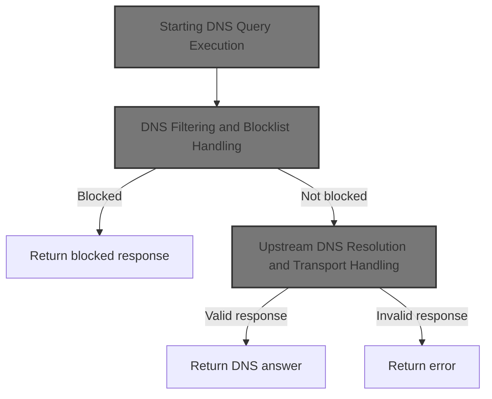

This document describes how DNS queries are processed, filtered, and resolved. The flow receives a DNS query, applies blocklist rules, and resolves the query using upstream DNS servers. The result is either a DNS answer, a blocked response, or an error.



# Starting DNS Query Execution

```mermaid
%%{init: {"flowchart": {"defaultRenderer": "elk"}} }%%
flowchart TD
    node1["Initialize empty response"] --> node2["Attempt DNS resolution"]
    click node1 openCode "src/plugins/dns-op/resolver.js:84:85"
    click node2 openCode "src/plugins/dns-op/resolver.js:87:87"
    node2 --> node3{"DNS resolution successful?"}
    click node3 openCode "src/plugins/dns-op/resolver.js:87:91"
    node3 -->|"Yes"| node4["Populate response with DNS data"]
    click node4 openCode "src/plugins/dns-op/resolver.js:87:87"
    node3 -->|"No"| node5["Populate response with error details"]
    click node5 openCode "src/plugins/dns-op/resolver.js:89:91"
    node4 --> node6["Return response"]
    node5 --> node6
    click node6 openCode "src/plugins/dns-op/resolver.js:93:94"

classDef HeadingStyle fill:#777777,stroke:#333,stroke-width:2px;

%% Swimm:
%% %%{init: {"flowchart": {"defaultRenderer": "elk"}} }%%
%% flowchart TD
%%     node1["Initialize empty response"] --> node2["Attempt DNS resolution"]
%%     click node1 openCode "<SwmPath>[src/…/dns-op/resolver.js](src/plugins/dns-op/resolver.js)</SwmPath>:84:85"
%%     click node2 openCode "<SwmPath>[src/…/dns-op/resolver.js](src/plugins/dns-op/resolver.js)</SwmPath>:87:87"
%%     node2 --> node3{"DNS resolution successful?"}
%%     click node3 openCode "<SwmPath>[src/…/dns-op/resolver.js](src/plugins/dns-op/resolver.js)</SwmPath>:87:91"
%%     node3 -->|"Yes"| node4["Populate response with DNS data"]
%%     click node4 openCode "<SwmPath>[src/…/dns-op/resolver.js](src/plugins/dns-op/resolver.js)</SwmPath>:87:87"
%%     node3 -->|"No"| node5["Populate response with error details"]
%%     click node5 openCode "<SwmPath>[src/…/dns-op/resolver.js](src/plugins/dns-op/resolver.js)</SwmPath>:89:91"
%%     node4 --> node6["Return response"]
%%     node5 --> node6
%%     click node6 openCode "<SwmPath>[src/…/dns-op/resolver.js](src/plugins/dns-op/resolver.js)</SwmPath>:93:94"
%% 
%% classDef HeadingStyle fill:#777777,stroke:#333,stroke-width:2px;
```



<SwmSnippet path="/src/plugins/dns-op/resolver.js" line="83">

---

Exec kicks off the DNS resolution flow by setting up an empty response and then calling <SwmToken path="src/plugins/dns-op/resolver.js" pos="87:11:11" line-data="      response.data = await this.resolveDns(ctx);">`resolveDns`</SwmToken> to do the actual work. If <SwmToken path="src/plugins/dns-op/resolver.js" pos="87:11:11" line-data="      response.data = await this.resolveDns(ctx);">`resolveDns`</SwmToken> throws, exec catches the error, logs it, and returns an error response. This separation keeps error handling and logging out of the main resolution logic.

```javascript
  async exec(ctx) {
    let response = pres.emptyResponse();

    try {
      response.data = await this.resolveDns(ctx);
    } catch (e) {
      response = pres.errResponse("dnsResolver", e);
      this.log.e(ctx.rxid, "main", e.stack);
    }

    return response;
  }
```

---

</SwmSnippet>

# DNS Filtering and Blocklist Handling

<SwmSnippet path="/src/plugins/dns-op/resolver.js" line="151">

---

ResolveDns checks if the DNS question is blocked using the blocklist filter and blockstamps, and if so, primes the cache and returns the blocked response.

```javascript
  async resolveDns(ctx) {
    const rxid = ctx.rxid;
    const req = ctx.request;
    const blInfo = ctx.userBlocklistInfo;
    const rawpacket = ctx.requestBodyBuffer;
    const decodedpacket = ctx.requestDecodedDnsPacket;
    const userDns = ctx.userDnsResolverUrl;
    const forceUserDns = this.forceDoh || !util.emptyString(userDns);
    const dispatcher = ctx.dispatcher;
    const userBlockstamp = ctx.userBlockstamp;
    // may be null or empty-obj (stamp then needs to be got from blf)
    // may be a obj { domainName: String -> blockstamps: Uint16Array }
    const stamps = ctx.domainBlockstamp;

    let blf = this.bw.getBlocklistFilter();
    const isBlfDisabled = this.bw.disabled();
    let isBlfSetup = rdnsutil.isBlocklistFilterSetup(blf);
    const ts = this.bw.timestamp(util.yyyymm());

    // if both blocklist-filter (blf) and stamps are not setup, question-block
    // is a no-op, while we expect answer-block to catch the block regardless.
    const q = this.makeRdnsResponse(rxid, rawpacket, blf, stamps);

    this.blocker.blockQuestion(rxid, /* out*/ q, blInfo);
    this.log.d(rxid, "q block?", q.isBlocked, "blf?", isBlfSetup, "ts?", ts);

    if (q.isBlocked) {
      this.primeCache(rxid, ts, q, dispatcher);
      return q;
    }

```

---

</SwmSnippet>

<SwmSnippet path="/src/plugins/dns-op/resolver.js" line="322">

---

PrimeCache stores the DNS response in the cache using a key built from the DNS packet and timestamp. It expects r to have <SwmToken path="src/plugins/dns-op/resolver.js" pos="324:13:13" line-data="    const k = cacheutil.makeHttpCacheKey(r.dnsPacket, ts);">`dnsPacket`</SwmToken>, <SwmToken path="src/plugins/dns-op/resolver.js" pos="323:9:9" line-data="    const blocked = r.isBlocked;">`isBlocked`</SwmToken>, and stamps, and if the key can't be built, it logs and skips caching. This keeps blocked or filtered responses available for quick lookup.

```javascript
  primeCache(rxid, ts, r, dispatcher) {
    const blocked = r.isBlocked;
    const k = cacheutil.makeHttpCacheKey(r.dnsPacket, ts);
    if (!k) {
      this.log.d(rxid, "primeCache: no key, url/query missing?", k, r.stamps);
      return;
    }

    this.log.d(rxid, "primeCache: block?", blocked, "k", k.href);
    const v = cacheutil.cacheValueOf(r);
    this.cache.put(k, v, dispatcher);
  }
```

---

</SwmSnippet>

<SwmSnippet path="/src/plugins/dns-op/resolver.js" line="182">

---

After returning from <SwmToken path="src/plugins/dns-op/resolver.js" pos="178:3:3" line-data="      this.primeCache(rxid, ts, q, dispatcher);">`primeCache`</SwmToken>, <SwmToken path="src/plugins/dns-op/resolver.js" pos="87:11:11" line-data="      response.data = await this.resolveDns(ctx);">`resolveDns`</SwmToken> checks if the blocklist filter is set up. If not, and background bandwidth init is enabled, it kicks off bandwidth setup and falls back to resolving DNS using the max upstream resolver, keeping things moving while the blocklist gets built.

```javascript
    let resolveStart = 0;
    let resolveEnd = 0;
    if (this.profileResolve) {
      resolveStart = Date.now();
    }

    let fromMax = false;
    let promisedTasks = null;
    if (!isBlfSetup && this.bgBwInit) {
      const alt = this.ofMax(userBlockstamp);
      fromMax = true;
      this.log.d(rxid, "bg-bw-init; upstream to max", alt);
      dispatcher(this.bw.init(rxid));
```

---

</SwmSnippet>

<SwmSnippet path="/src/plugins/rethinkdns/main.js" line="51">

---

Init manages blocklist construction by checking if the filter is set up or disabled, and if not, decides whether to start a new construction or wait for an ongoing one. The nowait flag lets callers skip waiting if construction is in progress, and the timing threshold is set by <SwmToken path="src/plugins/rethinkdns/main.js" pos="64:11:15" line-data="        now - this.startTime &gt; envutil.downloadTimeout() * 2">`envutil.downloadTimeout()`</SwmToken> \* 2.

```javascript
  async init(rxid, forceget = false) {
    if (this.isBlocklistFilterSetup() || this.disabled()) {
      const blres = pres.emptyResponse();
      blres.data.blocklistFilter = this.blocklistFilter; // may be nil
      return blres;
    }

    try {
      const now = Date.now();

      if (
        !this.isBlocklistUnderConstruction ||
        // it has been a while, queue another blocklist-construction
        now - this.startTime > envutil.downloadTimeout() * 2
      ) {
        this.log.i(rxid, "download blocklists", now, this.startTime);
        return this.initBlocklistConstruction(rxid, now);
      } else if (this.nowait && !forceget) {
        // blocklist-construction is in progress, but we don't have to
        // wait for it to finish. So, return an empty response.
        this.log.i(rxid, "nowait, but blocklist construction ongoing");
        return pres.emptyResponse();
      } else {
        // someone's constructing... wait till finished
        return this.waitUntilDone(rxid);
      }
    } catch (e) {
      this.log.e(rxid, "main", e.stack);
      return pres.errResponse("blocklistWrapper", e);
    }
  }
```

---

</SwmSnippet>

<SwmSnippet path="/src/plugins/dns-op/resolver.js" line="195">

---

After blocklist init, <SwmToken path="src/plugins/dns-op/resolver.js" pos="87:11:11" line-data="      response.data = await this.resolveDns(ctx);">`resolveDns`</SwmToken> runs DNS resolution upstream in parallel with bandwidth setup.

```javascript
      promisedTasks = await Promise.allSettled([
        Promise.resolve(), // placeholder promise that never rejects
        this.resolveDnsUpstream(
          rxid,
          ts,
          req,
          this.determineDohResolvers(alt, /* forceDoh */ true),
          rawpacket,
          decodedpacket
        ),
      ]);
    } else {
```

---

</SwmSnippet>

## Upstream DNS Resolution and Transport Handling

```mermaid
%%{init: {"flowchart": {"defaultRenderer": "elk"}} }%%
flowchart TD
  node1["Start DNS resolution"] --> node2{"Are DoH upstream resolvers configured?"}
  click node1 openCode "src/plugins/dns-op/resolver.js:351:479"
  node2 -->|"No"| node3["Check for cached/coalesced DNS response"]
  click node2 openCode "src/plugins/dns-op/resolver.js:360:415"
  node3 --> node4{"Is cached response available?"}
  click node3 openCode "src/plugins/dns-op/resolver.js:366:372"
  node4 -->|"Yes"| node5["Return cached response"]
  click node4 openCode "src/plugins/dns-op/resolver.js:371:372"
  node4 -->|"No"| node6["Send DNS query over UDP"]
  click node6 openCode "src/plugins/dns-op/resolver.js:392:394"
  node6 --> node7{"Is response truncated?"}
  click node7 openCode "src/plugins/dns-op/resolver.js:395:398"
  node7 -->|"Yes"| node8["Retry DNS query over TCP"]
  click node8 openCode "src/plugins/dns-op/resolver.js:397:398"
  node7 -->|"No"| node9["Return DNS response or 503 if unavailable"]
  click node9 openCode "src/plugins/dns-op/resolver.js:400:406"
  node8 --> node9
  node2 -->|"Yes"| node10["Resolve using DoH upstream resolvers"]
  click node10 openCode "src/plugins/dns-op/resolver.js:425:471"
  subgraph loop1["For each DoH upstream resolver"]
    node10 --> node11{"Request method: GET or POST?"}
    click node11 openCode "src/plugins/dns-op/resolver.js:448:465"
    node11 -->|"GET"| node12["Prepare GET request (with timeout)"]
    click node12 openCode "src/plugins/dns-op/resolver.js:449:454"
    node11 -->|"POST"| node13["Prepare POST request (with timeout)"]
    click node13 openCode "src/plugins/dns-op/resolver.js:456:464"
    node12 --> node14["Send DNS query to DoH upstream"]
    node13 --> node14
    click node14 openCode "src/plugins/dns-op/resolver.js:470:470"
  end
  loop1 --> node15["Return first successful response or 503 if all fail"]
  click node15 openCode "src/plugins/dns-op/resolver.js:478:479"
classDef HeadingStyle fill:#777777,stroke:#333,stroke-width:2px;

%% Swimm:
%% %%{init: {"flowchart": {"defaultRenderer": "elk"}} }%%
%% flowchart TD
%%   node1["Start DNS resolution"] --> node2{"Are DoH upstream resolvers configured?"}
%%   click node1 openCode "<SwmPath>[src/…/dns-op/resolver.js](src/plugins/dns-op/resolver.js)</SwmPath>:351:479"
%%   node2 -->|"No"| node3["Check for cached/coalesced DNS response"]
%%   click node2 openCode "<SwmPath>[src/…/dns-op/resolver.js](src/plugins/dns-op/resolver.js)</SwmPath>:360:415"
%%   node3 --> node4{"Is cached response available?"}
%%   click node3 openCode "<SwmPath>[src/…/dns-op/resolver.js](src/plugins/dns-op/resolver.js)</SwmPath>:366:372"
%%   node4 -->|"Yes"| node5["Return cached response"]
%%   click node4 openCode "<SwmPath>[src/…/dns-op/resolver.js](src/plugins/dns-op/resolver.js)</SwmPath>:371:372"
%%   node4 -->|"No"| node6["Send DNS query over UDP"]
%%   click node6 openCode "<SwmPath>[src/…/dns-op/resolver.js](src/plugins/dns-op/resolver.js)</SwmPath>:392:394"
%%   node6 --> node7{"Is response truncated?"}
%%   click node7 openCode "<SwmPath>[src/…/dns-op/resolver.js](src/plugins/dns-op/resolver.js)</SwmPath>:395:398"
%%   node7 -->|"Yes"| node8["Retry DNS query over TCP"]
%%   click node8 openCode "<SwmPath>[src/…/dns-op/resolver.js](src/plugins/dns-op/resolver.js)</SwmPath>:397:398"
%%   node7 -->|"No"| node9["Return DNS response or 503 if unavailable"]
%%   click node9 openCode "<SwmPath>[src/…/dns-op/resolver.js](src/plugins/dns-op/resolver.js)</SwmPath>:400:406"
%%   node8 --> node9
%%   node2 -->|"Yes"| node10["Resolve using DoH upstream resolvers"]
%%   click node10 openCode "<SwmPath>[src/…/dns-op/resolver.js](src/plugins/dns-op/resolver.js)</SwmPath>:425:471"
%%   subgraph loop1["For each DoH upstream resolver"]
%%     node10 --> node11{"Request method: GET or POST?"}
%%     click node11 openCode "<SwmPath>[src/…/dns-op/resolver.js](src/plugins/dns-op/resolver.js)</SwmPath>:448:465"
%%     node11 -->|"GET"| node12["Prepare GET request (with timeout)"]
%%     click node12 openCode "<SwmPath>[src/…/dns-op/resolver.js](src/plugins/dns-op/resolver.js)</SwmPath>:449:454"
%%     node11 -->|"POST"| node13["Prepare POST request (with timeout)"]
%%     click node13 openCode "<SwmPath>[src/…/dns-op/resolver.js](src/plugins/dns-op/resolver.js)</SwmPath>:456:464"
%%     node12 --> node14["Send DNS query to DoH upstream"]
%%     node13 --> node14
%%     click node14 openCode "<SwmPath>[src/…/dns-op/resolver.js](src/plugins/dns-op/resolver.js)</SwmPath>:470:470"
%%   end
%%   loop1 --> node15["Return first successful response or 503 if all fail"]
%%   click node15 openCode "<SwmPath>[src/…/dns-op/resolver.js](src/plugins/dns-op/resolver.js)</SwmPath>:478:479"
%% classDef HeadingStyle fill:#777777,stroke:#333,stroke-width:2px;
```



<SwmSnippet path="/src/plugins/dns-op/resolver.js" line="351">

---

In <SwmToken path="src/plugins/dns-op/resolver.js" pos="351:4:4" line-data="DNSResolver.prototype.resolveDnsUpstream = async function (">`resolveDnsUpstream`</SwmToken>, if there are no DoH upstreams, we try to coalesce DNS queries to avoid duplicates. If that doesn't work, we send the query over UDP using the transport, and if the response is truncated, we retry over TCP for a full answer.

```javascript
DNSResolver.prototype.resolveDnsUpstream = async function (
  rxid,
  ts,
  request,
  resolverUrls,
  query,
  packet
) {
  // if no doh upstreams set, resolve over plain-old dns
  if (util.emptyArray(resolverUrls)) {
    const eid = cacheutil.makeId(packet);
    /** @type {ArrayBuffer[]?} */
    let parcel = null;

    try {
      const g = await system.when(eid, this.timeout);
      this.coalstats.tot += 1;
      if (!util.emptyArray(g) && g[0] != null) {
        const sz = bufutil.len(g[0]);
        this.log.d(rxid, "coalesced", eid, sz, this.coalstats);
        if (sz > 0) return Promise.resolve(new Response(g[0]));
      }
      this.coalstats.empty += 1;
      this.log.e(rxid, "empty coalesced", eid, this.coalstats);
      return Promise.resolve(util.respond503());
    } catch (reason) {
      // happens on timeout or if new event, eid
      this.coalstats.try += 1;
      this.log.d(rxid, "not coalesced", eid, reason, this.coalstats);
    }

    if (this.transport == null) {
      this.log.e(rxid, "plain dns transport not set");
      this.coalstats.pub += 1;
      system.pub(eid, parcel);
      return Promise.reject(new Error("plain dns transport not set"));
    }

    let promisedResponse = null;
    try {
      // do not let exceptions passthrough to the caller
      const q = bufutil.bufferOf(query);

      let ans = await this.transport.udpquery(rxid, q);
```

---

</SwmSnippet>

<SwmSnippet path="/src/core/node/dns-transport.js" line="74">

---

Udpquery grabs a UDP socket from the pool or creates one if needed, sends the DNS query, waits for a response, and puts the socket back in the pool. If something goes wrong, it closes the socket to avoid leaks.

```javascript
  async udpquery(rxid, q) {
    let sock = this.udpconns.take();
    this.log.d(rxid, "udp pooled?", sock !== null);

    /** @type {Buffer?} */
    let ans = null;
    try {
      sock = sock || (await this.makeConn("udp"));
      ans = await UdpTx.begin(sock).exchange(rxid, q, this.ioTimeout);
      this.parkConn(sock, "udp");
    } catch (ex) {
      this.closeUdp(sock);
      this.log.e(rxid, ex);
    }
    return ans;
  }
```

---

</SwmSnippet>

<SwmSnippet path="/src/plugins/dns-op/resolver.js" line="395">

---

After udpquery, <SwmToken path="src/plugins/dns-op/resolver.js" pos="197:3:3" line-data="        this.resolveDnsUpstream(">`resolveDnsUpstream`</SwmToken> checks for truncated responses and retries over TCP if needed. When using DoH, it builds requests for each upstream, tweaks the URLs, and races them (plus a cache lookup) with <SwmToken path="src/plugins/dns-op/resolver.js" pos="417:3:5" line-data="  // Promise.any on promisedPromises[] only works if there are">`Promise.any`</SwmToken>, returning the first good result.

```javascript
      if (dnsutil.truncated(ans)) {
        this.log.w(rxid, "ans truncated, retrying over tcp");
        ans = await this.transport.tcpquery(rxid, q);
      }

      if (ans) {
        const ab = bufutil.arrayBufferOf(ans);
        parcel = [ab];
        promisedResponse = Promise.resolve(new Response(ab));
      } else {
        promisedResponse = Promise.resolve(util.respond503());
      }
    } catch (e) {
      this.log.e(rxid, "err when querying plain old dns", e.stack);
      promisedResponse = Promise.reject(e);
    }

    this.coalstats.pub += 1;
    system.pub(eid, parcel);
    return promisedResponse;
  }

  // Promise.any on promisedPromises[] only works if there are
  // zero awaits in this function or any of its downstream calls.
  // Otherwise, the first reject in promisedPromises[], before
  // any statement in the call-stack awaits, would throw unhandled
  // error, since the event loop would have 'ticked' and Promise.any
  // on promisedPromises[] would still not have been executed, as it
  // is the last statement of this function (which would have eaten up
  // all rejects as long as there was one resolved promise).
  const promisedPromises = [];
  try {
    // upstream to cache
    this.log.d(rxid, "upstream cache");
    promisedPromises.push(this.resolveDnsFromCache(rxid, ts, packet));

    // upstream to resolvers
    for (const rurl of resolverUrls) {
      if (util.emptyString(rurl)) {
        this.log.w(rxid, "missing resolver url", rurl, "among", resolverUrls);
        continue;
      }

      const u = new URL(request.url);
      const upstream = new URL(rurl);
      u.hostname = upstream.hostname; // default cloudflare-dns.com
      u.pathname = upstream.pathname; // override path, default /dns-query
      u.port = upstream.port; // override port, default 443
      u.protocol = upstream.protocol; // override proto, default https

      let dnsreq = null;
      // even for GET requests, plugin.js:getBodyBuffer converts contents of
      // u.search into an arraybuffer that then needs to be reconverted back
      if (util.isGetRequest(request)) {
        u.search = "?dns=" + bufutil.bytesToBase64Url(query);
        dnsreq = new Request(u.href, {
          method: "GET",
          headers: util.dnsHeaders(),
          signal: AbortSignal.timeout(this.timeout),
        });
      } else if (util.isPostRequest(request)) {
        dnsreq = new Request(u.href, {
          method: "POST",
          headers: util.concatHeaders(
            util.contentLengthHeader(query),
            util.dnsHeaders()
          ),
          body: query,
          signal: AbortSignal.timeout(this.timeout),
        });
      } else {
        throw new Error("get/post only");
      }

      this.log.d(rxid, "upstream doh2/fetch", u.href);
      promisedPromises.push(fetch(dnsreq));
    }
```

---

</SwmSnippet>

<SwmSnippet path="/src/plugins/dns-op/resolver.js" line="472">

---

ResolveDnsUpstream returns the first successful response from the set of upstream DoH requests and cache lookups using <SwmToken path="src/plugins/dns-op/resolver.js" pos="477:3:5" line-data="  // Promise.any returns any rejected promise if none resolved; node v15+">`Promise.any`</SwmToken>. If none succeed, it returns the error from the last failed promise.

```javascript
  } catch (e) {
    this.log.e(rxid, "err doh2/fetch upstream", e.stack);
    promisedPromises.push(Promise.reject(e));
  }

  // Promise.any returns any rejected promise if none resolved; node v15+
  return Promise.any(promisedPromises);
};
```

---

</SwmSnippet>

## Concurrent Upstream Resolution and Bandwidth Init

```mermaid
%%{init: {"flowchart": {"defaultRenderer": "elk"}} }%%
flowchart TD
  node1["Start DNS resolution process"]
  click node1 openCode "src/plugins/dns-op/resolver.js:207:217"
  node1 --> node2["Initialize and resolve DNS upstream"]
  click node2 openCode "src/plugins/dns-op/resolver.js:217:229"
  node2 --> node3{"Did all tasks succeed?"}
  click node3 openCode "src/plugins/dns-op/resolver.js:230:234"
  node3 -->|"No"| node12["Stop: Resolution failed"]
  click node12 openCode "src/plugins/dns-op/resolver.js:231:233"
  node3 -->|"Yes"| node4{"Is blocklist enabled or disabled?"}
  click node4 openCode "src/plugins/dns-op/resolver.js:246:256"
  node4 -->|"No"| node13["Stop: Blocklist not set up"]
  click node13 openCode "src/plugins/dns-op/resolver.js:258:258"
  node4 -->|"Yes"| node5{"Is upstream DNS response valid?"}
  click node5 openCode "src/plugins/dns-op/resolver.js:259:265"
  node5 -->|"No"| node14["Stop: Upstream DNS error"]
  click node14 openCode "src/plugins/dns-op/resolver.js:261:264"
  node5 -->|"Yes"| node6{"Is DNS response well-formed?"}
  click node6 openCode "src/plugins/dns-op/resolver.js:270:276"
  node6 -->|"No"| node7["Return SERVFAIL response"]
  click node7 openCode "src/plugins/dns-op/resolver.js:273:276"
  node6 -->|"Yes"| node8["Transform DNS response"]
  click node8 openCode "src/plugins/dns-op/resolver.js:271:272"
  node7 --> node9["Apply blocklist filtering"]
  click node9 openCode "src/plugins/dns-op/resolver.js:280:280"
  node8 --> node9
  node9 --> node10{"Was response from cache or max doh?"}
  click node10 openCode "src/plugins/dns-op/resolver.js:281:286"
  node10 -->|"No"| node11["Hydrate cache"]
  click node11 openCode "src/plugins/dns-op/resolver.js:287:288"
  node10 -->|"Yes"| node15["Skip cache hydration"]
  click node15 openCode "src/plugins/dns-op/resolver.js:284:286"
  node11 --> node16["Return DNS response"]
  click node16 openCode "src/plugins/dns-op/resolver.js:289:290"
  node15 --> node16
classDef HeadingStyle fill:#777777,stroke:#333,stroke-width:2px;

%% Swimm:
%% %%{init: {"flowchart": {"defaultRenderer": "elk"}} }%%
%% flowchart TD
%%   node1["Start DNS resolution process"]
%%   click node1 openCode "<SwmPath>[src/…/dns-op/resolver.js](src/plugins/dns-op/resolver.js)</SwmPath>:207:217"
%%   node1 --> node2["Initialize and resolve DNS upstream"]
%%   click node2 openCode "<SwmPath>[src/…/dns-op/resolver.js](src/plugins/dns-op/resolver.js)</SwmPath>:217:229"
%%   node2 --> node3{"Did all tasks succeed?"}
%%   click node3 openCode "<SwmPath>[src/…/dns-op/resolver.js](src/plugins/dns-op/resolver.js)</SwmPath>:230:234"
%%   node3 -->|"No"| node12["Stop: Resolution failed"]
%%   click node12 openCode "<SwmPath>[src/…/dns-op/resolver.js](src/plugins/dns-op/resolver.js)</SwmPath>:231:233"
%%   node3 -->|"Yes"| node4{"Is blocklist enabled or disabled?"}
%%   click node4 openCode "<SwmPath>[src/…/dns-op/resolver.js](src/plugins/dns-op/resolver.js)</SwmPath>:246:256"
%%   node4 -->|"No"| node13["Stop: Blocklist not set up"]
%%   click node13 openCode "<SwmPath>[src/…/dns-op/resolver.js](src/plugins/dns-op/resolver.js)</SwmPath>:258:258"
%%   node4 -->|"Yes"| node5{"Is upstream DNS response valid?"}
%%   click node5 openCode "<SwmPath>[src/…/dns-op/resolver.js](src/plugins/dns-op/resolver.js)</SwmPath>:259:265"
%%   node5 -->|"No"| node14["Stop: Upstream DNS error"]
%%   click node14 openCode "<SwmPath>[src/…/dns-op/resolver.js](src/plugins/dns-op/resolver.js)</SwmPath>:261:264"
%%   node5 -->|"Yes"| node6{"Is DNS response well-formed?"}
%%   click node6 openCode "<SwmPath>[src/…/dns-op/resolver.js](src/plugins/dns-op/resolver.js)</SwmPath>:270:276"
%%   node6 -->|"No"| node7["Return SERVFAIL response"]
%%   click node7 openCode "<SwmPath>[src/…/dns-op/resolver.js](src/plugins/dns-op/resolver.js)</SwmPath>:273:276"
%%   node6 -->|"Yes"| node8["Transform DNS response"]
%%   click node8 openCode "<SwmPath>[src/…/dns-op/resolver.js](src/plugins/dns-op/resolver.js)</SwmPath>:271:272"
%%   node7 --> node9["Apply blocklist filtering"]
%%   click node9 openCode "<SwmPath>[src/…/dns-op/resolver.js](src/plugins/dns-op/resolver.js)</SwmPath>:280:280"
%%   node8 --> node9
%%   node9 --> node10{"Was response from cache or max doh?"}
%%   click node10 openCode "<SwmPath>[src/…/dns-op/resolver.js](src/plugins/dns-op/resolver.js)</SwmPath>:281:286"
%%   node10 -->|"No"| node11["Hydrate cache"]
%%   click node11 openCode "<SwmPath>[src/…/dns-op/resolver.js](src/plugins/dns-op/resolver.js)</SwmPath>:287:288"
%%   node10 -->|"Yes"| node15["Skip cache hydration"]
%%   click node15 openCode "<SwmPath>[src/…/dns-op/resolver.js](src/plugins/dns-op/resolver.js)</SwmPath>:284:286"
%%   node11 --> node16["Return DNS response"]
%%   click node16 openCode "<SwmPath>[src/…/dns-op/resolver.js](src/plugins/dns-op/resolver.js)</SwmPath>:289:290"
%%   node15 --> node16
%% classDef HeadingStyle fill:#777777,stroke:#333,stroke-width:2px;
```



<SwmSnippet path="/src/plugins/dns-op/resolver.js" line="207">

---

After <SwmToken path="src/plugins/dns-op/resolver.js" pos="197:3:3" line-data="        this.resolveDnsUpstream(">`resolveDnsUpstream`</SwmToken>, <SwmToken path="src/plugins/dns-op/resolver.js" pos="87:11:11" line-data="      response.data = await this.resolveDns(ctx);">`resolveDns`</SwmToken> waits for both bandwidth init and DNS resolution to finish using <SwmToken path="src/plugins/dns-op/resolver.js" pos="217:7:9" line-data="      promisedTasks = await Promise.allSettled([">`Promise.allSettled`</SwmToken>. It checks for any errors before continuing, making sure both tasks are done.

```javascript
      // nested async calls (async fn calling another async fn)
      // need to await differently depending on what's returned:
      // case1:
      // fulfiller = async () => { return "123"; }
      // wrapper = async () => { return fulfiller(); }
      // result = await wrapper() :: outputs "123"
      // case2:
      // arrayWrapper = async () => { return [fulfiller()]; }
      // result1 = await arrayWrapper() :: outputs "Array[Promise{}]"
      // result2 = await result1[0] :: outputs "123"
      promisedTasks = await Promise.allSettled([
        this.bw.init(rxid),
```

---

</SwmSnippet>

<SwmSnippet path="/src/plugins/dns-op/resolver.js" line="219">

---

After returning from <SwmPath>[src/…/rethinkdns/main.js](src/plugins/rethinkdns/main.js)</SwmPath>, <SwmToken path="src/plugins/dns-op/resolver.js" pos="87:11:11" line-data="      response.data = await this.resolveDns(ctx);">`resolveDns`</SwmToken> runs <SwmToken path="src/plugins/dns-op/resolver.js" pos="219:3:3" line-data="        this.resolveDnsUpstream(">`resolveDnsUpstream`</SwmToken> and bandwidth init together, then checks both results for errors before continuing.

```javascript
        this.resolveDnsUpstream(
          rxid,
          ts,
          req,
          this.determineDohResolvers(userDns, forceUserDns),
          rawpacket,
          decodedpacket
        ),
      ]);
    }

    for (const task of promisedTasks) {
      if (task.status === "rejected") {
        throw new Error(`task rejected ${task.reason}`);
```

---

</SwmSnippet>

<SwmSnippet path="/src/plugins/dns-op/resolver.js" line="233">

---

After <SwmToken path="src/plugins/dns-op/resolver.js" pos="197:3:3" line-data="        this.resolveDnsUpstream(">`resolveDnsUpstream`</SwmToken>, <SwmToken path="src/plugins/dns-op/resolver.js" pos="87:11:11" line-data="      response.data = await this.resolveDns(ctx);">`resolveDns`</SwmToken> checks if the blocklist filter is set up, updates it if needed, and processes the upstream DNS answer. It blocks the answer if required and primes the cache only if the response wasn't already cached or from max upstream.

```javascript
      } // else: task.status === "fulfilled"
    }

    if (this.profileResolve) {
      resolveEnd = Date.now();
      this.measurements.push(resolveEnd - resolveStart);
      this.logMeasurementsPeriodically();
    }

    // developer.mozilla.org/en-US/docs/Web/JavaScript/Reference/Global_Objects/Promise/allSettled#return_value
    /** @type{Response} */
    const res = promisedTasks[1].value;

    if (fromMax) {
      // blf would be eventually be init'd in the background
      isBlfSetup = true;
    } else if (!isBlfSetup && !isBlfDisabled) {
      this.log.d(rxid, "blocklist-filter downloaded and setup");
      blf = this.bw.getBlocklistFilter();
      isBlfSetup = rdnsutil.isBlocklistFilterSetup(blf);
    } else {
      // override, as blocklists disabled
      isBlfSetup = true;
    }

    if (!isBlfSetup) throw new Error(rxid + " no blocklist-filter");
    if (!res) throw new Error(rxid + " no upstream result");

    if (!res.ok) {
      const txt = res.text && (await res.text());
      this.log.w(rxid, "!OK", res.status, txt);
      throw new Error(txt + " http err: " + res.status + " " + res.statusText);
    }

    const ans = await res.arrayBuffer();

    let r;
    try {
      r = this.makeRdnsResponse(rxid, ans, blf, stamps);
    } catch (e) {
      this.log.w(rxid, "upstream returned malformed dns response:", e.message);
      const pkt = dnsutil.servfail(decodedpacket.id, decodedpacket.questions);
      r = pres.dnsResponse(dnsutil.decode(pkt), pkt, stamps);
    }

    // blockAnswer is a no-op if the ans is already quad0
    // check outgoing cached dns-packet against blocklists
    this.blocker.blockAnswer(rxid, /* out*/ r, blInfo);
    const fromCache = cacheutil.hasCacheHeader(res.headers);
    this.log.d(rxid, "a block?", r.isBlocked, "c?", fromCache, "max?", fromMax);

    // if res was got from caches or if res was got from max doh (ie, blf
    // wasn't used to retrieve stamps), then skip hydrating the cache
    if (!fromCache && !fromMax) {
      this.primeCache(rxid, ts, r, dispatcher);
    }
    return r;
  }
```

---

</SwmSnippet>

&nbsp;

*This is an auto-generated document by Swimm 🌊 and has not yet been verified by a human*

<SwmMeta version="3.0.0" repo-id="Z2l0aHViJTNBJTNBamF2YXNjcmlwdC1zZXJ2ZXJsZXNzLWRucyUzQSUzQXJpY2FyZG9sb3Blemc=" repo-name="javascript-serverless-dns"><sup>Powered by [Swimm](https://app.swimm.io/)</sup></SwmMeta>
