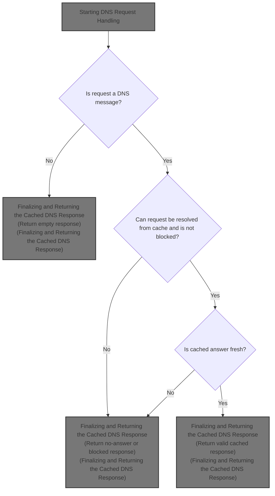

This document describes how DNS requests are handled to provide fast and secure DNS resolution for users. The flow receives a DNS request, checks its validity, and attempts to resolve it from cache. User-specific blocklists are enforced for both the incoming query and any cached answers, ensuring that blocked domains are not served. The system returns either an empty, blocked, or valid cached response.



# Starting DNS Request Handling

```mermaid
%%{init: {"flowchart": {"defaultRenderer": "elk"}} }%%
flowchart TD
  node1{"Is request a DNS message?"}
  click node1 openCode "src/plugins/dns-op/cache-resolver.js:33:36"
  node1 -->|"No"| node2["Return empty response"]
  click node2 openCode "src/plugins/dns-op/cache-resolver.js:35:35"
  node1 -->|"Yes"| node3["Attempt to resolve from cache"]
  click node3 openCode "src/plugins/dns-op/cache-resolver.js:39:43"
  node3 --> node4{"Cache resolution throws error?"}
  click node4 openCode "src/plugins/dns-op/cache-resolver.js:44:47"
  node4 -->|"No"| node5["Return DNS response"]
  click node5 openCode "src/plugins/dns-op/cache-resolver.js:49:49"
  node4 -->|"Yes"| node6["Return error response"]
  click node6 openCode "src/plugins/dns-op/cache-resolver.js:46:47"

classDef HeadingStyle fill:#777777,stroke:#333,stroke-width:2px;

%% Swimm:
%% %%{init: {"flowchart": {"defaultRenderer": "elk"}} }%%
%% flowchart TD
%%   node1{"Is request a DNS message?"}
%%   click node1 openCode "<SwmPath>[src/…/dns-op/cache-resolver.js](src/plugins/dns-op/cache-resolver.js)</SwmPath>:33:36"
%%   node1 -->|"No"| node2["Return empty response"]
%%   click node2 openCode "<SwmPath>[src/…/dns-op/cache-resolver.js](src/plugins/dns-op/cache-resolver.js)</SwmPath>:35:35"
%%   node1 -->|"Yes"| node3["Attempt to resolve from cache"]
%%   click node3 openCode "<SwmPath>[src/…/dns-op/cache-resolver.js](src/plugins/dns-op/cache-resolver.js)</SwmPath>:39:43"
%%   node3 --> node4{"Cache resolution throws error?"}
%%   click node4 openCode "<SwmPath>[src/…/dns-op/cache-resolver.js](src/plugins/dns-op/cache-resolver.js)</SwmPath>:44:47"
%%   node4 -->|"No"| node5["Return DNS response"]
%%   click node5 openCode "<SwmPath>[src/…/dns-op/cache-resolver.js](src/plugins/dns-op/cache-resolver.js)</SwmPath>:49:49"
%%   node4 -->|"Yes"| node6["Return error response"]
%%   click node6 openCode "<SwmPath>[src/…/dns-op/cache-resolver.js](src/plugins/dns-op/cache-resolver.js)</SwmPath>:46:47"
%% 
%% classDef HeadingStyle fill:#777777,stroke:#333,stroke-width:2px;
```



<SwmSnippet path="/src/plugins/dns-op/cache-resolver.js" line="31">

---

<SwmToken path="src/plugins/dns-op/cache-resolver.js" pos="31:3:3" line-data="  async exec(ctx) {">`exec`</SwmToken> kicks off the DNS cache responder flow. It first checks if the incoming context is a DNS message; if not, it logs and returns an empty response. If it is, it tries to resolve the DNS request from cache by calling <SwmToken path="src/plugins/dns-op/cache-resolver.js" pos="39:11:11" line-data="      response.data = await this.resolveFromCache(">`resolveFromCache`</SwmToken>. This step is needed because that's where the actual cache lookup and blocklist logic happens.

```javascript
  async exec(ctx) {
    let response = pres.emptyResponse();
    if (!ctx.isDnsMsg) {
      this.log.d(ctx.rxid, "not a dns-msg, nowt to resolve");
      return response;
    }

    try {
      response.data = await this.resolveFromCache(
        ctx.rxid,
        ctx.requestDecodedDnsPacket,
        ctx.userBlocklistInfo
      );
    } catch (e) {
      this.log.e(ctx.rxid, "main", e.stack);
      response = pres.errResponse("DnsCacheHandler", e);
    }

    return response;
  }
```

---

</SwmSnippet>

# Cache Lookup and Blocklist Filtering

<SwmSnippet path="/src/plugins/dns-op/cache-resolver.js" line="58">

---

<SwmToken path="src/plugins/dns-op/cache-resolver.js" pos="58:3:3" line-data="  async resolveFromCache(rxid, packet, blockInfo) {">`resolveFromCache`</SwmToken> checks blocklist filter setup, fetches from cache if needed, and hands off to <SwmToken path="src/plugins/dns-op/cache-resolver.js" pos="94:3:3" line-data="    this.makeCacheResponse(rxid, /* out*/ res, blockInfo);">`makeCacheResponse`</SwmToken> to apply blocklist logic to the cached response.

```javascript
  async resolveFromCache(rxid, packet, blockInfo) {
    const noAnswer = pres.rdnsNoBlockResponse();
    // if blocklist-filter is setup, then there's no need to query http-cache
    // (it introduces 5ms to 10ms latency). Because, the sole purpose of the
    // cache is to help avoid blocklist-filter downloads which cost 200ms
    // (when cached by cf) to 5s (uncached, downloaded from s3). Otherwise,
    // it only add 10s, even on cache-misses. This is expensive especially
    // when upstream DoHs (like cf, goog) have median response time of 10s.
    // When other platforms get http-cache / multiple caches (like on-disk),
    // the above reasoning may not apply, since it is only valid for infra
    // on Cloudflare, which not only has "free" egress, but also different
    // runtime (faster hw and sw) and deployment model (v8 isolates).
    const blf = this.bw.getBlocklistFilter();
    const hasblf = rdnsutil.isBlocklistFilterSetup(blf);
    const onlyLocal = this.bw.disabled() || hasblf;
    const ts = hasblf ? this.bw.timestamp(util.yyyymm()) : util.yyyymm();

    const k = cacheutil.makeHttpCacheKey(packet, ts);
    if (!k) return noAnswer;

    const cr = await this.cache.get(k, onlyLocal);
    const hascr = !util.emptyObj(cr);
    const hasm = hascr && cr.metadata != null;
    this.log.d(rxid, "l/b?", onlyLocal, hasblf, "cache k/m", k.href, hasm);

    if (!hascr) return noAnswer;

    // note: stamps in cr may be out-of-date; for ex, consider a
    // scenario where v6.example.com AAAA to fda3:: today,
    // but CNAMEs to v6.test.example.org tomorrow. cr.metadata
    // would contain stamps for [v6.example.com, example.com]
    // whereas it should be [v6.example.com, example.com
    // v6.test.example.org, test.example.org, example.org]
    const stamps = rdnsutil.blockstampFromCache(cr);
    const res = pres.dnsResponse(cr.dnsPacket, cr.dnsBuffer, stamps);

    this.makeCacheResponse(rxid, /* out*/ res, blockInfo);

    if (res.isBlocked) return res;

    if (!cacheutil.isAnswerFresh(cr.metadata)) {
      this.log.d(rxid, "cache ans not fresh");
      return noAnswer;
    }

```

---

</SwmSnippet>

## Applying Blocklists to Cached Response

```mermaid
%%{init: {"flowchart": {"defaultRenderer": "elk"}} }%%
flowchart TD
  node1["Check if DNS question is blocked"]
  click node1 openCode "src/plugins/dns-op/cache-resolver.js:120:124"
  node1 --> node2{"Is question blocked?"}
  click node2 openCode "src/plugins/dns-op/cache-resolver.js:124:126"
  node2 -->|"Yes"| node3["Return blocked response"]
  click node3 openCode "src/plugins/dns-op/cache-resolver.js:125:126"
  node2 -->|"No"| node4{"Does cached response have answers?"}
  click node4 openCode "src/plugins/dns-op/cache-resolver.js:130:132"
  node4 -->|"No"| node5["Checking Cached Answers Against Blocklists"]
  
  node4 -->|"Yes"| node6["Check if outgoing answer should be blocked and return response"]
  click node6 openCode "src/plugins/dns-op/cache-resolver.js:134:139"

classDef HeadingStyle fill:#777777,stroke:#333,stroke-width:2px;
click node5 goToHeading "Checking Cached Answers Against Blocklists"
node5:::HeadingStyle

%% Swimm:
%% %%{init: {"flowchart": {"defaultRenderer": "elk"}} }%%
%% flowchart TD
%%   node1["Check if DNS question is blocked"]
%%   click node1 openCode "<SwmPath>[src/…/dns-op/cache-resolver.js](src/plugins/dns-op/cache-resolver.js)</SwmPath>:120:124"
%%   node1 --> node2{"Is question blocked?"}
%%   click node2 openCode "<SwmPath>[src/…/dns-op/cache-resolver.js](src/plugins/dns-op/cache-resolver.js)</SwmPath>:124:126"
%%   node2 -->|"Yes"| node3["Return blocked response"]
%%   click node3 openCode "<SwmPath>[src/…/dns-op/cache-resolver.js](src/plugins/dns-op/cache-resolver.js)</SwmPath>:125:126"
%%   node2 -->|"No"| node4{"Does cached response have answers?"}
%%   click node4 openCode "<SwmPath>[src/…/dns-op/cache-resolver.js](src/plugins/dns-op/cache-resolver.js)</SwmPath>:130:132"
%%   node4 -->|"No"| node5["Checking Cached Answers Against Blocklists"]
%%   
%%   node4 -->|"Yes"| node6["Check if outgoing answer should be blocked and return response"]
%%   click node6 openCode "<SwmPath>[src/…/dns-op/cache-resolver.js](src/plugins/dns-op/cache-resolver.js)</SwmPath>:134:139"
%% 
%% classDef HeadingStyle fill:#777777,stroke:#333,stroke-width:2px;
%% click node5 goToHeading "Checking Cached Answers Against Blocklists"
%% node5:::HeadingStyle
```



<SwmSnippet path="/src/plugins/dns-op/cache-resolver.js" line="120">

---

In <SwmToken path="src/plugins/dns-op/cache-resolver.js" pos="120:1:1" line-data="  makeCacheResponse(rxid, r, blockInfo) {">`makeCacheResponse`</SwmToken>, we first check the incoming DNS request against blocklists using the blocker. If it's blocked, we return immediately. If not, and if the cached response has answers, we move on to check those answers against blocklists too. This step is needed to enforce blocking for both queries and responses.

```javascript
  makeCacheResponse(rxid, r, blockInfo) {
    // check incoming dns request against blocklists in cache-metadata
    this.blocker.blockQuestion(rxid, /* out*/ r, blockInfo);
    this.log.d(rxid, blockInfo, "q block?", r.isBlocked);
    if (r.isBlocked) {
      return r;
    }

    // cache-response contains only query and not answers,
    // hence there are no more domains to block.
    if (!dnsutil.hasAnswers(r.dnsPacket)) {
      return r;
    }

```

---

</SwmSnippet>

### Checking Query Against Blocklists

```mermaid
%%{init: {"flowchart": {"defaultRenderer": "elk"}} }%%
flowchart TD
    node1["Start DNS block evaluation"]
    click node1 openCode "src/plugins/dns-op/blocker.js:25:26"
    node1 --> node2{"Are there stamps?"}
    click node2 openCode "src/plugins/dns-op/blocker.js:29:32"
    node2 -->|"No stamps"| node3["Return original request"]
    click node3 openCode "src/plugins/dns-op/blocker.js:31:32"
    node2 -->|"Stamps present"| node4{"Has user set blockstamp?"}
    click node4 openCode "src/plugins/dns-op/blocker.js:34:37"
    node4 -->|"No blockstamp"| node3
    node4 -->|"Blockstamp present"| node5{"Is DNS query blockable?"}
    click node5 openCode "src/plugins/dns-op/blocker.js:39:42"
    node5 -->|"Not blockable"| node3
    node5 -->|"Blockable"| node6["Extract domains"]
    click node6 openCode "src/plugins/dns-op/blocker.js:44:44"
    node6 --> node7["Apply block to domains"]
    click node7 openCode "src/plugins/dns-op/blocker.js:45:45"
    node7 --> node8["Return blocked request"]
    click node8 openCode "src/plugins/dns-op/blocker.js:47:48"
classDef HeadingStyle fill:#777777,stroke:#333,stroke-width:2px;

%% Swimm:
%% %%{init: {"flowchart": {"defaultRenderer": "elk"}} }%%
%% flowchart TD
%%     node1["Start DNS block evaluation"]
%%     click node1 openCode "<SwmPath>[src/…/dns-op/blocker.js](src/plugins/dns-op/blocker.js)</SwmPath>:25:26"
%%     node1 --> node2{"Are there stamps?"}
%%     click node2 openCode "<SwmPath>[src/…/dns-op/blocker.js](src/plugins/dns-op/blocker.js)</SwmPath>:29:32"
%%     node2 -->|"No stamps"| node3["Return original request"]
%%     click node3 openCode "<SwmPath>[src/…/dns-op/blocker.js](src/plugins/dns-op/blocker.js)</SwmPath>:31:32"
%%     node2 -->|"Stamps present"| node4{"Has user set blockstamp?"}
%%     click node4 openCode "<SwmPath>[src/…/dns-op/blocker.js](src/plugins/dns-op/blocker.js)</SwmPath>:34:37"
%%     node4 -->|"No blockstamp"| node3
%%     node4 -->|"Blockstamp present"| node5{"Is DNS query blockable?"}
%%     click node5 openCode "<SwmPath>[src/…/dns-op/blocker.js](src/plugins/dns-op/blocker.js)</SwmPath>:39:42"
%%     node5 -->|"Not blockable"| node3
%%     node5 -->|"Blockable"| node6["Extract domains"]
%%     click node6 openCode "<SwmPath>[src/…/dns-op/blocker.js](src/plugins/dns-op/blocker.js)</SwmPath>:44:44"
%%     node6 --> node7["Apply block to domains"]
%%     click node7 openCode "<SwmPath>[src/…/dns-op/blocker.js](src/plugins/dns-op/blocker.js)</SwmPath>:45:45"
%%     node7 --> node8["Return blocked request"]
%%     click node8 openCode "<SwmPath>[src/…/dns-op/blocker.js](src/plugins/dns-op/blocker.js)</SwmPath>:47:48"
%% classDef HeadingStyle fill:#777777,stroke:#333,stroke-width:2px;
```



<SwmSnippet path="/src/plugins/dns-op/blocker.js" line="25">

---

<SwmToken path="src/plugins/dns-op/blocker.js" pos="25:1:1" line-data="  blockQuestion(rxid, req, blockInfo) {">`blockQuestion`</SwmToken> checks if the DNS query has stamps and a <SwmToken path="src/plugins/dns-op/blocker.js" pos="35:16:18" line-data="      this.log.d(rxid, &quot;q: no user-set blockstamp&quot;);">`user-set`</SwmToken> blockstamp, then verifies if the query is blockable. If so, it extracts domains and calls <SwmToken path="src/plugins/dns-op/blocker.js" pos="45:9:9" line-data="    const bres = this.block(domains, blockInfo, stamps);">`block`</SwmToken> to see if any should be blocked. This step is needed to enforce blocklists on incoming queries.

```javascript
  blockQuestion(rxid, req, blockInfo) {
    const dnsPacket = req.dnsPacket;
    const stamps = req.stamps;

    if (!stamps) {
      this.log.d(rxid, "q: no stamp");
      return req;
    }

    if (!rdnsutil.hasBlockstamp(blockInfo)) {
      this.log.d(rxid, "q: no user-set blockstamp");
      return req;
    }

    if (!dnsutil.isQueryBlockable(dnsPacket)) {
      this.log.d(rxid, "not a blockable dns-query");
      return req;
    }

    const domains = dnsutil.extractDomains(dnsPacket);
    const bres = this.block(domains, blockInfo, stamps);

    return pres.copyOnlyBlockProperties(req, bres);
  }
```

---

</SwmSnippet>

### Domain Blocklist Enforcement

<SwmSnippet path="/src/plugins/dns-op/blocker.js" line="93">

---

<SwmToken path="src/plugins/dns-op/blocker.js" pos="93:1:1" line-data="  block(names, blockInfo, blockstamps) {">`block`</SwmToken> checks each domain against blocklists using <SwmToken path="src/plugins/dns-op/blocker.js" pos="96:7:7" line-data="      r = rdnsutil.doBlock(n, blockInfo, blockstamps);">`doBlock`</SwmToken>, and returns as soon as one is blocked.

```javascript
  block(names, blockInfo, blockstamps) {
    let r = pres.rdnsNoBlockResponse();
    for (const n of names) {
      r = rdnsutil.doBlock(n, blockInfo, blockstamps);
      if (r.isBlocked) break;
    }
    return r;
  }
```

---

</SwmSnippet>

### Wildcard and Direct Blocklist Matching

```mermaid
%%{init: {"flowchart": {"defaultRenderer": "elk"}} }%%
flowchart TD
  node1["Validate inputs: domain and blocklist info"] --> node2{"Are inputs valid?"}
  click node1 openCode "src/plugins/rdns-util.js:100:111"
  node2 -->|"No"| node3["Return: Domain is not blocked"]
  click node2 openCode "src/plugins/rdns-util.js:105:110"
  click node3 openCode "src/plugins/rdns-util.js:110:111"
  node2 -->|"Yes"| node4{"Is wildcard blocklist enabled?"}
  click node4 openCode "src/plugins/rdns-util.js:113:115"
  node4 -->|"Yes"| node5["Check all subdomains for blocklist matches"]
  click node5 openCode "src/plugins/rdns-util.js:115:116"
  subgraph loop1["For each subdomain"]
    node5 --> node6{"Is subdomain blocked for user?"}
    click node6 openCode "src/plugins/rdns-util.js:176:191"
    node6 -->|"Yes"| node7["Return: Domain is blocked"]
    click node7 openCode "src/plugins/rdns-util.js:188:190"
    node6 -->|"No"| node8["Continue to next subdomain"]
    click node8 openCode "src/plugins/rdns-util.js:191:191"
    node8 -->|"All checked"| node3
  end
  node4 -->|"No"| node9{"Is domain in blocklist?"}
  click node9 openCode "src/plugins/rdns-util.js:118:120"
  node9 -->|"No"| node3
  node9 -->|"Yes"| node10{"Is user blocklist intersecting domain blocklist?"}
  click node10 openCode "src/plugins/rdns-util.js:121:122"
  node10 -->|"Yes"| node7
  node10 -->|"No"| node3

classDef HeadingStyle fill:#777777,stroke:#333,stroke-width:2px;

%% Swimm:
%% %%{init: {"flowchart": {"defaultRenderer": "elk"}} }%%
%% flowchart TD
%%   node1["Validate inputs: domain and blocklist info"] --> node2{"Are inputs valid?"}
%%   click node1 openCode "<SwmPath>[src/plugins/rdns-util.js](src/plugins/rdns-util.js)</SwmPath>:100:111"
%%   node2 -->|"No"| node3["Return: Domain is not blocked"]
%%   click node2 openCode "<SwmPath>[src/plugins/rdns-util.js](src/plugins/rdns-util.js)</SwmPath>:105:110"
%%   click node3 openCode "<SwmPath>[src/plugins/rdns-util.js](src/plugins/rdns-util.js)</SwmPath>:110:111"
%%   node2 -->|"Yes"| node4{"Is wildcard blocklist enabled?"}
%%   click node4 openCode "<SwmPath>[src/plugins/rdns-util.js](src/plugins/rdns-util.js)</SwmPath>:113:115"
%%   node4 -->|"Yes"| node5["Check all subdomains for blocklist matches"]
%%   click node5 openCode "<SwmPath>[src/plugins/rdns-util.js](src/plugins/rdns-util.js)</SwmPath>:115:116"
%%   subgraph loop1["For each subdomain"]
%%     node5 --> node6{"Is subdomain blocked for user?"}
%%     click node6 openCode "<SwmPath>[src/plugins/rdns-util.js](src/plugins/rdns-util.js)</SwmPath>:176:191"
%%     node6 -->|"Yes"| node7["Return: Domain is blocked"]
%%     click node7 openCode "<SwmPath>[src/plugins/rdns-util.js](src/plugins/rdns-util.js)</SwmPath>:188:190"
%%     node6 -->|"No"| node8["Continue to next subdomain"]
%%     click node8 openCode "<SwmPath>[src/plugins/rdns-util.js](src/plugins/rdns-util.js)</SwmPath>:191:191"
%%     node8 -->|"All checked"| node3
%%   end
%%   node4 -->|"No"| node9{"Is domain in blocklist?"}
%%   click node9 openCode "<SwmPath>[src/plugins/rdns-util.js](src/plugins/rdns-util.js)</SwmPath>:118:120"
%%   node9 -->|"No"| node3
%%   node9 -->|"Yes"| node10{"Is user blocklist intersecting domain blocklist?"}
%%   click node10 openCode "<SwmPath>[src/plugins/rdns-util.js](src/plugins/rdns-util.js)</SwmPath>:121:122"
%%   node10 -->|"Yes"| node7
%%   node10 -->|"No"| node3
%% 
%% classDef HeadingStyle fill:#777777,stroke:#333,stroke-width:2px;
```



<SwmSnippet path="/src/plugins/rdns-util.js" line="100">

---

In <SwmToken path="src/plugins/rdns-util.js" pos="100:4:4" line-data="export function doBlock(dn, userBlInfo, dnBlInfo) {">`doBlock`</SwmToken>, we check if the domain and blocklist info are valid, then decide if we need wildcard matching. If so, we call <SwmToken path="src/plugins/rdns-util.js" pos="115:3:3" line-data="    return applyWildcardBlocklists(dn, version, userUint, dnBlInfo);">`applyWildcardBlocklists`</SwmToken> to check all subdomains for blocklist matches. This step is needed for broad blocklist enforcement.

```javascript
export function doBlock(dn, userBlInfo, dnBlInfo) {
  const blockSubdomains = envutil.blockSubdomains();
  const version = userBlInfo.flagVersion;
  const noblock = pres.rdnsNoBlockResponse();
  const userUint = userBlInfo.userBlocklistFlagUint;
  if (
    util.emptyString(dn) ||
    util.emptyObj(dnBlInfo) ||
    util.emptyObj(userBlInfo)
  ) {
    return noblock;
  }

  // treat every blocklist as a wildcard blocklist
  if (blockSubdomains) {
    return applyWildcardBlocklists(dn, version, userUint, dnBlInfo);
  }

```

---

</SwmSnippet>

<SwmSnippet path="/src/plugins/rdns-util.js" line="171">

---

<SwmToken path="src/plugins/rdns-util.js" pos="171:2:2" line-data="function applyWildcardBlocklists(dn, flagVersion, usrUint, dnBlInfo) {">`applyWildcardBlocklists`</SwmToken> checks each subdomain for blocklist matches and blocks as soon as it finds one.

```javascript
function applyWildcardBlocklists(dn, flagVersion, usrUint, dnBlInfo) {
  const dnSplit = dn.split(".");

  // iterate through all subdomains one by one, for ex: a.b.c.ex.com:
  // 1st: a.b.c.ex.com; 2nd: b.c.ex.com; 3rd: c.ex.com; 4th: ex.com; 5th: .com
  do {
    if (util.emptyArray(dnSplit)) break;

    const subdomain = dnSplit.join(".");
    const subdomainUint = dnBlInfo[subdomain];

    // the subdomain isn't present in any current blocklists
    if (util.emptyArray(subdomainUint)) continue;

    const response = applyBlocklists(flagVersion, usrUint, subdomainUint);

    // if any subdomain is in any blocklist, block the current request
    if (!util.emptyObj(response) && response.isBlocked) {
      return response;
    }
  } while (dnSplit.shift() != null);
```

---

</SwmSnippet>

<SwmSnippet path="/src/plugins/rdns-util.js" line="118">

---

We just returned from <SwmToken path="src/plugins/rdns-util.js" pos="115:3:3" line-data="    return applyWildcardBlocklists(dn, version, userUint, dnBlInfo);">`applyWildcardBlocklists`</SwmToken> or direct blocklist matching in <SwmToken path="src/plugins/dns-op/blocker.js" pos="96:7:7" line-data="      r = rdnsutil.doBlock(n, blockInfo, blockstamps);">`doBlock`</SwmToken>. If the domain isn't in <SwmToken path="src/plugins/rdns-util.js" pos="119:15:17" line-data="  // if the domain isn&#39;t in block-info, we&#39;re done">`block-info`</SwmToken>, we bail out with a no-block response. Otherwise, we check for direct blocklist intersection using <SwmToken path="src/plugins/rdns-util.js" pos="122:3:3" line-data="  return applyBlocklists(version, userUint, dnUint);">`applyBlocklists`</SwmToken>. This wraps up the blocklist check for the domain.

```javascript
  const dnUint = dnBlInfo[dn];
  // if the domain isn't in block-info, we're done
  if (util.emptyArray(dnUint)) return noblock;
  // else, determine if user selected blocklist intersect with the domain's
  return applyBlocklists(version, userUint, dnUint);
}
```

---

</SwmSnippet>

### Checking Cached Answers Against Blocklists

```mermaid
%%{init: {"flowchart": {"defaultRenderer": "elk"}} }%%
flowchart TD
    node1["Check cached DNS response against blocklists"]
    click node1 openCode "src/plugins/dns-op/cache-resolver.js:134:139"
    node1 --> node2{"Has stamps and answers?"}
    click node2 openCode "src/plugins/dns-op/blocker.js:61:64"
    node2 -->|"No"| node7["Return DNS response (Not Blocked)"]
    click node7 openCode "src/plugins/dns-op/cache-resolver.js:138:139"
    node2 -->|"Yes"| node3{"Has user-set blockstamp?"}
    click node3 openCode "src/plugins/dns-op/blocker.js:66:69"
    node3 -->|"No"| node7
    node3 -->|"Yes"| node4{"Is answer blockable?"}
    click node4 openCode "src/plugins/dns-op/blocker.js:71:74"
    node4 -->|"No"| node7
    node4 -->|"Yes"| node5{"Already blocked?"}
    click node5 openCode "src/plugins/dns-op/blocker.js:76:79"
    node5 -->|"Yes"| node7
    node5 -->|"No"| node6["Return DNS response (Blocked)"]
    click node6 openCode "src/plugins/dns-op/blocker.js:84:85"
classDef HeadingStyle fill:#777777,stroke:#333,stroke-width:2px;

%% Swimm:
%% %%{init: {"flowchart": {"defaultRenderer": "elk"}} }%%
%% flowchart TD
%%     node1["Check cached DNS response against blocklists"]
%%     click node1 openCode "<SwmPath>[src/…/dns-op/cache-resolver.js](src/plugins/dns-op/cache-resolver.js)</SwmPath>:134:139"
%%     node1 --> node2{"Has stamps and answers?"}
%%     click node2 openCode "<SwmPath>[src/…/dns-op/blocker.js](src/plugins/dns-op/blocker.js)</SwmPath>:61:64"
%%     node2 -->|"No"| node7["Return DNS response (Not Blocked)"]
%%     click node7 openCode "<SwmPath>[src/…/dns-op/cache-resolver.js](src/plugins/dns-op/cache-resolver.js)</SwmPath>:138:139"
%%     node2 -->|"Yes"| node3{"Has <SwmToken path="src/plugins/dns-op/blocker.js" pos="35:16:18" line-data="      this.log.d(rxid, &quot;q: no user-set blockstamp&quot;);">`user-set`</SwmToken> blockstamp?"}
%%     click node3 openCode "<SwmPath>[src/…/dns-op/blocker.js](src/plugins/dns-op/blocker.js)</SwmPath>:66:69"
%%     node3 -->|"No"| node7
%%     node3 -->|"Yes"| node4{"Is answer blockable?"}
%%     click node4 openCode "<SwmPath>[src/…/dns-op/blocker.js](src/plugins/dns-op/blocker.js)</SwmPath>:71:74"
%%     node4 -->|"No"| node7
%%     node4 -->|"Yes"| node5{"Already blocked?"}
%%     click node5 openCode "<SwmPath>[src/…/dns-op/blocker.js](src/plugins/dns-op/blocker.js)</SwmPath>:76:79"
%%     node5 -->|"Yes"| node7
%%     node5 -->|"No"| node6["Return DNS response (Blocked)"]
%%     click node6 openCode "<SwmPath>[src/…/dns-op/blocker.js](src/plugins/dns-op/blocker.js)</SwmPath>:84:85"
%% classDef HeadingStyle fill:#777777,stroke:#333,stroke-width:2px;
```



<SwmSnippet path="/src/plugins/dns-op/cache-resolver.js" line="134">

---

After checking the question, <SwmToken path="src/plugins/dns-op/cache-resolver.js" pos="94:3:3" line-data="    this.makeCacheResponse(rxid, /* out*/ res, blockInfo);">`makeCacheResponse`</SwmToken> checks the answers using <SwmToken path="src/plugins/dns-op/cache-resolver.js" pos="135:5:5" line-data="    this.blocker.blockAnswer(rxid, /* out*/ r, blockInfo);">`blockAnswer`</SwmToken> before returning.

```javascript
    // check outgoing cached dns-packet against blocklists
    this.blocker.blockAnswer(rxid, /* out*/ r, blockInfo);
    this.log.d(rxid, "a block?", r.isBlocked);

    return r;
  }
```

---

</SwmSnippet>

<SwmSnippet path="/src/plugins/dns-op/blocker.js" line="56">

---

<SwmToken path="src/plugins/dns-op/blocker.js" pos="56:1:1" line-data="  blockAnswer(rxid, res, blockInfo) {">`blockAnswer`</SwmToken> checks if the cached DNS response has stamps and answers, then verifies if the answer is blockable and not already blocked. If so, it extracts domains and calls <SwmToken path="src/plugins/dns-op/blocker.js" pos="82:9:9" line-data="    const bres = this.block(domains, blockInfo, stamps);">`block`</SwmToken> to enforce blocklists on the answers. This step is needed to block domains in the response.

```javascript
  blockAnswer(rxid, res, blockInfo) {
    const dnsPacket = res.dnsPacket;
    const stamps = res.stamps;

    // dnsPacket is null when cache only has metadata
    if (!stamps || !dnsutil.hasAnswers(dnsPacket)) {
      this.log.d(rxid, "ans: no stamp / dns-packet");
      return res;
    }

    if (!rdnsutil.hasBlockstamp(blockInfo)) {
      this.log.d(rxid, "ans: no user-set blockstamp");
      return res;
    }

    if (!dnsutil.isAnswerBlockable(dnsPacket)) {
      this.log.d(rxid, "ans not cloaked with cname/https/svcb");
      return res;
    }

    if (dnsutil.isAnswerQuad0(dnsPacket)) {
      this.log.d(rxid, "ans: already blocked");
      return res;
    }

    const domains = dnsutil.extractDomains(dnsPacket);
    const bres = this.block(domains, blockInfo, stamps);

    return pres.copyOnlyBlockProperties(res, bres);
  }
```

---

</SwmSnippet>

## Finalizing and Returning the Cached DNS Response

<SwmSnippet path="/src/plugins/dns-op/cache-resolver.js" line="103">

---

We just returned from <SwmToken path="src/plugins/dns-op/cache-resolver.js" pos="94:3:3" line-data="    this.makeCacheResponse(rxid, /* out*/ res, blockInfo);">`makeCacheResponse`</SwmToken> in <SwmToken path="src/plugins/dns-op/cache-resolver.js" pos="39:11:11" line-data="      response.data = await this.resolveFromCache(">`resolveFromCache`</SwmToken>. If the cached answer is fresh, we update the DNS packet with the correct ID and expiry, re-encode it, and return the final DNS response. If it's stale, we return a no-answer response. This wraps up the cache lookup and blocklist enforcement.

```javascript
    cacheutil.updatedAnswer(
      /* out*/ res.dnsPacket,
      packet.id,
      cr.metadata.expiry
    );

    const reencoded = dnsutil.encode(res.dnsPacket);

    return pres.dnsResponse(res.dnsPacket, reencoded, res.stamps);
  }
```

---

</SwmSnippet>

&nbsp;

*This is an auto-generated document by Swimm 🌊 and has not yet been verified by a human*

<SwmMeta version="3.0.0" repo-id="Z2l0aHViJTNBJTNBamF2YXNjcmlwdC1zZXJ2ZXJsZXNzLWRucyUzQSUzQXJpY2FyZG9sb3Blemc=" repo-name="javascript-serverless-dns"><sup>Powered by [Swimm](https://app.swimm.io/)</sup></SwmMeta>
