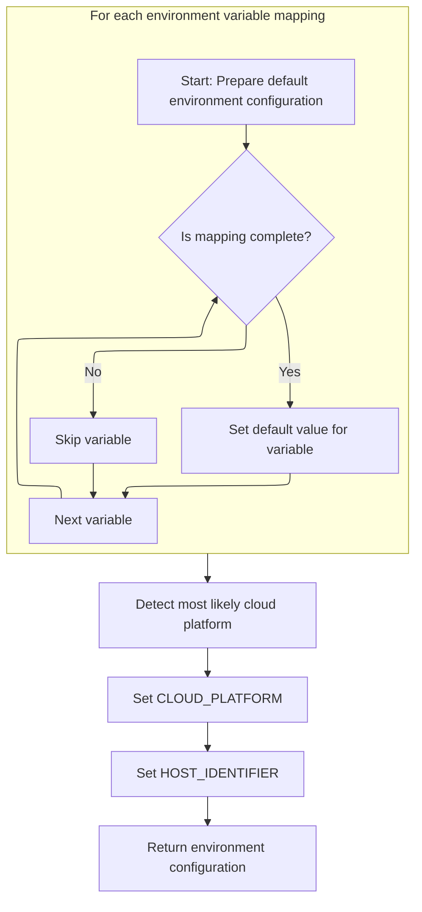

This document describes how the environment configuration is established. The process loads default values, detects the cloud platform, and finalizes the setup. The resulting configuration provides the necessary variables and platform context for subsequent operations.

# Loading and Initializing Environment Defaults

<SwmSnippet path="/src/core/env.js" line="317">

---

In <SwmToken path="src/core/env.js" pos="317:1:1" line-data="  load() {">`load`</SwmToken>, we kick off the flow by setting up <SwmToken path="src/core/env.js" pos="318:3:3" line-data="    this.envMap = this.defaultEnv();">`envMap`</SwmToken> using <SwmToken path="src/core/env.js" pos="318:9:9" line-data="    this.envMap = this.defaultEnv();">`defaultEnv`</SwmToken>. This sets the baseline environment values before any further customization or platform detection happens. We need to call <SwmToken path="src/core/env.js" pos="318:9:9" line-data="    this.envMap = this.defaultEnv();">`defaultEnv`</SwmToken> next to make sure <SwmToken path="src/core/env.js" pos="318:3:3" line-data="    this.envMap = this.defaultEnv();">`envMap`</SwmToken> is populated with the expected defaults, so everything downstream has something to work with.

```javascript
  load() {
    this.envMap = this.defaultEnv();
```

---

</SwmSnippet>

## Setting Up Default Environment Values and Detecting Platform



<SwmSnippet path="/src/core/env.js" line="374">

---

In <SwmToken path="src/core/env.js" pos="374:1:1" line-data="  defaultEnv() {">`defaultEnv`</SwmToken>, we loop through the defaults and add valid environment variables to the env map, making sure each one has a type and value. This sets up the basic environment before we try to figure out which cloud platform we're running on.

```javascript
  defaultEnv() {
    const env = new Map();

    for (const [key, mappedKey] of defaults) {
      if (typeof mappedKey !== "object") continue;

      const type = mappedKey.type;
      const val = mappedKey.default;

      if (!type || val == null) {
        console.debug(key, "incomplete env val:", mappedKey);
        continue;
      }

      env.set(key, caststr(val, type));
    }
```

---

</SwmSnippet>

<SwmSnippet path="/src/core/env.js" line="391">

---

After setting up the basic environment values, we call <SwmToken path="src/core/env.js" pos="391:9:9" line-data="    const cloud = this.mostLikelyCloudPlatform();">`mostLikelyCloudPlatform`</SwmToken> to figure out which platform we're running on. This lets us add platform-specific info to the environment map, which can be used for later decisions.

```javascript
    const cloud = this.mostLikelyCloudPlatform();
```

---

</SwmSnippet>

<SwmSnippet path="/src/core/env.js" line="333">

---

<SwmToken path="src/core/env.js" pos="333:1:1" line-data="  mostLikelyCloudPlatform() {">`mostLikelyCloudPlatform`</SwmToken> figures out which cloud platform we're running on by checking for platform-specific environment variables, user agent strings, and runtime properties. It returns a string for the detected platform, or null if nothing matches.

```javascript
  mostLikelyCloudPlatform() {
    const isDev = this.determineEnvStage() === "development";
    // FLY_ALLOC_ID=5778f6b7-3cc2-d011-36b1-dfe057b0dc79 is set on fly-vms
    const hasFlyAllocId = this.get("FLY_ALLOC_ID") != null;
    // github.com/denoland/deploy_feedback/issues/73
    const hasDenoDeployId = this.get("DENO_DEPLOYMENT_ID") != null;
    const hasWorkersUa =
      typeof navigator !== "undefined" &&
      navigator.userAgent === "Cloudflare-Workers";

    if (hasFlyAllocId) return "fly";
    if (hasDenoDeployId) return "deno-deploy";
    if (hasWorkersUa) return "cloudflare";
    // if dev, then whatever is running is likely local
    if (isDev) return "local";
    // if prod, then node/bun is likely running on fly
    if (this.runtime === "node") return "fly";
    if (this.runtime === "bun") return "fly";
    // if prod, then deno is likely running on deno-deploy
    if (this.runtime === "deno") return "deno-deploy";
    // if prod, then worker is likely running on cloudflare
    if (this.runtime === "worker") return "cloudflare";
    if (this.runtime === "fastly") return "fastly";

    return null;
  }
```

---

</SwmSnippet>

<SwmSnippet path="/src/core/env.js" line="392">

---

Back in <SwmToken path="src/core/env.js" pos="318:9:9" line-data="    this.envMap = this.defaultEnv();">`defaultEnv`</SwmToken>, after getting the platform from <SwmToken path="src/core/env.js" pos="333:1:1" line-data="  mostLikelyCloudPlatform() {">`mostLikelyCloudPlatform`</SwmToken>, we add <SwmToken path="src/core/env.js" pos="392:6:6" line-data="    env.set(&quot;CLOUD_PLATFORM&quot;, cloud);">`CLOUD_PLATFORM`</SwmToken> and <SwmToken path="src/core/env.js" pos="393:6:6" line-data="    env.set(&quot;HOST_IDENTIFIER&quot;, this.mostRelevantHostId(cloud)); // may be empty">`HOST_IDENTIFIER`</SwmToken> to the environment map. This gives us platform and host info for later use.

```javascript
    env.set("CLOUD_PLATFORM", cloud);
    env.set("HOST_IDENTIFIER", this.mostRelevantHostId(cloud)); // may be empty

    return env;
  }
```

---

</SwmSnippet>

## Finalizing Environment Setup

<SwmSnippet path="/src/core/env.js" line="319">

---

Back in <SwmToken path="src/core/env.js" pos="317:1:1" line-data="  load() {">`load`</SwmToken>, after getting the environment map from <SwmToken path="src/core/env.js" pos="318:9:9" line-data="    this.envMap = this.defaultEnv();">`defaultEnv`</SwmToken>, we optionally log the final environment setup for debugging. This helps verify that everything was set up as expected.

```javascript
    // verbose log:
    // console.debug("env defaults", this.envMap);
  }
```

---

</SwmSnippet>

&nbsp;

*This is an auto-generated document by Swimm 🌊 and has not yet been verified by a human*

<SwmMeta version="3.0.0" repo-id="Z2l0aHViJTNBJTNBamF2YXNjcmlwdC1zZXJ2ZXJsZXNzLWRucyUzQSUzQXJpY2FyZG9sb3Blemc=" repo-name="javascript-serverless-dns"><sup>Powered by [Swimm](https://app.swimm.io/)</sup></SwmMeta>
