This document outlines how a TLS Pre-Shared Key (PSK) credential is generated for a client. The process checks if PSK generation is permitted, validates or generates a client identifier, and either retrieves a cached credential or derives a new one using a session secret. The result is a credential that enables secure communication for the client.

# Where is this flow used?

This flow is used multiple times in the codebase as represented in the following diagram:

```mermaid
graph TD;
      34ad801dc32d8a56ad06cea42452ee71a99dcf0ce40ee19192790f9b17aebbf1(src/core/psk.js::up) --> a74cb1149be23ad155a6352098a8f8a6cf7498aef5d0261633ba6d260f5589eb(src/core/psk.js::generateTlsPsk):::mainFlowStyle

3cb641881b3b4cec2f80e3a1a4050b3ab17a4147fbb7dfe48fdd13a214f86196(src/…/command-control/cc.js::generateTlsPsk) --> a74cb1149be23ad155a6352098a8f8a6cf7498aef5d0261633ba6d260f5589eb(src/core/psk.js::generateTlsPsk):::mainFlowStyle

c4284cc89cfe5167db2f44081a566a421f91dc0cbc8077528668dc3ca096dd56(src/…/command-control/cc.js::CommandControl.commandOperation) --> 3cb641881b3b4cec2f80e3a1a4050b3ab17a4147fbb7dfe48fdd13a214f86196(src/…/command-control/cc.js::generateTlsPsk)

1ee3e410eb76b84533705554985e772d052147c2c3087e4d3876f8af16d4572d(src/…/command-control/cc.js::CommandControl.exec) --> c4284cc89cfe5167db2f44081a566a421f91dc0cbc8077528668dc3ca096dd56(src/…/command-control/cc.js::CommandControl.commandOperation)

18bf58e33302f3a3939cb492c66de448146aa846149d5fe871059e940fa5e72b(src/server-node.js::systemUp) --> a74cb1149be23ad155a6352098a8f8a6cf7498aef5d0261633ba6d260f5589eb(src/core/psk.js::generateTlsPsk):::mainFlowStyle

11b5716142a10aedcd4131dde2dd092032febc928f2d9519287f5e434cd68b2a(src/server-node.js::pskCallback) --> a74cb1149be23ad155a6352098a8f8a6cf7498aef5d0261633ba6d260f5589eb(src/core/psk.js::generateTlsPsk):::mainFlowStyle


classDef mainFlowStyle color:#000000,fill:#7CB9F4
classDef rootsStyle color:#000000,fill:#00FFF4
classDef Style1 color:#000000,fill:#00FFAA
classDef Style2 color:#000000,fill:#FFFF00
classDef Style3 color:#000000,fill:#AA7CB9

%% Swimm:
%% graph TD;
%%       34ad801dc32d8a56ad06cea42452ee71a99dcf0ce40ee19192790f9b17aebbf1(<SwmPath>[src/core/psk.js](src/core/psk.js)</SwmPath>::up) --> a74cb1149be23ad155a6352098a8f8a6cf7498aef5d0261633ba6d260f5589eb(<SwmPath>[src/core/psk.js](src/core/psk.js)</SwmPath>::<SwmToken path="src/core/psk.js" pos="89:6:6" line-data="export async function generateTlsPsk(clientid) {">`generateTlsPsk`</SwmToken>):::mainFlowStyle
%% 
%% 3cb641881b3b4cec2f80e3a1a4050b3ab17a4147fbb7dfe48fdd13a214f86196(<SwmPath>[src/…/command-control/cc.js](src/plugins/command-control/cc.js)</SwmPath>::<SwmToken path="src/core/psk.js" pos="89:6:6" line-data="export async function generateTlsPsk(clientid) {">`generateTlsPsk`</SwmToken>) --> a74cb1149be23ad155a6352098a8f8a6cf7498aef5d0261633ba6d260f5589eb(<SwmPath>[src/core/psk.js](src/core/psk.js)</SwmPath>::<SwmToken path="src/core/psk.js" pos="89:6:6" line-data="export async function generateTlsPsk(clientid) {">`generateTlsPsk`</SwmToken>):::mainFlowStyle
%% 
%% c4284cc89cfe5167db2f44081a566a421f91dc0cbc8077528668dc3ca096dd56(<SwmPath>[src/…/command-control/cc.js](src/plugins/command-control/cc.js)</SwmPath>::CommandControl.commandOperation) --> 3cb641881b3b4cec2f80e3a1a4050b3ab17a4147fbb7dfe48fdd13a214f86196(<SwmPath>[src/…/command-control/cc.js](src/plugins/command-control/cc.js)</SwmPath>::<SwmToken path="src/core/psk.js" pos="89:6:6" line-data="export async function generateTlsPsk(clientid) {">`generateTlsPsk`</SwmToken>)
%% 
%% 1ee3e410eb76b84533705554985e772d052147c2c3087e4d3876f8af16d4572d(<SwmPath>[src/…/command-control/cc.js](src/plugins/command-control/cc.js)</SwmPath>::CommandControl.exec) --> c4284cc89cfe5167db2f44081a566a421f91dc0cbc8077528668dc3ca096dd56(<SwmPath>[src/…/command-control/cc.js](src/plugins/command-control/cc.js)</SwmPath>::CommandControl.commandOperation)
%% 
%% 18bf58e33302f3a3939cb492c66de448146aa846149d5fe871059e940fa5e72b(<SwmPath>[src/server-node.js](src/server-node.js)</SwmPath>::systemUp) --> a74cb1149be23ad155a6352098a8f8a6cf7498aef5d0261633ba6d260f5589eb(<SwmPath>[src/core/psk.js](src/core/psk.js)</SwmPath>::<SwmToken path="src/core/psk.js" pos="89:6:6" line-data="export async function generateTlsPsk(clientid) {">`generateTlsPsk`</SwmToken>):::mainFlowStyle
%% 
%% 11b5716142a10aedcd4131dde2dd092032febc928f2d9519287f5e434cd68b2a(<SwmPath>[src/server-node.js](src/server-node.js)</SwmPath>::pskCallback) --> a74cb1149be23ad155a6352098a8f8a6cf7498aef5d0261633ba6d260f5589eb(<SwmPath>[src/core/psk.js](src/core/psk.js)</SwmPath>::<SwmToken path="src/core/psk.js" pos="89:6:6" line-data="export async function generateTlsPsk(clientid) {">`generateTlsPsk`</SwmToken>):::mainFlowStyle
%% 
%% 
%% classDef mainFlowStyle color:#000000,fill:#7CB9F4
%% classDef rootsStyle color:#000000,fill:#00FFF4
%% classDef Style1 color:#000000,fill:#00FFAA
%% classDef Style2 color:#000000,fill:#FFFF00
%% classDef Style3 color:#000000,fill:#AA7CB9
```



# PSK Generation Entry Point


<SwmSnippet path="/src/core/psk.js" line="89">

---

In <SwmToken path="src/core/psk.js" pos="89:6:6" line-data="export async function generateTlsPsk(clientid) {">`generateTlsPsk`</SwmToken>, we kick things off by checking if TLS PSK is even allowed in the current environment. If not, we bail immediately. This avoids unnecessary work and respects environment restrictions. Next, we need to call <SwmToken path="src/core/psk.js" pos="90:5:9" line-data="  if (!envutil.allowTlsPsk()) {">`envutil.allowTlsPsk()`</SwmToken> to make that decision, since it encapsulates the logic for checking the relevant environment flags. This sets up the rest of the flow, which only continues if PSK is permitted.

```javascript
export async function generateTlsPsk(clientid) {
  if (!envutil.allowTlsPsk()) {
    return null;
  }

```

---

</SwmSnippet>

## Environment PSK Permission Check

<SwmSnippet path="/src/commons/envutil.js" line="192">

---

<SwmToken path="src/commons/envutil.js" pos="192:4:4" line-data="export function allowTlsPsk() {">`allowTlsPsk`</SwmToken> checks if we're running in Bun (which isn't supported) and then looks for a non-null <SwmToken path="src/commons/envutil.js" pos="199:12:12" line-data="  const psk = envManager.get(&quot;TLS_PSK&quot;);">`TLS_PSK`</SwmToken> value in the environment. If either check fails, it returns false. This is how we decide if the rest of the PSK logic should even <SwmPath>[run](run)</SwmPath>.

```javascript
export function allowTlsPsk() {
  if (isBun()) return false;
  return tlsPskHex() != null;
}
```

---

</SwmSnippet>

## Extracting and Normalizing PSK Secret


<SwmSnippet path="/src/commons/envutil.js" line="197">

---

<SwmToken path="src/commons/envutil.js" pos="197:4:4" line-data="export function tlsPskHex() {">`tlsPskHex`</SwmToken> grabs the <SwmToken path="src/commons/envutil.js" pos="199:12:12" line-data="  const psk = envManager.get(&quot;TLS_PSK&quot;);">`TLS_PSK`</SwmToken> value from the environment, checks if it's present and non-empty, and then normalizes it to hex using <SwmToken path="src/commons/envutil.js" pos="201:3:3" line-data="  return b64tohexIfNeeded(psk);">`b64tohexIfNeeded`</SwmToken>. This way, the rest of the code always works with a hex string, regardless of how the secret was provided.

```javascript
export function tlsPskHex() {
  if (!envManager) return null;
  const psk = envManager.get("TLS_PSK");
  if (psk == null || psk.length <= 0) return null;
  return b64tohexIfNeeded(psk);
}
```

---

</SwmSnippet>

<SwmSnippet path="/src/commons/envutil.js" line="362">

---

<SwmToken path="src/commons/envutil.js" pos="362:2:2" line-data="function b64tohexIfNeeded(b64) {">`b64tohexIfNeeded`</SwmToken> checks if the input is already hex using a regex. If not, it decodes the input from <SwmToken path="src/commons/bufutil.js" pos="29:13:13" line-data="  return normalize8(Buffer.from(b64std, &quot;base64&quot;));">`base64`</SwmToken> and converts it to a hex string byte by byte. There's no error handling—if the input isn't valid <SwmToken path="src/commons/bufutil.js" pos="29:13:13" line-data="  return normalize8(Buffer.from(b64std, &quot;base64&quot;));">`base64`</SwmToken>, it'll just throw.

```javascript
function b64tohexIfNeeded(b64) {
  const ishex = /^[0-9a-fA-F]+$/.test(b64);
  if (ishex) return b64;
  // atob binary string is Latin-1 encoded, so each charCodeAt is a byte (8 bit).
  const u8 = Uint8Array.from(atob(b64), (c) => c.charCodeAt(0));
  return Array.prototype.map
    .call(u8, (b) => b.toString(16).padStart(2, "0"))
    .join("");
}
```

---

</SwmSnippet>

## Client ID Validation and Caching


<SwmSnippet path="/src/core/psk.js" line="94">

---

Back in <SwmToken path="src/core/psk.js" pos="89:6:6" line-data="export async function generateTlsPsk(clientid) {">`generateTlsPsk`</SwmToken>, after checking the environment, we validate the clientid. If it's empty, we generate a random one. If it's too short, we log and exit. We then convert the clientid to hex for cache lookup. All these checks use <SwmToken path="src/core/psk.js" pos="94:4:4" line-data="  if (bufutil.emptyBuf(clientid)) {">`bufutil`</SwmToken> functions, so we need to call into that module next.

```javascript
  if (bufutil.emptyBuf(clientid)) {
    clientid = csprng(minidlen);
  } else {
    if (bufutil.len(clientid) < minidlen) {
      log.e("psk: client id too short", bufutil.hex(clientid));
      return null;
    }
    // TODO: there's no invalidation even if sessionSecret changes
    const idhex = bufutil.hex(clientid);
    const cachedcred = recentPskCreds.get(idhex);
    if (cachedcred && cachedcred.ok()) {
      return cachedcred;
    }
  }
  // www.rfc-editor.org/rfc/rfc9257.html#section-8
  // www.rfc-editor.org/rfc/rfc9258.html#section-4
  if (bufutil.emptyBuf(sessionSecret)) {
    log.e("psk: no session secret set yet");
    return null;
  }

```

---

</SwmSnippet>

## Client ID Hex Conversion


<SwmSnippet path="/src/commons/bufutil.js" line="49">

---

<SwmToken path="src/commons/bufutil.js" pos="49:4:4" line-data="export function hex(b) {">`hex`</SwmToken> converts the clientid buffer into a hex string, handling both Buffer and <SwmToken path="src/commons/bufutil.js" pos="169:22:22" line-data="  // ... has byteLength property, b must be of type ArrayBuffer;">`ArrayBuffer`</SwmToken> types. This is needed so we can use the hex string as a cache key for credentials.

```javascript
export function hex(b) {
  if (emptyBuf(b)) return ZEROSTR;
  // avoids slicing Buffer (normalize8) to get hex
  if (b instanceof Buffer) return b.toString("hex");
  const ab = normalize8(b);
  return Array.prototype.map
    .call(new Uint8Array(ab), (b) => b.toString(16).padStart(2, "0"))
    .join("");
}
```

---

</SwmSnippet>

## Buffer Normalization


<SwmSnippet path="/src/commons/bufutil.js" line="164">

---

<SwmToken path="src/commons/bufutil.js" pos="164:4:4" line-data="export function normalize8(b) {">`normalize8`</SwmToken> takes whatever buffer-like input we have and makes sure it's a <SwmToken path="src/commons/bufutil.js" pos="166:8:8" line-data="  if (b instanceof Uint8Array) return b;">`Uint8Array`</SwmToken>. This way, all later code can assume a standard format, no matter what was passed in.

```javascript
export function normalize8(b) {
  if (emptyBuf(b)) return ZERO;
  if (b instanceof Uint8Array) return b;

  let underlyingBuffer = null;
  // ... has byteLength property, b must be of type ArrayBuffer;
  if (b instanceof ArrayBuffer) underlyingBuffer = b;
  // when b is node:Buffer, this underlying buffer is not its
  // TypedArray equivalent: nodejs.org/api/buffer.html#bufbuffer
  // but node:Buffer is a subclass of Uint8Array (a TypedArray)
  // first though, slice out the relevant range from node:Buffer
  else if (b instanceof Buffer) underlyingBuffer = arrayBufferOf(b);
  else underlyingBuffer = raw(b);

  return new Uint8Array(underlyingBuffer);
}
```

---

</SwmSnippet>

<SwmSnippet path="/src/commons/bufutil.js" line="156">

---

<SwmToken path="src/commons/bufutil.js" pos="156:4:4" line-data="export function raw(b) {">`raw`</SwmToken> checks if the input is falsy or missing a buffer property, and if so, swaps in ZERO (the repo's default empty buffer). This guarantees we always get a buffer out, even with weird input.

```javascript
export function raw(b) {
  if (!b || b.buffer == null) b = ZERO;

  return b.buffer;
}
```

---

</SwmSnippet>

## PSK Derivation and Credential Caching

<SwmSnippet path="/src/core/psk.js" line="115">

---

Back in <SwmToken path="src/core/psk.js" pos="89:6:6" line-data="export async function generateTlsPsk(clientid) {">`generateTlsPsk`</SwmToken>, after all the validation and hex conversion, we derive the PSK using HKDF, wrap it in a <SwmToken path="src/core/psk.js" pos="118:9:9" line-data="  const c = new PskCred(clientid, clientpsk);">`PskCred`</SwmToken>, and cache it. We call into the user cache to store the new credential, so repeated requests for the same clientid don't redo the work.

```javascript
  // www.rfc-editor.org/rfc/rfc9257.html#section-4.2
  const clientpsk = await hkdfraw(sessionSecret, clientid);

  const c = new PskCred(clientid, clientpsk);
  recentPskCreds.put(c.idhex, c);
  return c;
}
```

---

</SwmSnippet>

# Credential Cache Storage

<SwmSnippet path="/src/plugins/users/user-cache.js" line="23">

---

<SwmToken path="src/plugins/users/user-cache.js" pos="23:1:1" line-data="  put(key, val) {">`put`</SwmToken> tries to store the credential in the cache, and if anything blows up, it logs the error with a stack trace. That's why we need to call the log module next—to record any cache failures.

```javascript
  put(key, val) {
    try {
      this.cache.put(key, val);
    } catch (e) {
      this.log.e("put", key, val, e.stack);
    }
  }
```

---

</SwmSnippet>

# Error Logging with Timestamp

<SwmSnippet path="/src/core/log.js" line="112">

---

<SwmToken path="src/core/log.js" pos="112:1:1" line-data="      e: (...args) =&gt; {">`e`</SwmToken> logs errors by prepending a timestamp plus ' E' and any tags, then forwards everything to the main error logger. This makes error logs easy to spot and parse.

```javascript
      e: (...args) => {
        this.e(this.now() + " E", ...tags, ...args);
      },
```

---

</SwmSnippet>

<SwmSnippet path="/src/core/log.js" line="132">

---

<SwmToken path="src/core/log.js" pos="132:1:1" line-data="  now() {">`now`</SwmToken> returns the current time in ISO format if logging timestamps is enabled, otherwise just an empty string. This lets us toggle timestamps in logs based on config.

```javascript
  now() {
    if (this.logTimestamps) return new Date().toISOString();
    else return "";
  }
```

---

</SwmSnippet>

&nbsp;

*This is an auto-generated document by Swimm 🌊 and has not yet been verified by a human*

<SwmMeta version="3.0.0" repo-id="Z2l0aHViJTNBJTNBamF2YXNjcmlwdC1zZXJ2ZXJsZXNzLWRucyUzQSUzQXJpY2FyZG9sb3Blemc=" repo-name="javascript-serverless-dns"><sup>Powered by [Swimm](https://app.swimm.io/)</sup></SwmMeta>
