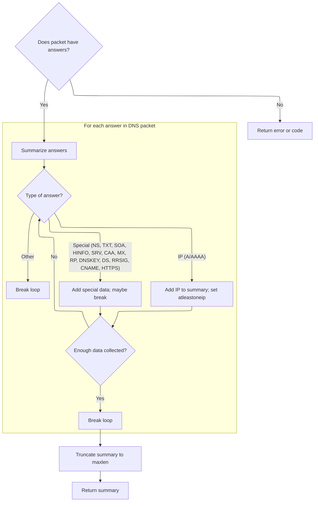
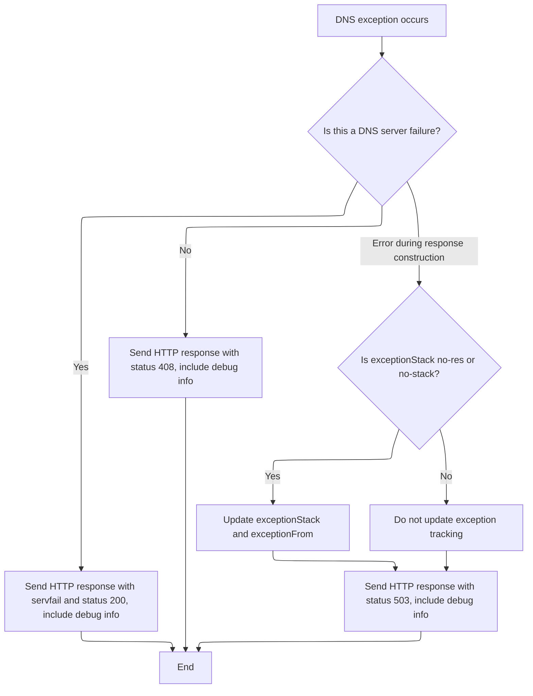

This document outlines how DNS exceptions are managed and how the system prepares a response for the client. When a DNS query fails, the system generates a SERVFAIL response if possible, logs the event for debugging, and sends an HTTP response with debug information and an appropriate status code.

# Handling DNS Exception and Preparing SERVFAIL Response

<SwmSnippet path="/src/core/io-state.js" line="79">

---

In <SwmToken path="src/core/io-state.js" pos="79:1:1" line-data="  dnsExceptionResponse(res) {">`dnsExceptionResponse`</SwmToken>, we set up exception context and try to generate a SERVFAIL DNS response. We use default strings for missing exception info, and if we get a valid SERVFAIL, we decode it for further handling. We log the DNS packet right after to capture the state for debugging.

```javascript
  dnsExceptionResponse(res) {
    this.initDecodedDnsPacketIfNeeded();

    this.stopProcessing = true;
    this.isException = true;

    if (util.emptyObj(res)) {
      this.exceptionStack = "no-res";
      this.exceptionFrom = "no-res";
    } else {
      this.exceptionStack = res.exceptionStack || "no-stack";
      this.exceptionFrom = res.exceptionFrom || "no-origin";
    }

    try {
      const qid = this.decodedDnsPacket.id; // may be null
      const questions = this.decodedDnsPacket.questions; // may be null
      const servfail = dnsutil.servfail(qid, questions); // may be empty
      const hasServfail = !bufutil.emptyBuf(servfail);
      const ex = {
        exceptionFrom: this.exceptionFrom,
        exceptionStack: this.exceptionStack,
      };

      if (hasServfail) {
        // TODO: try-catch as decode may throw?
        this.decodedDnsPacket = dnsutil.decode(servfail);
      }

      this.logDnsPkt();
```

---

</SwmSnippet>

## Logging DNS Packet Details

<SwmSnippet path="/src/core/io-state.js" line="175">

---

<SwmToken path="src/core/io-state.js" pos="175:1:1" line-data="  logDnsPkt() {">`logDnsPkt`</SwmToken> grabs domains, query type, answer data, and TTL from the current DNS packet and logs them (unless we're in prod). We use <SwmPath>[src/commons/dnsutil.js](src/commons/dnsutil.js)</SwmPath> utilities to extract each piece, so the next step is calling those helpers to break down the packet and get the relevant info for the log entry.

```javascript
  logDnsPkt() {
    if (this.isProd) return;
    this.log.d(
      "domains",
      dnsutil.extractDomains(this.decodedDnsPacket),
      dnsutil.getQueryType(this.decodedDnsPacket) || "",
      "data",
      dnsutil.getInterestingAnswerData(this.decodedDnsPacket),
      dnsutil.ttl(this.decodedDnsPacket)
    );
  }
```

---

</SwmSnippet>

## Extracting Key Data from DNS Answers



<SwmSnippet path="/src/commons/dnsutil.js" line="434">

---

In <SwmToken path="src/commons/dnsutil.js" pos="434:4:4" line-data="export function getInterestingAnswerData(packet, maxlen = 80, delim = &quot;|&quot;) {">`getInterestingAnswerData`</SwmToken>, we loop through DNS answers and extract key fields based on type. <SwmToken path="src/commons/dnsutil.js" pos="446:5:5" line-data="    // capturing IPs in A / AAAA records appearing later in ans">`IPs`</SwmToken> from <SwmToken path="src/core/io-state.js" pos="158:13:15" line-data="    // gw responses only assigned on A/AAAA/HTTPS/SVCB records">`A/AAAA`</SwmToken> records get prepended, other types get appended, and special handling is done for <SwmToken path="src/core/io-state.js" pos="158:17:19" line-data="    // gw responses only assigned on A/AAAA/HTTPS/SVCB records">`HTTPS/SVCB`</SwmToken> records to grab IP hints. We use heuristics to stop early if we've got enough data, and rely on repo-specific utilities and type checks to parse each answer.

```javascript
export function getInterestingAnswerData(packet, maxlen = 80, delim = "|") {
  if (!hasAnswers(packet)) {
    return !util.emptyObj(packet) ? packet.rcode || "WTF1" : "WTF2";
  }

  // set to true if at least one ip has been captured from ans
  let atleastoneip = false;
  let str = "";
  for (const a of packet.answers) {
    // gather twice the maxlen to capture as much as possible:
    // ips are usually prepend to the front, and going 2 times
    // over maxlen (chosen arbitrarily) maximises chances of
    // capturing IPs in A / AAAA records appearing later in ans
    if (atleastoneip && str.length > maxlen) break;
    if (!atleastoneip && str.length > maxlen * 2) break;

    if (isAnswerA(a) || isAnswerAAAA(a)) {
      const dat = a.data || "";
      // prepend A / AAAA data
      if (!util.emptyString(dat)) str = dat + delim + str;
      atleastoneip = true;
    } else if (isAnswerOPTION(a) || isAnswerNS(a) || isAnswerTXT(a)) {
      // ns: github.com/mafintosh/dns-packet/blob/31d3caf3/index.js#L249
      // txt: github.com/mafintosh/dns-packet/blob/31d3caf3/index.js#L370
      // opt: github.com/mafintosh/dns-packet/blob/31d3caf3/index.js#L773
      const dat = a.data || "";
      if (!util.emptyString(dat)) str += dat + delim;
    } else if (isAnswerSOA(a)) {
      // github.com/mafintosh/dns-packet/blob/31d3caf3/index.js#L284
      str += a.data.mname + delim;
    } else if (isAnswerHINFO(a)) {
      // github.com/mafintosh/dns-packet/blob/31d3caf3/index.js#L450
      str += a.data.os + delim;
      break;
    } else if (isAnswerSRV(a)) {
      // github.com/mafintosh/dns-packet/blob/31d3caf3/index.js#L521
      str += a.data.target + delim;
    } else if (isAnswerCAA(a)) {
      // github.com/mafintosh/dns-packet/blob/31d3caf3/index.js#L574
      str += a.data.value + delim;
    } else if (isAnswerMX(a)) {
      // github.com/mafintosh/dns-packet/blob/31d3caf3/index.js#L618
      str += a.data.exchange + delim;
    } else if (isAnswerRP(a)) {
      // github.com/mafintosh/dns-packet/blob/31d3caf3/index.js#L1027
      str += a.data.mbox + delim;
      break;
    } else if (isAnswerHttps(a)) {
      // https/svcb answers may have a A / AAAA records
      // github.com/serverless-dns/dns-parser/blob/b7d73b3d/index.js#L1381
      const t = a.data.targetName;
      const kv = a.data.svcParams;
      if (t === ".") {
        if (util.emptyObj(kv)) continue;
        // if svcb/https is self-referential, then prepend ip hints, if any
        if (
          !util.emptyArray(kv.ipv4hint) &&
          !util.emptyString(kv.ipv4hint[0])
        ) {
          str = kv.ipv4hint[0] + delim + str;
          atleastoneip = true;
        }
        if (
          !util.emptyArray(kv.ipv6hint) &&
          !util.emptyString(kv.ipv6hint[0])
        ) {
          str = kv.ipv6hint[0] + delim + str;
          atleastoneip = true;
        }
      } else {
        str += t + delim;
      }
    } else if (isAnswerDNSKEY(a)) {
      // github.com/mafintosh/dns-packet/blob/31d3caf3/index.js#L914
      str += bufutil.bytesToBase64Url(a.data.key) + delim;
      break;
    } else if (isAnswerDS(a)) {
      // ds: github.com/mafintosh/dns-packet/blob/31d3caf3/index.js#L1279
      str += bufutil.bytesToBase64Url(a.data.digest) + delim;
      break;
    } else if (isAnswerRRSIG(a)) {
      // rrsig: github.com/mafintosh/dns-packet/blob/31d3caf3/index.js#L984
      str += bufutil.bytesToBase64Url(a.data.signature) + delim;
      break;
    } else if (isAnswerCname(a)) {
      str += a.data + delim;
    } else {
      // unhanlded types:
      // null, ptr, ds, nsec, nsec3, nsec3param, tlsa, sshfp, spf, dname
      break;
    }
  }
```

---

</SwmSnippet>

<SwmSnippet path="/src/commons/dnsutil.js" line="527">

---

We return a truncated string of answer data, cut cleanly at the last delimiter, or a fallback if no answers are present.

```javascript
  const trunc = util.strstr(str, 0, maxlen);
  const idx = trunc.lastIndexOf(delim);
  return idx >= 0 ? util.strstr(trunc, 0, idx) : trunc;
}
```

---

</SwmSnippet>

## Finalizing HTTP Response for DNS Exception



<SwmSnippet path="/src/core/io-state.js" line="109">

---

Back in <SwmToken path="src/core/io-state.js" pos="118:8:8" line-data="      this.log.e(&quot;dnsExceptionResponse&quot;, pktjson, e.stack);">`dnsExceptionResponse`</SwmToken> after logging the DNS packet, we build the HTTP response. If we got a valid SERVFAIL, we set status 200; if not, it's 408 for timeout. If anything blows up, we catch it and set status 503, updating exception details and logging the error for debugging. The headers include exception info for traceability.

```javascript
      this.httpResponse = new Response(servfail, {
        headers: util.concatHeaders(
          this.headers(servfail),
          this.debugHeaders(JSON.stringify(ex))
        ),
        status: hasServfail ? 200 : 408, // rfc8484 section-4.2.1
      });
    } catch (e) {
      const pktjson = JSON.stringify(this.decodedDnsPacket || {});
      this.log.e("dnsExceptionResponse", pktjson, e.stack);
      if (
        this.exceptionStack === "no-res" ||
        this.exceptionStack === "no-stack"
      ) {
        this.exceptionStack = e.stack;
        this.exceptionFrom = "IOState:errorResponse";
      }
      this.httpResponse = new Response(null, {
        headers: util.concatHeaders(
          this.headers(),
          this.debugHeaders(JSON.stringify(this.exceptionStack))
        ),
        status: 503,
      });
    }
  }
```

---

</SwmSnippet>

&nbsp;

*This is an auto-generated document by Swimm 🌊 and has not yet been verified by a human*

<SwmMeta version="3.0.0" repo-id="Z2l0aHViJTNBJTNBamF2YXNjcmlwdC1zZXJ2ZXJsZXNzLWRucyUzQSUzQXJpY2FyZG9sb3Blemc=" repo-name="javascript-serverless-dns"><sup>Powered by [Swimm](https://app.swimm.io/)</sup></SwmMeta>
