This document outlines the process for handling DNS-over-HTTPS requests, enabling secure DNS resolution for clients. The flow receives an HTTPS DNS request, validates and processes it, supports user-specific features, and returns a DNS response to the client.

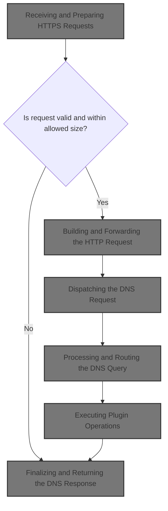

# Receiving and Preparing HTTPS Requests

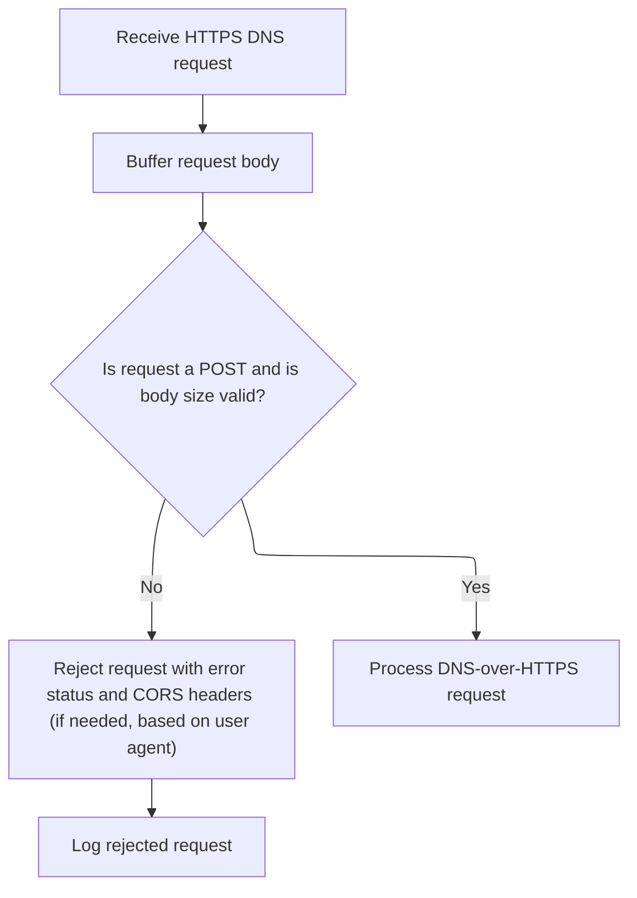

<SwmSnippet path="/src/server-node.js" line="1243">

---

ServeHTTPS sets up the initial request handling, buffers the incoming data, and after basic validation, passes control to <SwmToken path="src/server-node.js" pos="1265:1:1" line-data="      handleHTTPRequest(b, req, res);">`handleHTTPRequest`</SwmToken> to actually process the DNS query.

```javascript
function serveHTTPS(req, res) {
  trapRequestResponseEvents(req, res);
  const ua = req.headers["user-agent"];
  const buffers = [];

  // if using for await loop, then it must be wrapped in a
  // try-catch block: stackoverflow.com/questions/69169226
  // if not, errors from reading req escapes unhandled.
  // for example: req is being read from, but the underlying
  // socket has been the closed (resulting in err_premature_close)
  req.on("data", (chunk) => buffers.push(chunk));

  req.on("end", () => {
    const b = bufutil.concatBuf(buffers);
    const bLen = b.byteLength;

    if (util.isPostRequest(req) && !dnsutil.validResponseSize(b)) {
      res.writeHead(dnsutil.dohStatusCode(b), util.corsHeadersIfNeeded(ua));
      res.end();
      log.w(`h2: req body length out of bounds: ${bLen}`);
    } else {
      log.d("----> doh request", req.method, bLen, req.url);
      handleHTTPRequest(b, req, res);
    }
  });
}
```

---

</SwmSnippet>

# Building and Forwarding the HTTP Request

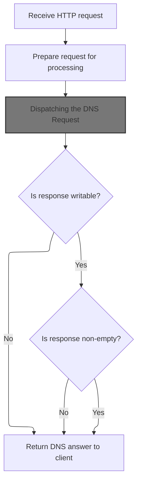

<SwmSnippet path="/src/server-node.js" line="1275">

---

In <SwmToken path="src/server-node.js" pos="1275:4:4" line-data="async function handleHTTPRequest(b, req, res) {">`handleHTTPRequest`</SwmToken>, we generate a unique request ID, wrap the incoming HTTP request into a standardized Request object, and add custom headers. Then, we call <SwmToken path="src/server-node.js" pos="1297:9:9" line-data="    const fRes = await handleRequest(util.mkFetchEvent(fReq));">`handleRequest`</SwmToken> from <SwmPath>[src/core/doh.js](src/core/doh.js)</SwmPath> to actually process the DNS-over-HTTPS logic using the prepared fetch event.

```javascript
async function handleHTTPRequest(b, req, res) {
  heartbeat();

  const rxid = util.xid();
  try {
    let host = req.headers.host || req.headers[":authority"];
    if (isIPv6(host)) host = `[${host}]`;

    // nb: req.url is a url-path, for ex: /a/b/c
    const fReq = new Request(new URL(req.url, `https://${host}`), {
      // Note: In a VM container, Object spread may not be working for all
      // properties, especially of "hidden" Symbol values!? like "headers"?
      ...req,
      // TODO: populate req ip in x-nile-client-ip header
      headers: util.concatHeaders(
        util.rxidHeader(rxid),
        nodeutil.copyNonPseudoHeaders(req.headers)
      ),
      method: req.method,
      body: req.method === "POST" ? b : null,
    });

    const fRes = await handleRequest(util.mkFetchEvent(fReq));

    if (!resOkay(res)) {
      throw new Error("res not writable 1");
    }

```

---

</SwmSnippet>

## Dispatching the DNS Request

<SwmSnippet path="/src/core/doh.js" line="25">

---

HandleRequest just forwards the fetch event to <SwmToken path="src/core/doh.js" pos="26:3:3" line-data="  return proxyRequest(event);">`proxyRequest`</SwmToken>, which does all the heavy lifting for DNS-over-HTTPS request handling.

```javascript
export function handleRequest(event) {
  return proxyRequest(event);
}
```

---

</SwmSnippet>

## Processing and Routing the DNS Query

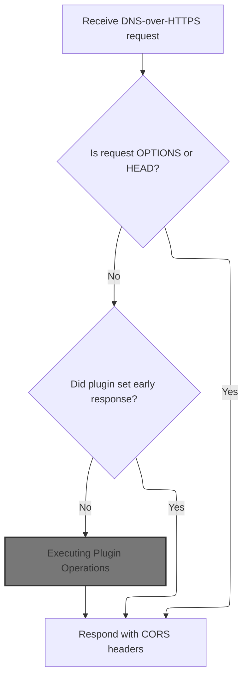

<SwmSnippet path="/src/core/doh.js" line="33">

---

In <SwmToken path="src/core/doh.js" pos="33:4:4" line-data="async function proxyRequest(event) {">`proxyRequest`</SwmToken>, we skip OPTIONS and HEAD requests, set up <SwmToken path="src/core/doh.js" pos="37:9:9" line-data="  const io = new IOState();">`IOState`</SwmToken> for tracking, and initialize the <SwmToken path="src/core/doh.js" pos="41:9:9" line-data="    const plugin = new RethinkPlugin(event);">`RethinkPlugin`</SwmToken>. If the plugin sets an early response, we return it; otherwise, we execute the plugin logic to process the DNS query.

```javascript
async function proxyRequest(event) {
  if (optionsRequest(event.request)) return util.respond204();
  if (headRequest(event.request)) return util.respond204();

  const io = new IOState();
  const ua = event.request.headers.get("User-Agent");

  try {
    const plugin = new RethinkPlugin(event);
    await plugin.initIoState(io);

    // if an early response has been set by plugin.initIoState, return it
    if (io.httpResponse) {
      return withCors(io, ua);
    }

    await util.timedSafeAsyncOp(
      /* op*/ () => plugin.execute(),
```

---

</SwmSnippet>

### Executing Plugin Operations

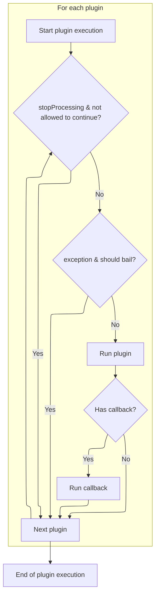

<SwmSnippet path="/src/core/plugin.js" line="143">

---

Execute iterates plugins, runs their exec logic with context, and skips or continues based on processing state.

```javascript
  async execute() {
    const io = this.io;
    // const rxid = this.ctx.get("rxid");
    for (const p of this.plugin) {
      if (io.stopProcessing && !p.continueOnStopProcess) {
        continue;
      }
      if (io.isException && p.bailOnException) {
        continue;
      }

      const res = await p.module.exec(makectx(this.ctx, p.pctx));

      if (typeof p.callback === "function") {
        await p.callback.call(this, res, io);
      }
    }
  }
```

---

</SwmSnippet>

### Authenticating and Loading User Data

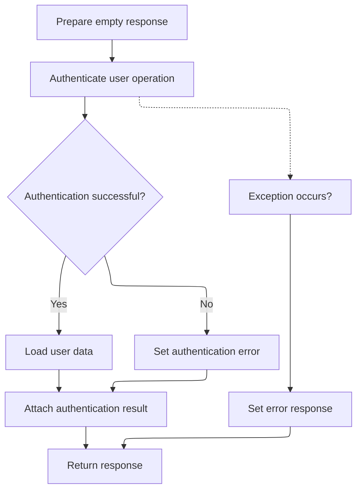

<SwmSnippet path="/src/plugins/users/user-op.js" line="34">

---

In exec, we start with an empty response and call <SwmToken path="src/plugins/users/user-op.js" pos="38:9:11" line-data="      const out = await token.auth(ctx.rxid, ctx.request.url);">`token.auth`</SwmToken> to check if the request is authorized. The result determines if we load user data or return an error. Next up is the actual auth logic in <SwmPath>[src/…/users/auth-token.js](src/plugins/users/auth-token.js)</SwmPath>.

```javascript
  async exec(ctx) {
    let res = pres.emptyResponse();

    try {
      const out = await token.auth(ctx.rxid, ctx.request.url);
```

---

</SwmSnippet>

<SwmSnippet path="/src/plugins/users/auth-token.js" line="63">

---

Auth checks access keys from the environment, extracts a message key from the URL, and compares generated keys for each domain against the access keys. If any match, it passes; otherwise, it logs partials and fails.

```javascript
export async function auth(rxid, url) {
  const accesskeys = envutil.accessKeys();

  // empty access key, allow all
  if (util.emptySet(accesskeys)) {
    return Outcome.none();
  }
  const msg = rdnsutil.msgkeyFromUrl(url);
  // if missing msg-key in url, deny
  if (util.emptyString(msg)) {
    log.w(rxid, "auth: stop! missing access-key in", url);
    return Outcome.miss();
  }

  let ok = false;
  let a6 = "";
  // eval [s2.domain.tld, domain.tld] from a hostname
  // like s0.s1.s2.domain.tld
  for (const dom of util.domains(url)) {
    if (util.emptyString(dom)) continue;

    const [hex, hexcat] = await gen(msg, dom);

    log.d(rxid, msg, dom, "<= msg/h :auth: hex/k =>", hexcat, accesskeys);

    // allow if access-key (upto its full len) matches calculated hex
    for (const ak of accesskeys) {
      ok = hexcat.startsWith(ak);
      if (ok) {
        return Outcome.pass();
      } else {
        const [d, h] = ak.split(akdelim);
        a6 += d + akdelim + h.slice(0, 6) + " ";
      }
    }

    const h6 = dom + akdelim + hex.slice(0, 6);
    log.w(rxid, "auth: key mismatch want:", a6, "have:", h6);
  }
```

---

</SwmSnippet>

<SwmSnippet path="/src/plugins/users/user-op.js" line="39">

---

We just got back from <SwmPath>[src/…/users/auth-token.js](src/plugins/users/auth-token.js)</SwmPath>. If auth failed, exec returns an error response; if it passed, it loads user data and attaches auth info to the response. This wraps up the <SwmPath>[src/…/users/user-op.js](src/plugins/users/user-op.js)</SwmPath> logic.

```javascript
      if (!out.ok) {
        res = pres.errResponse("UserOp:Auth", new Error("auth failed"));
      } else {
        res = this.loadUser(ctx);
      }
      res.data.userAuth = out;
    } catch (ex) {
      res = pres.errResponse("UserOp", ex);
    }

    return res;
  }
```

---

</SwmSnippet>

### Extracting User and DNS Context

```mermaid
%%{init: {"flowchart": {"defaultRenderer": "elk"}} }%%
flowchart TD
  node1["Receive DNS request"] --> node2{"Is DNS message?"}
  click node1 openCode "src/plugins/users/user-op.js:56:57"
  click node2 openCode "src/plugins/users/user-op.js:59:62"
  node2 -->|"No"| node3["Return empty response"]
  click node3 openCode "src/plugins/users/user-op.js:57:62"
  node2 -->|"Yes"| node4["Process domains for delegation"]
  click node4 openCode "src/plugins/users/user-op.js:65:72"
  subgraph loop1["For each domain in DNS packet"]
    node4 --> node5{"Is domain delegated?"}
    click node5 openCode "src/plugins/users/user-op.js:68:71"
    node5 -->|"Yes"| node6["Set resolver preference in response"]
    click node6 openCode "src/plugins/users/user-op.js:70:71"
    node5 -->|"No"| node4
  end
  node4 --> node7["Check blocklist flag in request URL"]
  click node7 openCode "src/plugins/users/user-op.js:74:76"
  node7 --> node8{"Is blocklist flag present?"}
  click node8 openCode "src/plugins/users/user-op.js:75:76"
  node8 -->|"No"| node9["Return response"]
  click node9 openCode "src/plugins/users/user-op.js:109:110"
  node8 -->|"Yes"| node10{"Is blocklist data available?"}
  click node10 openCode "src/plugins/users/user-op.js:80:81"
  node10 -->|"No"| node11["Retrieve blocklist data from flag"]
  click node11 openCode "src/plugins/users/user-op.js:84:85"
  node11 --> node12{"Is blocklist data now available?"}
  click node12 openCode "src/plugins/users/user-op.js:87:93"
  node12 -->|"Yes"| node13["Enrich response with blocklist info and flag"]
  click node13 openCode "src/plugins/users/user-op.js:99:102"
  node12 -->|"No"| node9
  node10 -->|"Yes"| node13
  node13 --> node9
classDef HeadingStyle fill:#777777,stroke:#333,stroke-width:2px;

%% Swimm:
%% %%{init: {"flowchart": {"defaultRenderer": "elk"}} }%%
%% flowchart TD
%%   node1["Receive DNS request"] --> node2{"Is DNS message?"}
%%   click node1 openCode "<SwmPath>[src/…/users/user-op.js](src/plugins/users/user-op.js)</SwmPath>:56:57"
%%   click node2 openCode "<SwmPath>[src/…/users/user-op.js](src/plugins/users/user-op.js)</SwmPath>:59:62"
%%   node2 -->|"No"| node3["Return empty response"]
%%   click node3 openCode "<SwmPath>[src/…/users/user-op.js](src/plugins/users/user-op.js)</SwmPath>:57:62"
%%   node2 -->|"Yes"| node4["Process domains for delegation"]
%%   click node4 openCode "<SwmPath>[src/…/users/user-op.js](src/plugins/users/user-op.js)</SwmPath>:65:72"
%%   subgraph loop1["For each domain in DNS packet"]
%%     node4 --> node5{"Is domain delegated?"}
%%     click node5 openCode "<SwmPath>[src/…/users/user-op.js](src/plugins/users/user-op.js)</SwmPath>:68:71"
%%     node5 -->|"Yes"| node6["Set resolver preference in response"]
%%     click node6 openCode "<SwmPath>[src/…/users/user-op.js](src/plugins/users/user-op.js)</SwmPath>:70:71"
%%     node5 -->|"No"| node4
%%   end
%%   node4 --> node7["Check blocklist flag in request URL"]
%%   click node7 openCode "<SwmPath>[src/…/users/user-op.js](src/plugins/users/user-op.js)</SwmPath>:74:76"
%%   node7 --> node8{"Is blocklist flag present?"}
%%   click node8 openCode "<SwmPath>[src/…/users/user-op.js](src/plugins/users/user-op.js)</SwmPath>:75:76"
%%   node8 -->|"No"| node9["Return response"]
%%   click node9 openCode "<SwmPath>[src/…/users/user-op.js](src/plugins/users/user-op.js)</SwmPath>:109:110"
%%   node8 -->|"Yes"| node10{"Is blocklist data available?"}
%%   click node10 openCode "<SwmPath>[src/…/users/user-op.js](src/plugins/users/user-op.js)</SwmPath>:80:81"
%%   node10 -->|"No"| node11["Retrieve blocklist data from flag"]
%%   click node11 openCode "<SwmPath>[src/…/users/user-op.js](src/plugins/users/user-op.js)</SwmPath>:84:85"
%%   node11 --> node12{"Is blocklist data now available?"}
%%   click node12 openCode "<SwmPath>[src/…/users/user-op.js](src/plugins/users/user-op.js)</SwmPath>:87:93"
%%   node12 -->|"Yes"| node13["Enrich response with blocklist info and flag"]
%%   click node13 openCode "<SwmPath>[src/…/users/user-op.js](src/plugins/users/user-op.js)</SwmPath>:99:102"
%%   node12 -->|"No"| node9
%%   node10 -->|"Yes"| node13
%%   node13 --> node9
%% classDef HeadingStyle fill:#777777,stroke:#333,stroke-width:2px;
```

<SwmSnippet path="/src/plugins/users/user-op.js" line="56">

---

In <SwmToken path="src/plugins/users/user-op.js" pos="56:1:1" line-data="  loadUser(ctx) {">`loadUser`</SwmToken>, we bail early if the context isn't a DNS message. For DNS queries, we extract domains and check for delegation, setting the resolver URL if needed. Next, we handle blocklist flags and user config.

```javascript
  loadUser(ctx) {
    const response = pres.emptyResponse();

    if (!ctx.isDnsMsg) {
      this.log.w(ctx.rxid, "not a dns-msg, ignore");
      return response;
    }

    try {
      const dnsPacket = ctx.requestDecodedDnsPacket;
      const domains = dnsutil.extractDomains(dnsPacket);
      for (const d of domains) {
        if (delegated.has(d)) {
          // may be overriden by user-preferred doh upstream
          response.data.dnsResolverUrl = envutil.primaryDohResolver();
        }
      }
```

---

</SwmSnippet>

<SwmSnippet path="/src/plugins/users/user-op.js" line="74">

---

After handling delegation, <SwmToken path="src/plugins/users/user-op.js" pos="104:13:13" line-data="      this.log.e(ctx.rxid, &quot;loadUser&quot;, e);">`loadUser`</SwmToken> extracts the blocklist flag from the URL, checks the cache, and decodes it if needed. If valid, it attaches user blocklist info and the flag to the response data.

```javascript
      const blocklistFlag = rdnsutil.blockstampFromUrl(ctx.request.url);
      const hasflag = !util.emptyString(blocklistFlag);
      if (!hasflag) {
        this.log.d(ctx.rxid, "empty blocklist-flag", ctx.request.url);
      }
      // blocklistFlag may be invalid, ref rdnsutil.blockstampFromUrl
      let r = this.userConfigCache.get(blocklistFlag);
      let hasdata = rdnsutil.hasBlockstamp(r);
      if (hasflag && !hasdata) {
        // r not in cache
        r = rdnsutil.unstamp(blocklistFlag); // r is never null, may throw ex
        hasdata = rdnsutil.hasBlockstamp(r);

        if (hasdata) {
          this.log.d(ctx.rxid, "new cfg cache kv", blocklistFlag, r);
          // TODO: blocklistFlag is not normalized, ie b32 used for dot isn't
          // converted to its b64 form (which doh and rethinkdns modules use)
          // example, b32: 1-AABABAA / equivalent b64: 1:AAIAgA==
          this.userConfigCache.put(blocklistFlag, r);
        }
      } else {
        this.log.d(ctx.rxid, "cfg cache hit?", hasdata, blocklistFlag, r);
      }

      if (hasdata) {
        response.data.userBlocklistInfo = r;
        response.data.userBlocklistFlag = blocklistFlag;
        // TODO: override response.data.dnsResolverUrl
      }
    } catch (e) {
      this.log.e(ctx.rxid, "loadUser", e);
      // avoid erroring out on invalid blocklist info & flag
      // response = pres.errResponse("UserOp:loadUser", e);
    }

    return response;
  }
```

---

</SwmSnippet>

### Finalizing and Returning the DNS Response

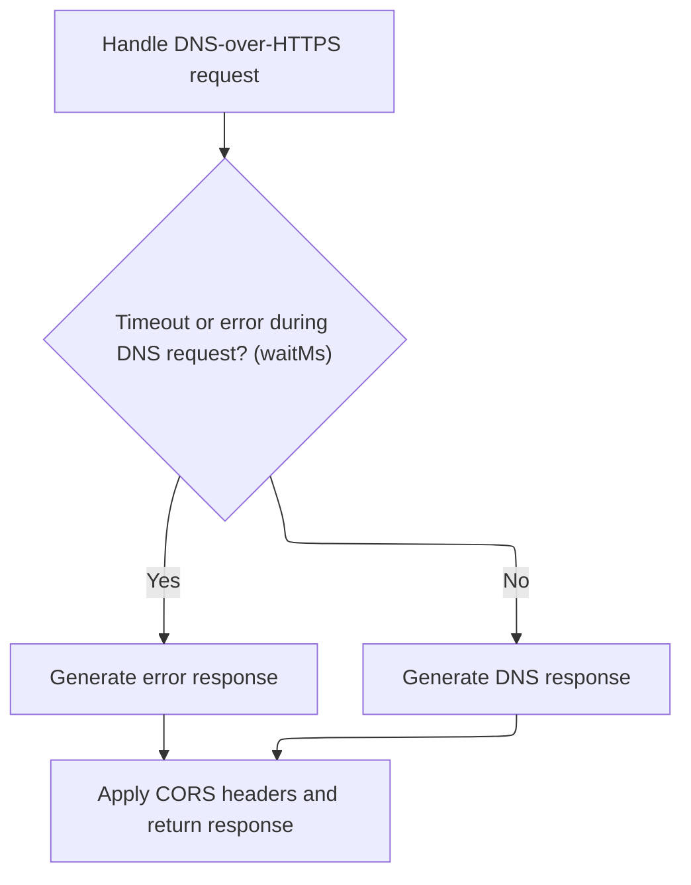

<SwmSnippet path="/src/core/doh.js" line="51">

---

We just got back from <SwmPath>[src/core/plugin.js](src/core/plugin.js)</SwmPath>. <SwmToken path="src/core/doh.js" pos="26:3:3" line-data="  return proxyRequest(event);">`proxyRequest`</SwmToken> wraps up by returning the response with CORS headers, or calls <SwmToken path="src/core/doh.js" pos="52:15:15" line-data="      /* onTimeout*/ () =&gt; Promise.resolve(errorResponse(io))">`errorResponse`</SwmToken> if something failed. This is the last step before sending the response back.

```javascript
      /* waitMs*/ dnsutil.requestTimeout(),
      /* onTimeout*/ () => Promise.resolve(errorResponse(io))
    );
  } catch (err) {
    log.e("doh", "proxy-request error", err.stack);
    errorResponse(io, err);
  }

  return withCors(io, ua);
}
```

---

</SwmSnippet>

## Handling DNS Exceptions

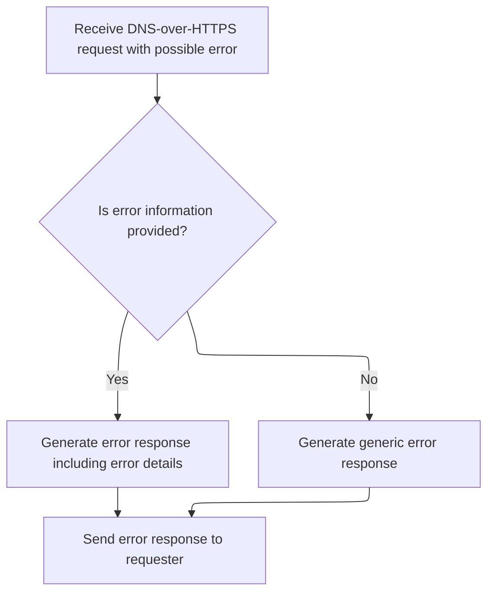

<SwmSnippet path="/src/core/doh.js" line="75">

---

ErrorResponse creates an error response object and calls <SwmToken path="src/core/doh.js" pos="77:3:3" line-data="  io.dnsExceptionResponse(eres);">`dnsExceptionResponse`</SwmToken> on <SwmToken path="src/core/doh.js" pos="37:9:9" line-data="  const io = new IOState();">`IOState`</SwmToken> to build and log the DNS exception details.

```javascript
function errorResponse(io, err = null) {
  const eres = pres.errResponse("doh.js", err);
  io.dnsExceptionResponse(eres);
}
```

---

</SwmSnippet>

## Building the DNS Exception Response

<SwmSnippet path="/src/core/io-state.js" line="79">

---

In <SwmToken path="src/core/io-state.js" pos="79:1:1" line-data="  dnsExceptionResponse(res) {">`dnsExceptionResponse`</SwmToken>, we set flags for error state, extract exception info, generate a SERVFAIL DNS packet, decode it, log the packet, and build the HTTP response with the right status code.

```javascript
  dnsExceptionResponse(res) {
    this.initDecodedDnsPacketIfNeeded();

    this.stopProcessing = true;
    this.isException = true;

    if (util.emptyObj(res)) {
      this.exceptionStack = "no-res";
      this.exceptionFrom = "no-res";
    } else {
      this.exceptionStack = res.exceptionStack || "no-stack";
      this.exceptionFrom = res.exceptionFrom || "no-origin";
    }

    try {
      const qid = this.decodedDnsPacket.id; // may be null
      const questions = this.decodedDnsPacket.questions; // may be null
      const servfail = dnsutil.servfail(qid, questions); // may be empty
      const hasServfail = !bufutil.emptyBuf(servfail);
      const ex = {
        exceptionFrom: this.exceptionFrom,
        exceptionStack: this.exceptionStack,
      };

      if (hasServfail) {
        // TODO: try-catch as decode may throw?
        this.decodedDnsPacket = dnsutil.decode(servfail);
      }

      this.logDnsPkt();
```

---

</SwmSnippet>

### Logging DNS Packet Details

<SwmSnippet path="/src/core/io-state.js" line="175">

---

LogDnsPkt dumps domains, query type, answer data, and TTL from the decoded DNS packet for debugging. Next, we call <SwmPath>[src/commons/dnsutil.js](src/commons/dnsutil.js)</SwmPath> to extract answer data.

```javascript
  logDnsPkt() {
    if (this.isProd) return;
    this.log.d(
      "domains",
      dnsutil.extractDomains(this.decodedDnsPacket),
      dnsutil.getQueryType(this.decodedDnsPacket) || "",
      "data",
      dnsutil.getInterestingAnswerData(this.decodedDnsPacket),
      dnsutil.ttl(this.decodedDnsPacket)
    );
  }
```

---

</SwmSnippet>

### Extracting Key DNS Answer Data

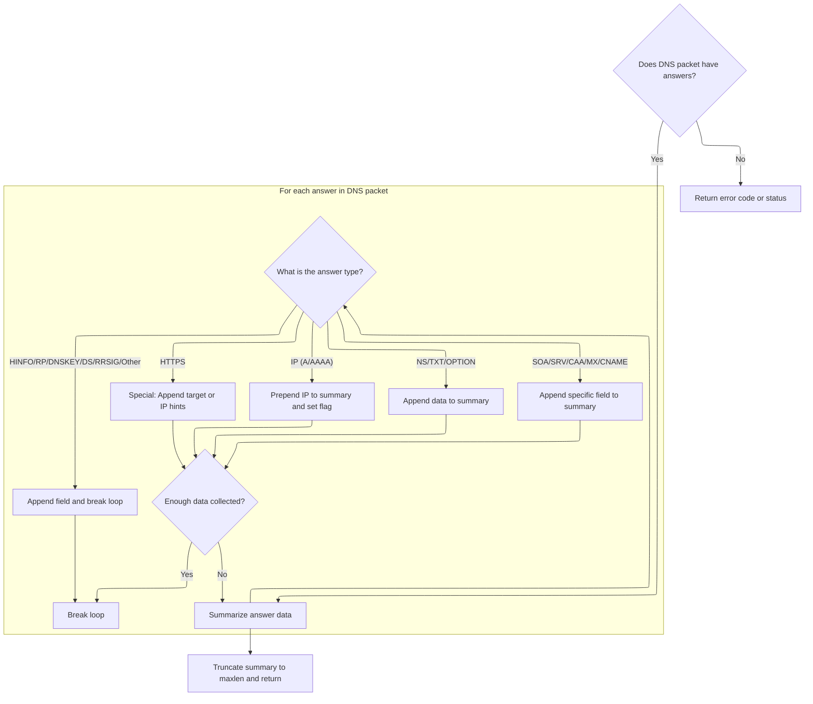

<SwmSnippet path="/src/commons/dnsutil.js" line="434">

---

GetInterestingAnswerData scans DNS answers, grabs <SwmToken path="src/commons/dnsutil.js" pos="446:5:5" line-data="    // capturing IPs in A / AAAA records appearing later in ans">`IPs`</SwmToken> first, and breaks early if enough data is found. It handles each answer type specifically, then truncates and cleans up the result for logging or display.

```javascript
export function getInterestingAnswerData(packet, maxlen = 80, delim = "|") {
  if (!hasAnswers(packet)) {
    return !util.emptyObj(packet) ? packet.rcode || "WTF1" : "WTF2";
  }

  // set to true if at least one ip has been captured from ans
  let atleastoneip = false;
  let str = "";
  for (const a of packet.answers) {
    // gather twice the maxlen to capture as much as possible:
    // ips are usually prepend to the front, and going 2 times
    // over maxlen (chosen arbitrarily) maximises chances of
    // capturing IPs in A / AAAA records appearing later in ans
    if (atleastoneip && str.length > maxlen) break;
    if (!atleastoneip && str.length > maxlen * 2) break;

    if (isAnswerA(a) || isAnswerAAAA(a)) {
      const dat = a.data || "";
      // prepend A / AAAA data
      if (!util.emptyString(dat)) str = dat + delim + str;
      atleastoneip = true;
    } else if (isAnswerOPTION(a) || isAnswerNS(a) || isAnswerTXT(a)) {
      // ns: github.com/mafintosh/dns-packet/blob/31d3caf3/index.js#L249
      // txt: github.com/mafintosh/dns-packet/blob/31d3caf3/index.js#L370
      // opt: github.com/mafintosh/dns-packet/blob/31d3caf3/index.js#L773
      const dat = a.data || "";
      if (!util.emptyString(dat)) str += dat + delim;
    } else if (isAnswerSOA(a)) {
      // github.com/mafintosh/dns-packet/blob/31d3caf3/index.js#L284
      str += a.data.mname + delim;
    } else if (isAnswerHINFO(a)) {
      // github.com/mafintosh/dns-packet/blob/31d3caf3/index.js#L450
      str += a.data.os + delim;
      break;
    } else if (isAnswerSRV(a)) {
      // github.com/mafintosh/dns-packet/blob/31d3caf3/index.js#L521
      str += a.data.target + delim;
    } else if (isAnswerCAA(a)) {
      // github.com/mafintosh/dns-packet/blob/31d3caf3/index.js#L574
      str += a.data.value + delim;
    } else if (isAnswerMX(a)) {
      // github.com/mafintosh/dns-packet/blob/31d3caf3/index.js#L618
      str += a.data.exchange + delim;
    } else if (isAnswerRP(a)) {
      // github.com/mafintosh/dns-packet/blob/31d3caf3/index.js#L1027
      str += a.data.mbox + delim;
      break;
    } else if (isAnswerHttps(a)) {
      // https/svcb answers may have a A / AAAA records
      // github.com/serverless-dns/dns-parser/blob/b7d73b3d/index.js#L1381
      const t = a.data.targetName;
      const kv = a.data.svcParams;
      if (t === ".") {
        if (util.emptyObj(kv)) continue;
        // if svcb/https is self-referential, then prepend ip hints, if any
        if (
          !util.emptyArray(kv.ipv4hint) &&
          !util.emptyString(kv.ipv4hint[0])
        ) {
          str = kv.ipv4hint[0] + delim + str;
          atleastoneip = true;
        }
        if (
          !util.emptyArray(kv.ipv6hint) &&
          !util.emptyString(kv.ipv6hint[0])
        ) {
          str = kv.ipv6hint[0] + delim + str;
          atleastoneip = true;
        }
      } else {
        str += t + delim;
      }
    } else if (isAnswerDNSKEY(a)) {
      // github.com/mafintosh/dns-packet/blob/31d3caf3/index.js#L914
      str += bufutil.bytesToBase64Url(a.data.key) + delim;
      break;
    } else if (isAnswerDS(a)) {
      // ds: github.com/mafintosh/dns-packet/blob/31d3caf3/index.js#L1279
      str += bufutil.bytesToBase64Url(a.data.digest) + delim;
      break;
    } else if (isAnswerRRSIG(a)) {
      // rrsig: github.com/mafintosh/dns-packet/blob/31d3caf3/index.js#L984
      str += bufutil.bytesToBase64Url(a.data.signature) + delim;
      break;
    } else if (isAnswerCname(a)) {
      str += a.data + delim;
    } else {
      // unhanlded types:
      // null, ptr, ds, nsec, nsec3, nsec3param, tlsa, sshfp, spf, dname
      break;
    }
  }
```

---

</SwmSnippet>

<SwmSnippet path="/src/commons/dnsutil.js" line="527">

---

After extracting answer data, we truncate the result to maxlen, then cut off at the last delimiter for clean output. This keeps logs and displays tidy.

```javascript
  const trunc = util.strstr(str, 0, maxlen);
  const idx = trunc.lastIndexOf(delim);
  return idx >= 0 ? util.strstr(trunc, 0, idx) : trunc;
}
```

---

</SwmSnippet>

### Setting the HTTP Error Response

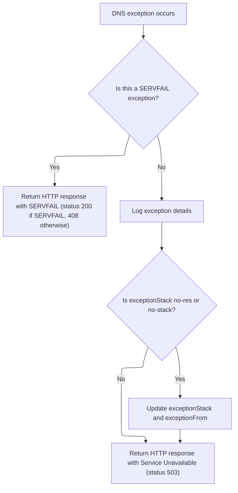

<SwmSnippet path="/src/core/io-state.js" line="109">

---

We just finished <SwmToken path="src/core/io-state.js" pos="118:8:8" line-data="      this.log.e(&quot;dnsExceptionResponse&quot;, pktjson, e.stack);">`dnsExceptionResponse`</SwmToken>. Based on whether SERVFAIL is present, we set the HTTP response status to 200 or 408, and fall back to 503 if something blows up. Headers include debug info for traceability.

```javascript
      this.httpResponse = new Response(servfail, {
        headers: util.concatHeaders(
          this.headers(servfail),
          this.debugHeaders(JSON.stringify(ex))
        ),
        status: hasServfail ? 200 : 408, // rfc8484 section-4.2.1
      });
    } catch (e) {
      const pktjson = JSON.stringify(this.decodedDnsPacket || {});
      this.log.e("dnsExceptionResponse", pktjson, e.stack);
      if (
        this.exceptionStack === "no-res" ||
        this.exceptionStack === "no-stack"
      ) {
        this.exceptionStack = e.stack;
        this.exceptionFrom = "IOState:errorResponse";
      }
      this.httpResponse = new Response(null, {
        headers: util.concatHeaders(
          this.headers(),
          this.debugHeaders(JSON.stringify(this.exceptionStack))
        ),
        status: 503,
      });
    }
  }
```

---

</SwmSnippet>

## Sending the Final Response to the Client

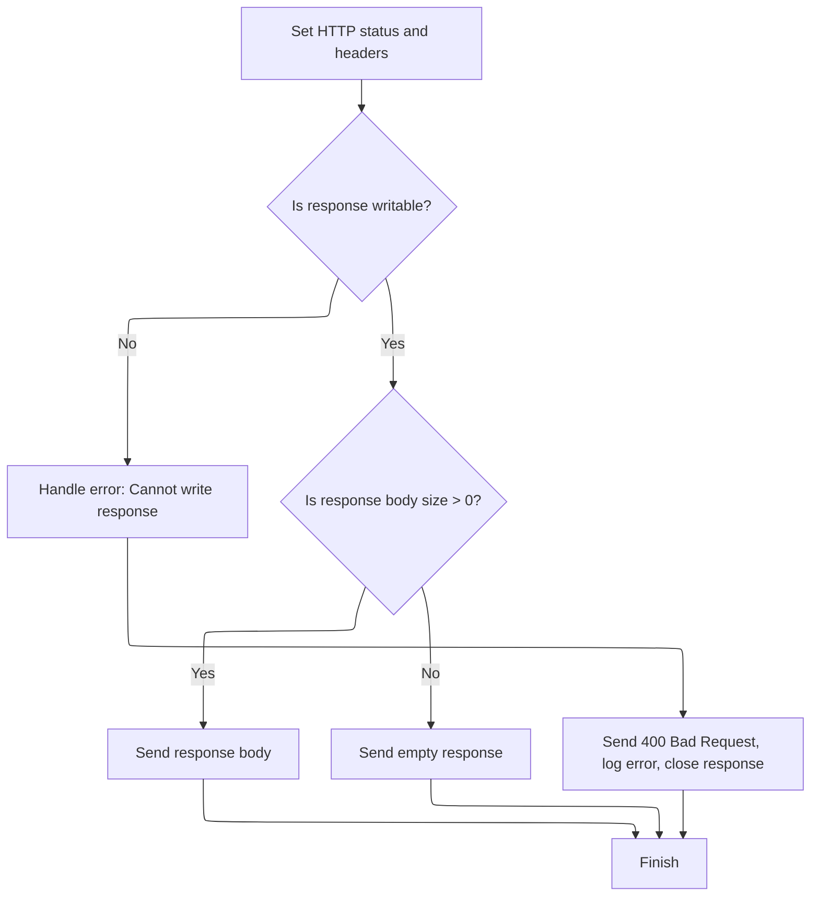

<SwmSnippet path="/src/server-node.js" line="1303">

---

We just got back from <SwmPath>[src/core/doh.js](src/core/doh.js)</SwmPath>. <SwmToken path="src/server-node.js" pos="1265:1:1" line-data="      handleHTTPRequest(b, req, res);">`handleHTTPRequest`</SwmToken> writes the response headers and body to the client, normalizing the buffer if there's data, or ending the response if not. Errors are handled with fallback status codes and logging.

```javascript
    res.writeHead(fRes.status, util.copyHeaders(fRes));

    // ans may be null on non-2xx responses, such as redirects (3xx) by cc.js
    // or 4xx responses on timeouts or 5xx on invalid http method
    const ans = await fRes.arrayBuffer();
    const sz = bufutil.len(ans);

    if (!resOkay(res)) {
      throw new Error("res not writable 2");
    } else if (sz > 0) {
      adjustTLSFragAfterWrites(res.socket, sz);
      res.end(bufutil.normalize8(ans));
    } else {
      // expect fRes.status to be set to non 2xx above
      res.end();
    }
  } catch (e) {
    const ok = resOkay(res);
    if (ok && !res.headersSent) res.writeHead(400); // bad request
    if (ok && !res.writableEnded) res.end();
    if (!ok) resClose(res);
    log.w(e);
  }
}
```

---

</SwmSnippet>

&nbsp;

*This is an auto-generated document by Swimm 🌊 and has not yet been verified by a human*

<SwmMeta version="3.0.0" repo-id="Z2l0aHViJTNBJTNBamF2YXNjcmlwdC1zZXJ2ZXJsZXNzLWRucyUzQSUzQXJpY2FyZG9sb3Blemc=" repo-name="javascript-serverless-dns"><sup>Powered by [Swimm](https://app.swimm.io/)</sup></SwmMeta>
