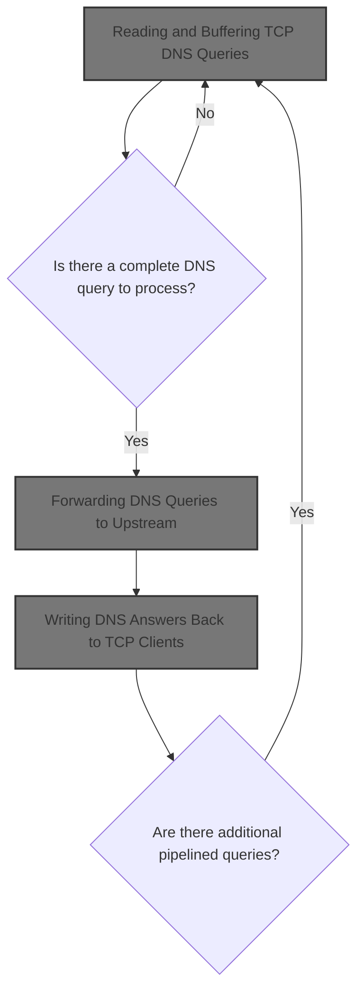
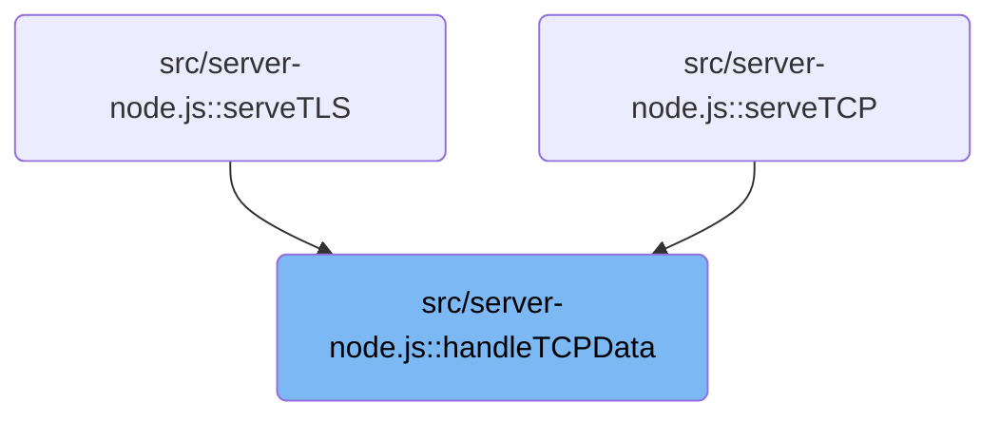
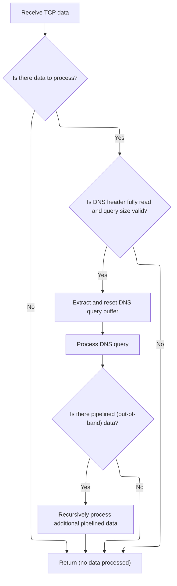
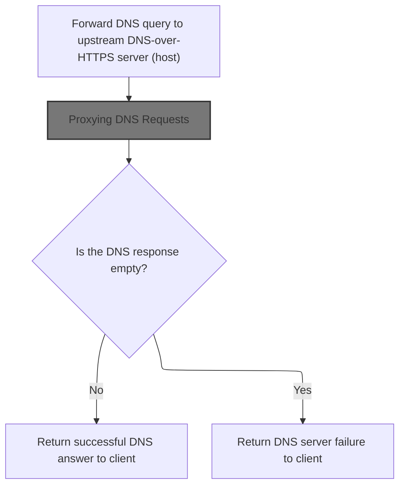
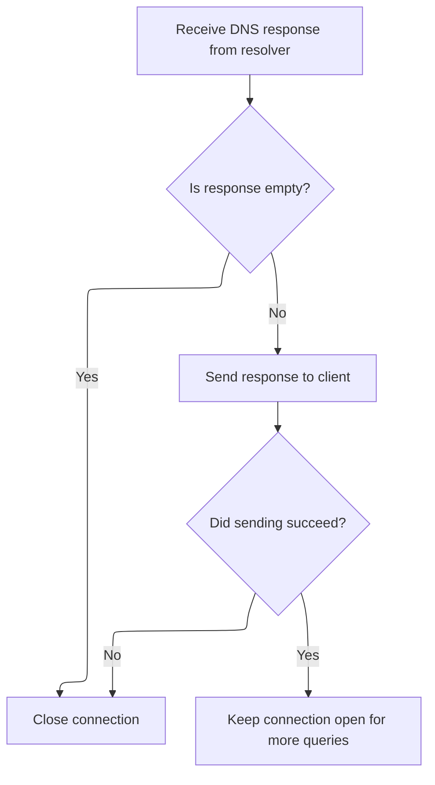

This document describes how DNS queries sent by clients over TCP are received, assembled, and processed. Each query is forwarded to an upstream resolver, and the response is returned to the client. The flow supports handling multiple queries in a single connection for efficient DNS resolution.



# Where is this flow used?

This flow is used multiple times in the codebase as represented in the following diagram:



# Reading and Buffering TCP DNS Queries



<SwmSnippet path="/src/server-node.js" line="1073">

---

HandleTCPData kicks off the flow by reading incoming TCP data and assembling DNS queries using a custom scratch buffer (sb). It reads the length header, validates it, and copies query data into sb, handling partial reads and pipelined queries. Once a full query is assembled, it resets sb and calls <SwmToken path="src/server-node.js" pos="1119:7:7" line-data="    n += await handleTCPQuery(b, socket, host, flag);">`handleTCPQuery`</SwmToken> to process the DNS query. Recursive calls handle any extra data in the chunk.

```javascript
async function handleTCPData(socket, chunk, sb, host, flag) {
  const cl = chunk.byteLength;
  if (cl <= 0) return 0;

  // read header first which contains length(dns-query)
  const rem = dnsutil.dnsHeaderSize - sb.qlenBufOffset;
  if (rem > 0) {
    const seek = Math.min(rem, cl);
    const read = chunk.slice(0, seek);
    sb.qlenBuf.fill(read, sb.qlenBufOffset);
    sb.qlenBufOffset += seek;
  }

  // header has not been read fully, yet; expect more data
  // www.rfc-editor.org/rfc/rfc7766#section-8
  if (sb.qlenBufOffset !== dnsutil.dnsHeaderSize) return 0;

  const qlen = sb.qlenBuf.readUInt16BE();
  if (!dnsutil.validateSize(qlen)) {
    log.w(`tcp: query size err: ql:${qlen} cl:${cl} rem:${rem}`);
    close(socket);
    return 0;
  }

  // rem bytes already read, is any more left in chunk?
  const size = cl - rem;
  if (size <= 0) return 0;
  // gobble up at most qlen bytes from chunk starting rem-th byte
  const qlimit = rem + Math.min(qlen - sb.qBufOffset, size);
  // hopefully fast github.com/nodejs/node/issues/20130#issuecomment-382417255
  // chunk out dns-query starting rem-th byte
  const data = chunk.slice(rem, qlimit);
  // out of band data, if any
  const oob = qlimit < cl ? chunk.slice(qlimit) : null;

  sb.allocOnce(qlen);

  sb.qBuf.fill(data, sb.qBufOffset);
  sb.qBufOffset += data.byteLength;

  log.d(`tcp: q: ${qlen}, sb.q: ${sb.qBufOffset}, cl: ${cl}, sz: ${size}`);
  let n = 0;
  // exactly qlen bytes read till now, handle the dns query
  if (sb.qBufOffset === qlen) {
    // extract out the query and reset the scratch-buffer
    const b = sb.reset();
    n += await handleTCPQuery(b, socket, host, flag);

    // if there is any out of band data, handle it
    if (!bufutil.emptyBuf(oob)) {
      log.d(`tcp: pipelined, handle oob: ${oob.byteLength}`);
      n += await handleTCPData(socket, oob, sb, host, flag);
    }
  } // continue reading from socket
  return n;
}
```

---

</SwmSnippet>

# Processing Assembled DNS Queries

<SwmSnippet path="/src/server-node.js" line="1137">

---

In <SwmToken path="src/server-node.js" pos="1137:4:4" line-data="async function handleTCPQuery(q, socket, host, flag) {">`handleTCPQuery`</SwmToken>, we validate the query and socket, set up a transaction ID, and then call <SwmToken path="src/server-node.js" pos="1148:7:7" line-data="    r = await resolveQuery(rxid, q, host, flag);">`resolveQuery`</SwmToken> to actually resolve the DNS query. This separates query assembly from resolution, keeping the flow modular.

```javascript
async function handleTCPQuery(q, socket, host, flag) {
  heartbeat();

  let n = 0;
  let ok = true;
  if (bufutil.emptyBuf(q) || !tcpOkay(socket)) return 0;

  /** @type {Uint8Array?} */
  let r = null;
  const rxid = util.xid();
  try {
    r = await resolveQuery(rxid, q, host, flag);
```

---

</SwmSnippet>

## Forwarding DNS Queries to Upstream



<SwmSnippet path="/src/server-node.js" line="1204">

---

In <SwmToken path="src/server-node.js" pos="1204:4:4" line-data="async function resolveQuery(rxid, q, host, flag) {">`resolveQuery`</SwmToken>, we package the DNS query as a POST request with the right headers and send it to the upstream resolver. We then call <SwmToken path="src/server-node.js" pos="1219:9:9" line-data="  const r = await handleRequest(util.mkFetchEvent(freq));">`handleRequest`</SwmToken> from <SwmPath>[src/core/doh.js](src/core/doh.js)</SwmPath> to actually proxy the request and get the response.

```javascript
async function resolveQuery(rxid, q, host, flag) {
  // Using POST, since GET requests cannot be greater than 2KB,
  // where-as DNS-over-TCP msgs could be upto 64KB in size.
  const freq = new Request(`https://${host}/${flag}`, {
    method: "POST",
    // TODO: populate req ip in x-nile-client-ip header
    // TODO: add host header
    headers: util.concatHeaders(
      util.dnsHeaders(),
      util.contentLengthHeader(q),
      util.rxidHeader(rxid)
    ),
    body: q,
  });

  const r = await handleRequest(util.mkFetchEvent(freq));

```

---

</SwmSnippet>

### Proxying DNS Requests

<SwmSnippet path="/src/core/doh.js" line="25">

---

HandleRequest just delegates the DNS request event to <SwmToken path="src/core/doh.js" pos="26:3:3" line-data="  return proxyRequest(event);">`proxyRequest`</SwmToken>, which does the actual proxying to the upstream resolver. This keeps the flow modular and focused.

```javascript
export function handleRequest(event) {
  return proxyRequest(event);
}
```

---

</SwmSnippet>

### Relaying DNS Queries to Upstream Servers

See <SwmLink doc-title="Processing DNS-over-HTTPS Requests">[Processing DNS-over-HTTPS Requests](/.swm/processing-dns-over-https-requests.je20mtdr.sw.md)</SwmLink>

### Formatting and Sending Error Responses

<SwmSnippet path="/src/core/doh.js" line="75">

---

ErrorResponse formats an error using <SwmToken path="src/core/doh.js" pos="76:7:9" line-data="  const eres = pres.errResponse(&quot;doh.js&quot;, err);">`pres.errResponse`</SwmToken> with the context <SwmPath>[src/core/doh.js](src/core/doh.js)</SwmPath>, then sends it out using <SwmToken path="src/core/doh.js" pos="77:1:3" line-data="  io.dnsExceptionResponse(eres);">`io.dnsExceptionResponse`</SwmToken>. This ties errors to the <SwmPath>[src/core/doh.js](src/core/doh.js)</SwmPath> module for easier tracing.

```javascript
function errorResponse(io, err = null) {
  const eres = pres.errResponse("doh.js", err);
  io.dnsExceptionResponse(eres);
}
```

---

</SwmSnippet>

### Sending DNS Error Responses to Clients

See <SwmLink doc-title="Handling DNS Exception Responses">[Handling DNS Exception Responses](/.swm/handling-dns-exception-responses.b69x7qnt.sw.md)</SwmLink>

### Handling Upstream DNS Responses

<SwmSnippet path="/src/server-node.js" line="1221">

---

Back in <SwmToken path="src/server-node.js" pos="1148:7:7" line-data="    r = await resolveQuery(rxid, q, host, flag);">`resolveQuery`</SwmToken>, after getting the response from <SwmPath>[src/core/doh.js](src/core/doh.js)</SwmPath>, we check if the answer is empty. If not, we normalize and return it; if it is, we log and send a SERVFAIL response.

```javascript
  const ans = await r.arrayBuffer();

  if (!bufutil.emptyBuf(ans)) {
    return bufutil.normalize8(ans);
  } else {
    log.w(rxid, host, "empty ans, send servfail; flags?", flag);
    return dnsutil.servfailQ(q);
  }
}
```

---

</SwmSnippet>

## Writing DNS Answers Back to TCP Clients



<SwmSnippet path="/src/server-node.js" line="1149">

---

Back in <SwmToken path="src/server-node.js" pos="1119:7:7" line-data="    n += await handleTCPQuery(b, socket, host, flag);">`handleTCPQuery`</SwmToken>, after getting the answer from <SwmToken path="src/server-node.js" pos="1148:7:7" line-data="    r = await resolveQuery(rxid, q, host, flag);">`resolveQuery`</SwmToken>, we encode and write the response to the TCP socket. If the answer is empty or an error occurs, we log and close the socket.

```javascript
    if (bufutil.emptyBuf(r)) {
      log.w(rxid, "tcp: empty ans from resolver");
      ok = false;
    } else {
      const rlBuf = bufutil.encodeUint8ArrayBE(r.byteLength, 2);
      const data = new Uint8Array([...rlBuf, ...r]);
      n = measuredWrite(rxid, socket, data);
    }
  } catch (e) {
    ok = false;
    log.w(rxid, "tcp: send fail, err", e);
  }

  // close socket when !ok
  if (!ok) {
    close(socket);
  } // else: expect pipelined queries on the same socket

  return n;
}
```

---

</SwmSnippet>

&nbsp;

*This is an auto-generated document by Swimm 🌊 and has not yet been verified by a human*

<SwmMeta version="3.0.0" repo-id="Z2l0aHViJTNBJTNBamF2YXNjcmlwdC1zZXJ2ZXJsZXNzLWRucyUzQSUzQXJpY2FyZG9sb3Blemc=" repo-name="javascript-serverless-dns"><sup>Powered by [Swimm](https://app.swimm.io/)</sup></SwmMeta>
