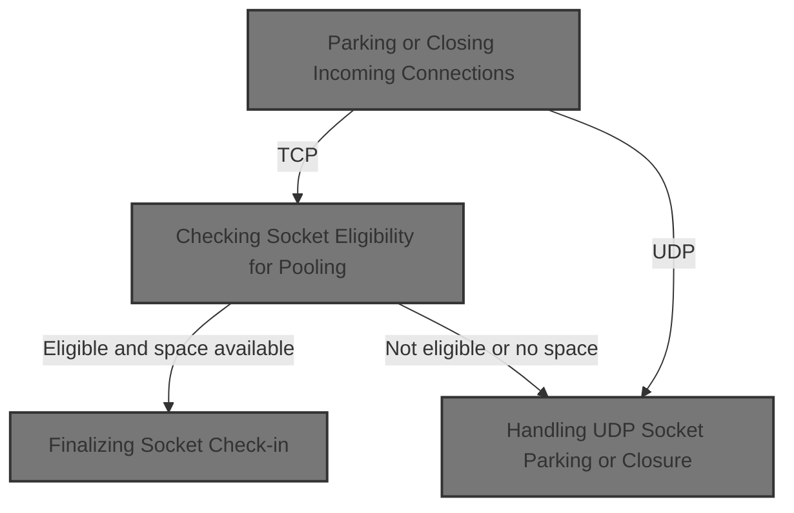
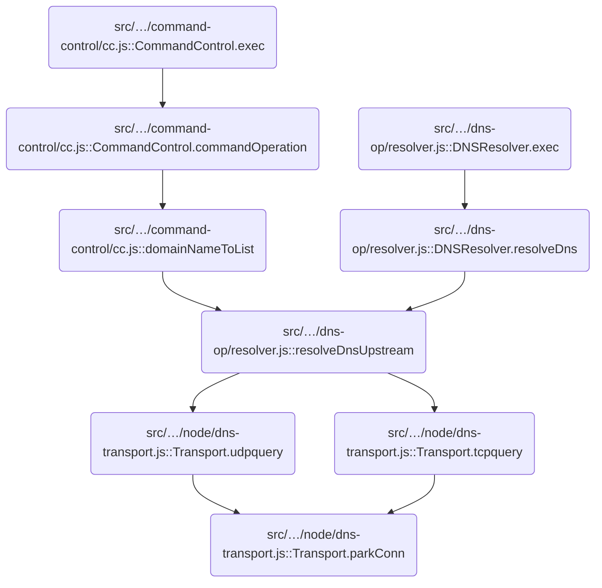

This document explains how incoming network sockets are managed based on their protocol. Sockets are either pooled for reuse or closed if pooling is not possible, optimizing network resource usage.



# Where is this flow used?

This flow is used multiple times in the codebase as represented in the following diagram:



# Parking or Closing Incoming Connections

<SwmSnippet path="/src/core/node/dns-transport.js" line="118">

---

In <SwmToken path="src/core/node/dns-transport.js" pos="118:1:1" line-data="  parkConn(sock, proto) {">`parkConn`</SwmToken>, we decide how to handle a socket based on its protocol. For TCP, we try to hand it off to the TCP connection pool; for UDP, we use the UDP pool. If the pool can't accept the socket, we close it. Next, we call into <SwmPath>[src/…/dns/conns.js](src/core/dns/conns.js)</SwmPath> to see if the pool will take the socket, which determines if we keep or drop the connection.

```javascript
  parkConn(sock, proto) {
    if (proto === "tcp") {
      const ok = this.tcpconns.give(sock);
      if (!ok) this.closeTcp(sock);
    } else if (proto === "udp") {
      const ok = this.udpconns.give(sock);
```

---

</SwmSnippet>

## Checking Socket Eligibility for Pooling

<SwmSnippet path="/src/core/dns/conns.js" line="47">

---

In <SwmToken path="src/core/dns/conns.js" pos="47:1:1" line-data="  give(socket) {">`give`</SwmToken>, we check if the socket is in a good state for pooling—it's not pending, it's writable, and it's ready. If the pool is full, we try to free up space with a sweep. If all checks pass, we move on to actually parking the socket.

```javascript
  give(socket) {
    if (socket.pending) return false;
    if (!socket.writable) return false;
    if (!this.ready(socket)) return false;

    if (this.pool.has(socket)) return true;

    const free = this.pool.size < this.size || this.sweep();
    if (!free) return false;

```

---

</SwmSnippet>

### Freeing Up Pool Space and Logging

See <SwmLink doc-title="Sweeping DNS Connections">[Sweeping DNS Connections](/.swm/sweeping-dns-connections.9ncirpbh.sw.md)</SwmLink>

### Finalizing Socket Check-in

<SwmSnippet path="/src/core/dns/conns.js" line="57">

---

Back in <SwmToken path="src/core/node/dns-transport.js" pos="120:11:11" line-data="      const ok = this.tcpconns.give(sock);">`give`</SwmToken>, after eligibility and space checks, we call <SwmToken path="src/core/dns/conns.js" pos="57:5:5" line-data="    return this.checkin(socket);">`checkin`</SwmToken> to actually add the socket to the pool. This is where the socket gets parked and managed for future use.

```javascript
    return this.checkin(socket);
  }
```

---

</SwmSnippet>

<SwmSnippet path="/src/core/dns/conns.js" line="115">

---

<SwmToken path="src/core/dns/conns.js" pos="115:1:1" line-data="  checkin(sock) {">`checkin`</SwmToken> sets up the socket for pooling: it attaches a report, enables keepalive, pauses the socket, and binds cleanup handlers for close and error. It then logs the check-in and adds the socket to the pool.

```javascript
  checkin(sock) {
    const report = this.mkreport();

    sock.setKeepAlive(true, this.keepalive);
    sock.pause();
    sock.on("close", this.evict.bind(this));
    sock.on("error", this.evict.bind(this));

    this.pool.set(sock, report);

    log.d(report.id, "checkin, size:", this.pool.size);
    return true;
  }
```

---

</SwmSnippet>

## Handling UDP Socket Parking or Closure

<SwmSnippet path="/src/core/node/dns-transport.js" line="124">

---

Back in <SwmToken path="src/core/node/dns-transport.js" pos="118:1:1" line-data="  parkConn(sock, proto) {">`parkConn`</SwmToken>, if the UDP pool can't take the socket, we close it right away. This prevents resource leaks since UDP sockets aren't reused.

```javascript
      if (!ok) this.closeUdp(sock);
    }
  }
```

---

</SwmSnippet>

<SwmSnippet path="/src/core/node/dns-transport.js" line="173">

---

<SwmToken path="src/core/node/dns-transport.js" pos="173:1:1" line-data="  closeUdp(sock) {">`closeUdp`</SwmToken> adds a stub error listener to the socket before disconnecting and closing it. This avoids unhandled error events, which is a repo-specific detail since sockets here don't have error listeners by default.

```javascript
  closeUdp(sock) {
    if (!sock || sock.destroyed) return;
    // the socket is expected to not have any error-listeners
    // so we add one just in case to avoid unhandled errors
    sock.on("error", util.stub);
    sock.disconnect();
    sock.close();
  }
```

---

</SwmSnippet>

&nbsp;

*This is an auto-generated document by Swimm 🌊 and has not yet been verified by a human*

<SwmMeta version="3.0.0" repo-id="Z2l0aHViJTNBJTNBamF2YXNjcmlwdC1zZXJ2ZXJsZXNzLWRucyUzQSUzQXJpY2FyZG9sb3Blemc=" repo-name="javascript-serverless-dns"><sup>Powered by [Swimm](https://app.swimm.io/)</sup></SwmMeta>
