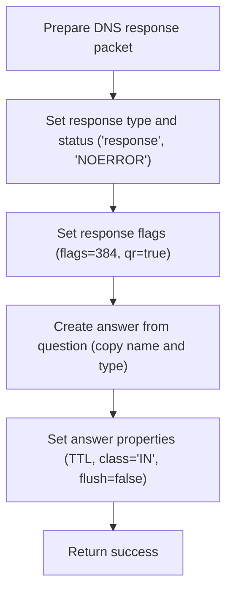

This document outlines how the system prepares a DNS response packet by validating the presence of a question in the incoming query. If a question exists, a response is built with the correct flags and an answer based on the question's details. If not, an error is logged and no response is created.

# Initializing DNS Response Flags and Validating Questions

<SwmSnippet path="/src/core/io-state.js" line="341">

---

In <SwmToken path="src/core/io-state.js" pos="341:1:1" line-data="  initFlagsAndAnswers(ttlsec = 300) {">`initFlagsAndAnswers`</SwmToken>, we check if the DNS packet has any questions using <SwmToken path="src/core/io-state.js" pos="342:4:6" line-data="    if (util.emptyObj(this.decodedDnsPacket.questions)) {">`util.emptyObj`</SwmToken>. If not, we exit early, since the rest of the logic depends on questions\[0\] being present.

```javascript
  initFlagsAndAnswers(ttlsec = 300) {
    if (util.emptyObj(this.decodedDnsPacket.questions)) {
```

---

</SwmSnippet>

<SwmSnippet path="/src/commons/util.js" line="387">

---

<SwmToken path="src/commons/util.js" pos="387:4:4" line-data="export function emptyObj(x) {">`emptyObj`</SwmToken> checks if the input is falsy (null/undefined) and returns true, so it treats those as empty objects. For actual objects, it checks that there are no own enumerable properties and that the prototype is <SwmToken path="src/commons/util.js" pos="391:25:27" line-data="    Object.keys(x).length === 0 &amp;&amp; Object.getPrototypeOf(x) === Object.prototype">`Object.prototype`</SwmToken>, making sure it's a plain, empty object.

```javascript
export function emptyObj(x) {
  // note: Object.keys type-errors when x is null / undefined
  if (!x) return true;
  return (
    Object.keys(x).length === 0 && Object.getPrototypeOf(x) === Object.prototype
  );
}
```

---

</SwmSnippet>

<SwmSnippet path="/src/core/io-state.js" line="343">

---

After checking for empty questions, we log an error and exit, so missing questions are traceable.

```javascript
      this.log.e("decoded dns-packet missing question");
      return false;
    }
```

---

</SwmSnippet>

## Logging Errors with Timestamp and Tags

<SwmSnippet path="/src/core/log.js" line="112">

---

<SwmToken path="src/core/log.js" pos="112:1:1" line-data="      e: (...args) =&gt; {">`e`</SwmToken> adds a timestamp and ' E' to the log entry, then forwards the tags and arguments to another log handler. The tags are expected to be available in the surrounding scope, which isn't obvious from the function signature.

```javascript
      e: (...args) => {
        this.e(this.now() + " E", ...tags, ...args);
      },
```

---

</SwmSnippet>

<SwmSnippet path="/src/core/log.js" line="132">

---

<SwmToken path="src/core/log.js" pos="132:1:1" line-data="  now() {">`now`</SwmToken> checks the <SwmToken path="src/core/log.js" pos="133:6:6" line-data="    if (this.logTimestamps) return new Date().toISOString();">`logTimestamps`</SwmToken> property and returns an ISO timestamp string if it's true, otherwise just an empty string. This means logs can be timestamped or not, depending on configuration.

```javascript
  now() {
    if (this.logTimestamps) return new Date().toISOString();
    else return "";
  }
```

---

</SwmSnippet>

## Building the DNS Response Packet



<SwmSnippet path="/src/core/io-state.js" line="346">

---

After logging (from <SwmPath>[src/core/log.js](src/core/log.js)</SwmPath>), IOState.initFlagsAndAnswers sets up the DNS response: type, rcode, flags (384, with a TODO about its meaning), and <SwmToken path="src/core/io-state.js" pos="350:5:5" line-data="    this.decodedDnsPacket.flag_qr = true;">`flag_qr`</SwmToken>. It builds the answers array using the first question's name and type, sets ttl, class, and flush, then returns true. The flags value is unexplained and could be protocol-specific.

```javascript
    this.decodedDnsPacket.type = "response";
    this.decodedDnsPacket.rcode = "NOERROR";
    // TODO: what is flag(384) 0b0_0000_0000_1100_0000?
    this.decodedDnsPacket.flags = 384;
    this.decodedDnsPacket.flag_qr = true;
    this.decodedDnsPacket.answers = [];
    this.decodedDnsPacket.answers[0] = {};
    this.decodedDnsPacket.answers[0].name =
      this.decodedDnsPacket.questions[0].name;
    this.decodedDnsPacket.answers[0].type =
      this.decodedDnsPacket.questions[0].type;
    this.decodedDnsPacket.answers[0].ttl = ttlsec;
    this.decodedDnsPacket.answers[0].class = "IN";
    this.decodedDnsPacket.answers[0].flush = false;
    return true;
  }
```

---

</SwmSnippet>

&nbsp;

*This is an auto-generated document by Swimm 🌊 and has not yet been verified by a human*

<SwmMeta version="3.0.0" repo-id="Z2l0aHViJTNBJTNBamF2YXNjcmlwdC1zZXJ2ZXJsZXNzLWRucyUzQSUzQXJpY2FyZG9sb3Blemc=" repo-name="javascript-serverless-dns"><sup>Powered by [Swimm](https://app.swimm.io/)</sup></SwmMeta>
