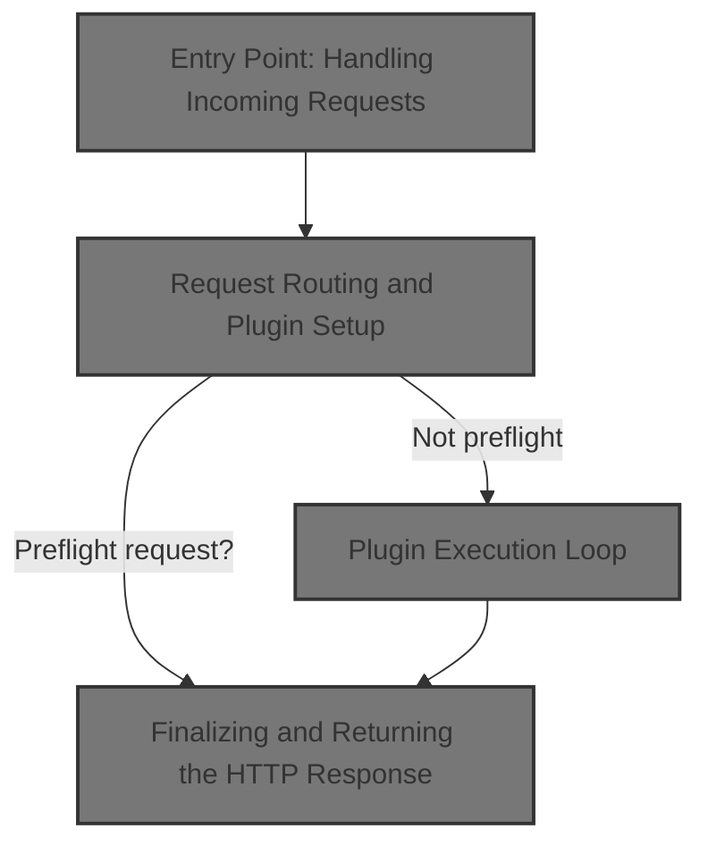
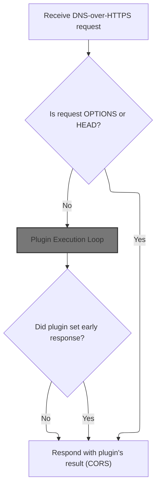
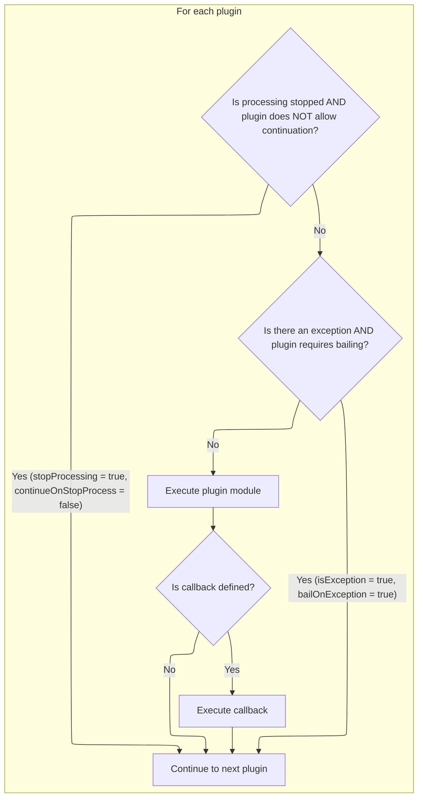
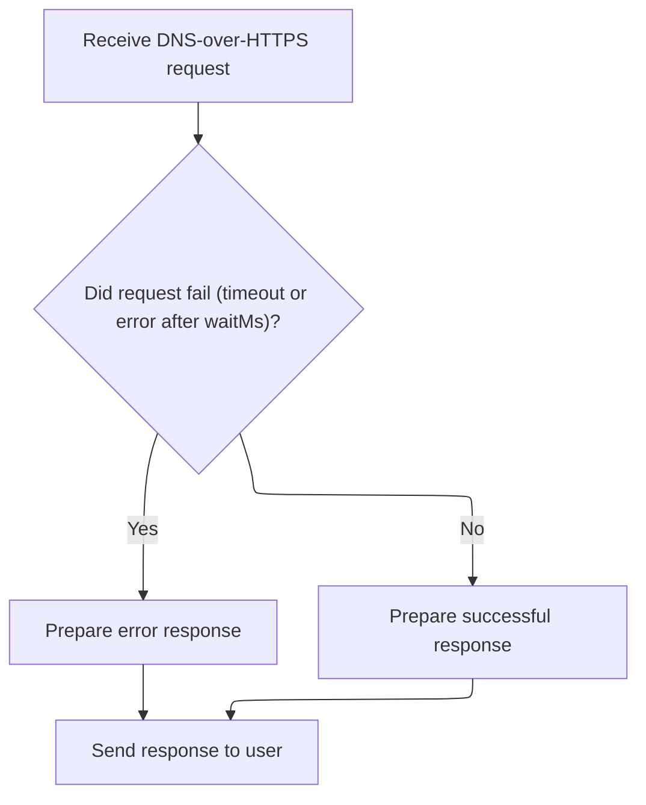
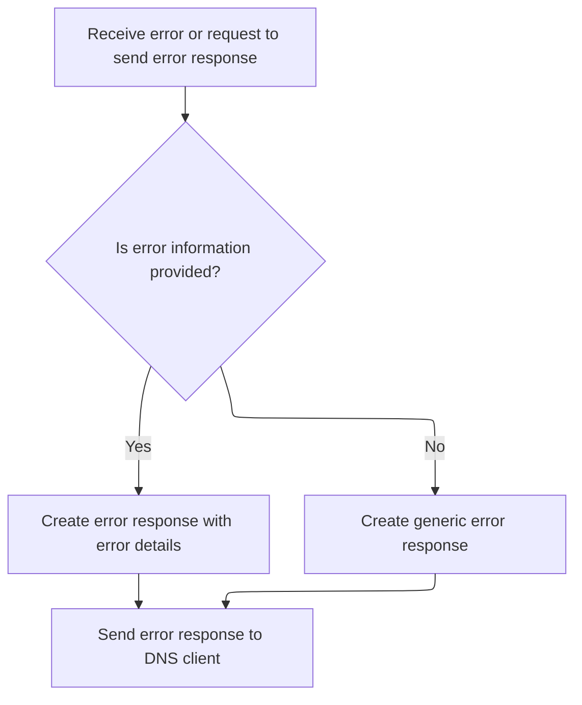
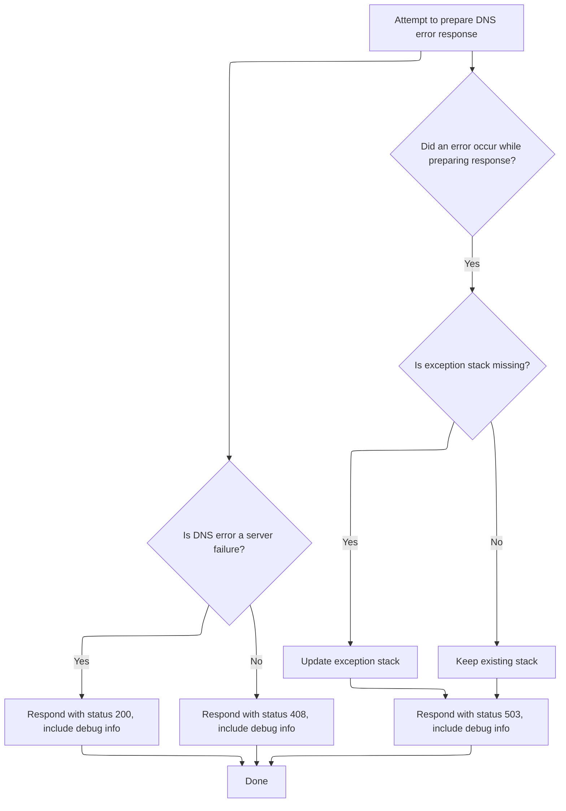

This document describes how DNS-over-HTTPS requests are processed. Incoming requests are checked for preflight status, then pass through plugins that handle user authentication, domain delegation, and blocklist configuration. The flow returns a DNS answer in an HTTP response, customized based on user and domain logic, or an error response if processing fails.



# Where is this flow used?

This flow is used multiple times in the codebase as represented in the following diagram:

(Note - these are only some of the entry points of this flow)

```mermaid
graph TD;
      f5de6bc3f31d0c0a92e31b823ed537ce17720cae281dd4db18ae331346886c95(src/server-deno.ts::systemUp) --> 9da620d34b446d4bcdd12ad961e1e0a044261ae4889dc2648e32d6c2f1560f33(src/server-deno.ts::startDotIfPossible)

f5de6bc3f31d0c0a92e31b823ed537ce17720cae281dd4db18ae331346886c95(src/server-deno.ts::systemUp) --> 1217ca8e6d287c008759187ce88d59b4473fad0e8c9597174cd03fbf4b90f1b4(src/server-deno.ts::serveTcp)

9da620d34b446d4bcdd12ad961e1e0a044261ae4889dc2648e32d6c2f1560f33(src/server-deno.ts::startDotIfPossible) --> 1217ca8e6d287c008759187ce88d59b4473fad0e8c9597174cd03fbf4b90f1b4(src/server-deno.ts::serveTcp)

1217ca8e6d287c008759187ce88d59b4473fad0e8c9597174cd03fbf4b90f1b4(src/server-deno.ts::serveTcp) --> c5071bc29b1c6ca39593adeba0f0ed736437c156cd188188361190738f5ed8b6(src/server-deno.ts::handleTCPQuery)

c5071bc29b1c6ca39593adeba0f0ed736437c156cd188188361190738f5ed8b6(src/server-deno.ts::handleTCPQuery) --> c0136a65464d369d39d04b90fdfe70f4ded610ed546bd0a3db04a892903ba0e0(src/server-deno.ts::resolveQuery)

c0136a65464d369d39d04b90fdfe70f4ded610ed546bd0a3db04a892903ba0e0(src/server-deno.ts::resolveQuery) --> fcde7f3b2f5c67bd24d58cff285ac5af02d39b851f77641f0f4a608a5355cc7b(src/core/doh.js::handleRequest):::mainFlowStyle

900ccb321fe23baa523d9ad5d054beea83e670a38afa8359ce0a1dc7cf6a4b15(src/server-node.js::serveTLS) --> cf090485bf8d5fbbb13cf52382f159bf0b4f759e64dd976ef6f968d42846bd62(src/server-node.js::handleTCPData)

cf090485bf8d5fbbb13cf52382f159bf0b4f759e64dd976ef6f968d42846bd62(src/server-node.js::handleTCPData) --> ccd64906beddbd4b155f5444c2c3e34d7c3fc73518983925ba6fa1e7b6860453(src/server-node.js::handleTCPQuery)

cf090485bf8d5fbbb13cf52382f159bf0b4f759e64dd976ef6f968d42846bd62(src/server-node.js::handleTCPData) --> cf090485bf8d5fbbb13cf52382f159bf0b4f759e64dd976ef6f968d42846bd62(src/server-node.js::handleTCPData)

ccd64906beddbd4b155f5444c2c3e34d7c3fc73518983925ba6fa1e7b6860453(src/server-node.js::handleTCPQuery) --> 22d183c64a9a16d14ba53daffc62f045464de567da70e0243122cb21a5a9083c(src/server-node.js::resolveQuery)

22d183c64a9a16d14ba53daffc62f045464de567da70e0243122cb21a5a9083c(src/server-node.js::resolveQuery) --> fcde7f3b2f5c67bd24d58cff285ac5af02d39b851f77641f0f4a608a5355cc7b(src/core/doh.js::handleRequest):::mainFlowStyle

3045764f3abaaafc715c65dde62e10b3bdcb2b02a11a89428d894c6bdcd647fc(src/server-node.js::serveTCP) --> cf090485bf8d5fbbb13cf52382f159bf0b4f759e64dd976ef6f968d42846bd62(src/server-node.js::handleTCPData)

d10ff40acee226cc1538a7f039080eccf5caba46de9ee1626bfdfb9c9b9355b4(src/server-node.js::serveHTTPS) --> 9fa0fd320853a5412fc3479cfb7a1127d00a7a6845329ccbad11e9a8bcd0a6a7(src/server-node.js::handleHTTPRequest)

9fa0fd320853a5412fc3479cfb7a1127d00a7a6845329ccbad11e9a8bcd0a6a7(src/server-node.js::handleHTTPRequest) --> fcde7f3b2f5c67bd24d58cff285ac5af02d39b851f77641f0f4a608a5355cc7b(src/core/doh.js::handleRequest):::mainFlowStyle

93d78c4d28afc19d807556d2f8b0cffc926dedd1626c5a3cfe3827d32c599e62(src/server-workers.js::fetch) --> fdce2f000197bca8ba2c80b4aac89b59562ab9caeb3da61f7c9509e0f9cd1359(src/server-workers.js::serveDoh)

fdce2f000197bca8ba2c80b4aac89b59562ab9caeb3da61f7c9509e0f9cd1359(src/server-workers.js::serveDoh) --> fcde7f3b2f5c67bd24d58cff285ac5af02d39b851f77641f0f4a608a5355cc7b(src/core/doh.js::handleRequest):::mainFlowStyle


classDef mainFlowStyle color:#000000,fill:#7CB9F4
classDef rootsStyle color:#000000,fill:#00FFF4
classDef Style1 color:#000000,fill:#00FFAA
classDef Style2 color:#000000,fill:#FFFF00
classDef Style3 color:#000000,fill:#AA7CB9

%% Swimm:
%% graph TD;
%%       f5de6bc3f31d0c0a92e31b823ed537ce17720cae281dd4db18ae331346886c95(<SwmPath>[src/server-deno.ts](src/server-deno.ts)</SwmPath>::systemUp) --> 9da620d34b446d4bcdd12ad961e1e0a044261ae4889dc2648e32d6c2f1560f33(<SwmPath>[src/server-deno.ts](src/server-deno.ts)</SwmPath>::startDotIfPossible)
%% 
%% f5de6bc3f31d0c0a92e31b823ed537ce17720cae281dd4db18ae331346886c95(<SwmPath>[src/server-deno.ts](src/server-deno.ts)</SwmPath>::systemUp) --> 1217ca8e6d287c008759187ce88d59b4473fad0e8c9597174cd03fbf4b90f1b4(<SwmPath>[src/server-deno.ts](src/server-deno.ts)</SwmPath>::serveTcp)
%% 
%% 9da620d34b446d4bcdd12ad961e1e0a044261ae4889dc2648e32d6c2f1560f33(<SwmPath>[src/server-deno.ts](src/server-deno.ts)</SwmPath>::startDotIfPossible) --> 1217ca8e6d287c008759187ce88d59b4473fad0e8c9597174cd03fbf4b90f1b4(<SwmPath>[src/server-deno.ts](src/server-deno.ts)</SwmPath>::serveTcp)
%% 
%% 1217ca8e6d287c008759187ce88d59b4473fad0e8c9597174cd03fbf4b90f1b4(<SwmPath>[src/server-deno.ts](src/server-deno.ts)</SwmPath>::serveTcp) --> c5071bc29b1c6ca39593adeba0f0ed736437c156cd188188361190738f5ed8b6(<SwmPath>[src/server-deno.ts](src/server-deno.ts)</SwmPath>::handleTCPQuery)
%% 
%% c5071bc29b1c6ca39593adeba0f0ed736437c156cd188188361190738f5ed8b6(<SwmPath>[src/server-deno.ts](src/server-deno.ts)</SwmPath>::handleTCPQuery) --> c0136a65464d369d39d04b90fdfe70f4ded610ed546bd0a3db04a892903ba0e0(<SwmPath>[src/server-deno.ts](src/server-deno.ts)</SwmPath>::resolveQuery)
%% 
%% c0136a65464d369d39d04b90fdfe70f4ded610ed546bd0a3db04a892903ba0e0(<SwmPath>[src/server-deno.ts](src/server-deno.ts)</SwmPath>::resolveQuery) --> fcde7f3b2f5c67bd24d58cff285ac5af02d39b851f77641f0f4a608a5355cc7b(<SwmPath>[src/core/doh.js](src/core/doh.js)</SwmPath>::<SwmToken path="src/core/doh.js" pos="25:4:4" line-data="export function handleRequest(event) {">`handleRequest`</SwmToken>):::mainFlowStyle
%% 
%% 900ccb321fe23baa523d9ad5d054beea83e670a38afa8359ce0a1dc7cf6a4b15(<SwmPath>[src/server-node.js](src/server-node.js)</SwmPath>::serveTLS) --> cf090485bf8d5fbbb13cf52382f159bf0b4f759e64dd976ef6f968d42846bd62(<SwmPath>[src/server-node.js](src/server-node.js)</SwmPath>::handleTCPData)
%% 
%% cf090485bf8d5fbbb13cf52382f159bf0b4f759e64dd976ef6f968d42846bd62(<SwmPath>[src/server-node.js](src/server-node.js)</SwmPath>::handleTCPData) --> ccd64906beddbd4b155f5444c2c3e34d7c3fc73518983925ba6fa1e7b6860453(<SwmPath>[src/server-node.js](src/server-node.js)</SwmPath>::handleTCPQuery)
%% 
%% cf090485bf8d5fbbb13cf52382f159bf0b4f759e64dd976ef6f968d42846bd62(<SwmPath>[src/server-node.js](src/server-node.js)</SwmPath>::handleTCPData) --> cf090485bf8d5fbbb13cf52382f159bf0b4f759e64dd976ef6f968d42846bd62(<SwmPath>[src/server-node.js](src/server-node.js)</SwmPath>::handleTCPData)
%% 
%% ccd64906beddbd4b155f5444c2c3e34d7c3fc73518983925ba6fa1e7b6860453(<SwmPath>[src/server-node.js](src/server-node.js)</SwmPath>::handleTCPQuery) --> 22d183c64a9a16d14ba53daffc62f045464de567da70e0243122cb21a5a9083c(<SwmPath>[src/server-node.js](src/server-node.js)</SwmPath>::resolveQuery)
%% 
%% 22d183c64a9a16d14ba53daffc62f045464de567da70e0243122cb21a5a9083c(<SwmPath>[src/server-node.js](src/server-node.js)</SwmPath>::resolveQuery) --> fcde7f3b2f5c67bd24d58cff285ac5af02d39b851f77641f0f4a608a5355cc7b(<SwmPath>[src/core/doh.js](src/core/doh.js)</SwmPath>::<SwmToken path="src/core/doh.js" pos="25:4:4" line-data="export function handleRequest(event) {">`handleRequest`</SwmToken>):::mainFlowStyle
%% 
%% 3045764f3abaaafc715c65dde62e10b3bdcb2b02a11a89428d894c6bdcd647fc(<SwmPath>[src/server-node.js](src/server-node.js)</SwmPath>::serveTCP) --> cf090485bf8d5fbbb13cf52382f159bf0b4f759e64dd976ef6f968d42846bd62(<SwmPath>[src/server-node.js](src/server-node.js)</SwmPath>::handleTCPData)
%% 
%% d10ff40acee226cc1538a7f039080eccf5caba46de9ee1626bfdfb9c9b9355b4(<SwmPath>[src/server-node.js](src/server-node.js)</SwmPath>::serveHTTPS) --> 9fa0fd320853a5412fc3479cfb7a1127d00a7a6845329ccbad11e9a8bcd0a6a7(<SwmPath>[src/server-node.js](src/server-node.js)</SwmPath>::handleHTTPRequest)
%% 
%% 9fa0fd320853a5412fc3479cfb7a1127d00a7a6845329ccbad11e9a8bcd0a6a7(<SwmPath>[src/server-node.js](src/server-node.js)</SwmPath>::handleHTTPRequest) --> fcde7f3b2f5c67bd24d58cff285ac5af02d39b851f77641f0f4a608a5355cc7b(<SwmPath>[src/core/doh.js](src/core/doh.js)</SwmPath>::<SwmToken path="src/core/doh.js" pos="25:4:4" line-data="export function handleRequest(event) {">`handleRequest`</SwmToken>):::mainFlowStyle
%% 
%% 93d78c4d28afc19d807556d2f8b0cffc926dedd1626c5a3cfe3827d32c599e62(<SwmPath>[src/server-workers.js](src/server-workers.js)</SwmPath>::fetch) --> fdce2f000197bca8ba2c80b4aac89b59562ab9caeb3da61f7c9509e0f9cd1359(<SwmPath>[src/server-workers.js](src/server-workers.js)</SwmPath>::serveDoh)
%% 
%% fdce2f000197bca8ba2c80b4aac89b59562ab9caeb3da61f7c9509e0f9cd1359(<SwmPath>[src/server-workers.js](src/server-workers.js)</SwmPath>::serveDoh) --> fcde7f3b2f5c67bd24d58cff285ac5af02d39b851f77641f0f4a608a5355cc7b(<SwmPath>[src/core/doh.js](src/core/doh.js)</SwmPath>::<SwmToken path="src/core/doh.js" pos="25:4:4" line-data="export function handleRequest(event) {">`handleRequest`</SwmToken>):::mainFlowStyle
%% 
%% 
%% classDef mainFlowStyle color:#000000,fill:#7CB9F4
%% classDef rootsStyle color:#000000,fill:#00FFF4
%% classDef Style1 color:#000000,fill:#00FFAA
%% classDef Style2 color:#000000,fill:#FFFF00
%% classDef Style3 color:#000000,fill:#AA7CB9
```



# Entry Point: Handling Incoming Requests

<SwmSnippet path="/src/core/doh.js" line="25">

---

HandleRequest just passes the event to <SwmToken path="src/core/doh.js" pos="26:3:3" line-data="  return proxyRequest(event);">`proxyRequest`</SwmToken> to kick off the main logic.

```javascript
export function handleRequest(event) {
  return proxyRequest(event);
}
```

---

</SwmSnippet>

# Request Routing and Plugin Setup



<SwmSnippet path="/src/core/doh.js" line="33">

---

ProxyRequest sets up request state, initializes plugins, and then runs the plugin chain to handle the request.

```javascript
async function proxyRequest(event) {
  if (optionsRequest(event.request)) return util.respond204();
  if (headRequest(event.request)) return util.respond204();

  const io = new IOState();
  const ua = event.request.headers.get("User-Agent");

  try {
    const plugin = new RethinkPlugin(event);
    await plugin.initIoState(io);

    // if an early response has been set by plugin.initIoState, return it
    if (io.httpResponse) {
      return withCors(io, ua);
    }

    await util.timedSafeAsyncOp(
      /* op*/ () => plugin.execute(),
```

---

</SwmSnippet>

## Plugin Execution Loop



<SwmSnippet path="/src/core/plugin.js" line="143">

---

Execute loops through plugins, runs their exec methods if allowed, and moves on to the next plugin in the chain.

```javascript
  async execute() {
    const io = this.io;
    // const rxid = this.ctx.get("rxid");
    for (const p of this.plugin) {
      if (io.stopProcessing && !p.continueOnStopProcess) {
        continue;
      }
      if (io.isException && p.bailOnException) {
        continue;
      }

      const res = await p.module.exec(makectx(this.ctx, p.pctx));

      if (typeof p.callback === "function") {
        await p.callback.call(this, res, io);
      }
    }
  }
```

---

</SwmSnippet>

## User Authentication and Preparation

<SwmSnippet path="/src/plugins/users/user-op.js" line="34">

---

Exec checks user authentication first, before moving on to user-specific logic.

```javascript
  async exec(ctx) {
    let res = pres.emptyResponse();

    try {
      const out = await token.auth(ctx.rxid, ctx.request.url);
```

---

</SwmSnippet>

### Token Authentication Logic

See <SwmLink doc-title="Request Authentication Flow">[Request Authentication Flow](/.swm/request-authentication-flow.cwm3jtoh.sw.md)</SwmLink>

### Post-Authentication User Logic

<SwmSnippet path="/src/plugins/users/user-op.js" line="39">

---

After auth, exec either errors out or loads user data, then returns the response.

```javascript
      if (!out.ok) {
        res = pres.errResponse("UserOp:Auth", new Error("auth failed"));
      } else {
        res = this.loadUser(ctx);
      }
      res.data.userAuth = out;
    } catch (ex) {
      res = pres.errResponse("UserOp", ex);
    }

    return res;
  }
```

---

</SwmSnippet>

## User Data and DNS Context Processing

```mermaid
%%{init: {"flowchart": {"defaultRenderer": "elk"}} }%%
flowchart TD
  node1{"Is request a DNS message?"}
  click node1 openCode "src/plugins/users/user-op.js:59:62"
  node1 -->|"Yes"| node2["Extract domains from DNS packet"]
  click node2 openCode "src/plugins/users/user-op.js:65:66"
  node1 -->|"No"| node9["Return empty response"]
  click node9 openCode "src/plugins/users/user-op.js:61:62"
  node2 --> node3["Process delegation for domains"]
  click node3 openCode "src/plugins/users/user-op.js:67:72"
  subgraph loop1["For each domain in request"]
    node3 --> node4{"Is domain delegated?"}
    click node4 openCode "src/plugins/users/user-op.js:68:71"
    node4 -->|"Delegated"| node5["Set preferred DNS resolver"]
    click node5 openCode "src/plugins/users/user-op.js:70:71"
    node4 -->|"Not Delegated"| node3
  end
  node3 --> node6["Extract blocklist flag from request URL"]
  click node6 openCode "src/plugins/users/user-op.js:74:75"
  node6 --> node7{"Is blocklist flag present?"}
  click node7 openCode "src/plugins/users/user-op.js:75:76"
  node7 -->|"Yes"| node8["Check if blocklist data is in cache"]
  click node8 openCode "src/plugins/users/user-op.js:80:81"
  node7 -->|"No"| node12["Continue without blocklist info"]
  click node12 openCode "src/plugins/users/user-op.js:77:78"
  node8 --> node10{"Is blocklist data available?"}
  click node10 openCode "src/plugins/users/user-op.js:81:82"
  node10 -->|"Yes"| node11["Attach blocklist info to response"]
  click node11 openCode "src/plugins/users/user-op.js:99:102"
  node10 -->|"No"| node13["Load and cache blocklist data"]
  click node13 openCode "src/plugins/users/user-op.js:84:93"
  node13 --> node11
  node11 --> node14["Return response"]
  click node14 openCode "src/plugins/users/user-op.js:109:110"
  node12 --> node14
classDef HeadingStyle fill:#777777,stroke:#333,stroke-width:2px;

%% Swimm:
%% %%{init: {"flowchart": {"defaultRenderer": "elk"}} }%%
%% flowchart TD
%%   node1{"Is request a DNS message?"}
%%   click node1 openCode "<SwmPath>[src/…/users/user-op.js](src/plugins/users/user-op.js)</SwmPath>:59:62"
%%   node1 -->|"Yes"| node2["Extract domains from DNS packet"]
%%   click node2 openCode "<SwmPath>[src/…/users/user-op.js](src/plugins/users/user-op.js)</SwmPath>:65:66"
%%   node1 -->|"No"| node9["Return empty response"]
%%   click node9 openCode "<SwmPath>[src/…/users/user-op.js](src/plugins/users/user-op.js)</SwmPath>:61:62"
%%   node2 --> node3["Process delegation for domains"]
%%   click node3 openCode "<SwmPath>[src/…/users/user-op.js](src/plugins/users/user-op.js)</SwmPath>:67:72"
%%   subgraph loop1["For each domain in request"]
%%     node3 --> node4{"Is domain delegated?"}
%%     click node4 openCode "<SwmPath>[src/…/users/user-op.js](src/plugins/users/user-op.js)</SwmPath>:68:71"
%%     node4 -->|"Delegated"| node5["Set preferred DNS resolver"]
%%     click node5 openCode "<SwmPath>[src/…/users/user-op.js](src/plugins/users/user-op.js)</SwmPath>:70:71"
%%     node4 -->|"Not Delegated"| node3
%%   end
%%   node3 --> node6["Extract blocklist flag from request URL"]
%%   click node6 openCode "<SwmPath>[src/…/users/user-op.js](src/plugins/users/user-op.js)</SwmPath>:74:75"
%%   node6 --> node7{"Is blocklist flag present?"}
%%   click node7 openCode "<SwmPath>[src/…/users/user-op.js](src/plugins/users/user-op.js)</SwmPath>:75:76"
%%   node7 -->|"Yes"| node8["Check if blocklist data is in cache"]
%%   click node8 openCode "<SwmPath>[src/…/users/user-op.js](src/plugins/users/user-op.js)</SwmPath>:80:81"
%%   node7 -->|"No"| node12["Continue without blocklist info"]
%%   click node12 openCode "<SwmPath>[src/…/users/user-op.js](src/plugins/users/user-op.js)</SwmPath>:77:78"
%%   node8 --> node10{"Is blocklist data available?"}
%%   click node10 openCode "<SwmPath>[src/…/users/user-op.js](src/plugins/users/user-op.js)</SwmPath>:81:82"
%%   node10 -->|"Yes"| node11["Attach blocklist info to response"]
%%   click node11 openCode "<SwmPath>[src/…/users/user-op.js](src/plugins/users/user-op.js)</SwmPath>:99:102"
%%   node10 -->|"No"| node13["Load and cache blocklist data"]
%%   click node13 openCode "<SwmPath>[src/…/users/user-op.js](src/plugins/users/user-op.js)</SwmPath>:84:93"
%%   node13 --> node11
%%   node11 --> node14["Return response"]
%%   click node14 openCode "<SwmPath>[src/…/users/user-op.js](src/plugins/users/user-op.js)</SwmPath>:109:110"
%%   node12 --> node14
%% classDef HeadingStyle fill:#777777,stroke:#333,stroke-width:2px;
```



<SwmSnippet path="/src/plugins/users/user-op.js" line="56">

---

LoadUser processes DNS context, handles delegation, and manages user blocklist config with caching.

```javascript
  loadUser(ctx) {
    const response = pres.emptyResponse();

    if (!ctx.isDnsMsg) {
      this.log.w(ctx.rxid, "not a dns-msg, ignore");
      return response;
    }

    try {
      const dnsPacket = ctx.requestDecodedDnsPacket;
      const domains = dnsutil.extractDomains(dnsPacket);
      for (const d of domains) {
        if (delegated.has(d)) {
          // may be overriden by user-preferred doh upstream
          response.data.dnsResolverUrl = envutil.primaryDohResolver();
        }
      }
```

---

</SwmSnippet>

<SwmSnippet path="/src/plugins/users/user-op.js" line="74">

---

LoadUser returns DNS and user config info, or just an empty response if nothing matched.

```javascript
      const blocklistFlag = rdnsutil.blockstampFromUrl(ctx.request.url);
      const hasflag = !util.emptyString(blocklistFlag);
      if (!hasflag) {
        this.log.d(ctx.rxid, "empty blocklist-flag", ctx.request.url);
      }
      // blocklistFlag may be invalid, ref rdnsutil.blockstampFromUrl
      let r = this.userConfigCache.get(blocklistFlag);
      let hasdata = rdnsutil.hasBlockstamp(r);
      if (hasflag && !hasdata) {
        // r not in cache
        r = rdnsutil.unstamp(blocklistFlag); // r is never null, may throw ex
        hasdata = rdnsutil.hasBlockstamp(r);

        if (hasdata) {
          this.log.d(ctx.rxid, "new cfg cache kv", blocklistFlag, r);
          // TODO: blocklistFlag is not normalized, ie b32 used for dot isn't
          // converted to its b64 form (which doh and rethinkdns modules use)
          // example, b32: 1-AABABAA / equivalent b64: 1:AAIAgA==
          this.userConfigCache.put(blocklistFlag, r);
        }
      } else {
        this.log.d(ctx.rxid, "cfg cache hit?", hasdata, blocklistFlag, r);
      }

      if (hasdata) {
        response.data.userBlocklistInfo = r;
        response.data.userBlocklistFlag = blocklistFlag;
        // TODO: override response.data.dnsResolverUrl
      }
    } catch (e) {
      this.log.e(ctx.rxid, "loadUser", e);
      // avoid erroring out on invalid blocklist info & flag
      // response = pres.errResponse("UserOp:loadUser", e);
    }

    return response;
  }
```

---

</SwmSnippet>

## Finalizing and Returning the HTTP Response



<SwmSnippet path="/src/core/doh.js" line="51">

---

ProxyRequest wraps up by returning the response or calling <SwmToken path="src/core/doh.js" pos="52:15:15" line-data="      /* onTimeout*/ () =&gt; Promise.resolve(errorResponse(io))">`errorResponse`</SwmToken> if something failed.

```javascript
      /* waitMs*/ dnsutil.requestTimeout(),
      /* onTimeout*/ () => Promise.resolve(errorResponse(io))
    );
  } catch (err) {
    log.e("doh", "proxy-request error", err.stack);
    errorResponse(io, err);
  }

  return withCors(io, ua);
}
```

---

</SwmSnippet>

# Generating Error Responses



<SwmSnippet path="/src/core/doh.js" line="75">

---

ErrorResponse tags the error and hands it off to io for DNS error handling.

```javascript
function errorResponse(io, err = null) {
  const eres = pres.errResponse("doh.js", err);
  io.dnsExceptionResponse(eres);
}
```

---

</SwmSnippet>

# Preparing DNS Exception State

<SwmSnippet path="/src/core/io-state.js" line="79">

---

DnsExceptionResponse builds a SERVFAIL DNS response and wraps it in an HTTP reply with debug info.

```javascript
  dnsExceptionResponse(res) {
    this.initDecodedDnsPacketIfNeeded();

    this.stopProcessing = true;
    this.isException = true;

    if (util.emptyObj(res)) {
      this.exceptionStack = "no-res";
      this.exceptionFrom = "no-res";
    } else {
      this.exceptionStack = res.exceptionStack || "no-stack";
      this.exceptionFrom = res.exceptionFrom || "no-origin";
    }

    try {
      const qid = this.decodedDnsPacket.id; // may be null
      const questions = this.decodedDnsPacket.questions; // may be null
      const servfail = dnsutil.servfail(qid, questions); // may be empty
      const hasServfail = !bufutil.emptyBuf(servfail);
      const ex = {
        exceptionFrom: this.exceptionFrom,
        exceptionStack: this.exceptionStack,
      };

      if (hasServfail) {
        // TODO: try-catch as decode may throw?
        this.decodedDnsPacket = dnsutil.decode(servfail);
      }

      this.logDnsPkt();
```

---

</SwmSnippet>

## Extracting DNS Answer Details

<SwmSnippet path="/src/core/io-state.js" line="175">

---

LogDnsPkt logs DNS packet details for debugging using dnsutil.

```javascript
  logDnsPkt() {
    if (this.isProd) return;
    this.log.d(
      "domains",
      dnsutil.extractDomains(this.decodedDnsPacket),
      dnsutil.getQueryType(this.decodedDnsPacket) || "",
      "data",
      dnsutil.getInterestingAnswerData(this.decodedDnsPacket),
      dnsutil.ttl(this.decodedDnsPacket)
    );
  }
```

---

</SwmSnippet>

## Formatting DNS Answer Data for Logging

```mermaid
%%{init: {"flowchart": {"defaultRenderer": "elk"}} }%%
flowchart TD
  node1["Check if packet has answers"]
  click node1 openCode "src/commons/dnsutil.js:434:435"
  node1 --> node2{"Does packet have answers?"}
  click node2 openCode "src/commons/dnsutil.js:435:436"
  node2 -->|"No"| node3["Return error code or status"]
  click node3 openCode "src/commons/dnsutil.js:436:437"
  node2 -->|"Yes"| node4["Initialize summary string and atleastoneip"]
  click node4 openCode "src/commons/dnsutil.js:439:441"
  node4 --> node5["Iterate through answers"]
  click node5 openCode "src/commons/dnsutil.js:442:525"

  subgraph loop1["For each answer in packet"]
    node5 --> node6{"Record type?"}
    click node6 openCode "src/commons/dnsutil.js:450:524"
    node6 -->|A/AAAA| node7["Prepend IP address; set atleastoneip"]
    click node7 openCode "src/commons/dnsutil.js:450:455"
    node6 -->|"NS/TXT/OPTION"| node8["Append data"]
    click node8 openCode "src/commons/dnsutil.js:455:461"
    node6 -->|"SOA"| node9["Append mname"]
    click node9 openCode "src/commons/dnsutil.js:461:464"
    node6 -->|"HINFO"| node10["Append OS and break"]
    click node10 openCode "src/commons/dnsutil.js:464:467"
    node6 -->|"SRV"| node11["Append target"]
    click node11 openCode "src/commons/dnsutil.js:467:471"
    node6 -->|"CAA"| node12["Append value"]
    click node12 openCode "src/commons/dnsutil.js:471:474"
    node6 -->|"MX"| node13["Append exchange"]
    click node13 openCode "src/commons/dnsutil.js:474:477"
    node6 -->|"RP"| node14["Append mbox and break"]
    click node14 openCode "src/commons/dnsutil.js:477:480"
    node6 -->|HTTPS/SVCB| node15{"Is self-referential?"}
    click node15 openCode "src/commons/dnsutil.js:481:505"
    node15 -->|"Yes"| node16["Prepend IP hints; set atleastoneip"]
    click node16 openCode "src/commons/dnsutil.js:486:502"
    node15 -->|"No"| node17["Append targetName"]
    click node17 openCode "src/commons/dnsutil.js:504:505"
    node6 -->|"DNSKEY"| node18["Append key and break"]
    click node18 openCode "src/commons/dnsutil.js:506:509"
    node6 -->|"DS"| node19["Append digest and break"]
    click node19 openCode "src/commons/dnsutil.js:510:513"
    node6 -->|"RRSIG"| node20["Append signature and break"]
    click node20 openCode "src/commons/dnsutil.js:514:517"
    node6 -->|"CNAME"| node21["Append data"]
    click node21 openCode "src/commons/dnsutil.js:518:519"
    node6 -->|"Unhandled"| node22["Break"]
    click node22 openCode "src/commons/dnsutil.js:520:524"
  end

  node5 --> node23{"Has enough data been collected?"}
  click node23 openCode "src/commons/dnsutil.js:447:448"
  node23 -->|"Yes"| node24["Exit loop"]
  click node24 openCode "src/commons/dnsutil.js:447:448"
  node23 -->|"No"| node5

  node5 --> node25["Truncate and format result using maxlen and delim"]
  click node25 openCode "src/commons/dnsutil.js:527:529"
  node25 --> node26["Return summary string"]
  click node26 openCode "src/commons/dnsutil.js:529:530"

classDef HeadingStyle fill:#777777,stroke:#333,stroke-width:2px;

%% Swimm:
%% %%{init: {"flowchart": {"defaultRenderer": "elk"}} }%%
%% flowchart TD
%%   node1["Check if packet has answers"]
%%   click node1 openCode "<SwmPath>[src/commons/dnsutil.js](src/commons/dnsutil.js)</SwmPath>:434:435"
%%   node1 --> node2{"Does packet have answers?"}
%%   click node2 openCode "<SwmPath>[src/commons/dnsutil.js](src/commons/dnsutil.js)</SwmPath>:435:436"
%%   node2 -->|"No"| node3["Return error code or status"]
%%   click node3 openCode "<SwmPath>[src/commons/dnsutil.js](src/commons/dnsutil.js)</SwmPath>:436:437"
%%   node2 -->|"Yes"| node4["Initialize summary string and atleastoneip"]
%%   click node4 openCode "<SwmPath>[src/commons/dnsutil.js](src/commons/dnsutil.js)</SwmPath>:439:441"
%%   node4 --> node5["Iterate through answers"]
%%   click node5 openCode "<SwmPath>[src/commons/dnsutil.js](src/commons/dnsutil.js)</SwmPath>:442:525"
%% 
%%   subgraph loop1["For each answer in packet"]
%%     node5 --> node6{"Record type?"}
%%     click node6 openCode "<SwmPath>[src/commons/dnsutil.js](src/commons/dnsutil.js)</SwmPath>:450:524"
%%     node6 -->|<SwmToken path="src/core/io-state.js" pos="158:13:15" line-data="    // gw responses only assigned on A/AAAA/HTTPS/SVCB records">`A/AAAA`</SwmToken>| node7["Prepend IP address; set atleastoneip"]
%%     click node7 openCode "<SwmPath>[src/commons/dnsutil.js](src/commons/dnsutil.js)</SwmPath>:450:455"
%%     node6 -->|"NS/TXT/OPTION"| node8["Append data"]
%%     click node8 openCode "<SwmPath>[src/commons/dnsutil.js](src/commons/dnsutil.js)</SwmPath>:455:461"
%%     node6 -->|"SOA"| node9["Append mname"]
%%     click node9 openCode "<SwmPath>[src/commons/dnsutil.js](src/commons/dnsutil.js)</SwmPath>:461:464"
%%     node6 -->|"HINFO"| node10["Append OS and break"]
%%     click node10 openCode "<SwmPath>[src/commons/dnsutil.js](src/commons/dnsutil.js)</SwmPath>:464:467"
%%     node6 -->|"SRV"| node11["Append target"]
%%     click node11 openCode "<SwmPath>[src/commons/dnsutil.js](src/commons/dnsutil.js)</SwmPath>:467:471"
%%     node6 -->|"CAA"| node12["Append value"]
%%     click node12 openCode "<SwmPath>[src/commons/dnsutil.js](src/commons/dnsutil.js)</SwmPath>:471:474"
%%     node6 -->|"MX"| node13["Append exchange"]
%%     click node13 openCode "<SwmPath>[src/commons/dnsutil.js](src/commons/dnsutil.js)</SwmPath>:474:477"
%%     node6 -->|"RP"| node14["Append mbox and break"]
%%     click node14 openCode "<SwmPath>[src/commons/dnsutil.js](src/commons/dnsutil.js)</SwmPath>:477:480"
%%     node6 -->|<SwmToken path="src/core/io-state.js" pos="158:17:19" line-data="    // gw responses only assigned on A/AAAA/HTTPS/SVCB records">`HTTPS/SVCB`</SwmToken>| node15{"Is <SwmToken path="src/commons/dnsutil.js" pos="488:11:13" line-data="        // if svcb/https is self-referential, then prepend ip hints, if any">`self-referential`</SwmToken>?"}
%%     click node15 openCode "<SwmPath>[src/commons/dnsutil.js](src/commons/dnsutil.js)</SwmPath>:481:505"
%%     node15 -->|"Yes"| node16["Prepend IP hints; set atleastoneip"]
%%     click node16 openCode "<SwmPath>[src/commons/dnsutil.js](src/commons/dnsutil.js)</SwmPath>:486:502"
%%     node15 -->|"No"| node17["Append <SwmToken path="src/commons/dnsutil.js" pos="484:11:11" line-data="      const t = a.data.targetName;">`targetName`</SwmToken>"]
%%     click node17 openCode "<SwmPath>[src/commons/dnsutil.js](src/commons/dnsutil.js)</SwmPath>:504:505"
%%     node6 -->|"DNSKEY"| node18["Append key and break"]
%%     click node18 openCode "<SwmPath>[src/commons/dnsutil.js](src/commons/dnsutil.js)</SwmPath>:506:509"
%%     node6 -->|"DS"| node19["Append digest and break"]
%%     click node19 openCode "<SwmPath>[src/commons/dnsutil.js](src/commons/dnsutil.js)</SwmPath>:510:513"
%%     node6 -->|"RRSIG"| node20["Append signature and break"]
%%     click node20 openCode "<SwmPath>[src/commons/dnsutil.js](src/commons/dnsutil.js)</SwmPath>:514:517"
%%     node6 -->|"CNAME"| node21["Append data"]
%%     click node21 openCode "<SwmPath>[src/commons/dnsutil.js](src/commons/dnsutil.js)</SwmPath>:518:519"
%%     node6 -->|"Unhandled"| node22["Break"]
%%     click node22 openCode "<SwmPath>[src/commons/dnsutil.js](src/commons/dnsutil.js)</SwmPath>:520:524"
%%   end
%% 
%%   node5 --> node23{"Has enough data been collected?"}
%%   click node23 openCode "<SwmPath>[src/commons/dnsutil.js](src/commons/dnsutil.js)</SwmPath>:447:448"
%%   node23 -->|"Yes"| node24["Exit loop"]
%%   click node24 openCode "<SwmPath>[src/commons/dnsutil.js](src/commons/dnsutil.js)</SwmPath>:447:448"
%%   node23 -->|"No"| node5
%% 
%%   node5 --> node25["Truncate and format result using maxlen and delim"]
%%   click node25 openCode "<SwmPath>[src/commons/dnsutil.js](src/commons/dnsutil.js)</SwmPath>:527:529"
%%   node25 --> node26["Return summary string"]
%%   click node26 openCode "<SwmPath>[src/commons/dnsutil.js](src/commons/dnsutil.js)</SwmPath>:529:530"
%% 
%% classDef HeadingStyle fill:#777777,stroke:#333,stroke-width:2px;
```



<SwmSnippet path="/src/commons/dnsutil.js" line="434">

---

GetInterestingAnswerData collects answer data from the DNS packet for logging, with type-specific handling and truncation.

```javascript
export function getInterestingAnswerData(packet, maxlen = 80, delim = "|") {
  if (!hasAnswers(packet)) {
    return !util.emptyObj(packet) ? packet.rcode || "WTF1" : "WTF2";
  }

  // set to true if at least one ip has been captured from ans
  let atleastoneip = false;
  let str = "";
  for (const a of packet.answers) {
    // gather twice the maxlen to capture as much as possible:
    // ips are usually prepend to the front, and going 2 times
    // over maxlen (chosen arbitrarily) maximises chances of
    // capturing IPs in A / AAAA records appearing later in ans
    if (atleastoneip && str.length > maxlen) break;
    if (!atleastoneip && str.length > maxlen * 2) break;

    if (isAnswerA(a) || isAnswerAAAA(a)) {
      const dat = a.data || "";
      // prepend A / AAAA data
      if (!util.emptyString(dat)) str = dat + delim + str;
      atleastoneip = true;
    } else if (isAnswerOPTION(a) || isAnswerNS(a) || isAnswerTXT(a)) {
      // ns: github.com/mafintosh/dns-packet/blob/31d3caf3/index.js#L249
      // txt: github.com/mafintosh/dns-packet/blob/31d3caf3/index.js#L370
      // opt: github.com/mafintosh/dns-packet/blob/31d3caf3/index.js#L773
      const dat = a.data || "";
      if (!util.emptyString(dat)) str += dat + delim;
    } else if (isAnswerSOA(a)) {
      // github.com/mafintosh/dns-packet/blob/31d3caf3/index.js#L284
      str += a.data.mname + delim;
    } else if (isAnswerHINFO(a)) {
      // github.com/mafintosh/dns-packet/blob/31d3caf3/index.js#L450
      str += a.data.os + delim;
      break;
    } else if (isAnswerSRV(a)) {
      // github.com/mafintosh/dns-packet/blob/31d3caf3/index.js#L521
      str += a.data.target + delim;
    } else if (isAnswerCAA(a)) {
      // github.com/mafintosh/dns-packet/blob/31d3caf3/index.js#L574
      str += a.data.value + delim;
    } else if (isAnswerMX(a)) {
      // github.com/mafintosh/dns-packet/blob/31d3caf3/index.js#L618
      str += a.data.exchange + delim;
    } else if (isAnswerRP(a)) {
      // github.com/mafintosh/dns-packet/blob/31d3caf3/index.js#L1027
      str += a.data.mbox + delim;
      break;
    } else if (isAnswerHttps(a)) {
      // https/svcb answers may have a A / AAAA records
      // github.com/serverless-dns/dns-parser/blob/b7d73b3d/index.js#L1381
      const t = a.data.targetName;
      const kv = a.data.svcParams;
      if (t === ".") {
        if (util.emptyObj(kv)) continue;
        // if svcb/https is self-referential, then prepend ip hints, if any
        if (
          !util.emptyArray(kv.ipv4hint) &&
          !util.emptyString(kv.ipv4hint[0])
        ) {
          str = kv.ipv4hint[0] + delim + str;
          atleastoneip = true;
        }
        if (
          !util.emptyArray(kv.ipv6hint) &&
          !util.emptyString(kv.ipv6hint[0])
        ) {
          str = kv.ipv6hint[0] + delim + str;
          atleastoneip = true;
        }
      } else {
        str += t + delim;
      }
    } else if (isAnswerDNSKEY(a)) {
      // github.com/mafintosh/dns-packet/blob/31d3caf3/index.js#L914
      str += bufutil.bytesToBase64Url(a.data.key) + delim;
      break;
    } else if (isAnswerDS(a)) {
      // ds: github.com/mafintosh/dns-packet/blob/31d3caf3/index.js#L1279
      str += bufutil.bytesToBase64Url(a.data.digest) + delim;
      break;
    } else if (isAnswerRRSIG(a)) {
      // rrsig: github.com/mafintosh/dns-packet/blob/31d3caf3/index.js#L984
      str += bufutil.bytesToBase64Url(a.data.signature) + delim;
      break;
    } else if (isAnswerCname(a)) {
      str += a.data + delim;
    } else {
      // unhanlded types:
      // null, ptr, ds, nsec, nsec3, nsec3param, tlsa, sshfp, spf, dname
      break;
    }
  }
```

---

</SwmSnippet>

<SwmSnippet path="/src/commons/dnsutil.js" line="527">

---

GetInterestingAnswerData returns a trimmed, delimited string of DNS answer data for logging.

```javascript
  const trunc = util.strstr(str, 0, maxlen);
  const idx = trunc.lastIndexOf(delim);
  return idx >= 0 ? util.strstr(trunc, 0, idx) : trunc;
}
```

---

</SwmSnippet>

## Building the HTTP Error Response



<SwmSnippet path="/src/core/io-state.js" line="109">

---

DnsExceptionResponse returns an HTTP response with the right status and debug info, depending on what happened.

```javascript
      this.httpResponse = new Response(servfail, {
        headers: util.concatHeaders(
          this.headers(servfail),
          this.debugHeaders(JSON.stringify(ex))
        ),
        status: hasServfail ? 200 : 408, // rfc8484 section-4.2.1
      });
    } catch (e) {
      const pktjson = JSON.stringify(this.decodedDnsPacket || {});
      this.log.e("dnsExceptionResponse", pktjson, e.stack);
      if (
        this.exceptionStack === "no-res" ||
        this.exceptionStack === "no-stack"
      ) {
        this.exceptionStack = e.stack;
        this.exceptionFrom = "IOState:errorResponse";
      }
      this.httpResponse = new Response(null, {
        headers: util.concatHeaders(
          this.headers(),
          this.debugHeaders(JSON.stringify(this.exceptionStack))
        ),
        status: 503,
      });
    }
  }
```

---

</SwmSnippet>

&nbsp;

*This is an auto-generated document by Swimm 🌊 and has not yet been verified by a human*

<SwmMeta version="3.0.0" repo-id="Z2l0aHViJTNBJTNBamF2YXNjcmlwdC1zZXJ2ZXJsZXNzLWRucyUzQSUzQXJpY2FyZG9sb3Blemc=" repo-name="javascript-serverless-dns"><sup>Powered by [Swimm](https://app.swimm.io/)</sup></SwmMeta>
