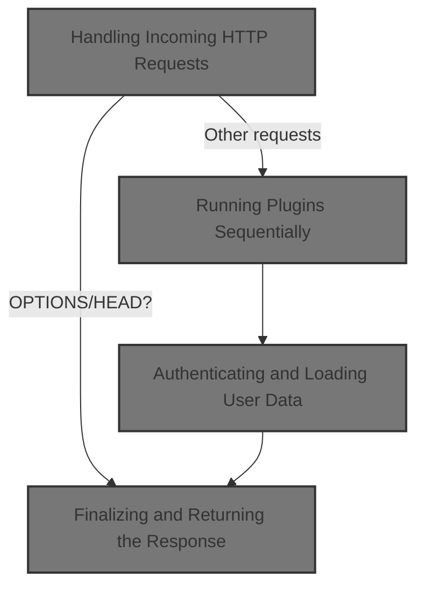
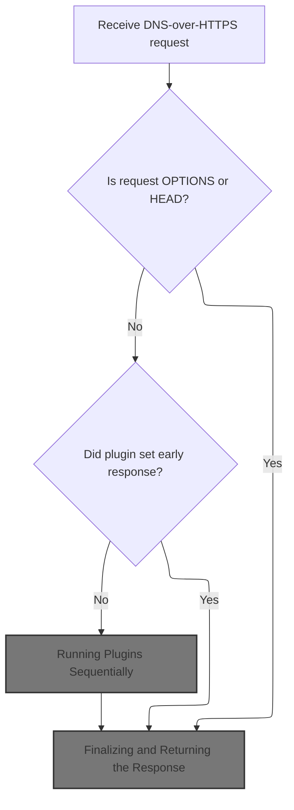
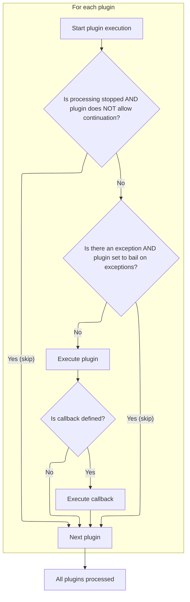

This document describes how DNS-over-HTTPS requests are processed to provide user-specific DNS responses. The flow supports authentication, custom DNS resolution, and blocklist enforcement, allowing the system to tailor DNS answers for each user. Incoming requests are handled, plugins are <SwmPath>[run](run)</SwmPath> to process logic, user data is loaded, and DNS information is extracted before returning the final response.



# Handling Incoming HTTP Requests



<SwmSnippet path="/src/core/doh.js" line="33">

---

In <SwmToken path="src/core/doh.js" pos="33:4:4" line-data="async function proxyRequest(event) {">`proxyRequest`</SwmToken>, we start by handling OPTIONS and HEAD requests right away with a 204 response—no need to process those further. Then we set up <SwmToken path="src/core/doh.js" pos="37:9:9" line-data="  const io = new IOState();">`IOState`</SwmToken> and <SwmToken path="src/core/doh.js" pos="41:9:9" line-data="    const plugin = new RethinkPlugin(event);">`RethinkPlugin`</SwmToken> to manage the request's state and plugin logic. If the plugin's init sets an early response, we return it immediately (with CORS headers). Otherwise, we move on to running the plugin logic, but we wrap it in a timeout so we don't hang forever if something goes wrong. Calling into <SwmPath>[src/core/plugin.js](src/core/plugin.js)</SwmPath> next lets us <SwmPath>[run](run)</SwmPath> the actual plugin logic for the request.

```javascript
async function proxyRequest(event) {
  if (optionsRequest(event.request)) return util.respond204();
  if (headRequest(event.request)) return util.respond204();

  const io = new IOState();
  const ua = event.request.headers.get("User-Agent");

  try {
    const plugin = new RethinkPlugin(event);
    await plugin.initIoState(io);

    // if an early response has been set by plugin.initIoState, return it
    if (io.httpResponse) {
      return withCors(io, ua);
    }

    await util.timedSafeAsyncOp(
      /* op*/ () => plugin.execute(),
```

---

</SwmSnippet>

## Running Plugins Sequentially



<SwmSnippet path="/src/core/plugin.js" line="143">

---

<SwmToken path="src/core/plugin.js" pos="143:3:3" line-data="  async execute() {">`execute`</SwmToken> runs plugins in order, skipping ones based on io flags, and calls their exec and optional callback. Next up is <SwmPath>[src/…/users/user-op.js](src/plugins/users/user-op.js)</SwmPath> for user logic.

```javascript
  async execute() {
    const io = this.io;
    // const rxid = this.ctx.get("rxid");
    for (const p of this.plugin) {
      if (io.stopProcessing && !p.continueOnStopProcess) {
        continue;
      }
      if (io.isException && p.bailOnException) {
        continue;
      }

      const res = await p.module.exec(makectx(this.ctx, p.pctx));

      if (typeof p.callback === "function") {
        await p.callback.call(this, res, io);
      }
    }
  }
```

---

</SwmSnippet>

## Authenticating and Loading User Data

```mermaid
%%{init: {"flowchart": {"defaultRenderer": "elk"}} }%%
flowchart TD
  node1["Authenticate user operation using request context"]
  click node1 openCode "src/plugins/users/user-op.js:38:39"
  node1 --> node2{"Authentication successful?"}
  click node2 openCode "src/plugins/users/user-op.js:39:43"
  node2 -->|"Yes"| node3["Load user data and include authentication result"]
  click node3 openCode "src/plugins/users/user-op.js:42:44"
  node2 -->|"No"| node4["Return authentication error and include authentication result"]
  click node4 openCode "src/plugins/users/user-op.js:40:44"
  node3 --> node5["Return response"]
  click node5 openCode "src/plugins/users/user-op.js:49:50"
  node4 --> node5
  node6["If an error occurs, return error response"]
  click node6 openCode "src/plugins/users/user-op.js:45:47"
  node6 --> node5
classDef HeadingStyle fill:#777777,stroke:#333,stroke-width:2px;

%% Swimm:
%% %%{init: {"flowchart": {"defaultRenderer": "elk"}} }%%
%% flowchart TD
%%   node1["Authenticate user operation using request context"]
%%   click node1 openCode "<SwmPath>[src/…/users/user-op.js](src/plugins/users/user-op.js)</SwmPath>:38:39"
%%   node1 --> node2{"Authentication successful?"}
%%   click node2 openCode "<SwmPath>[src/…/users/user-op.js](src/plugins/users/user-op.js)</SwmPath>:39:43"
%%   node2 -->|"Yes"| node3["Load user data and include authentication result"]
%%   click node3 openCode "<SwmPath>[src/…/users/user-op.js](src/plugins/users/user-op.js)</SwmPath>:42:44"
%%   node2 -->|"No"| node4["Return authentication error and include authentication result"]
%%   click node4 openCode "<SwmPath>[src/…/users/user-op.js](src/plugins/users/user-op.js)</SwmPath>:40:44"
%%   node3 --> node5["Return response"]
%%   click node5 openCode "<SwmPath>[src/…/users/user-op.js](src/plugins/users/user-op.js)</SwmPath>:49:50"
%%   node4 --> node5
%%   node6["If an error occurs, return error response"]
%%   click node6 openCode "<SwmPath>[src/…/users/user-op.js](src/plugins/users/user-op.js)</SwmPath>:45:47"
%%   node6 --> node5
%% classDef HeadingStyle fill:#777777,stroke:#333,stroke-width:2px;
```



<SwmSnippet path="/src/plugins/users/user-op.js" line="34">

---

In <SwmToken path="src/plugins/users/user-op.js" pos="34:3:3" line-data="  async exec(ctx) {">`exec`</SwmToken> (<SwmPath>[src/…/users/user-op.js](src/plugins/users/user-op.js)</SwmPath>), we start by prepping an empty response and then immediately call <SwmToken path="src/plugins/users/user-op.js" pos="38:9:11" line-data="      const out = await token.auth(ctx.rxid, ctx.request.url);">`token.auth`</SwmToken> to check if the request is authorized. If auth passes, we move on to loading user data; if not, we return an error. We call into <SwmPath>[src/…/users/auth-token.js](src/plugins/users/auth-token.js)</SwmPath> next to actually perform the authentication logic.

```javascript
  async exec(ctx) {
    let res = pres.emptyResponse();

    try {
      const out = await token.auth(ctx.rxid, ctx.request.url);
```

---

</SwmSnippet>

<SwmSnippet path="/src/plugins/users/auth-token.js" line="63">

---

<SwmToken path="src/plugins/users/auth-token.js" pos="63:6:6" line-data="export async function auth(rxid, url) {">`auth`</SwmToken> (<SwmPath>[src/…/users/auth-token.js](src/plugins/users/auth-token.js)</SwmPath>) pulls access keys from env, allows all if they're empty, then grabs a message key from the URL. For each domain in the URL, it generates hex keys and checks if any access key matches the start of the generated hex key. If so, access is granted; otherwise, it's denied. This is a custom key scheme tied to both the key and the domain.

```javascript
export async function auth(rxid, url) {
  const accesskeys = envutil.accessKeys();

  // empty access key, allow all
  if (util.emptySet(accesskeys)) {
    return Outcome.none();
  }
  const msg = rdnsutil.msgkeyFromUrl(url);
  // if missing msg-key in url, deny
  if (util.emptyString(msg)) {
    log.w(rxid, "auth: stop! missing access-key in", url);
    return Outcome.miss();
  }

  let ok = false;
  let a6 = "";
  // eval [s2.domain.tld, domain.tld] from a hostname
  // like s0.s1.s2.domain.tld
  for (const dom of util.domains(url)) {
    if (util.emptyString(dom)) continue;

    const [hex, hexcat] = await gen(msg, dom);

    log.d(rxid, msg, dom, "<= msg/h :auth: hex/k =>", hexcat, accesskeys);

    // allow if access-key (upto its full len) matches calculated hex
    for (const ak of accesskeys) {
      ok = hexcat.startsWith(ak);
      if (ok) {
        return Outcome.pass();
      } else {
        const [d, h] = ak.split(akdelim);
        a6 += d + akdelim + h.slice(0, 6) + " ";
      }
    }

    const h6 = dom + akdelim + hex.slice(0, 6);
    log.w(rxid, "auth: key mismatch want:", a6, "have:", h6);
  }
```

---

</SwmSnippet>

<SwmSnippet path="/src/plugins/users/user-op.js" line="39">

---

Just back from <SwmPath>[src/…/users/auth-token.js](src/plugins/users/auth-token.js)</SwmPath>, we check if auth passed. If not, we set an error response. If it did, we call <SwmToken path="src/plugins/users/user-op.js" pos="42:7:7" line-data="        res = this.loadUser(ctx);">`loadUser`</SwmToken> to fetch user-specific data. Either way, we attach the auth result to the response. This wraps up the <SwmPath>[src/…/users/user-op.js](src/plugins/users/user-op.js)</SwmPath> logic.

```javascript
      if (!out.ok) {
        res = pres.errResponse("UserOp:Auth", new Error("auth failed"));
      } else {
        res = this.loadUser(ctx);
      }
      res.data.userAuth = out;
    } catch (ex) {
      res = pres.errResponse("UserOp", ex);
    }

    return res;
  }
```

---

</SwmSnippet>

## Extracting User and DNS Info

```mermaid
%%{init: {"flowchart": {"defaultRenderer": "elk"}} }%%
flowchart TD
  node1["Receive DNS request"]
  click node1 openCode "src/plugins/users/user-op.js:56:59"
  node1 --> node2{"Is DNS message?"}
  click node2 openCode "src/plugins/users/user-op.js:59:62"
  node2 -->|"No"| node3["Ignore request"]
  click node3 openCode "src/plugins/users/user-op.js:61:62"
  node2 -->|"Yes"| node4["Process domains"]
  click node4 openCode "src/plugins/users/user-op.js:65:72"

  subgraph loop1["For each domain in request"]
    node4 --> node5{"Is domain delegated?"}
    click node5 openCode "src/plugins/users/user-op.js:68:71"
    node5 -->|"Delegated"| node6["Set resolver URL to primary"]
    click node6 openCode "src/plugins/users/user-op.js:70:71"
    node5 -->|"Not Delegated"| node7["Next domain"]
    click node7 openCode "src/plugins/users/user-op.js:72:72"
    node6 --> node7
    node7 --> node8["After all domains"]
    click node8 openCode "src/plugins/users/user-op.js:72:74"
  end

  node8 --> node9{"Is blocklist flag present?"}
  click node9 openCode "src/plugins/users/user-op.js:74:76"
  node9 -->|"No"| node10["Continue without blocklist info"]
  click node10 openCode "src/plugins/users/user-op.js:77:78"
  node9 -->|"Yes"| node11{"Is blocklist data available?"}
  click node11 openCode "src/plugins/users/user-op.js:80:81"
  node11 -->|"No"| node12["Fetch and cache blocklist data"]
  click node12 openCode "src/plugins/users/user-op.js:84:93"
  node11 -->|"Yes"| node13["Update response with blocklist info"]
  click node13 openCode "src/plugins/users/user-op.js:99:102"
  node12 --> node13
  node10 --> node14["Return response"]
  node13 --> node14
  click node14 openCode "src/plugins/users/user-op.js:109:110"
classDef HeadingStyle fill:#777777,stroke:#333,stroke-width:2px;

%% Swimm:
%% %%{init: {"flowchart": {"defaultRenderer": "elk"}} }%%
%% flowchart TD
%%   node1["Receive DNS request"]
%%   click node1 openCode "<SwmPath>[src/…/users/user-op.js](src/plugins/users/user-op.js)</SwmPath>:56:59"
%%   node1 --> node2{"Is DNS message?"}
%%   click node2 openCode "<SwmPath>[src/…/users/user-op.js](src/plugins/users/user-op.js)</SwmPath>:59:62"
%%   node2 -->|"No"| node3["Ignore request"]
%%   click node3 openCode "<SwmPath>[src/…/users/user-op.js](src/plugins/users/user-op.js)</SwmPath>:61:62"
%%   node2 -->|"Yes"| node4["Process domains"]
%%   click node4 openCode "<SwmPath>[src/…/users/user-op.js](src/plugins/users/user-op.js)</SwmPath>:65:72"
%% 
%%   subgraph loop1["For each domain in request"]
%%     node4 --> node5{"Is domain delegated?"}
%%     click node5 openCode "<SwmPath>[src/…/users/user-op.js](src/plugins/users/user-op.js)</SwmPath>:68:71"
%%     node5 -->|"Delegated"| node6["Set resolver URL to primary"]
%%     click node6 openCode "<SwmPath>[src/…/users/user-op.js](src/plugins/users/user-op.js)</SwmPath>:70:71"
%%     node5 -->|"Not Delegated"| node7["Next domain"]
%%     click node7 openCode "<SwmPath>[src/…/users/user-op.js](src/plugins/users/user-op.js)</SwmPath>:72:72"
%%     node6 --> node7
%%     node7 --> node8["After all domains"]
%%     click node8 openCode "<SwmPath>[src/…/users/user-op.js](src/plugins/users/user-op.js)</SwmPath>:72:74"
%%   end
%% 
%%   node8 --> node9{"Is blocklist flag present?"}
%%   click node9 openCode "<SwmPath>[src/…/users/user-op.js](src/plugins/users/user-op.js)</SwmPath>:74:76"
%%   node9 -->|"No"| node10["Continue without blocklist info"]
%%   click node10 openCode "<SwmPath>[src/…/users/user-op.js](src/plugins/users/user-op.js)</SwmPath>:77:78"
%%   node9 -->|"Yes"| node11{"Is blocklist data available?"}
%%   click node11 openCode "<SwmPath>[src/…/users/user-op.js](src/plugins/users/user-op.js)</SwmPath>:80:81"
%%   node11 -->|"No"| node12["Fetch and cache blocklist data"]
%%   click node12 openCode "<SwmPath>[src/…/users/user-op.js](src/plugins/users/user-op.js)</SwmPath>:84:93"
%%   node11 -->|"Yes"| node13["Update response with blocklist info"]
%%   click node13 openCode "<SwmPath>[src/…/users/user-op.js](src/plugins/users/user-op.js)</SwmPath>:99:102"
%%   node12 --> node13
%%   node10 --> node14["Return response"]
%%   node13 --> node14
%%   click node14 openCode "<SwmPath>[src/…/users/user-op.js](src/plugins/users/user-op.js)</SwmPath>:109:110"
%% classDef HeadingStyle fill:#777777,stroke:#333,stroke-width:2px;
```



<SwmSnippet path="/src/plugins/users/user-op.js" line="56">

---

In <SwmToken path="src/plugins/users/user-op.js" pos="56:1:1" line-data="  loadUser(ctx) {">`loadUser`</SwmToken>, we bail out early if the context isn't a DNS message. If it is, we extract domains from the DNS packet and check if any are delegated. If so, we set the DNS resolver URL in the response to the primary DoH resolver. This ties user data to DNS delegation.

```javascript
  loadUser(ctx) {
    const response = pres.emptyResponse();

    if (!ctx.isDnsMsg) {
      this.log.w(ctx.rxid, "not a dns-msg, ignore");
      return response;
    }

    try {
      const dnsPacket = ctx.requestDecodedDnsPacket;
      const domains = dnsutil.extractDomains(dnsPacket);
      for (const d of domains) {
        if (delegated.has(d)) {
          // may be overriden by user-preferred doh upstream
          response.data.dnsResolverUrl = envutil.primaryDohResolver();
        }
      }
```

---

</SwmSnippet>

<SwmSnippet path="/src/plugins/users/user-op.js" line="74">

---

After extracting domains, we pull a blocklist flag from the URL. If it's present, we check the cache for user config data. If not cached, we decode and validate it, then cache it. If valid, we add blocklist info and the flag to the response. This keeps user-specific blocklist settings handy for later use.

```javascript
      const blocklistFlag = rdnsutil.blockstampFromUrl(ctx.request.url);
      const hasflag = !util.emptyString(blocklistFlag);
      if (!hasflag) {
        this.log.d(ctx.rxid, "empty blocklist-flag", ctx.request.url);
      }
      // blocklistFlag may be invalid, ref rdnsutil.blockstampFromUrl
      let r = this.userConfigCache.get(blocklistFlag);
      let hasdata = rdnsutil.hasBlockstamp(r);
      if (hasflag && !hasdata) {
        // r not in cache
        r = rdnsutil.unstamp(blocklistFlag); // r is never null, may throw ex
        hasdata = rdnsutil.hasBlockstamp(r);

        if (hasdata) {
          this.log.d(ctx.rxid, "new cfg cache kv", blocklistFlag, r);
          // TODO: blocklistFlag is not normalized, ie b32 used for dot isn't
          // converted to its b64 form (which doh and rethinkdns modules use)
          // example, b32: 1-AABABAA / equivalent b64: 1:AAIAgA==
          this.userConfigCache.put(blocklistFlag, r);
        }
      } else {
        this.log.d(ctx.rxid, "cfg cache hit?", hasdata, blocklistFlag, r);
      }

      if (hasdata) {
        response.data.userBlocklistInfo = r;
        response.data.userBlocklistFlag = blocklistFlag;
        // TODO: override response.data.dnsResolverUrl
      }
    } catch (e) {
      this.log.e(ctx.rxid, "loadUser", e);
      // avoid erroring out on invalid blocklist info & flag
      // response = pres.errResponse("UserOp:loadUser", e);
    }

    return response;
  }
```

---

</SwmSnippet>

## Finalizing and Returning the Response

<SwmSnippet path="/src/core/doh.js" line="51">

---

Just back from <SwmPath>[src/core/plugin.js](src/core/plugin.js)</SwmPath>, we wrap up <SwmToken path="src/core/doh.js" pos="33:4:4" line-data="async function proxyRequest(event) {">`proxyRequest`</SwmToken> by returning the response (or an error if something went wrong or timed out), always with CORS headers. If plugin execution times out, we call <SwmToken path="src/core/doh.js" pos="52:15:15" line-data="      /* onTimeout*/ () =&gt; Promise.resolve(errorResponse(io))">`errorResponse`</SwmToken> to generate a fallback error. This keeps things snappy and browser-friendly.

```javascript
      /* waitMs*/ dnsutil.requestTimeout(),
      /* onTimeout*/ () => Promise.resolve(errorResponse(io))
    );
  } catch (err) {
    log.e("doh", "proxy-request error", err.stack);
    errorResponse(io, err);
  }

  return withCors(io, ua);
}
```

---

</SwmSnippet>

&nbsp;

*This is an auto-generated document by Swimm 🌊 and has not yet been verified by a human*

<SwmMeta version="3.0.0" repo-id="Z2l0aHViJTNBJTNBamF2YXNjcmlwdC1zZXJ2ZXJsZXNzLWRucyUzQSUzQXJpY2FyZG9sb3Blemc=" repo-name="javascript-serverless-dns"><sup>Powered by [Swimm](https://app.swimm.io/)</sup></SwmMeta>
