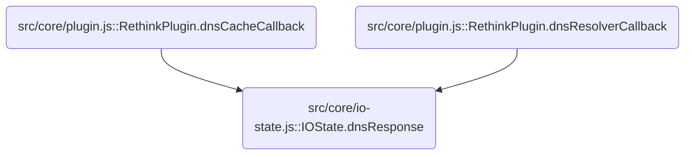
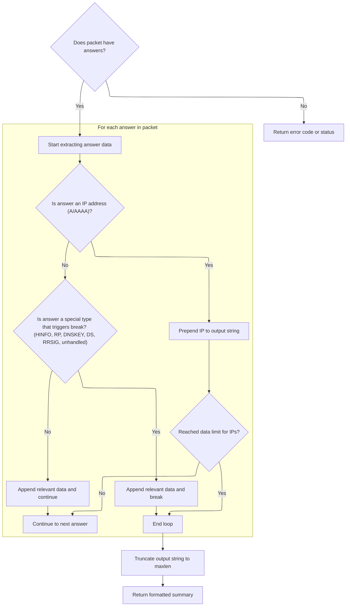

This document describes how DNS packets received from the network are processed and transformed into HTTP responses for clients. The flow includes inspection, optional modification for gateway responses, logging for debugging, and extraction of relevant answer data before building the final HTTP response.

# Where is this flow used?

This flow is used multiple times in the codebase as represented in the following diagram:



# Handling the DNS response and prepping for logging

<SwmSnippet path="/src/core/io-state.js" line="150">

---

In <SwmToken path="src/core/io-state.js" pos="150:1:1" line-data="  dnsResponse(arrayBuffer, dnsPacket = null, blockflag = null) {">`dnsResponse`</SwmToken>, we start by checking if the buffer is empty and bail if so. We then set some flags and possibly modify the packet if a gateway response is needed. The next step is to call <SwmToken path="src/core/io-state.js" pos="169:3:3" line-data="    this.logDnsPkt();">`logDnsPkt`</SwmToken> to record the DNS packet state right after any changes, so our logs match what we're about to send out.

```javascript
  dnsResponse(arrayBuffer, dnsPacket = null, blockflag = null) {
    if (bufutil.emptyBuf(arrayBuffer)) {
      return;
    }

    this.stopProcessing = true;
    this.flag = blockflag || "";

    // gw responses only assigned on A/AAAA/HTTPS/SVCB records
    // TODO: ALT-SVC records
    const isGwAns = this.assignGatewayResponseIfNeeded();
    if (isGwAns) {
      // overwrite the existing packet (raw) as in the new decoded-packed
      arrayBuffer = dnsutil.encode(this.decodedDnsPacket);
    } else {
      // overwrite the existing packet (decoded) as in the sent array-buffer
      this.decodedDnsPacket = dnsPacket || dnsutil.decode(arrayBuffer);
    }

    this.logDnsPkt();
```

---

</SwmSnippet>

## Logging DNS packet details for debugging

<SwmSnippet path="/src/core/io-state.js" line="175">

---

<SwmToken path="src/core/io-state.js" pos="175:1:1" line-data="  logDnsPkt() {">`logDnsPkt`</SwmToken> grabs key details from the DNS packet—domains, query type, answer data, and TTL—using dnsutil helpers. This is only done outside production, and it assumes the packet is already decoded and ready for inspection. Next, we call dnsutil functions to extract these fields for logging.

```javascript
  logDnsPkt() {
    if (this.isProd) return;
    this.log.d(
      "domains",
      dnsutil.extractDomains(this.decodedDnsPacket),
      dnsutil.getQueryType(this.decodedDnsPacket) || "",
      "data",
      dnsutil.getInterestingAnswerData(this.decodedDnsPacket),
      dnsutil.ttl(this.decodedDnsPacket)
    );
  }
```

---

</SwmSnippet>

## Extracting relevant DNS answer data



<SwmSnippet path="/src/commons/dnsutil.js" line="434">

---

In <SwmToken path="src/commons/dnsutil.js" pos="434:4:4" line-data="export function getInterestingAnswerData(packet, maxlen = 80, delim = &quot;|&quot;) {">`getInterestingAnswerData`</SwmToken>, we loop through DNS answers and selectively extract fields based on type. <SwmToken path="src/commons/dnsutil.js" pos="446:5:5" line-data="    // capturing IPs in A / AAAA records appearing later in ans">`IPs`</SwmToken> from <SwmToken path="src/core/io-state.js" pos="158:13:15" line-data="    // gw responses only assigned on A/AAAA/HTTPS/SVCB records">`A/AAAA`</SwmToken> records get prepended, while other types append their relevant data. We use length limits and break early for some types to keep the output concise and focused. Special handling for <SwmToken path="src/core/io-state.js" pos="158:17:19" line-data="    // gw responses only assigned on A/AAAA/HTTPS/SVCB records">`HTTPS/SVCB`</SwmToken> records grabs IP hints if present.

```javascript
export function getInterestingAnswerData(packet, maxlen = 80, delim = "|") {
  if (!hasAnswers(packet)) {
    return !util.emptyObj(packet) ? packet.rcode || "WTF1" : "WTF2";
  }

  // set to true if at least one ip has been captured from ans
  let atleastoneip = false;
  let str = "";
  for (const a of packet.answers) {
    // gather twice the maxlen to capture as much as possible:
    // ips are usually prepend to the front, and going 2 times
    // over maxlen (chosen arbitrarily) maximises chances of
    // capturing IPs in A / AAAA records appearing later in ans
    if (atleastoneip && str.length > maxlen) break;
    if (!atleastoneip && str.length > maxlen * 2) break;

    if (isAnswerA(a) || isAnswerAAAA(a)) {
      const dat = a.data || "";
      // prepend A / AAAA data
      if (!util.emptyString(dat)) str = dat + delim + str;
      atleastoneip = true;
    } else if (isAnswerOPTION(a) || isAnswerNS(a) || isAnswerTXT(a)) {
      // ns: github.com/mafintosh/dns-packet/blob/31d3caf3/index.js#L249
      // txt: github.com/mafintosh/dns-packet/blob/31d3caf3/index.js#L370
      // opt: github.com/mafintosh/dns-packet/blob/31d3caf3/index.js#L773
      const dat = a.data || "";
      if (!util.emptyString(dat)) str += dat + delim;
    } else if (isAnswerSOA(a)) {
      // github.com/mafintosh/dns-packet/blob/31d3caf3/index.js#L284
      str += a.data.mname + delim;
    } else if (isAnswerHINFO(a)) {
      // github.com/mafintosh/dns-packet/blob/31d3caf3/index.js#L450
      str += a.data.os + delim;
      break;
    } else if (isAnswerSRV(a)) {
      // github.com/mafintosh/dns-packet/blob/31d3caf3/index.js#L521
      str += a.data.target + delim;
    } else if (isAnswerCAA(a)) {
      // github.com/mafintosh/dns-packet/blob/31d3caf3/index.js#L574
      str += a.data.value + delim;
    } else if (isAnswerMX(a)) {
      // github.com/mafintosh/dns-packet/blob/31d3caf3/index.js#L618
      str += a.data.exchange + delim;
    } else if (isAnswerRP(a)) {
      // github.com/mafintosh/dns-packet/blob/31d3caf3/index.js#L1027
      str += a.data.mbox + delim;
      break;
    } else if (isAnswerHttps(a)) {
      // https/svcb answers may have a A / AAAA records
      // github.com/serverless-dns/dns-parser/blob/b7d73b3d/index.js#L1381
      const t = a.data.targetName;
      const kv = a.data.svcParams;
      if (t === ".") {
        if (util.emptyObj(kv)) continue;
        // if svcb/https is self-referential, then prepend ip hints, if any
        if (
          !util.emptyArray(kv.ipv4hint) &&
          !util.emptyString(kv.ipv4hint[0])
        ) {
          str = kv.ipv4hint[0] + delim + str;
          atleastoneip = true;
        }
        if (
          !util.emptyArray(kv.ipv6hint) &&
          !util.emptyString(kv.ipv6hint[0])
        ) {
          str = kv.ipv6hint[0] + delim + str;
          atleastoneip = true;
        }
      } else {
        str += t + delim;
      }
    } else if (isAnswerDNSKEY(a)) {
      // github.com/mafintosh/dns-packet/blob/31d3caf3/index.js#L914
      str += bufutil.bytesToBase64Url(a.data.key) + delim;
      break;
    } else if (isAnswerDS(a)) {
      // ds: github.com/mafintosh/dns-packet/blob/31d3caf3/index.js#L1279
      str += bufutil.bytesToBase64Url(a.data.digest) + delim;
      break;
    } else if (isAnswerRRSIG(a)) {
      // rrsig: github.com/mafintosh/dns-packet/blob/31d3caf3/index.js#L984
      str += bufutil.bytesToBase64Url(a.data.signature) + delim;
      break;
    } else if (isAnswerCname(a)) {
      str += a.data + delim;
    } else {
      // unhanlded types:
      // null, ptr, ds, nsec, nsec3, nsec3param, tlsa, sshfp, spf, dname
      break;
    }
  }
```

---

</SwmSnippet>

<SwmSnippet path="/src/commons/dnsutil.js" line="527">

---

After building the answer string, we truncate it to maxlen and cut at the last delimiter so we only return complete fields. This keeps the output tidy and avoids partial data. The constants for length and delimiter shape how much and what format gets returned.

```javascript
  const trunc = util.strstr(str, 0, maxlen);
  const idx = trunc.lastIndexOf(delim);
  return idx >= 0 ? util.strstr(trunc, 0, idx) : trunc;
}
```

---

</SwmSnippet>

## Building the HTTP response from DNS data

<SwmSnippet path="/src/core/io-state.js" line="170">

---

Back in <SwmToken path="src/core/io-state.js" pos="150:1:1" line-data="  dnsResponse(arrayBuffer, dnsPacket = null, blockflag = null) {">`dnsResponse`</SwmToken>, after logging the packet, we wrap the (possibly modified) DNS packet in an HTTP response and set headers. The logging step doesn't affect the response content, but it means we have a debug record of what we're sending out.

```javascript
    this.httpResponse = new Response(arrayBuffer, {
      headers: this.headers(arrayBuffer),
    });
  }
```

---

</SwmSnippet>

&nbsp;

*This is an auto-generated document by Swimm 🌊 and has not yet been verified by a human*

<SwmMeta version="3.0.0" repo-id="Z2l0aHViJTNBJTNBamF2YXNjcmlwdC1zZXJ2ZXJsZXNzLWRucyUzQSUzQXJpY2FyZG9sb3Blemc=" repo-name="javascript-serverless-dns"><sup>Powered by [Swimm](https://app.swimm.io/)</sup></SwmMeta>
