This document explains how users interact with DNS and blocklist management features by sending HTTP GET requests. The flow identifies the request type, prepares filters, and executes commands such as blocklist conversion, domain filtering, or page redirection, returning the result to the user.

# Entry Point: Handling Incoming Requests

<SwmSnippet path="/src/plugins/command-control/cc.js" line="49">

---

<SwmToken path="src/plugins/command-control/cc.js" pos="49:3:3" line-data="  async exec(ctx) {">`exec`</SwmToken> is the entry point for handling requests. It checks if the request is a GET, and if so, passes control to <SwmToken path="src/plugins/command-control/cc.js" pos="52:7:7" line-data="      return await this.commandOperation(">`commandOperation`</SwmToken> with relevant context. Non-GET requests are ignored and get an empty response. We call <SwmToken path="src/plugins/command-control/cc.js" pos="52:7:7" line-data="      return await this.commandOperation(">`commandOperation`</SwmToken> next because that's where all the actual command logic lives, including parsing and executing user commands.

```javascript
  async exec(ctx) {
    // process only GET requests, ignore all others
    if (util.isGetRequest(ctx.request)) {
      return await this.commandOperation(
        ctx.rxid,
        ctx.request,
        ctx.isDnsMsg,
        ctx.userAuth,
        ctx.lid
      );
    }

    // no-op
    return pres.emptyResponse();
  }
```

---

</SwmSnippet>

# Command Parsing and Blocklist Preparation

```mermaid
%%{init: {"flowchart": {"defaultRenderer": "elk"}} }%%
flowchart TD
  node1["Receive HTTP request"] --> node2{"Is DNS command?"}
  click node1 openCode "src/plugins/command-control/cc.js:93:97"
  node2 -->|"Yes"| node3["No operation, continue processing"]
  click node2 openCode "src/plugins/command-control/cc.js:101:105"
  node3 --> node12["Return response"]
  click node3 openCode "src/plugins/command-control/cc.js:103:104"
  node2 -->|"No"| node4["Prepare for command processing"]
  click node4 openCode "src/plugins/command-control/cc.js:108:109"
  node4 --> node5["Determine user command"]
  click node5 openCode "src/plugins/command-control/cc.js:111:121"
  
  subgraph loop1["Loop: Check each possible command"]
    node5 --> node6{"Is this a recognized command?"}
    click node6 openCode "src/plugins/command-control/cc.js:118:121"
    node6 -->|"Yes"| node7["Select this command"]
    click node7 openCode "src/plugins/command-control/cc.js:119:120"
    node6 -->|"No"| node5
  end
  node7 --> node8["Ensure blocklist filter is set up"]
  click node8 openCode "src/plugins/command-control/cc.js:126:127"
  node8 --> node9{"Is blocklist filter set up?"}
  click node9 openCode "src/plugins/command-control/cc.js:128:129"
  node9 -->|"No"| node10["Error: Blocklist filter not set"]
  click node10 openCode "src/plugins/command-control/cc.js:129"
  node10 --> node12["Return response"]
  node9 -->|"Yes"| node11{"Which command?"}
  click node11 openCode "src/plugins/command-control/cc.js:132:185"
  node11 -->|listtob64| node13["Convert blocklists to blockstamp"]
  click node13 openCode "src/plugins/command-control/cc.js:134"
  node11 -->|b64tolist| node14["Convert blockstamp to blocklists"]
  click node14 openCode "src/plugins/command-control/cc.js:137"
  node11 -->|"dntolist"| node15["Convert domain names to blocklists"]
  click node15 openCode "src/plugins/command-control/cc.js:140:147"
  node11 -->|"dntouint"| node16["Convert domain names to flags"]
  click node16 openCode "src/plugins/command-control/cc.js:150:154"
  node11 -->|"search"| node17["Redirect to search page"]
  click node17 openCode "src/plugins/command-control/cc.js:157"
  node11 -->|"genaccesskey"| node18["Generate access key"]
  click node18 openCode "src/plugins/command-control/cc.js:160:163"
  node11 -->|"gentlspsk"| node19["Generate TLS PSK"]
  click node19 openCode "src/plugins/command-control/cc.js:165"
  node11 -->|"analytics"| node20["Redirect to analytics page"]
  click node20 openCode "src/plugins/command-control/cc.js:168:173"
  node11 -->|"logs"| node21["Redirect to logs page"]
  click node21 openCode "src/plugins/command-control/cc.js:176"
  node11 -->|"config/configure/other"| node22["Redirect to configure page"]
  click node22 openCode "src/plugins/command-control/cc.js:179:184"
  node11 -->|"Unknown"| node23["Return error response"]
  click node23 openCode "src/plugins/command-control/cc.js:186:188"
  node13 --> node12["Return response"]
  node14 --> node12
  node15 --> node12
  node16 --> node12
  node17 --> node12
  node18 --> node12
  node19 --> node12
  node20 --> node12
  node21 --> node12
  node22 --> node12
  node23 --> node12
  click node12 openCode "src/plugins/command-control/cc.js:196:197"

classDef HeadingStyle fill:#777777,stroke:#333,stroke-width:2px;

%% Swimm:
%% %%{init: {"flowchart": {"defaultRenderer": "elk"}} }%%
%% flowchart TD
%%   node1["Receive HTTP request"] --> node2{"Is DNS command?"}
%%   click node1 openCode "<SwmPath>[src/…/command-control/cc.js](src/plugins/command-control/cc.js)</SwmPath>:93:97"
%%   node2 -->|"Yes"| node3["No operation, continue processing"]
%%   click node2 openCode "<SwmPath>[src/…/command-control/cc.js](src/plugins/command-control/cc.js)</SwmPath>:101:105"
%%   node3 --> node12["Return response"]
%%   click node3 openCode "<SwmPath>[src/…/command-control/cc.js](src/plugins/command-control/cc.js)</SwmPath>:103:104"
%%   node2 -->|"No"| node4["Prepare for command processing"]
%%   click node4 openCode "<SwmPath>[src/…/command-control/cc.js](src/plugins/command-control/cc.js)</SwmPath>:108:109"
%%   node4 --> node5["Determine user command"]
%%   click node5 openCode "<SwmPath>[src/…/command-control/cc.js](src/plugins/command-control/cc.js)</SwmPath>:111:121"
%%   
%%   subgraph loop1["Loop: Check each possible command"]
%%     node5 --> node6{"Is this a recognized command?"}
%%     click node6 openCode "<SwmPath>[src/…/command-control/cc.js](src/plugins/command-control/cc.js)</SwmPath>:118:121"
%%     node6 -->|"Yes"| node7["Select this command"]
%%     click node7 openCode "<SwmPath>[src/…/command-control/cc.js](src/plugins/command-control/cc.js)</SwmPath>:119:120"
%%     node6 -->|"No"| node5
%%   end
%%   node7 --> node8["Ensure blocklist filter is set up"]
%%   click node8 openCode "<SwmPath>[src/…/command-control/cc.js](src/plugins/command-control/cc.js)</SwmPath>:126:127"
%%   node8 --> node9{"Is blocklist filter set up?"}
%%   click node9 openCode "<SwmPath>[src/…/command-control/cc.js](src/plugins/command-control/cc.js)</SwmPath>:128:129"
%%   node9 -->|"No"| node10["Error: Blocklist filter not set"]
%%   click node10 openCode "<SwmPath>[src/…/command-control/cc.js](src/plugins/command-control/cc.js)</SwmPath>:129"
%%   node10 --> node12["Return response"]
%%   node9 -->|"Yes"| node11{"Which command?"}
%%   click node11 openCode "<SwmPath>[src/…/command-control/cc.js](src/plugins/command-control/cc.js)</SwmPath>:132:185"
%%   node11 -->|<SwmToken path="src/plugins/command-control/cc.js" pos="132:9:9" line-data="      if (command === &quot;listtob64&quot;) {">`listtob64`</SwmToken>| node13["Convert blocklists to blockstamp"]
%%   click node13 openCode "<SwmPath>[src/…/command-control/cc.js](src/plugins/command-control/cc.js)</SwmPath>:134"
%%   node11 -->|<SwmToken path="src/plugins/command-control/cc.js" pos="135:13:13" line-data="      } else if (command === &quot;b64tolist&quot;) {">`b64tolist`</SwmToken>| node14["Convert blockstamp to blocklists"]
%%   click node14 openCode "<SwmPath>[src/…/command-control/cc.js](src/plugins/command-control/cc.js)</SwmPath>:137"
%%   node11 -->|"dntolist"| node15["Convert domain names to blocklists"]
%%   click node15 openCode "<SwmPath>[src/…/command-control/cc.js](src/plugins/command-control/cc.js)</SwmPath>:140:147"
%%   node11 -->|"dntouint"| node16["Convert domain names to flags"]
%%   click node16 openCode "<SwmPath>[src/…/command-control/cc.js](src/plugins/command-control/cc.js)</SwmPath>:150:154"
%%   node11 -->|"search"| node17["Redirect to search page"]
%%   click node17 openCode "<SwmPath>[src/…/command-control/cc.js](src/plugins/command-control/cc.js)</SwmPath>:157"
%%   node11 -->|"genaccesskey"| node18["Generate access key"]
%%   click node18 openCode "<SwmPath>[src/…/command-control/cc.js](src/plugins/command-control/cc.js)</SwmPath>:160:163"
%%   node11 -->|"gentlspsk"| node19["Generate TLS PSK"]
%%   click node19 openCode "<SwmPath>[src/…/command-control/cc.js](src/plugins/command-control/cc.js)</SwmPath>:165"
%%   node11 -->|"analytics"| node20["Redirect to analytics page"]
%%   click node20 openCode "<SwmPath>[src/…/command-control/cc.js](src/plugins/command-control/cc.js)</SwmPath>:168:173"
%%   node11 -->|"logs"| node21["Redirect to logs page"]
%%   click node21 openCode "<SwmPath>[src/…/command-control/cc.js](src/plugins/command-control/cc.js)</SwmPath>:176"
%%   node11 -->|"config/configure/other"| node22["Redirect to configure page"]
%%   click node22 openCode "<SwmPath>[src/…/command-control/cc.js](src/plugins/command-control/cc.js)</SwmPath>:179:184"
%%   node11 -->|"Unknown"| node23["Return error response"]
%%   click node23 openCode "<SwmPath>[src/…/command-control/cc.js](src/plugins/command-control/cc.js)</SwmPath>:186:188"
%%   node13 --> node12["Return response"]
%%   node14 --> node12
%%   node15 --> node12
%%   node16 --> node12
%%   node17 --> node12
%%   node18 --> node12
%%   node19 --> node12
%%   node20 --> node12
%%   node21 --> node12
%%   node22 --> node12
%%   node23 --> node12
%%   click node12 openCode "<SwmPath>[src/…/command-control/cc.js](src/plugins/command-control/cc.js)</SwmPath>:196:197"
%% 
%% classDef HeadingStyle fill:#777777,stroke:#333,stroke-width:2px;
```



<SwmSnippet path="/src/plugins/command-control/cc.js" line="93">

---

In <SwmToken path="src/plugins/command-control/cc.js" pos="93:3:3" line-data="  async commandOperation(rxid, req, isDnsCmd, auth, lid) {">`commandOperation`</SwmToken>, we parse the request URL, check if it's a DNS command, and if not, set up for command handling. We extract possible commands from the URL and pick the relevant one. This sets up the context for blocklist and command execution.

```javascript
  async commandOperation(rxid, req, isDnsCmd, auth, lid) {
    const url = req.url;
    let response = pres.emptyResponse();

    try {
      const reqUrl = new URL(url);
      const queryString = reqUrl.searchParams;

      if (isDnsCmd) {
        this.log.d(rxid, "cc no-op: dns-msg not cc-msg");
        response.data.stopProcessing = false;
        return response;
      } else {
        // non-dns GET requests are exclusively handled here
        // and have to return a httpResponse obj
        response.data.stopProcessing = true;
      }

      const cmds = this.userCommands(reqUrl, isDnsCmd);
      const b64UserFlag = this.userFlag(url, isDnsCmd);
      // if userflag is same as cmd1, then cmd2 must be the actual cmd
      // consider urls: r.tld/cmd/flag & r.tld/flag/cmd
      // by default, treat cmd1 (at path[1]) as cmd, regardless
      let command = cmds[0];
      for (const c of cmds) {
        if (this.isAnyCmd(c)) {
          command = c;
          break;
        }
      }
```

---

</SwmSnippet>

<SwmSnippet path="/src/plugins/command-control/cc.js" line="126">

---

Before handling commands, we make sure the blocklist filter is ready by calling its init method. This is needed because most commands rely on blocklist data, so we can't proceed until it's available.

```javascript
      // blocklistFilter may not have been setup, so set it up
      await this.bw.init(rxid, /* force-wait */ true);
```

---

</SwmSnippet>

<SwmSnippet path="/src/plugins/rethinkdns/main.js" line="51">

---

<SwmToken path="src/plugins/rethinkdns/main.js" pos="51:3:3" line-data="  async init(rxid, forceget = false) {">`init`</SwmToken> checks if the blocklist filter is ready or disabled and returns if so. If not, it decides whether to start a new blocklist construction, wait for an ongoing one, or return immediately based on timing and flags. This manages blocklist readiness and concurrency for downstream commands.

```javascript
  async init(rxid, forceget = false) {
    if (this.isBlocklistFilterSetup() || this.disabled()) {
      const blres = pres.emptyResponse();
      blres.data.blocklistFilter = this.blocklistFilter; // may be nil
      return blres;
    }

    try {
      const now = Date.now();

      if (
        !this.isBlocklistUnderConstruction ||
        // it has been a while, queue another blocklist-construction
        now - this.startTime > envutil.downloadTimeout() * 2
      ) {
        this.log.i(rxid, "download blocklists", now, this.startTime);
        return this.initBlocklistConstruction(rxid, now);
      } else if (this.nowait && !forceget) {
        // blocklist-construction is in progress, but we don't have to
        // wait for it to finish. So, return an empty response.
        this.log.i(rxid, "nowait, but blocklist construction ongoing");
        return pres.emptyResponse();
      } else {
        // someone's constructing... wait till finished
        return this.waitUntilDone(rxid);
      }
    } catch (e) {
      this.log.e(rxid, "main", e.stack);
      return pres.errResponse("blocklistWrapper", e);
    }
  }
```

---

</SwmSnippet>

<SwmSnippet path="/src/plugins/command-control/cc.js" line="128">

---

Back in <SwmToken path="src/plugins/command-control/cc.js" pos="52:7:7" line-data="      return await this.commandOperation(">`commandOperation`</SwmToken>, after blocklist setup, we check the command type. For 'dntolist', we call <SwmToken path="src/plugins/command-control/cc.js" pos="140:11:11" line-data="        response.data.httpResponse = await domainNameToList(">`domainNameToList`</SwmToken> to resolve domains and filter them using the blocklist. Other commands branch off to their respective handlers.

```javascript
      const blf = this.bw.getBlocklistFilter();
      if (!rdnsutil.isBlocklistFilterSetup(blf)) throw new Error("no blf");
      const blfts = this.bw.timestamp(); // throws err if basicconfig is not set

      if (command === "listtob64") {
        // convert blocklists (tags) to blockstamp (b64)
        response.data.httpResponse = listToB64(queryString);
      } else if (command === "b64tolist") {
        // convert blockstamp (b64) to blocklists (tags)
        response.data.httpResponse = b64ToList(queryString, blf);
      } else if (command === "dntolist") {
        // convert names to blocklists (tags)
        response.data.httpResponse = await domainNameToList(
          rxid,
          this.resolver,
          blfts,
          req,
          queryString,
          blf
        );
```

---

</SwmSnippet>

<SwmSnippet path="/src/plugins/command-control/cc.js" line="306">

---

<SwmToken path="src/plugins/command-control/cc.js" pos="306:4:4" line-data="async function domainNameToList(">`domainNameToList`</SwmToken> takes a domain name, builds a DNS query, forces DNS over HTTPS resolution, decodes the response, extracts domains, and filters them through the blocklist. The result is a JSON object with the domain, timestamp, and filtered entries.

```javascript
async function domainNameToList(
  rxid,
  resolver,
  ts,
  req,
  queryString,
  blocklistFilter
) {
  const domainName = queryString.get("dn") || "";
  const latestTimestamp = util.bareTimestampFrom(ts);
  const r = {
    domainName: domainName,
    version: latestTimestamp,
    list: {},
  };

  // qid for doh is always 0
  const qid = 0;
  const qs = [
    {
      type: "A",
      name: domainName,
    },
  ];
  // only doh truly works across runtimes, workers/fastly/node/deno
  const forcedoh = true;
  const query = dnsutil.mkQ(qid, qs);
  const querypacket = dnsutil.decode(query);
  const rmax = resolver.determineDohResolvers(resolver.ofMax(), forcedoh);
  const res = await resolver.resolveDnsUpstream(
    rxid,
    ts,
    req,
    rmax,
    query,
    querypacket
  );
  const ans = await res.arrayBuffer();
  let anspacket;
  try {
    anspacket = dnsutil.decode(ans);
  } catch (e) {
    log.w(rxid, "malformed dns response in command-control:", e.message);
    return r; // empty response
  }
  const ansdomains = dnsutil.extractDomains(anspacket);

  for (const d of ansdomains) {
    const searchResult = blocklistFilter.lookup(d);
    if (!searchResult) continue;

    // ex: max.rethinkdns.com/dntolist?dn=google.com
    // res: { "domainName": "google.com",
    //        "version":"1655223903366",
    //        "list": {  "google.com": {
    //                      "NUI": {
    //                          "value":149,
    //                          "uname":"NUI",
    //                          "vname":"No Google",
    //                          "group":"privacy",
    //                          "subg":"",
    //                          "url":"https://raw.githubuserc...",
    //                          "show":1,
    //                          "entries":304
    //                       }
    //                    }
    //                 },
    //        ...
    //      }
    for (const entry of searchResult) {
      const list = flagsToTags(entry[1]);
      const listDetail = blocklistFilter.extract(list);
      r.list[entry[0]] = listDetail;
    }
  }
```

---

</SwmSnippet>

<SwmSnippet path="/src/plugins/command-control/cc.js" line="148">

---

After returning from <SwmToken path="src/plugins/command-control/cc.js" pos="140:11:11" line-data="        response.data.httpResponse = await domainNameToList(">`domainNameToList`</SwmToken>, <SwmToken path="src/plugins/command-control/cc.js" pos="52:7:7" line-data="      return await this.commandOperation(">`commandOperation`</SwmToken> continues branching for other commands, setting the response based on the command type. Errors are caught and handled, and the final response is returned to the client.

```javascript
      } else if (command === "dntouint") {
        // convert names to flags
        response.data.httpResponse = domainNameToUint(
          this.resolver,
          queryString,
          blf
        );
      } else if (command === "search") {
        // redirect to the search page with blockstamp (b64) preloaded
        response.data.httpResponse = searchRedirect(b64UserFlag);
      } else if (command === "genaccesskey") {
        // generate a token
        response.data.httpResponse = await generateAccessKey(
          queryString,
          reqUrl.hostname
        );
      } else if (command === "gentlspsk") {
        response.data.httpResponse = await generateTlsPsk();
      } else if (command === "analytics") {
        // redirect to the analytics page
        response.data.httpResponse = await analytics(
          this.lp,
          reqUrl,
          auth,
          lid
        );
      } else if (command === "logs") {
        // redirect to the logs page
        response.data.httpResponse = await logs(this.lp, reqUrl, auth, lid);
      } else if (command === "config" || command === "configure" || !isDnsCmd) {
        // redirect to configure page
        response.data.httpResponse = configRedirect(
          b64UserFlag,
          reqUrl.origin,
          rdnsutil.bareTimestampFrom(blfts),
          !isDnsCmd
        );
      } else {
        this.log.w(rxid, "unknown command-control query");
        response.data.httpResponse = util.respond400();
      }
    } catch (e) {
      this.log.e(rxid, "err cc:op", e.stack);
      response = pres.errResponse("cc:op", e);
      // TODO: set response status to 5xx
      response.data.httpResponse = jsonResponse(e.stack);
    }

    return response;
  }
```

---

</SwmSnippet>

&nbsp;

*This is an auto-generated document by Swimm 🌊 and has not yet been verified by a human*

<SwmMeta version="3.0.0" repo-id="Z2l0aHViJTNBJTNBamF2YXNjcmlwdC1zZXJ2ZXJsZXNzLWRucyUzQSUzQXJpY2FyZG9sb3Blemc=" repo-name="javascript-serverless-dns"><sup>Powered by [Swimm](https://app.swimm.io/)</sup></SwmMeta>
