This document describes how requests are authenticated using access keys and a message key. The flow determines whether a request is authorized to access resources by generating a domain-specific token and checking for a matching access key.

# Checking Access Keys and Message Key from URL

<SwmSnippet path="/src/plugins/users/auth-token.js" line="63">

---

In <SwmToken path="src/plugins/users/auth-token.js" pos="63:6:6" line-data="export async function auth(rxid, url) {">`auth`</SwmToken>, we kick off by grabbing access keys from the environment and a message key from the URL. If there are no access keys, we just allow everything. If the message key is missing, we bail out early. Next, we loop through domains parsed from the URL and call <SwmToken path="src/plugins/users/auth-token.js" pos="84:14:14" line-data="    const [hex, hexcat] = await gen(msg, dom);">`gen`</SwmToken> to get hex tokens for each domain/message combo. We need to call <SwmToken path="src/plugins/users/auth-token.js" pos="84:14:14" line-data="    const [hex, hexcat] = await gen(msg, dom);">`gen`</SwmToken> because it produces the hex values we use to check if any access key matches as a prefix, which is how we decide if access is allowed.

```javascript
export async function auth(rxid, url) {
  const accesskeys = envutil.accessKeys();

  // empty access key, allow all
  if (util.emptySet(accesskeys)) {
    return Outcome.none();
  }
  const msg = rdnsutil.msgkeyFromUrl(url);
  // if missing msg-key in url, deny
  if (util.emptyString(msg)) {
    log.w(rxid, "auth: stop! missing access-key in", url);
    return Outcome.miss();
  }

  let ok = false;
  let a6 = "";
  // eval [s2.domain.tld, domain.tld] from a hostname
  // like s0.s1.s2.domain.tld
  for (const dom of util.domains(url)) {
    if (util.emptyString(dom)) continue;

    const [hex, hexcat] = await gen(msg, dom);

    log.d(rxid, msg, dom, "<= msg/h :auth: hex/k =>", hexcat, accesskeys);

```

---

</SwmSnippet>

## Generating Domain-Specific Hex Tokens

```mermaid
%%{init: {"flowchart": {"defaultRenderer": "elk"}} }%%
flowchart TD
    node1["Receive message and domain"] --> node2{"Are both inputs provided?"}
    click node1 openCode "src/plugins/users/auth-token.js:113:114"
    node2 -->|"No"| node3["Reject: Missing input"]
    click node2 openCode "src/plugins/users/auth-token.js:114:116"
    click node3 openCode "src/plugins/users/auth-token.js:115:116"
    node2 -->|"Yes"| node4{"Are inputs valid?"}
    click node4 openCode "src/plugins/users/auth-token.js:119:121"
    node4 -->|"No"| node5["Reject: Invalid format"]
    click node5 openCode "src/plugins/users/auth-token.js:120:121"
    node4 -->|"Yes"| node6["Normalize inputs to lowercase"]
    click node6 openCode "src/plugins/users/auth-token.js:123:124"
    node6 --> node7["Delegate to token generation (genInternal)"]
    click node7 openCode "src/plugins/users/auth-token.js:126:127"
classDef HeadingStyle fill:#777777,stroke:#333,stroke-width:2px;

%% Swimm:
%% %%{init: {"flowchart": {"defaultRenderer": "elk"}} }%%
%% flowchart TD
%%     node1["Receive message and domain"] --> node2{"Are both inputs provided?"}
%%     click node1 openCode "<SwmPath>[src/…/users/auth-token.js](src/plugins/users/auth-token.js)</SwmPath>:113:114"
%%     node2 -->|"No"| node3["Reject: Missing input"]
%%     click node2 openCode "<SwmPath>[src/…/users/auth-token.js](src/plugins/users/auth-token.js)</SwmPath>:114:116"
%%     click node3 openCode "<SwmPath>[src/…/users/auth-token.js](src/plugins/users/auth-token.js)</SwmPath>:115:116"
%%     node2 -->|"Yes"| node4{"Are inputs valid?"}
%%     click node4 openCode "<SwmPath>[src/…/users/auth-token.js](src/plugins/users/auth-token.js)</SwmPath>:119:121"
%%     node4 -->|"No"| node5["Reject: Invalid format"]
%%     click node5 openCode "<SwmPath>[src/…/users/auth-token.js](src/plugins/users/auth-token.js)</SwmPath>:120:121"
%%     node4 -->|"Yes"| node6["Normalize inputs to lowercase"]
%%     click node6 openCode "<SwmPath>[src/…/users/auth-token.js](src/plugins/users/auth-token.js)</SwmPath>:123:124"
%%     node6 --> node7["Delegate to token generation (<SwmToken path="src/plugins/users/auth-token.js" pos="126:3:3" line-data="  return genInternal(m, d);">`genInternal`</SwmToken>)"]
%%     click node7 openCode "<SwmPath>[src/…/users/auth-token.js](src/plugins/users/auth-token.js)</SwmPath>:126:127"
%% classDef HeadingStyle fill:#777777,stroke:#333,stroke-width:2px;
```



<SwmSnippet path="/src/plugins/users/auth-token.js" line="113">

---

<SwmToken path="src/plugins/users/auth-token.js" pos="113:6:6" line-data="export async function gen(msg, domain) {">`gen`</SwmToken> checks that both the message and domain are valid and normalized, then hands off to <SwmToken path="src/plugins/users/auth-token.js" pos="126:3:3" line-data="  return genInternal(m, d);">`genInternal`</SwmToken> to actually generate the tokens. We call <SwmToken path="src/plugins/users/auth-token.js" pos="126:3:3" line-data="  return genInternal(m, d);">`genInternal`</SwmToken> next because that's where the memoization and cryptographic proof logic lives.

```javascript
export async function gen(msg, domain) {
  if (util.emptyString(msg) || util.emptyString(domain)) {
    throw new Error(`args empty [${msg} / ${domain}]`);
  }

  // reject if msg is not alphanumeric
  if (!util.isAlphaNumeric(msg) || !util.isDNSName(domain)) {
    throw new Error("args must be alphanumeric");
  }

  const m = msg.toLowerCase();
  const d = domain.toLowerCase();

  return genInternal(m, d);
}
```

---

</SwmSnippet>

<SwmSnippet path="/src/plugins/users/auth-token.js" line="135">

---

<SwmToken path="src/plugins/users/auth-token.js" pos="135:4:4" line-data="async function genInternal(k1, k2, msg = info) {">`genInternal`</SwmToken> checks if we've already computed tokens for this key/message combo and returns cached results if available. Otherwise, it encodes the keys and message, runs the async proof function to get a cryptographic token, pads the hex output, builds two token formats, caches them, and returns them. This keeps repeated calls fast and consistent.

```javascript
async function genInternal(k1, k2, msg = info) {
  // concat key1 + delim + key2
  const kcat = k1 + msgkeydelim + k2;
  // return memoized ans
  const cached = mem.get(kcat);
  if (cached) return cached;

  const k8 = encoder.encode(kcat);
  const m8 = encoder.encode(msg);
  const u8 = await proof(k8, m8);

  // conv to base16, pad 0 for single digits, 01, 02, 03, ... 0f
  const hex = bufutil.hex(u8);
  const hexcat = k2 + akdelim + hex;
  const toks = [hex, hexcat];

  mem.put(kcat, toks);
  return toks;
}
```

---

</SwmSnippet>

## Matching Access Keys Against Generated Tokens

```mermaid
%%{init: {"flowchart": {"defaultRenderer": "elk"}} }%%
flowchart TD
    node1["Start authentication check"]
    click node1 openCode "src/plugins/users/auth-token.js:88:89"
    subgraph loop1["For each access key"]
        node1 --> node2{"Does access key match expected authentication value?"}
        click node2 openCode "src/plugins/users/auth-token.js:90:91"
        node2 -->|"Yes"| node3["Grant access"]
        click node3 openCode "src/plugins/users/auth-token.js:92:93"
        node2 -->|"No"| node4["Log mismatch details"]
        click node4 openCode "src/plugins/users/auth-token.js:94:96"
        node4 --> node2
    end
    loop1 -->|"No matches found"| node5["Log final mismatch and deny access"]
    click node5 openCode "src/plugins/users/auth-token.js:99:105"

classDef HeadingStyle fill:#777777,stroke:#333,stroke-width:2px;

%% Swimm:
%% %%{init: {"flowchart": {"defaultRenderer": "elk"}} }%%
%% flowchart TD
%%     node1["Start authentication check"]
%%     click node1 openCode "<SwmPath>[src/…/users/auth-token.js](src/plugins/users/auth-token.js)</SwmPath>:88:89"
%%     subgraph loop1["For each access key"]
%%         node1 --> node2{"Does access key match expected authentication value?"}
%%         click node2 openCode "<SwmPath>[src/…/users/auth-token.js](src/plugins/users/auth-token.js)</SwmPath>:90:91"
%%         node2 -->|"Yes"| node3["Grant access"]
%%         click node3 openCode "<SwmPath>[src/…/users/auth-token.js](src/plugins/users/auth-token.js)</SwmPath>:92:93"
%%         node2 -->|"No"| node4["Log mismatch details"]
%%         click node4 openCode "<SwmPath>[src/…/users/auth-token.js](src/plugins/users/auth-token.js)</SwmPath>:94:96"
%%         node4 --> node2
%%     end
%%     loop1 -->|"No matches found"| node5["Log final mismatch and deny access"]
%%     click node5 openCode "<SwmPath>[src/…/users/auth-token.js](src/plugins/users/auth-token.js)</SwmPath>:99:105"
%% 
%% classDef HeadingStyle fill:#777777,stroke:#333,stroke-width:2px;
```



<SwmSnippet path="/src/plugins/users/auth-token.js" line="88">

---

Back in <SwmToken path="src/plugins/users/auth-token.js" pos="63:6:6" line-data="export async function auth(rxid, url) {">`auth`</SwmToken>, after getting tokens from <SwmToken path="src/plugins/users/auth-token.js" pos="84:14:14" line-data="    const [hex, hexcat] = await gen(msg, dom);">`gen`</SwmToken>, we loop through each access key and check if it matches the start of the generated token. If it matches, we pass authorization. If not, we log the mismatch, showing the expected format and the actual token. The delimiter and domain order are baked into how keys and tokens are compared.

```javascript
    // allow if access-key (upto its full len) matches calculated hex
    for (const ak of accesskeys) {
      ok = hexcat.startsWith(ak);
      if (ok) {
        return Outcome.pass();
      } else {
        const [d, h] = ak.split(akdelim);
        a6 += d + akdelim + h.slice(0, 6) + " ";
      }
    }
```

---

</SwmSnippet>

<SwmSnippet path="/src/plugins/users/auth-token.js" line="99">

---

Finally in <SwmToken path="src/plugins/users/auth-token.js" pos="100:9:9" line-data="    log.w(rxid, &quot;auth: key mismatch want:&quot;, a6, &quot;have:&quot;, h6);">`auth`</SwmToken>, if none of the access keys match the generated tokens, we log what was expected versus what was found, then return a failure outcome to deny access. This wraps up the repository-specific prefix matching scheme.

```javascript
    const h6 = dom + akdelim + hex.slice(0, 6);
    log.w(rxid, "auth: key mismatch want:", a6, "have:", h6);
  }

  log.w(rxid, "auth: stop! no matches");
  return Outcome.fail();
}
```

---

</SwmSnippet>

&nbsp;

*This is an auto-generated document by Swimm 🌊 and has not yet been verified by a human*

<SwmMeta version="3.0.0" repo-id="Z2l0aHViJTNBJTNBamF2YXNjcmlwdC1zZXJ2ZXJsZXNzLWRucyUzQSUzQXJpY2FyZG9sb3Blemc=" repo-name="javascript-serverless-dns"><sup>Powered by [Swimm](https://app.swimm.io/)</sup></SwmMeta>
