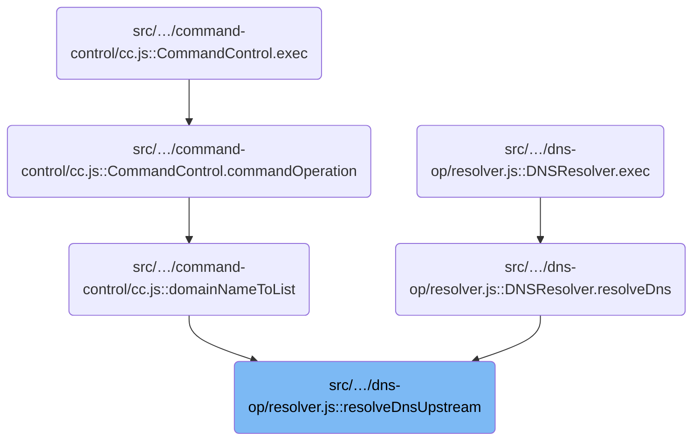

This document describes how DNS queries are resolved by selecting between cache, plain DNS, and DNS-over-HTTPS (DoH) upstreams. The system checks the configuration and sends requests to all available DoH resolvers in parallel if configured, or falls back to cache and plain DNS servers. The first successful response is returned to the client, ensuring efficient DNS resolution.

# Where is this flow used?

This flow is used multiple times in the codebase as represented in the following diagram:



# Resolving DNS Requests via Upstream Servers

```mermaid
%%{init: {"flowchart": {"defaultRenderer": "elk"}} }%%
flowchart TD
  node1["Receive DNS query"] --> node2{"Are any DoH resolvers configured?"}
  click node1 openCode "src/plugins/dns-op/resolver.js:351:415"
  click node2 openCode "src/plugins/dns-op/resolver.js:360:415"
  node2 -->|"No"| node3["Try to answer from DNS cache"]
  click node3 openCode "src/plugins/dns-op/resolver.js:361:375"
  node3 --> node4{"Is cached response available?"}
  click node4 openCode "src/plugins/dns-op/resolver.js:368:372"
  node4 -->|"Yes"| node5["Return cached response"]
  click node5 openCode "src/plugins/dns-op/resolver.js:371:372"
  node4 -->|"No"| node6{"Is plain DNS transport available?"}
  click node6 openCode "src/plugins/dns-op/resolver.js:382:387"
  node6 -->|"No"| node7["Return error: DNS transport not set"]
  click node7 openCode "src/plugins/dns-op/resolver.js:386:387"
  node6 -->|"Yes"| node8["Send DNS query, retry if truncated"]
  click node8 openCode "src/plugins/dns-op/resolver.js:392:398"
  node8 --> node9["Return DNS response or error"]
  click node9 openCode "src/plugins/dns-op/resolver.js:400:410"
  node2 -->|"Yes"| node10["Prepare and send requests to all DoH resolvers"]
  click node10 openCode "src/plugins/dns-op/resolver.js:425:471"
  subgraph loop1["For each resolver in resolverUrls"]
    node10 --> node11{"Is resolver URL valid?"}
    click node11 openCode "src/plugins/dns-op/resolver.js:433:436"
    node11 -->|"No"| node12["Skip resolver"]
    click node12 openCode "src/plugins/dns-op/resolver.js:434:435"
    node11 -->|"Yes"| node13{"Request method: GET or POST?"}
    click node13 openCode "src/plugins/dns-op/resolver.js:448:465"
    node13 -->|"GET"| node14["Prepare GET request"]
    click node14 openCode "src/plugins/dns-op/resolver.js:449:454"
    node13 -->|"POST"| node15["Prepare POST request"]
    click node15 openCode "src/plugins/dns-op/resolver.js:456:464"
    node14 --> node16["Send request to resolver"]
    node15 --> node16
    click node16 openCode "src/plugins/dns-op/resolver.js:470:470"
  end
  node10 --> node17["Return first successful response or error"]
  click node17 openCode "src/plugins/dns-op/resolver.js:478:478"

classDef HeadingStyle fill:#777777,stroke:#333,stroke-width:2px;

%% Swimm:
%% %%{init: {"flowchart": {"defaultRenderer": "elk"}} }%%
%% flowchart TD
%%   node1["Receive DNS query"] --> node2{"Are any DoH resolvers configured?"}
%%   click node1 openCode "<SwmPath>[src/…/dns-op/resolver.js](src/plugins/dns-op/resolver.js)</SwmPath>:351:415"
%%   click node2 openCode "<SwmPath>[src/…/dns-op/resolver.js](src/plugins/dns-op/resolver.js)</SwmPath>:360:415"
%%   node2 -->|"No"| node3["Try to answer from DNS cache"]
%%   click node3 openCode "<SwmPath>[src/…/dns-op/resolver.js](src/plugins/dns-op/resolver.js)</SwmPath>:361:375"
%%   node3 --> node4{"Is cached response available?"}
%%   click node4 openCode "<SwmPath>[src/…/dns-op/resolver.js](src/plugins/dns-op/resolver.js)</SwmPath>:368:372"
%%   node4 -->|"Yes"| node5["Return cached response"]
%%   click node5 openCode "<SwmPath>[src/…/dns-op/resolver.js](src/plugins/dns-op/resolver.js)</SwmPath>:371:372"
%%   node4 -->|"No"| node6{"Is plain DNS transport available?"}
%%   click node6 openCode "<SwmPath>[src/…/dns-op/resolver.js](src/plugins/dns-op/resolver.js)</SwmPath>:382:387"
%%   node6 -->|"No"| node7["Return error: DNS transport not set"]
%%   click node7 openCode "<SwmPath>[src/…/dns-op/resolver.js](src/plugins/dns-op/resolver.js)</SwmPath>:386:387"
%%   node6 -->|"Yes"| node8["Send DNS query, retry if truncated"]
%%   click node8 openCode "<SwmPath>[src/…/dns-op/resolver.js](src/plugins/dns-op/resolver.js)</SwmPath>:392:398"
%%   node8 --> node9["Return DNS response or error"]
%%   click node9 openCode "<SwmPath>[src/…/dns-op/resolver.js](src/plugins/dns-op/resolver.js)</SwmPath>:400:410"
%%   node2 -->|"Yes"| node10["Prepare and send requests to all DoH resolvers"]
%%   click node10 openCode "<SwmPath>[src/…/dns-op/resolver.js](src/plugins/dns-op/resolver.js)</SwmPath>:425:471"
%%   subgraph loop1["For each resolver in <SwmToken path="src/plugins/dns-op/resolver.js" pos="355:1:1" line-data="  resolverUrls,">`resolverUrls`</SwmToken>"]
%%     node10 --> node11{"Is resolver URL valid?"}
%%     click node11 openCode "<SwmPath>[src/…/dns-op/resolver.js](src/plugins/dns-op/resolver.js)</SwmPath>:433:436"
%%     node11 -->|"No"| node12["Skip resolver"]
%%     click node12 openCode "<SwmPath>[src/…/dns-op/resolver.js](src/plugins/dns-op/resolver.js)</SwmPath>:434:435"
%%     node11 -->|"Yes"| node13{"Request method: GET or POST?"}
%%     click node13 openCode "<SwmPath>[src/…/dns-op/resolver.js](src/plugins/dns-op/resolver.js)</SwmPath>:448:465"
%%     node13 -->|"GET"| node14["Prepare GET request"]
%%     click node14 openCode "<SwmPath>[src/…/dns-op/resolver.js](src/plugins/dns-op/resolver.js)</SwmPath>:449:454"
%%     node13 -->|"POST"| node15["Prepare POST request"]
%%     click node15 openCode "<SwmPath>[src/…/dns-op/resolver.js](src/plugins/dns-op/resolver.js)</SwmPath>:456:464"
%%     node14 --> node16["Send request to resolver"]
%%     node15 --> node16
%%     click node16 openCode "<SwmPath>[src/…/dns-op/resolver.js](src/plugins/dns-op/resolver.js)</SwmPath>:470:470"
%%   end
%%   node10 --> node17["Return first successful response or error"]
%%   click node17 openCode "<SwmPath>[src/…/dns-op/resolver.js](src/plugins/dns-op/resolver.js)</SwmPath>:478:478"
%% 
%% classDef HeadingStyle fill:#777777,stroke:#333,stroke-width:2px;
```



<SwmSnippet path="/src/plugins/dns-op/resolver.js" line="351">

---

In <SwmToken path="src/plugins/dns-op/resolver.js" pos="351:4:4" line-data="DNSResolver.prototype.resolveDnsUpstream = async function (">`resolveDnsUpstream`</SwmToken>, the flow starts by checking if any DoH upstreams are configured. If none are set, it tries to coalesce DNS requests by waiting for a cached event (using eid from the packet). If a cached response is found, it returns that immediately. If not, it falls back to querying plain DNS servers over UDP, and retries over TCP if the response is truncated. If DoH upstreams are present, it prepares DoH requests for each resolver URL, adjusts the request parameters, and sets up parallel fetches to all upstreams, ready to return the first successful response.

```javascript
DNSResolver.prototype.resolveDnsUpstream = async function (
  rxid,
  ts,
  request,
  resolverUrls,
  query,
  packet
) {
  // if no doh upstreams set, resolve over plain-old dns
  if (util.emptyArray(resolverUrls)) {
    const eid = cacheutil.makeId(packet);
    /** @type {ArrayBuffer[]?} */
    let parcel = null;

    try {
      const g = await system.when(eid, this.timeout);
      this.coalstats.tot += 1;
      if (!util.emptyArray(g) && g[0] != null) {
        const sz = bufutil.len(g[0]);
        this.log.d(rxid, "coalesced", eid, sz, this.coalstats);
        if (sz > 0) return Promise.resolve(new Response(g[0]));
      }
      this.coalstats.empty += 1;
      this.log.e(rxid, "empty coalesced", eid, this.coalstats);
      return Promise.resolve(util.respond503());
    } catch (reason) {
      // happens on timeout or if new event, eid
      this.coalstats.try += 1;
      this.log.d(rxid, "not coalesced", eid, reason, this.coalstats);
    }

    if (this.transport == null) {
      this.log.e(rxid, "plain dns transport not set");
      this.coalstats.pub += 1;
      system.pub(eid, parcel);
      return Promise.reject(new Error("plain dns transport not set"));
    }

    let promisedResponse = null;
    try {
      // do not let exceptions passthrough to the caller
      const q = bufutil.bufferOf(query);

      let ans = await this.transport.udpquery(rxid, q);
      if (dnsutil.truncated(ans)) {
        this.log.w(rxid, "ans truncated, retrying over tcp");
        ans = await this.transport.tcpquery(rxid, q);
      }

      if (ans) {
        const ab = bufutil.arrayBufferOf(ans);
        parcel = [ab];
        promisedResponse = Promise.resolve(new Response(ab));
      } else {
        promisedResponse = Promise.resolve(util.respond503());
      }
    } catch (e) {
      this.log.e(rxid, "err when querying plain old dns", e.stack);
      promisedResponse = Promise.reject(e);
    }

    this.coalstats.pub += 1;
    system.pub(eid, parcel);
    return promisedResponse;
  }

  // Promise.any on promisedPromises[] only works if there are
  // zero awaits in this function or any of its downstream calls.
  // Otherwise, the first reject in promisedPromises[], before
  // any statement in the call-stack awaits, would throw unhandled
  // error, since the event loop would have 'ticked' and Promise.any
  // on promisedPromises[] would still not have been executed, as it
  // is the last statement of this function (which would have eaten up
  // all rejects as long as there was one resolved promise).
  const promisedPromises = [];
  try {
    // upstream to cache
    this.log.d(rxid, "upstream cache");
    promisedPromises.push(this.resolveDnsFromCache(rxid, ts, packet));

    // upstream to resolvers
    for (const rurl of resolverUrls) {
      if (util.emptyString(rurl)) {
        this.log.w(rxid, "missing resolver url", rurl, "among", resolverUrls);
        continue;
      }

      const u = new URL(request.url);
      const upstream = new URL(rurl);
      u.hostname = upstream.hostname; // default cloudflare-dns.com
      u.pathname = upstream.pathname; // override path, default /dns-query
      u.port = upstream.port; // override port, default 443
      u.protocol = upstream.protocol; // override proto, default https

      let dnsreq = null;
      // even for GET requests, plugin.js:getBodyBuffer converts contents of
      // u.search into an arraybuffer that then needs to be reconverted back
      if (util.isGetRequest(request)) {
        u.search = "?dns=" + bufutil.bytesToBase64Url(query);
        dnsreq = new Request(u.href, {
          method: "GET",
          headers: util.dnsHeaders(),
          signal: AbortSignal.timeout(this.timeout),
        });
      } else if (util.isPostRequest(request)) {
        dnsreq = new Request(u.href, {
          method: "POST",
          headers: util.concatHeaders(
            util.contentLengthHeader(query),
            util.dnsHeaders()
          ),
          body: query,
          signal: AbortSignal.timeout(this.timeout),
        });
      } else {
        throw new Error("get/post only");
      }

      this.log.d(rxid, "upstream doh2/fetch", u.href);
      promisedPromises.push(fetch(dnsreq));
    }
```

---

</SwmSnippet>

<SwmSnippet path="/src/plugins/dns-op/resolver.js" line="472">

---

Finally, the function returns the first successful response from any of the upstreams using <SwmToken path="src/plugins/dns-op/resolver.js" pos="477:3:5" line-data="  // Promise.any returns any rejected promise if none resolved; node v15+">`Promise.any`</SwmToken>. This means the client gets the fastest available answer, and errors from individual upstreams don't block the overall resolution unless all fail.

```javascript
  } catch (e) {
    this.log.e(rxid, "err doh2/fetch upstream", e.stack);
    promisedPromises.push(Promise.reject(e));
  }

  // Promise.any returns any rejected promise if none resolved; node v15+
  return Promise.any(promisedPromises);
};
```

---

</SwmSnippet>

&nbsp;

*This is an auto-generated document by Swimm 🌊 and has not yet been verified by a human*

<SwmMeta version="3.0.0" repo-id="Z2l0aHViJTNBJTNBamF2YXNjcmlwdC1zZXJ2ZXJsZXNzLWRucyUzQSUzQXJpY2FyZG9sb3Blemc=" repo-name="javascript-serverless-dns"><sup>Powered by [Swimm](https://app.swimm.io/)</sup></SwmMeta>
