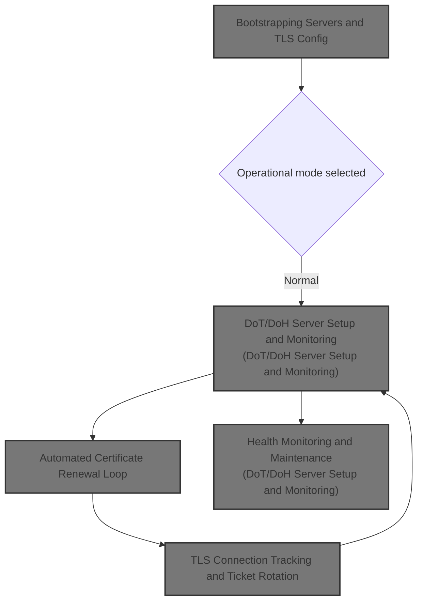
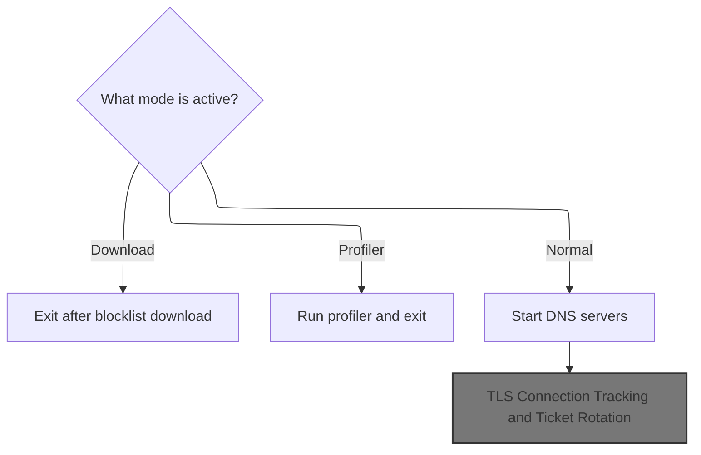
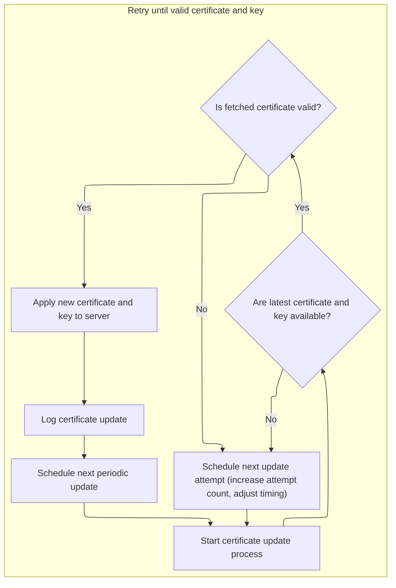
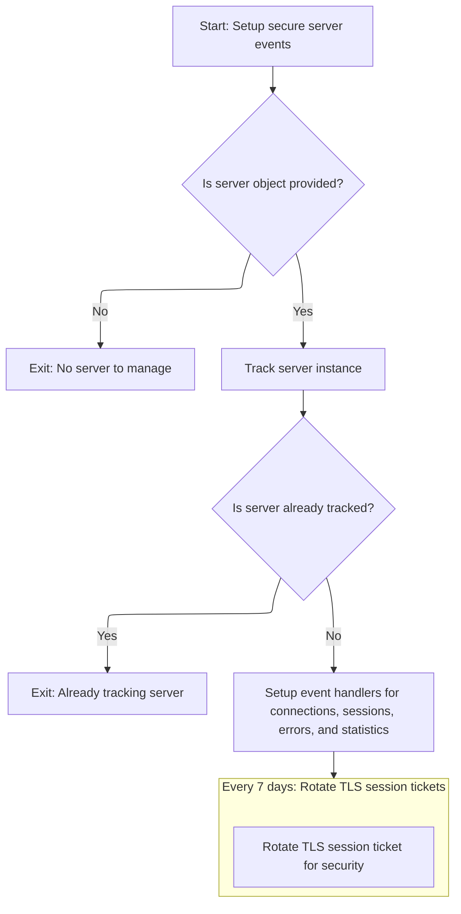
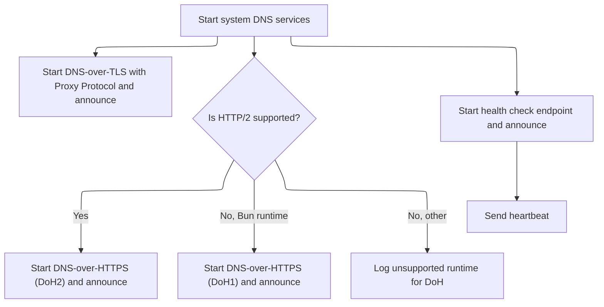

This document describes how secure DNS servers are started and maintained. The system configures TLS and server options, launches DNS-over-TLS and DNS-over-HTTPS services, and ensures certificates remain valid through automated renewal and remote validation. Event handlers manage connections, sessions, and ticket rotation, while health monitoring and heartbeat signals maintain continuous operation.



# Bootstrapping Servers and TLS Config



<SwmSnippet path="/src/server-node.js" line="297">

---

In <SwmToken path="src/server-node.js" pos="297:2:2" line-data="function systemUp() {">`systemUp`</SwmToken>, we kick off the whole setup: logging, env checks for modes (download, profiler, normal), and TLS/PSK/cipher config. It branches for different operational modes, then builds server and TLS options. When spinning up secure servers, <SwmToken path="src/server-node.js" pos="465:1:1" line-data="      certUpdateForever(secOpts, dot1);">`certUpdateForever`</SwmToken> is called right away to keep the TLS cert fresh and valid before any connections are accepted. This is needed so we don't end up serving with an expired cert.

```javascript
function systemUp() {
  log = loggerWithTags("NodeJs");
  if (!log) throw new Error("logger unavailable on system up");

  const downloadmode = envutil.blocklistDownloadOnly();
  const profilermode = envutil.profileDnsResolves();
  const tlsoffload = envutil.isCleartext();
  // todo: tcp backlog for doh/dot servers not supported on bun 1.1
  const tcpbacklog = envutil.tcpBacklog();
  const maxconns = envutil.maxconns();
  // see also: dns-transport.js:ioTimeout
  const ioTimeoutMs = envutil.ioTimeoutMs();
  const supportsHttp2 = envutil.isNode() || envutil.isDeno();
  const isBun = envutil.isBun();
  const allowTlsPsk = envutil.allowTlsPsk();

  if (downloadmode) {
    log.i("in download mode, not running the dns resolver");
    return;
  } else if (profilermode) {
    const durationms = 60 * 1000; // 1 min
    log.w("in profiler mode, run for", durationms, "and exit");
    stopAfter(durationms);
  } else {
    adjTimer = util.repeat(adjPeriodSec * 1000, adjustMaxConns);
    log.i(`cpu ${cpucount}, ip ${zero6}, tcpb ${tcpbacklog}, c ${maxconns}`);
  }

  /** @type {Uint8Array?} */
  let tlsPsk = null;
  if (allowTlsPsk) {
    const pskhex = envutil.tlsPskHex();
    tlsPsk = bufutil.hex2buf(pskhex);
    if (bufutil.len(tlsPsk) < psk.minkeyentropy) {
      log.e("TLS_PSK disabled; seed not", psk.minkeyentropy, "bytes long");
      allowTlsPsk = false;
      if (envManager != null) envManager.set("TLS_PSK", ""); // disable
    }
  }

  // nodejs.org/api/net.html#netcreateserveroptions-connectionlistener
  /** @type {net.ServerOpts} */
  const serverOpts = {
    keepAlive: true,
    noDelay: true,
  };
  // default cipher suites
  // nodejs.org/api/tls.html#tlsdefault_ciphers
  // nodejs.org/api/tls.html#tlsgetciphers
  const ciphers = !util.emptyString(tls.DEFAULT_CIPHERS)
    ? tls.DEFAULT_CIPHERS.split(":")
    : tls.getCiphers();
  // defaultTlsCiphers contains "!PSK" and so, this must be appended before it.
  const defaultTlsCiphers = ciphers
    .map((c) => c.toUpperCase())
    .filter((c) => !c.startsWith("!PSK"))
    .join(":");
  // aes128 is a 'cipher string' for tls1.2 and below
  // docs.openssl.org/1.1.1/man1/ciphers/#cipher-strings
  let preferAes128 =
    "TLS_AES_128_CCM_SHA256:TLS_AES_128_CCM_8_SHA256:TLS_AES_128_GCM_SHA256:AES128";
  if (allowTlsPsk) {
    preferAes128 = preferAes128 + ":aPSK";
  } else {
    preferAes128 = preferAes128 + ":!PSK";
  }
  log.d(preferAes128 + ":" + defaultTlsCiphers);
  // nodejs.org/api/tls.html#tlscreateserveroptions-secureconnectionlistener
  /** @type {tls.TlsOptions} */
  const tlsOpts = {
    // nodejs.org/api/tls.html#modifying-the-default-tls-cipher-suite
    ciphers: preferAes128 + ":" + defaultTlsCiphers,
    honorCipherOrder: true,
    handshakeTimeout: Math.max((ioTimeoutMs / 2) | 0, 3 * 1000), // 3s in ms
    // blog.cloudflare.com/tls-session-resumption-full-speed-and-secure
    sessionTimeout: 60 * 60 * 24 * 7, // 7d in secs
  };
  if (allowTlsPsk) {
    // tlsOpts.enableTrace = true;
    /**
     * @param {TLSSocket} _socket - TLS Socket
     * @param {string} idhex - Identifier in hex
     * @returns {DataView}
     */
    tlsOpts.pskCallback = (_socket, idhex) => {
      stats.tottlspsk += 1;
      if (!bufutil.isHex(idhex)) return;

      // openssl s_client -reconnect -tls1_2 -psk_identity 790bb45383670663ce9a39480be2de5426179506c8a6b2be922af055896438dd06dd320e68cd81348a32d679c026f73be64fdbbc46c43bfbc0f98160ffae2452
      // -psk "$TLS_PSK" -connect dns.rethinkdns.localhost:10000 -debug -cipher "PSK-AES128-GCM-SHA256"
      /** @type {psk.PskCred?} */
      const creds = psk.recentPskCreds.get(idhex);
      if (creds && creds.ok()) {
        // log.d("TLS PSK: known client", creds.idhexhint);
        if (idhex === creds.idhex) stats.tlspsks += 1;
        else stats.tlspskd += 1;
        // TODO: confirm creds.key is compatible with socket.getCipher();
        return creds.key;
      }

      // async callbacks are not possible yet, and so, generate the
      // missing credentials in the next microtask and fail this one;
      // hopefully, the next time this same idhex connects, we'll have
      // generated the corresponding PSK credentials to serve it.
      psk.generateTlsPsk(bufutil.hex2buf(idhex));
      // log.d("TLS PSK: unknown client id", idhex);
      stats.tlspskmiss += 1;
      return null;
    };
    tlsOpts.pskIdentityHint = psk.serverid;
    log.i("TLS PSK identity hint", tlsOpts.pskIdentityHint);
  }
  // nodejs.org/api/http2.html#http2createsecureserveroptions-onrequesthandler
  const h2Opts = {
    allowHTTP1: true,
  };

  if (tlsoffload) {
    // fly.io terminated tls?
    const portdoh = envutil.dohCleartextBackendPort();
    const portdot = envutil.dotCleartextBackendPort();
    /** @type {net.ListenOptions} */
    const dohOpts = { port: portdoh, host: zero6, backlog: tcpbacklog };
    /** @type {net.ListenOptions} */
    const dotOpts = { port: portdot, host: zero6, backlog: tcpbacklog };

    // TODO: ProxyProtoV2 with TLS ClientHello (unsupported by Fly.io, rn)
    // DNS over TLS Cleartext
    const dotct = net.createServer(serverOpts, serveTCP).listen(dotOpts, () => {
      up("DoT Cleartext", dotct.address());
      trapServerEvents("dotct", dotct);
    });

    // DNS over HTTPS Cleartext
    // Same port for http1.1/h2 does not work on node without tls, that is,
    // http2.createServer with opts { ALPNProtocols: ["h2", "http/1.1"],
    // allowHTTP1: true } doesn't handle http1.1 at all (but it does with
    // http2.createSecureServer which involves tls).
    // Ref (for servers): github.com/nodejs/node/issues/34296
    // Ref (for clients): github.com/nodejs/node/issues/31759
    // Impl: stackoverflow.com/a/42019773
    const dohct = h2c
      .createServer(serverOpts, serveHTTPS)
      .listen(dohOpts, () => {
        up("DoH Cleartext", dohct.address());
        trapServerEvents("dohct", dohct);
      });
  } else {
    // terminate tls ourselves
    /** @type {tls.TlsOptions} */
    const secOpts = {
      key: bufutil.fromB64(envutil.tlsKey()),
      cert: bufutil.fromB64(envutil.tlsCrt()),
      ...tlsOpts,
      ...serverOpts,
    };
    const portdot1 = envutil.dotBackendPort();
    const portdot2 = envutil.dotProxyProtoBackendPort();
    const portdoh = envutil.dohBackendPort();
    /** @type {net.ListenOptions} */
    const dohOpts = { port: portdoh, host: zero6, backlog: tcpbacklog };
    /** @type {net.ListenOptions} */
    const dot1Opts = { port: portdot1, host: zero6, backlog: tcpbacklog };
    /** @type {net.ListenOptions} */
    const dot2Opts = { port: portdot2, host: zero6, backlog: tcpbacklog };
    // DNS over TLS
    const dot1 = tls.createServer(secOpts, serveTLS).listen(dot1Opts, () => {
      up("DoT", dot1.address());
      certUpdateForever(secOpts, dot1);
```

---

</SwmSnippet>

## Automated Certificate Renewal Loop

<SwmSnippet path="/src/server-node.js" line="513">

---

In <SwmToken path="src/server-node.js" pos="513:4:4" line-data="async function certUpdateForever(secopts, s, n = 0) {">`certUpdateForever`</SwmToken>, we check if the cert is still good for more than a day. If not, we call <SwmToken path="src/server-node.js" pos="541:16:16" line-data="  const [latestKey, latestCert] = await nodeutil.replaceKeyCert(crt);">`replaceKeyCert`</SwmToken> to try and fetch a new one. If that fails, we retry with backoff. If it works, we update the server's TLS context and schedule the next renewal. Calling <SwmToken path="src/server-node.js" pos="541:16:16" line-data="  const [latestKey, latestCert] = await nodeutil.replaceKeyCert(crt);">`replaceKeyCert`</SwmToken> here is what actually gets us a new cert when needed.

```javascript
async function certUpdateForever(secopts, s, n = 0) {
  if (n > maxCertUpdateAttempts) {
    console.error("crt: max update attempts reached", n);
    return false;
  }

  const crtpem = secopts.cert;
  if (bufutil.emptyBuf(crtpem)) {
    return false;
  }

  // nodejs.org/api/tls.html#tlsgetcertificates
  // nodejs.org/api/tls.html#certificate-object
  const crt = new X509Certificate(crtpem);

  if (!crt) return false;
  else logCertInfo(crt);

  const oneDayMs = 24 * 60 * 60 * 1000; // in ms
  const validUntil = new Date(crt.validTo).getTime() - Date.now();
  if (validUntil > oneDayMs) {
    console.log("crt: #", n, "update: valid for", validUntil, "ms; not needed");
    util.timeout(validUntil - oneDayMs, () => certUpdateForever(secopts, s));
    return false;
  }

  const oneMinMs = 1 * 60 * 1000; // in ms
  const sixMinMs = 6 * 60 * 1000; // in ms
  const [latestKey, latestCert] = await nodeutil.replaceKeyCert(crt);
```

---

</SwmSnippet>

### Remote Certificate Fetch and Validation

```mermaid
%%{init: {"flowchart": {"defaultRenderer": "elk"}} }%%
flowchart TD
  node1["Start: Attempt to replace certificate"] --> node2{"Is there a certificate to replace?"}
  click node1 openCode "src/core/node/util.js:46:47"
  node2 -->|"No"| nodeEnd["Return empty key/cert"]
  click node2 openCode "src/core/node/util.js:49:49"
  click nodeEnd openCode "src/core/node/util.js:47:47"
  node2 -->|"Yes"| node3{"Does certificate subject contain rethinkdns.com?"}
  click node3 openCode "src/core/node/util.js:51:54"
  node3 -->|"No"| nodeEnd
  node3 -->|"Yes"| node4{"Is remote response empty or invalid?"}
  click node4 openCode "src/core/node/util.js:85:89"
  node4 -->|"Yes"| nodeEnd
  node4 -->|"No"| node5["Extract key/cert from response"]
  click node5 openCode "src/core/node/util.js:96:96"
  node5 --> node6{"Is extracted key/cert empty?"}
  click node6 openCode "src/core/node/util.js:97:99"
  node6 -->|"Yes"| nodeEnd
  node6 -->|"No"| node7{"Is new certificate subject rethinkdns.com?"}
  click node7 openCode "src/core/node/util.js:104:109"
  node7 -->|"No"| nodeEnd
  node7 -->|"Yes"| node8{"Is new certificate newer and not expired?"}
  click node8 openCode "src/core/node/util.js:116:130"
  node8 -->|"No"| nodeEnd
  node8 -->|"Yes"| node9{"Is new certificate different from current?"}
  click node9 openCode "src/core/node/util.js:111:114"
  node9 -->|"No"| nodeReturnCurrent["Return current key/cert"]
  click nodeReturnCurrent openCode "src/core/node/util.js:113:113"
  node9 -->|"Yes"| nodeReturnNew["Return new key/cert"]
  click nodeReturnNew openCode "src/core/node/util.js:134:134"
classDef HeadingStyle fill:#777777,stroke:#333,stroke-width:2px;

%% Swimm:
%% %%{init: {"flowchart": {"defaultRenderer": "elk"}} }%%
%% flowchart TD
%%   node1["Start: Attempt to replace certificate"] --> node2{"Is there a certificate to replace?"}
%%   click node1 openCode "<SwmPath>[src/…/node/util.js](src/core/node/util.js)</SwmPath>:46:47"
%%   node2 -->|"No"| nodeEnd["Return empty <SwmToken path="src/server-node.js" pos="549:22:24" line-data="    console.error(&quot;crt: #&quot;, n, &quot;update: no key/cert fetched; next&quot;, when);">`key/cert`</SwmToken>"]
%%   click node2 openCode "<SwmPath>[src/…/node/util.js](src/core/node/util.js)</SwmPath>:49:49"
%%   click nodeEnd openCode "<SwmPath>[src/…/node/util.js](src/core/node/util.js)</SwmPath>:47:47"
%%   node2 -->|"Yes"| node3{"Does certificate subject contain <SwmToken path="src/core/node/util.js" pos="51:8:10" line-data="    replacing.subject.indexOf(&quot;rethinkdns.com&quot;) &lt; 0 ||">`rethinkdns.com`</SwmToken>?"}
%%   click node3 openCode "<SwmPath>[src/…/node/util.js](src/core/node/util.js)</SwmPath>:51:54"
%%   node3 -->|"No"| nodeEnd
%%   node3 -->|"Yes"| node4{"Is remote response empty or invalid?"}
%%   click node4 openCode "<SwmPath>[src/…/node/util.js](src/core/node/util.js)</SwmPath>:85:89"
%%   node4 -->|"Yes"| nodeEnd
%%   node4 -->|"No"| node5["Extract <SwmToken path="src/server-node.js" pos="549:22:24" line-data="    console.error(&quot;crt: #&quot;, n, &quot;update: no key/cert fetched; next&quot;, when);">`key/cert`</SwmToken> from response"]
%%   click node5 openCode "<SwmPath>[src/…/node/util.js](src/core/node/util.js)</SwmPath>:96:96"
%%   node5 --> node6{"Is extracted <SwmToken path="src/server-node.js" pos="549:22:24" line-data="    console.error(&quot;crt: #&quot;, n, &quot;update: no key/cert fetched; next&quot;, when);">`key/cert`</SwmToken> empty?"}
%%   click node6 openCode "<SwmPath>[src/…/node/util.js](src/core/node/util.js)</SwmPath>:97:99"
%%   node6 -->|"Yes"| nodeEnd
%%   node6 -->|"No"| node7{"Is new certificate subject <SwmToken path="src/core/node/util.js" pos="51:8:10" line-data="    replacing.subject.indexOf(&quot;rethinkdns.com&quot;) &lt; 0 ||">`rethinkdns.com`</SwmToken>?"}
%%   click node7 openCode "<SwmPath>[src/…/node/util.js](src/core/node/util.js)</SwmPath>:104:109"
%%   node7 -->|"No"| nodeEnd
%%   node7 -->|"Yes"| node8{"Is new certificate newer and not expired?"}
%%   click node8 openCode "<SwmPath>[src/…/node/util.js](src/core/node/util.js)</SwmPath>:116:130"
%%   node8 -->|"No"| nodeEnd
%%   node8 -->|"Yes"| node9{"Is new certificate different from current?"}
%%   click node9 openCode "<SwmPath>[src/…/node/util.js](src/core/node/util.js)</SwmPath>:111:114"
%%   node9 -->|"No"| nodeReturnCurrent["Return current <SwmToken path="src/server-node.js" pos="549:22:24" line-data="    console.error(&quot;crt: #&quot;, n, &quot;update: no key/cert fetched; next&quot;, when);">`key/cert`</SwmToken>"]
%%   click nodeReturnCurrent openCode "<SwmPath>[src/…/node/util.js](src/core/node/util.js)</SwmPath>:113:113"
%%   node9 -->|"Yes"| nodeReturnNew["Return new <SwmToken path="src/server-node.js" pos="549:22:24" line-data="    console.error(&quot;crt: #&quot;, n, &quot;update: no key/cert fetched; next&quot;, when);">`key/cert`</SwmToken>"]
%%   click nodeReturnNew openCode "<SwmPath>[src/…/node/util.js](src/core/node/util.js)</SwmPath>:134:134"
%% classDef HeadingStyle fill:#777777,stroke:#333,stroke-width:2px;
```



<SwmSnippet path="/src/core/node/util.js" line="46">

---

In <SwmToken path="src/core/node/util.js" pos="46:6:6" line-data="export async function replaceKeyCert(replacing) {">`replaceKeyCert`</SwmToken>, we check if the cert is eligible for replacement, fetch keys, sign and send a request to the remote cert service, and decrypt the response using <SwmToken path="src/core/node/util.js" pos="91:9:9" line-data="    const crtkey = await decryptText(req, crthex);">`decryptText`</SwmToken>. Only if the new cert passes all checks do we use it. This step is needed to actually get a fresh cert from the remote service.

```javascript
export async function replaceKeyCert(replacing) {
  const nokeycert = [null, null];

  if (replacing == null) return nokeycert;
  if (
    replacing.subject.indexOf("rethinkdns.com") < 0 ||
    replacing.subjectAltName.indexOf("rethinkdns.com") < 0
  ) {
    return nokeycert;
  }

  try {
    const [aeskey, mackey] = await keys();
    if (!aeskey || !mackey) {
      log.e("certfile: key missing");
      return nokeycert;
    }

    const now = Date.now();
    const u = "https://redir.nile.workers.dev/x/crt/" + now;
    const url = new URL(u);
    // TODO: bind "who" to msg?
    const msg = bufutil.fromStr(url.pathname);
    const authz = await hmacsign(mackey, msg);
    const who = envutil.hostId(); // never empty on fly
    const req = new Request(url, {
      method: "GET",
      headers: {
        "x-rethinkdns-xsvc-authz": bufutil.hex(authz),
        "x-rethinkdns-xsvc-who": who,
      },
    });
    const r = await fetch(req);

    if (!r.ok) {
      log.e("certfile: fetch err", who, authz.length, r.status, r.statusText);
      return nokeycert;
    }

    const crthex = await r.text();
    if (util.emptyString(crthex)) {
      log.e("certfile: empty response");
      return nokeycert;
    }

    const crtkey = await decryptText(req, crthex);
    if (util.emptyString(crtkey)) {
      log.e("certfile: empty enc(crtkey)");
      return nokeycert;
    }
```

---

</SwmSnippet>

<SwmSnippet path="/src/core/node/util.js" line="146">

---

<SwmToken path="src/core/node/util.js" pos="146:6:6" line-data="export async function decryptText(req, ivciphertaghex) {">`decryptText`</SwmToken> takes the hex string, splits out IV and ciphertext+tag, builds a context-specific AAD string from request headers and date, and runs AES-GCM decryption. This ties the decrypted cert to the request and time, so you can't replay or reuse it.

```javascript
export async function decryptText(req, ivciphertaghex) {
  const now = new Date();
  const u = new URL(req.url);
  const authn = req.headers.get("x-rethinkdns-xsvc-who");
  const ivciphertag = bufutil.hex2buf(ivciphertaghex);
  if (bufutil.emptyBuf(ivciphertag)) {
    log.e("decrypt: ivciphertag empty");
    return null;
  }

  try {
    const iv = ivciphertag.slice(0, 12); // first 12 bytes are iv
    const ciphertag = ivciphertag.slice(12); // rest is cipher text + tag
    // crypto.junod.info/posts/recursive-hash/#data-serialization
    // 1 Aug 2025 => "5/7/2025" => Friday, 7th month (0-indexed), 2025
    const aadstr =
      authn +
      "/" +
      now.getUTCDay() +
      "/" +
      now.getUTCMonth() +
      "/" +
      now.getUTCFullYear() +
      "/" +
      u.hostname +
      "/" +
      u.pathname +
      "/" +
      req.method;
    const aad = bufutil.fromStr(aadstr);

    log.d(
      "decrypt: ivciphertag",
      ivciphertaghex.length,
      "iv",
      iv.length,
      "ciphertag",
      ciphertag.length,
      "aad",
      aadstr,
      aad.length
    );

    const [aeskey, mackey] = await keys();
    if (!aeskey || !mackey) {
      log.e("decrypt: key missing");
      return null;
    }

    const plain = await decryptAesGcm(aeskey, iv, ciphertag, aad);
    if (bufutil.emptyBuf(plain)) {
      log.e("decrypt: failed to decrypt", ivciphertaghex.length);
      return null;
    }
    return bufutil.toStr(plain);
  } catch (err) {
    log.e("decrypt: failed", err);
    return null;
  }
}
```

---

</SwmSnippet>

<SwmSnippet path="/src/core/node/util.js" line="96">

---

Back in <SwmToken path="src/server-node.js" pos="541:16:16" line-data="  const [latestKey, latestCert] = await nodeutil.replaceKeyCert(crt);">`replaceKeyCert`</SwmToken> after <SwmToken path="src/core/node/util.js" pos="91:9:9" line-data="    const crtkey = await decryptText(req, crthex);">`decryptText`</SwmToken>, we parse and validate the new cert. If it matches all criteria (subject, serial, expiry), we return it; otherwise, we stick with the old or return null. This is the final gate before a cert swap.

```javascript
    const [key, cert] = getCertKeyFromEnv(crtkey);
    if (bufutil.emptyBuf(key) || bufutil.emptyBuf(cert)) {
      log.e("certfile: key/cert empty");
      return nokeycert;
    }

    const latest = new X509Certificate(cert);
    if (
      latest.subject.indexOf("rethinkdns.com") < 0 ||
      latest.subjectAltName.indexOf("rethinkdns.com") < 0
    ) {
      log.e("certfile: latest cert subject mismatch", latest.subject);
      return nokeycert;
    }

    if (latest.serialNumber === replacing.serialNumber) {
      log.d("certfile: latest cert same as replacing", latest.serialNumber);
      return [key, cert];
    }

    const latestUntil = new Date(latest.validTo);
    const replacingUntil = new Date(replacing.validTo);
    if (
      latestUntil.getTime() < Date.now() ||
      latestUntil.getTime() <= replacingUntil.getTime()
    ) {
      log.d(
        "certfile: err latestUntil < replacingUntil",
        latestUntil,
        replacingUntil,
        "now",
        Date.now()
      );
      return nokeycert;
    }

    log.i("certfile: latest cert", latest.serialNumber, "until", latestUntil);

    return [key, cert];
  } catch (err) {
    log.e("certfile: failed to get cert", err);
  }
  return nokeycert;
}
```

---

</SwmSnippet>

### Certificate Update Retry and Context Refresh



<SwmSnippet path="/src/server-node.js" line="542">

---

Back in <SwmToken path="src/server-node.js" pos="550:13:13" line-data="    util.timeout(when, () =&gt; certUpdateForever(secopts, s, n));">`certUpdateForever`</SwmToken> after <SwmToken path="src/server-node.js" pos="541:16:16" line-data="  const [latestKey, latestCert] = await nodeutil.replaceKeyCert(crt);">`replaceKeyCert`</SwmToken>, if we didn't get a valid cert, we retry with backoff. If we did, we update the TLS context and schedule the next renewal. This keeps the cert fresh and the server running with valid credentials.

```javascript
  if (bufutil.emptyBuf(latestKey) || bufutil.emptyBuf(latestCert)) {
    n = n + 1;
    const attemptsLeft = Math.max(1, maxCertUpdateAttempts - n);
    let when = validUntil <= oneMinMs ? oneMinMs : sixMinMs * attemptsLeft;
    if (validUntil > oneMinMs && when > validUntil) {
      when = Math.max(oneMinMs, validUntil - oneMinMs);
    }
    console.error("crt: #", n, "update: no key/cert fetched; next", when);
    util.timeout(when, () => certUpdateForever(secopts, s, n));
    return false;
  }

  const latestcrt = new X509Certificate(latestCert);

  if (!latestcrt) return false;
  else logCertInfo(latestcrt);

  secopts.cert = latestCert;
  secopts.key = latestKey;
  setTlsVars(latestKey, latestCert);

  s.setSecureContext(secopts);

  console.info("crt: #", n, "update: set new cert");
  util.next(() => certUpdateForever(secopts, s));

  return true;
}
```

---

</SwmSnippet>

## TLS Server Event Hookup

<SwmSnippet path="/src/server-node.js" line="466">

---

Back in <SwmToken path="src/server-node.js" pos="297:2:2" line-data="function systemUp() {">`systemUp`</SwmToken> after <SwmToken path="src/server-node.js" pos="465:1:1" line-data="      certUpdateForever(secOpts, dot1);">`certUpdateForever`</SwmToken>, we hook up <SwmToken path="src/server-node.js" pos="466:1:1" line-data="      trapSecureServerEvents(&quot;dot1&quot;, dot1);">`trapSecureServerEvents`</SwmToken> to the TLS server. This is needed to track connections, handle errors, and manage TLS session state for the server.

```javascript
      trapSecureServerEvents("dot1", dot1);
    });

```

---

</SwmSnippet>

## TLS Connection Tracking and Ticket Rotation



<SwmSnippet path="/src/server-node.js" line="653">

---

<SwmToken path="src/server-node.js" pos="653:2:2" line-data="function trapSecureServerEvents(id, s) {">`trapSecureServerEvents`</SwmToken> wires up connection/session handlers and schedules <SwmToken path="src/server-node.js" pos="704:23:23" line-data="  const rottm = util.repeat(86400000 * 7, () =&gt; rotateTkt(id, s)); // 7d">`rotateTkt`</SwmToken> for ticket key rotation.

```javascript
function trapSecureServerEvents(id, s) {
  const ioTimeoutMs = envutil.ioTimeoutMs();

  if (!s) return;

  const sid = tracker.trackServer(id, s);

  if (sid === tracker.zeroid) {
    log.w("tls: may be already tracking server", id);
    return;
  }

  // github.com/grpc/grpc-node/blob/e6ea6f517epackages/grpc-js/src/server.ts#L392
  s.on("secureConnection", (/** @type {TLSSocket} */ socket) => {
    stats.nofconns += 1;
    stats.openconns += 1;

    const id = tracker.trackConn(s, socket);
    if (!tracker.valid(id)) {
      log.i("tls: not tracking; server shutting down?", id);
      close(socket);
      return;
    }

    // github.com/nodejs/node-v0.x-archive/issues/6889
    socket.setMaxSendFragment(tlsStartFragmentSize);

    socket.setTimeout(ioTimeoutMs, () => {
      stats.noftimeouts += 1;
      log.d("tls: incoming conn timed out; " + id);
      close(socket);
    });

    // error must be handled by Http2SecureServer
    // github.com/nodejs/node/issues/35824
    socket.on("error", (err) => {
      log.e("tls: incoming conn", id, "closed;", err.message);
      close(socket);
    });

    socket.on("end", () => {
      // client gone, socket half-open at this point
      // close this end of the socket, too
      socket.end();
    });

    socket.on("close", () => {
      stats.openconns -= 1;
    });
  });

  const rottm = util.repeat(86400000 * 7, () => rotateTkt(id, s)); // 7d
```

---

</SwmSnippet>

<SwmSnippet path="/src/server-node.js" line="753">

---

<SwmToken path="src/server-node.js" pos="753:2:2" line-data="function rotateTkt(id, s) {">`rotateTkt`</SwmToken> checks if ticket rotation is allowed, grabs a seed from env, builds a context string, and calls nodecrypto.tkt48 to generate new TLS ticket keys. If the server is listening, it sets the new keys asynchronously.

```javascript
function rotateTkt(id, s) {
  if (envutil.isCleartext()) return; // tls offload
  if (envutil.isBun()) return;
  if (!s || !s.listening) return;

  let seed = bufutil.fromB64(envutil.secretb64());
  if (bufutil.emptyBuf(seed)) {
    // see: node/config.js:setTlsVars
    seed = bufutil.fromB64(envutil.tlsKey());
  }
  const d = new Date();
  const cur = d.getUTCFullYear() + " " + d.getUTCMonth(); // 2023 7
  const ctx = cur + envutil.imageRef(); // may be empty str
  // tls session resumption with tickets (or ids) reduce the 3.5kb to 6.5kb
  // overhead associated with tls handshake: netsekure.org/2010/03/tls-overhead
  nodecrypto
    .tkt48(seed, ctx)
    .then((k) => s.setTicketKeys(k)) // not supported on bun
    .catch((err) => log.e("tls:", id, "tkt rotation err", err));

  log.i("tls:", id, "tkt rotation", bufutil.len(seed), "ctx", ctx);
}
```

---

</SwmSnippet>

<SwmSnippet path="/src/server-node.js" line="705">

---

Back in <SwmToken path="src/server-node.js" pos="466:1:1" line-data="      trapSecureServerEvents(&quot;dot1&quot;, dot1);">`trapSecureServerEvents`</SwmToken> after <SwmToken path="src/server-node.js" pos="704:23:23" line-data="  const rottm = util.repeat(86400000 * 7, () =&gt; rotateTkt(id, s)); // 7d">`rotateTkt`</SwmToken>, we wire up handlers for server close, errors, session creation/resume, and connection drops. This covers all the TLS session and connection lifecycle events.

```javascript
  s.on("close", () => clearInterval(rottm));

  s.on("error", (err) => {
    log.e("tls: stop!", id, "server err; " + err.message, err);
    stopAfter(0);
  });

  // bajtos.net/posts/2013-08-07-improve-the-performance-of-the-node-js-https-server
  // session tickets take precedence over session ids; -no_ticket is needed
  // openssl s_client -connect :10000 -reconnect -tls1_2 -no_ticket
  // on bun, since session tickets cannot be set by programs (though may be vended
  // by the runtime itself), session ids may come in handy.
  s.on("newSession", (id, data, next) => {
    const hid = bufutil.hex(id);
    tlsSessions.put(hid, data);
    // log.d("tls: new session;", hid);
    next();
  });

  s.on("resumeSession", (id, next) => {
    const hid = bufutil.hex(id);
    const data = tlsSessions.get(hid) || null;
    // log.d("tls: resume;", hid, "ok?", data != null);
    if (data) stats.fasttls += 1;
    else stats.totfasttls += 1;
    next(/* err */ null, data);
  });

  // emitted when the req is discarded due to maxConnections
  s.on("drop", (_data) => {
    stats.nofdrops += 1;
    stats.nofconns += 1;
  });

  s.on("tlsClientError", (err, /** @type {TLSSocket} */ tlsSocket) => {
    stats.tlserr += 1;
    // fly tcp healthchecks also trigger tlsClientErrors
    // log.d("tls: client err;", err.message, addrstr(tlsSocket));
    close(tlsSocket);
  });
}
```

---

</SwmSnippet>

## DoT/DoH Server Setup and Monitoring



<SwmSnippet path="/src/server-node.js" line="469">

---

Back in <SwmToken path="src/server-node.js" pos="297:2:2" line-data="function systemUp() {">`systemUp`</SwmToken> after <SwmToken path="src/server-node.js" pos="466:1:1" line-data="      trapSecureServerEvents(&quot;dot1&quot;, dot1);">`trapSecureServerEvents`</SwmToken> for <SwmToken path="src/server-node.js" pos="473:4:4" line-data="        up(&quot;DoT ProxyProto&quot;, dot2.address());">`DoT`</SwmToken> <SwmToken path="src/server-node.js" pos="469:11:11" line-data="    // DNS over TLS w ProxyProto">`ProxyProto`</SwmToken>, we set up the <SwmToken path="src/server-node.js" pos="441:4:4" line-data="        up(&quot;DoH Cleartext&quot;, dohct.address());">`DoH`</SwmToken> server and call <SwmToken path="src/server-node.js" pos="483:1:1" line-data="          certUpdateForever(secOpts, doh);">`certUpdateForever`</SwmToken> again to keep its certificate valid. This keeps the <SwmToken path="src/server-node.js" pos="441:4:4" line-data="        up(&quot;DoH Cleartext&quot;, dohct.address());">`DoH`</SwmToken> server's TLS cert fresh.

```javascript
    // DNS over TLS w ProxyProto
    const dot2 =
      envutil.isDotOverProxyProto() &&
      net.createServer(serverOpts, serveDoTProxyProto).listen(dot2Opts, () => {
        up("DoT ProxyProto", dot2.address());
        trapServerEvents("dot2", dot2);
      });

    // DNS over HTTPS
    if (supportsHttp2) {
      const doh = http2
        .createSecureServer({ ...secOpts, ...h2Opts }, serveHTTPS)
        .listen(dohOpts, () => {
          up("DoH2", doh.address());
          certUpdateForever(secOpts, doh);
```

---

</SwmSnippet>

<SwmSnippet path="/src/server-node.js" line="484">

---

Back in <SwmToken path="src/server-node.js" pos="297:2:2" line-data="function systemUp() {">`systemUp`</SwmToken> after <SwmToken path="src/server-node.js" pos="465:1:1" line-data="      certUpdateForever(secOpts, dot1);">`certUpdateForever`</SwmToken> for <SwmToken path="src/server-node.js" pos="482:4:4" line-data="          up(&quot;DoH2&quot;, doh.address());">`DoH2`</SwmToken>, we hook up <SwmToken path="src/server-node.js" pos="484:1:1" line-data="          trapSecureServerEvents(&quot;doh2&quot;, doh);">`trapSecureServerEvents`</SwmToken> to track and manage <SwmToken path="src/server-node.js" pos="482:4:4" line-data="          up(&quot;DoH2&quot;, doh.address());">`DoH2`</SwmToken> connections and sessions.

```javascript
          trapSecureServerEvents("doh2", doh);
        });
```

---

</SwmSnippet>

<SwmSnippet path="/src/server-node.js" line="486">

---

Back in <SwmToken path="src/server-node.js" pos="297:2:2" line-data="function systemUp() {">`systemUp`</SwmToken> after <SwmToken path="src/server-node.js" pos="466:1:1" line-data="      trapSecureServerEvents(&quot;dot1&quot;, dot1);">`trapSecureServerEvents`</SwmToken> for <SwmToken path="src/server-node.js" pos="490:4:4" line-data="          up(&quot;DoH1&quot;, doh.address());">`DoH1`</SwmToken> (Bun), we call <SwmToken path="src/server-node.js" pos="491:1:1" line-data="          certUpdateForever(secOpts, doh);">`certUpdateForever`</SwmToken> to keep the <SwmToken path="src/server-node.js" pos="490:4:4" line-data="          up(&quot;DoH1&quot;, doh.address());">`DoH1`</SwmToken> server's certificate valid.

```javascript
    } else if (isBun) {
      const doh = https
        .createServer(secOpts, serveHTTPS)
        .listen(dohOpts, () => {
          up("DoH1", doh.address());
          certUpdateForever(secOpts, doh);
```

---

</SwmSnippet>

<SwmSnippet path="/src/server-node.js" line="492">

---

Back in <SwmToken path="src/server-node.js" pos="297:2:2" line-data="function systemUp() {">`systemUp`</SwmToken> after <SwmToken path="src/server-node.js" pos="465:1:1" line-data="      certUpdateForever(secOpts, dot1);">`certUpdateForever`</SwmToken> for <SwmToken path="src/server-node.js" pos="490:4:4" line-data="          up(&quot;DoH1&quot;, doh.address());">`DoH1`</SwmToken>, we call <SwmToken path="src/server-node.js" pos="492:1:1" line-data="          trapSecureServerEvents(&quot;doh1&quot;, doh);">`trapSecureServerEvents`</SwmToken> to track and manage <SwmToken path="src/server-node.js" pos="490:4:4" line-data="          up(&quot;DoH1&quot;, doh.address());">`DoH1`</SwmToken> connections. If the runtime isn't supported, we log that too.

```javascript
          trapSecureServerEvents("doh1", doh);
        });
    } else {
      console.log("unsupported runtime for doh");
    }
  }

```

---

</SwmSnippet>

<SwmSnippet path="/src/server-node.js" line="499">

---

Back in <SwmToken path="src/server-node.js" pos="297:2:2" line-data="function systemUp() {">`systemUp`</SwmToken> after all the server setup and event wiring, we start a health check HTTP server and kick off the heartbeat process for monitoring and liveness.

```javascript
  const portcheck = envutil.httpCheckPort();
  const hcheck = h2c.createServer(serve200).listen(portcheck, () => {
    up("http-check", hcheck.address());
    trapServerEvents("hcheck", hcheck);
  });

  heartbeat();
}
```

---

</SwmSnippet>

&nbsp;

*This is an auto-generated document by Swimm 🌊 and has not yet been verified by a human*

<SwmMeta version="3.0.0" repo-id="Z2l0aHViJTNBJTNBamF2YXNjcmlwdC1zZXJ2ZXJsZXNzLWRucyUzQSUzQXJpY2FyZG9sb3Blemc=" repo-name="javascript-serverless-dns"><sup>Powered by [Swimm](https://app.swimm.io/)</sup></SwmMeta>
