This document describes how the DNS connection pool is maintained by sweeping through active connections and removing those that are no longer healthy or have expired. The sweep receives a pool of connections and a sweep trigger, and outputs a refreshed pool with dead connections removed, along with logging information about the sweep. The main steps include checking for connections to process, evaluating their health, evicting dead ones, and logging the results.

# Sweeping and Timestamping Connections

<SwmSnippet path="/src/core/dns/conns.js" line="133">

---

In <SwmToken path="src/core/dns/conns.js" pos="133:1:1" line-data="  sweep(clear = false) {">`sweep`</SwmToken>, we start by checking if there are any connections to process and whether enough time has passed since the last sweep. We grab the current time to decide if we should continue or bail early. Next, we need to call <SwmPath>[src/core/log.js](src/core/log.js)</SwmPath> to get a timestamp for logging and tracking when sweeps happen.

```javascript
  sweep(clear = false) {
    const sz = this.pool.size;
    if (sz <= 0) return false;

    const now = Date.now();
    if (this.lastSweep + this.sweepGapMs > now) {
      if (!clear) return false;
    }
```

---

</SwmSnippet>

<SwmSnippet path="/src/core/log.js" line="132">

---

<SwmToken path="src/core/log.js" pos="132:1:1" line-data="  now() {">`now`</SwmToken> checks if logging timestamps is enabled and returns the current time as an ISO string if so, otherwise it gives back an empty string. This lets the rest of the flow decide whether to include timestamps in logs.

```javascript
  now() {
    if (this.logTimestamps) return new Date().toISOString();
    else return "";
  }
```

---

</SwmSnippet>

<SwmSnippet path="/src/core/dns/conns.js" line="141">

---

Back in <SwmToken path="src/core/dns/conns.js" pos="133:1:1" line-data="  sweep(clear = false) {">`sweep`</SwmToken>, after grabbing the timestamp, we update the sweep time and loop through each socket in the pool. Next, we call <SwmToken path="src/core/dns/conns.js" pos="145:10:10" line-data="      if (clear || this.dead(sock, report)) this.evict(sock);">`dead`</SwmToken> to figure out which sockets should be evicted.

```javascript
    this.lastSweep = now;

    let n = 0;
    for (const [sock, report] of this.pool) {
      if (clear || this.dead(sock, report)) this.evict(sock);
```

---

</SwmSnippet>

## Checking Socket Liveness

<SwmSnippet path="/src/core/dns/conns.js" line="182">

---

<SwmToken path="src/core/dns/conns.js" pos="182:1:1" line-data="  dead(sock, report) {">`dead`</SwmToken> just calls <SwmToken path="src/core/dns/conns.js" pos="183:6:6" line-data="    return !this.healthy(sock, report);">`healthy`</SwmToken> and inverts the result. Next, we need to call <SwmToken path="src/core/dns/conns.js" pos="183:6:6" line-data="    return !this.healthy(sock, report);">`healthy`</SwmToken> to check if the socket is still usable.

```javascript
  dead(sock, report) {
    return !this.healthy(sock, report);
  }
```

---

</SwmSnippet>

## Evaluating Connection Health

```mermaid
%%{init: {"flowchart": {"defaultRenderer": "elk"}} }%%
flowchart TD
  node1{"Is there a connection to check?"}
  click node1 openCode "src/core/dns/conns.js:167:167"
  node1 -->|"No"| node2["Connection is NOT healthy (cannot be reused)"]
  click node2 openCode "src/core/dns/conns.js:167:167"
  node1 -->|"Yes"| node3{"Is connection destroyed or not open?"}
  click node3 openCode "src/core/dns/conns.js:168:173"
  node3 -->|"Yes"| node2
  node3 -->|"No"| node4{"Is connection still fresh (within allowed time-to-live/ttl)?"}
  click node4 openCode "src/core/dns/conns.js:170:174"
  node4 -->|"Yes"| node5["Connection is healthy (can be reused for DNS)"]
  click node5 openCode "src/core/dns/conns.js:174:174"
  node4 -->|"No"| node2
classDef HeadingStyle fill:#777777,stroke:#333,stroke-width:2px;

%% Swimm:
%% %%{init: {"flowchart": {"defaultRenderer": "elk"}} }%%
%% flowchart TD
%%   node1{"Is there a connection to check?"}
%%   click node1 openCode "<SwmPath>[src/…/dns/conns.js](src/core/dns/conns.js)</SwmPath>:167:167"
%%   node1 -->|"No"| node2["Connection is NOT healthy (cannot be reused)"]
%%   click node2 openCode "<SwmPath>[src/…/dns/conns.js](src/core/dns/conns.js)</SwmPath>:167:167"
%%   node1 -->|"Yes"| node3{"Is connection destroyed or not open?"}
%%   click node3 openCode "<SwmPath>[src/…/dns/conns.js](src/core/dns/conns.js)</SwmPath>:168:173"
%%   node3 -->|"Yes"| node2
%%   node3 -->|"No"| node4{"Is connection still fresh (within allowed time-to-live/ttl)?"}
%%   click node4 openCode "<SwmPath>[src/…/dns/conns.js](src/core/dns/conns.js)</SwmPath>:170:174"
%%   node4 -->|"Yes"| node5["Connection is healthy (can be reused for DNS)"]
%%   click node5 openCode "<SwmPath>[src/…/dns/conns.js](src/core/dns/conns.js)</SwmPath>:174:174"
%%   node4 -->|"No"| node2
%% classDef HeadingStyle fill:#777777,stroke:#333,stroke-width:2px;
```



<SwmSnippet path="/src/core/dns/conns.js" line="166">

---

In <SwmToken path="src/core/dns/conns.js" pos="166:1:1" line-data="  healthy(sock, report) {">`healthy`</SwmToken>, we check if the socket is valid, writable, and ready. Then we call <SwmToken path="src/core/dns/conns.js" pos="170:7:9" line-data="    const fresh = report.fresh(this.ttl);">`report.fresh`</SwmToken> to see if the connection is still fresh based on its TTL.

```javascript
  healthy(sock, report) {
    if (!sock) return false;
    const destroyed = !sock.writable;
    const open = this.ready(sock);
    const fresh = report.fresh(this.ttl);
```

---

</SwmSnippet>

<SwmSnippet path="/src/core/dns/conns.js" line="215">

---

<SwmToken path="src/core/dns/conns.js" pos="215:1:1" line-data="  fresh(since) {">`fresh`</SwmToken> checks if the last use of the connection plus its TTL is still in the future, meaning the connection is fresh. Next, we call <SwmPath>[src/core/log.js](src/core/log.js)</SwmPath> to record the health check details.

```javascript
  fresh(since) {
    return this.lastuse + since >= Date.now();
  }
```

---

</SwmSnippet>

<SwmSnippet path="/src/core/dns/conns.js" line="171">

---

After checking freshness in <SwmToken path="src/core/dns/conns.js" pos="174:8:8" line-data="    return fresh; // healthy if not expired">`healthy`</SwmToken>, we log the connection's status (destroyed, open, fresh) for visibility. Next, we call <SwmPath>[src/core/log.js](src/core/log.js)</SwmPath> to handle the actual logging.

```javascript
    const id = report.id;
    log.d(id, "destroyed?", destroyed, "open?", open, "fresh?", fresh);
    if (destroyed || !open) return false;
    return fresh; // healthy if not expired
  }
```

---

</SwmSnippet>

<SwmSnippet path="/src/core/log.js" line="103">

---

<SwmToken path="src/core/log.js" pos="103:1:1" line-data="      d: (...args) =&gt; {">`d`</SwmToken> logs debug info by prepending a timestamp and a ' D' label, plus any tags, to the log message. This helps keep logs structured and easy to filter.

```javascript
      d: (...args) => {
        this.d(this.now() + " D", ...tags, ...args);
      },
```

---

</SwmSnippet>

## Evicting Dead Connections

```mermaid
%%{init: {"flowchart": {"defaultRenderer": "elk"}} }%%
flowchart TD
    node1["Start sweep of connection pool"]
    click node1 openCode "src/core/dns/conns.js:145:151"
    subgraph loop1["For each connection in pool"]
      node1 --> node2{"Evict connection?"}
      click node2 openCode "src/core/dns/conns.js:145:148"
      node2 -->|"clear = true or dead connection"| node3["Evict connection"]
      click node3 openCode "src/core/dns/conns.js:189:195"
      node2 -->|"No"| node4["Increment sweep count"]
      click node4 openCode "src/core/dns/conns.js:147:148"
      node3 --> node4
      node4 --> node5{"Reached maxsweep and not clearing?"}
      click node5 openCode "src/core/dns/conns.js:147:148"
      node5 -->|"Yes"| node6["Exit loop"]
      node5 -->|"No"| node2
    end
    node6 --> node7{"Did pool size decrease after sweep?"}
    click node7 openCode "src/core/dns/conns.js:149:150"
    node7 -->|"Yes"| node8["Return: Connections removed"]
    click node8 openCode "src/core/dns/conns.js:150:151"
    node7 -->|"No"| node9["Return: No connections removed"]
    click node9 openCode "src/core/dns/conns.js:150:151"

classDef HeadingStyle fill:#777777,stroke:#333,stroke-width:2px;

%% Swimm:
%% %%{init: {"flowchart": {"defaultRenderer": "elk"}} }%%
%% flowchart TD
%%     node1["Start sweep of connection pool"]
%%     click node1 openCode "<SwmPath>[src/…/dns/conns.js](src/core/dns/conns.js)</SwmPath>:145:151"
%%     subgraph loop1["For each connection in pool"]
%%       node1 --> node2{"Evict connection?"}
%%       click node2 openCode "<SwmPath>[src/…/dns/conns.js](src/core/dns/conns.js)</SwmPath>:145:148"
%%       node2 -->|"clear = true or dead connection"| node3["Evict connection"]
%%       click node3 openCode "<SwmPath>[src/…/dns/conns.js](src/core/dns/conns.js)</SwmPath>:189:195"
%%       node2 -->|"No"| node4["Increment sweep count"]
%%       click node4 openCode "<SwmPath>[src/…/dns/conns.js](src/core/dns/conns.js)</SwmPath>:147:148"
%%       node3 --> node4
%%       node4 --> node5{"Reached maxsweep and not clearing?"}
%%       click node5 openCode "<SwmPath>[src/…/dns/conns.js](src/core/dns/conns.js)</SwmPath>:147:148"
%%       node5 -->|"Yes"| node6["Exit loop"]
%%       node5 -->|"No"| node2
%%     end
%%     node6 --> node7{"Did pool size decrease after sweep?"}
%%     click node7 openCode "<SwmPath>[src/…/dns/conns.js](src/core/dns/conns.js)</SwmPath>:149:150"
%%     node7 -->|"Yes"| node8["Return: Connections removed"]
%%     click node8 openCode "<SwmPath>[src/…/dns/conns.js](src/core/dns/conns.js)</SwmPath>:150:151"
%%     node7 -->|"No"| node9["Return: No connections removed"]
%%     click node9 openCode "<SwmPath>[src/…/dns/conns.js](src/core/dns/conns.js)</SwmPath>:150:151"
%% 
%% classDef HeadingStyle fill:#777777,stroke:#333,stroke-width:2px;
```



<SwmSnippet path="/src/core/dns/conns.js" line="145">

---

Back in <SwmToken path="src/core/dns/conns.js" pos="133:1:1" line-data="  sweep(clear = false) {">`sweep`</SwmToken>, after checking if a socket is dead, we call <SwmToken path="src/core/dns/conns.js" pos="145:21:21" line-data="      if (clear || this.dead(sock, report)) this.evict(sock);">`evict`</SwmToken> to remove it from the pool and clean up. This keeps the pool from holding onto dead connections.

```javascript
      if (clear || this.dead(sock, report)) this.evict(sock);
      // incr n even if we are clearing (ignoring maxsweep)
      if (++n >= this.maxsweep && !clear) break;
    }
```

---

</SwmSnippet>

<SwmSnippet path="/src/core/dns/conns.js" line="189">

---

<SwmToken path="src/core/dns/conns.js" pos="189:1:1" line-data="  evict(sock) {">`evict`</SwmToken> deletes the socket and shuts it down if needed.

```javascript
  evict(sock) {
    this.pool.delete(sock);

    try {
      if (sock && !sock.destroyed) sock.destroySoon();
    } catch (ignore) {}
  }
```

---

</SwmSnippet>

<SwmSnippet path="/src/core/dns/conns.js" line="149">

---

After evicting sockets in <SwmToken path="src/core/dns/conns.js" pos="149:6:6" line-data="    log.i(&quot;sweep, cleared:&quot;, sz - this.pool.size, &quot;clear?&quot;, clear, &quot;n:&quot;, n);">`sweep`</SwmToken>, we log how many were cleared and whether the sweep was a full clear or partial. This helps track pool maintenance.

```javascript
    log.i("sweep, cleared:", sz - this.pool.size, "clear?", clear, "n:", n);
    return sz > this.pool.size; // size decreased post-sweep?
  }
```

---

</SwmSnippet>

<SwmSnippet path="/src/core/log.js" line="106">

---

<SwmToken path="src/core/log.js" pos="106:1:1" line-data="      i: (...args) =&gt; {">`i`</SwmToken> logs info by adding a timestamp and an ' I' label, plus any tags, to the log message. This keeps logs organized and easy to scan for info events.

```javascript
      i: (...args) => {
        this.i(this.now() + " I", ...tags, ...args);
      },
```

---

</SwmSnippet>

&nbsp;

*This is an auto-generated document by Swimm 🌊 and has not yet been verified by a human*

<SwmMeta version="3.0.0" repo-id="Z2l0aHViJTNBJTNBamF2YXNjcmlwdC1zZXJ2ZXJsZXNzLWRucyUzQSUzQXJpY2FyZG9sb3Blemc=" repo-name="javascript-serverless-dns"><sup>Powered by [Swimm](https://app.swimm.io/)</sup></SwmMeta>
